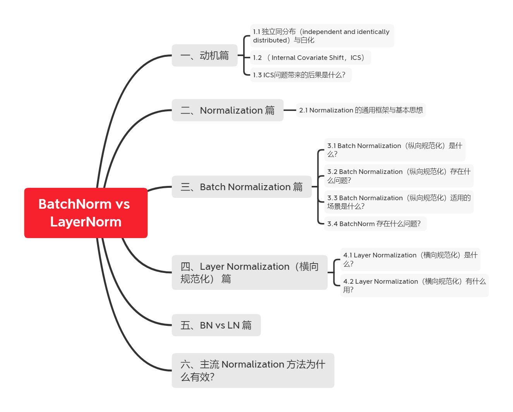

# 【关于 BatchNorm vs LayerNorm】那些你不知道的事

## 一、动机篇

### 1.1 独立同分布（independent and identically distributed）与白化

- 独立同分布
  - 为什么？
    - 独立同分布的数据可以简化常规机器学习模型的训练、提升机器学习模型的预测能力
  - 相关性：
    - 强相关：Naive Bayes 模型就建立在特征彼此独立的基础之
    - 弱相关：Logistic Regression 和 神经网络 则在非独立的特征数据上依然可以训练出很好的模型
- 白化【数据预处理步骤】
  - 作用：
    - 去除特征间的相关性 -> 独立；
    - 使所有特征具有相同的均值和方差 -> 同分布

### 1.2 （ Internal Covariate Shift，ICS）

- 动机：深度神经网络涉及到很多层的叠加，而每一层的参数更新会导致上层的输入数据分布发生变化，通过层层叠加，高层的输入分布变化会非常剧烈，这就使得高层需要不断去重新适应底层的参数更新。为了训好模型，我们需要非常谨慎地去设定学习率、初始化权重、以及尽可能细致的参数更新策略。
- 模型训练对于数据的一个假设：“源空间（source domain）和目标空间（target domain）的数据分布（distribution）是一致的”。如果不一致，那么就出现了新的机器学习问题，如 transfer learning / domain adaptation 等。而 covariate shift 就是分布不一致假设之下的一个分支问题，它是指源空间和目标空间的条件概率是一致的，但是其边缘概率不同；
- ICS 【每个神经元的输入数据不再是“独立同分布”】导致的后果：
  - 上层参数需要不断适应新的输入数据分布，降低学习速度;
  - 下层输入的变化可能趋向于变大或者变小，导致上层落入饱和区，使得学习过早停止;
  - 每层的更新都会影响到其它层，因此每层的参数更新策略需要尽可能的谨慎;

### 1.3 ICS问题带来的后果是什么？ 

1. 上层参数需要不断适应新的输入数据分布，导致学习速度下降；
2. 下层输入的变化可能趋于变大或变小，导致上层落入饱和区，从而学习过早停止；
3. 每层的更新都会影响到其他层，因此每层参数更新策略需要尽可能谨慎；

## 二、Normalization 篇

### 2.1 Normalization 的通用框架与基本思想

- 前言

假设 神经元的输入：

输出的结果：

- ICS 问题： X 的 分布可能相差很大
- 解决方法：
  -  方法：对每一层的数据做白化操作
  -  存在问题：成本高，因为要保证 白化操作是可微的

- 基本思想：在将 x 送给神经元之前，先对其做平移和伸缩变换， 将 x 的分布规范化成在固定区间范围的标准分布;
- 变换框架：

> 参数介绍： 
> μ：平移参数 
> δ：缩放参数 

- 步骤：
1. 对 x 进行 shift 和 scale 变换

> 得到的数据符合均值为 0、方差为 1 的标准分布

1.  b 是再平移参数（re-shift parameter）， g 是再缩放参数（re-scale parameter）,再进一步变换为

> 得到的数据符合均值为 b 、方差为 $g^2$ 的分布

## 三、Batch Normalization 篇

### 3.1 Batch Normalization（纵向规范化）是什么？

- 方式：针对单个神经元进行，利用网络训练时一个 mini-batch 的数据来计算该神经元 $x_i$ 的均值和方差,因而称为 Batch Normalization。

> 其中 M 是 mini-batch 的大小。

### 3.2 Batch Normalization（纵向规范化）存在什么问题？

- BN 独立地规范化每一个输入维度 $x_i$ ，但规范化的参数是一个 mini-batch 的一阶统计量和二阶统计量。这就要求 每一个 mini-batch 的统计量是整体统计量的近似估计，或者说每一个 mini-batch 彼此之间，以及和整体数据，都应该是近似同分布的。分布差距较小的 mini-batch 可以看做是为规范化操作和模型训练引入了噪声，可以增加模型的鲁棒性；但如果每个 mini-batch的原始分布差别很大，那么不同 mini-batch 的数据将会进行不一样的数据变换，这就增加了模型训练的难度。
- 由于 BN 需要在运行过程中统计每个 mini-batch 的一阶统计量和二阶统计量，因此不适用于 动态的网络结构 和 RNN 网络

### 3.3 Batch Normalization（纵向规范化）适用的场景是什么？

每个 mini-batch 比较大，数据分布比较接近。在进行训练之前，要做好充分的 shuffle. 否则效果会差很多。

### 3.4 BatchNorm 存在什么问题？

1. BN特别依赖Batch Size；当Batch size很小的时候，BN的效果就非常不理想了。在很多情况下，Batch size大不了，因为你GPU的显存不够。所以，通常会有其他比较麻烦的手段去解决这个问题，比如MegDet的CGBN等；
2. BN对处理序列化数据的网络比如RNN是不太适用的；So，BN的应用领域减少了一半；
3. BN只在训练的时候用，inference的时候不会用到，因为inference的输入不是批量输入。

## 四、Layer Normalization（横向规范化） 篇

### 4.1 Layer Normalization（横向规范化）是什么？

- 方式：综合考虑一层所有维度的输入，计算该层的平均输入值和输入方差，然后用同一个规范化操作来转换各个维度的输入。

> 其中 i 枚举了该层所有的输入神经元。对应到标准公式中，四大参数 μ, δ, g, b 均为标量（BN中是向量），所有输入共享一个规范化变换。

### 4.2 Layer Normalization（横向规范化）有什么用？

LN 针对单个训练样本进行，不依赖于其他数据，因此可以避免 BN 中受 mini-batch 数据分布影响的问题，可以用于 小mini-batch场景、动态网络场景和 RNN，特别是自然语言处理领域。此外，LN 不需要保存 mini-batch 的均值和方差，节省了额外的存储空间。

## 五、BN vs LN 篇

BN 的转换是针对单个神经元可训练的——不同神经元的输入经过再平移和再缩放后分布在不同的区间，而 LN 对于一整层的神经元训练得到同一个转换——所有的输入都在同一个区间范围内。如果不同输入特征不属于相似的类别（比如颜色和大小），那么 LN 的处理可能会降低模型的表达能力。

## 六、主流 Normalization 方法为什么有效？

1. Normalization 的权重伸缩不变性
   
- 介绍：权重 W 按照常量 λ 进行伸缩时，得到的规范化后的值保持不变

> 其中：W' = λW

- 原因：当权重 W 伸缩时，对应的均值和标准差均等比例伸缩，分子分母相抵。

- 优点：
  - 权重伸缩不变性可以有效地提高反向传播的效率

> 注：因此，权重的伸缩变化不会影响反向梯度的 Jacobian 矩阵，因此也就对反向传播没有影响，避免了反向传播时因为权重过大或过小导致的梯度消失或梯度爆炸问题，从而加速了神经网络的训练。

  - 权重伸缩不变性还具有参数正则化的效果，可以使用更高的学习率。

> 因此，下层的权重值越大，其梯度就越小。这样，参数的变化就越稳定，相当于实现了参数正则化的效果，避免参数的大幅震荡，提高网络的泛化性能。

2. Normalization 的数据伸缩不变性

- 介绍：当数据 x 按照常量 λ 进行伸缩时，得到的规范化后的值保持不变

> 注：x'= λx

- 优点：
  - 数据伸缩不变性可以有效地减少梯度弥散，简化对学习率的选择

对于某一层神经元 ：

可得：

每一层神经元的输出依赖于底下各层的计算结果。如果没有正则化，当下层输入发生伸缩变化时，经过层层传递，可能会导致数据发生剧烈的膨胀或者弥散，从而也导致了反向计算时的梯度爆炸或梯度弥散。

加入 Normalization 之后，不论底层的数据如何变化，对于某一层神经元 而言，其输入 $x_i$ 永远保持标准的分布，这就使得高层的训练更加简单。从梯度的计算公式来看：

数据的伸缩变化也不会影响到对该层的权重参数更新，使得训练过程更加鲁棒，简化了对学习率的选择。

