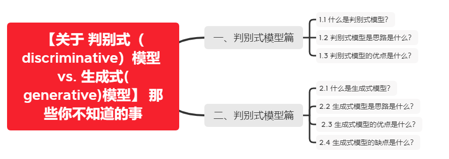

# 【关于 判别式（discriminative）模型 vs. 生成式(generative)模型】 那些你不知道的事

> 作者：杨夕
> 
> 项目地址：https://github.com/km1994/nlp_paper_study
> 
> 个人介绍：大佬们好，我叫杨夕，该项目主要是本人在研读顶会论文和复现经典论文过程中，所见、所思、所想、所闻，可能存在一些理解错误，希望大佬们多多指正。

## 一、判别式模型篇

### 1.1 什么是判别式模型？

判别模型是直接对P(Y|X)建模，就是说，直接根据X特征来对Y建模训练。

### 1.2 判别式模型是思路是什么？

1. 对P(Y|X)建模；
2. 对所有的样本只构建一个模型，确认总体判别边界；
3. 观测到输入什么特征，就预测最可能的label；

### 1.3 判别式模型的优点是什么？

对数据量要求没生成式的严格，速度也会快，小数据量下准确率也会好些。

## 二、生成式模型篇

### 2.1 什么是生成式模型？

在模型训练中，我学习到的是X与Y的联合模型 P(X,Y)  ，也就是说，我在训练阶段是只对 P(X,Y) 建模，我需要确定维护这个联合概率分布的所有的信息参数。完了之后在inference再对新的sample计算 P(Y|X)  ，导出 Y,但这已经不属于建模阶段了。

### 2.2 生成式模型是思路是什么？

1. 1.对 P(X,Y) 建模；
2. 这里我们主要讲分类问题，所以是要对每个label（ yi）都需要建模，最终选择最优概率的label为结果，所以没有什么判别边界。（对于序列标注问题，那只需要构件一个model）；
3. 中间生成联合分布，并可生成采样数据。

### 2.3 生成式模型的优点是什么？

所包含的信息非常齐全，我称之为“上帝信息”，所以不仅可以用来输入label，还可以干其他的事情。生成式模型关注结果是如何产生的。

### 2.4 生成式模型的缺点是什么？

但是生成式模型需要非常充足的数据量以保证采样到了数据本来的面目，所以速度相比之下较慢。