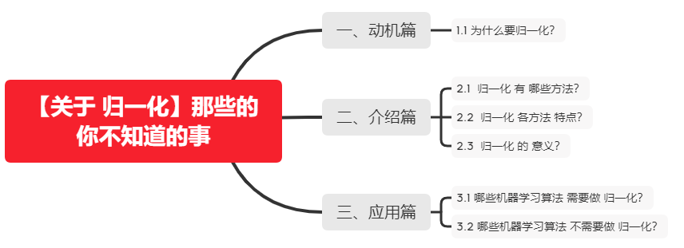

# 【关于 归一化】那些你不知道的事

## 一、动机篇

### 1.1 为什么要归一化？

因为 每一列 数据的量纲不同，导致 数据分布区间存在差异。
举例：（人的身高可以是 180cm，也可以是 1.8m，这两个虽然表示意义相同，但是由于单位的不同，导致 机器学习在计算过程中也容易出现差异，所以就需要对数据进行归一化）。

## 二、介绍篇

### 2.1  归一化有哪些方法？

- 线性比例变换法：

- 极差变换法：

- 0 均值标准化（z-score 方法）：

### 2.2  归一化各方法特点？

- 线性比例变换法 and 极差变换法
  - 特点：将原始数据线性化的方法转换到[0 1]的范围，该方法实现对原始数据的等比例缩放。通过利用变量取值的最大值和最小值（或者最大值）将原始数据转换为界于某一特定范围的数据，从而消除量纲和数量级影响，改变变量在分析中的权重来解决不同度量的问题。由于极值化方法在对变量无量纲化过程中仅仅与该变量的最大值和最小值这两个极端值有关，而与其他取值无关，这使得该方法在改变各变量权重时过分依赖两个极端取值。
- 0 均值标准化（z-score 方法）
  - 特点：即每一变量值与其平均值之差除以该变量的标准差。虽然该方法在无量纲化过程中利用了所有的数据信息，但是该方法在无量纲化后不仅使得转换后的各变量均值相同，且标准差也相同，即无量纲化的同时还消除了各变量在变异程度上的差异，从而转换后的各变量在聚类分析中的重要性程度是同等看待的。而实际分析中，经常根据各变量在不同单位间取值的差异程度大小来决定其在分析中的重要性程度，差异程度大的其分析权重也相对较大。

### 2.3  归一化 的 意义？

每个维度都是去量纲化的，避免了不同量纲的选取对距离计算产生的巨大影响。

## 三、应用篇

### 3.1 哪些机器学习算法 需要做 归一化？

- 机器学习算法算法：
  - 基于距离计算的模型：KNN；
  - 通过梯度下降法求解的模型：线性回归、逻辑回归、支持向量机、神经网络

### 3.2 哪些机器学习算法 不需要做 归一化？

- 机器学习算法算法：
  - 树形模型：决策树、随机森林(Random Forest)
- 为什么：
  - 原因1：因为它们不关心变量的值，而是关心变量的分布和变量之间的条件概率；
  - 原因2：因为数值缩放不影响分裂点位置，对树模型的结构不造成影响。按照特征值进行排序的，排序的顺序不变，那么所属的分支以及分裂点就不会有不同。而且，树模型是不能进行梯度下降的，因为构建树模型（回归树）寻找最优点时是通过寻找最优分裂点完成的，因此树模型是阶跃的，阶跃点是不可导的，并且求导没意义，也就不需要归一化。

