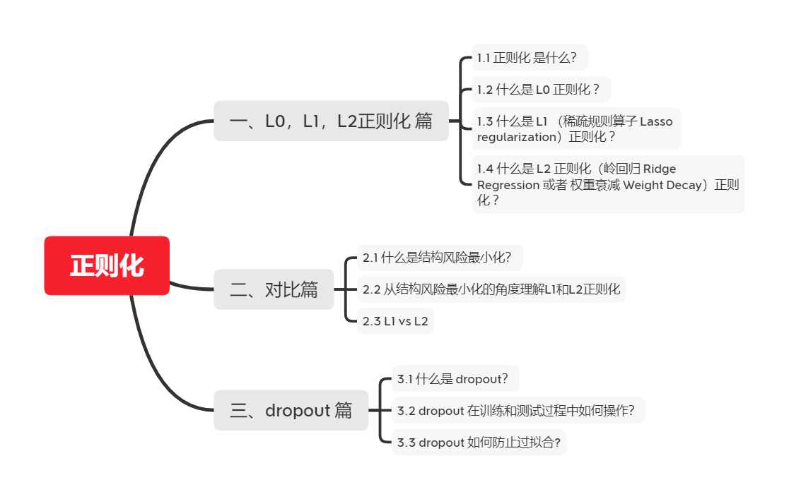
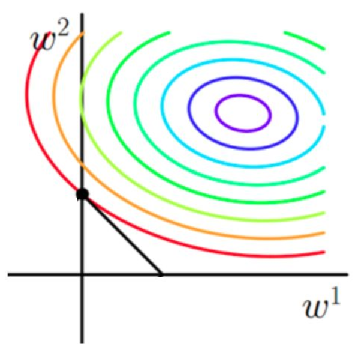

# 【关于 正则化】那些你不知道的事

## 一、L0，L1，L2正则化 篇

### 1.1 正则化 是什么？

我们所说的正则化，就是在原来的loss function的基础上，加上了一些正则化项或者称为模型复杂度惩罚项。

### 1.2 什么是 L0 正则化 ？

- 介绍：指向量中非零元素的个数，希望参数中大部分元素为0，希望参数是稀疏的； 

- 公式：$\sum_{j=1, \theta_{j} \neq 0}^{m} \theta_{j}^{0}$
- 直观理解：即将所有的非零项都作为1加起来，然后再用步长$\lambda$调节。意思很明显，每一个对预测产生了贡献的参数，我都惩罚一次，不多不少，大家都一样。 

> 就像一个法官判决，你偷了一毛钱，他杀了一个人，法官均以“价值观不正确”为由，把你们判一样的罪……只有一点都没参与的人，才不会被判刑。

- 缺点：难以优化（存在NP难问题） 

### 1.3 什么是 L1 （稀疏规则算子 Lasso regularization）正则化 ？

- 介绍：指向量中各元素绝对值之和，是 L0 正则项的最优凸近似；
- 公式：
  
$\sum_{j=1}^{m}\left|\theta_{j}\right|$ 

- 直观理解：即将所有的绝对值值相加。 

> 拿法官举例子，就是，法官要按照你们的罪行量刑判罪，但是都得判，无论你影响最终是好是坏（比如你杀了个人，这个人也是个坏人，但是你还是犯了杀人罪得判刑）都按照罪行判罪。于是就都取个绝对值，表示都判，然后按照罪行大小判罪了…… 

- 优点：
  - 比 L0 容易优化求解，L0存在NP难问题，所以 使用 较多；
  - L1范数是L0范数的最优凸近似；
- 参数稀疏 的 优点：
  - 特征选择：通过将无用特征所对应的权重设为0，以去除无用特征；
  - 可解释性：因为无用特征的权重对应权重都为0，所以只需要介绍权重不为 0 的特征； 

### 1.4 什么是 L2 正则化（岭回归 Ridge Regression 或者 权重衰减 Weight Decay）正则化 ？

- 介绍：向量各元素的平方和然后求平方根，防止模型出现过拟合的问题 
- 公式：

$\sum_{j=1}^{m} \theta_{j}^{2}$

- 直观理解：所有项目的平方和相加最后开根
- 作用：防止过拟合问题
- 优点：
  - 防止过拟合，提升模型的泛化能力;
  - 有助于处理 condition number 不好的情况下矩阵求逆很困难的问题。

## 二、对比篇

### 2.1 什么是结构风险最小化？ 

在经验风险最小化的基础上（也就是训练误差最小化），尽可能采用简单的模型，以此提高泛化预测精度。 

下面是一个图像解释（假设X为一个二维样本，那么要求解参数$w$也是二维)： 

- 原函数曲线等高线(同颜色曲线上，每一组$w_1,w_2$带入值都相同)   

 

### 2.2 从结构风险最小化的角度理解L1和L2正则化 

- L1和L2加入后的函数图像：

     

从上面两幅图中我们可以看出： 

- 如果不加L1和L2正则化的时候，对于线性回归这种目标函数凸函数的话，我们最终的结果就是最里边的紫色的小圈圈等高线上的点。 

- 当加入L1正则化的时候，我们先画出以下函数的图像：

  $$
  \left|\omega_{1}\right|+\left|\omega_{2}\right|=F
  $$

  该图像也就是一个菱形，代表这些曲线上的点算出来的1范数 $\left|\omega_{1}\right|+\left|\omega_{2}\right|$ 都为F，那我们现在的目标是不仅是原曲线算得值要小（越来越接近中心的紫色圈圈），还要使得这个菱形越小越好（F越小越好）。那么还和原来一样的话，过中心紫色圈圈的那个菱形明显很大，因此我们要取到一个恰好的值。那么如何求值呢？   

     

  1. 以同一条原曲线目标等高线来说，现在以最外圈的红色等高线为例，我们看到，对于红色曲线上的每个点都可以做一个菱形，根据上图可知，当这个菱形与某条等高线相切（仅有一个交点）的时候，这个菱形最小。用公式说这个时候能使得在相同的$1 / N * \sum_{i=1}^{N}\left(y_{i}-\omega^{T} x_{i}\right)^{2}$下，由于相切的时候的$C\|\omega\|_{1}$，即$\left|\omega_{1}\right|+\left|\omega_{2}\right|$小，所以：能够使得$1 / N * \sum_{i=1}^{N}\left(y_{i}-\omega^{T} x_{i}\right)^{2}+C\|\omega\|_{1}$更小。  

  2. 有了上述说明，我们可以看出，最终加入L1范数得到的解，一定是某个菱形和某条原函数等高线的切点。现在有个比较重要的结论来了，**我们经过观察可以看到，几乎对于很多原函数等高曲线，和某个菱形相交的时候及其容易相交在坐标轴（比如上图），也就是说最终的结果，解的某些维度及其容易是0，比如上图最终解是** 
     $$
     \omega=(0, x)
     $$
     **这也就是我们所说的L1更容易得到稀疏解（解向量中0比较多）的原因。**  

  3. 当然了，光看着图说，L1的菱形更容易和等高线相交在坐标轴，一点都没说服力，只是个感性的认识，不过不要紧，其实是很严谨的，我们直接用求导来证明，具体的证明这里有一个很好的答案了，简而言之就是假设现在我们是一维的情况下 

  $$
  h(\omega)=f(\omega)+C|\omega|
  $$

  其中$ h(\omega) $是目标函数，$f(\omega)$是没加L1正则化的目标函数，$C|\omega|$是L1正则项，那么要使得0点成为最值的可能得点，，虽然在0点不可导，但是我们只需要让0点左右的导数异号，即

  $$
  h_{\mathrm{左}}^{\prime}(0) * h_{\mathrm{右}}^{\prime}(0)=\left(f^{\prime}(0)+C\right) \quad\left(f^{\prime}(0)-C\right)<0
  $$

  也就是$C>\left|f^{\prime}(0)\right|$的情况下，0点都是可能得最值点。

- 当加入L2正则化的时候，分析和L1正则化是类似的，也就是说我们仅仅是从菱形变成了圆形而已，同样还是求原曲线和圆形的切点作为最终解。当然与L1范数比，我们这样求的L2范数的**从图上来看，不容易交在坐标轴上，但是仍然比较靠近坐标轴**。**因此这也就是我们老说的，L2范数能让解比较小（靠近0），但是比较平滑（不等于0）。** 

综上所述，我们可以看见，加入正则化项，在最小化经验误差的情况下，可以让我们选择解更简单（趋向于0）的解。 

### 2.3 L1 vs L2

<table>
    <tr>
        <td></td>
        <td>L1</td>
        <td>L2</td>
    </tr>
    <tr>
        <td>目标</td>
        <td>绝对值最小化</td>
        <td>平方值最小化</td>
    </tr>
    <tr>
        <td>下降速度</td>
        <td>以绝对值函数方式下降，较快</td>
        <td>以二次函数函数方式下降，较慢</td>
    </tr>
    <tr>
        <td>规则化的代价函数</td>
        <td>图 1 </td>
        <td>图 2 </td>
    </tr>
    <tr>
        <td>最优解是 w1 和 w2 的取值</td>
        <td>L1在和每个坐标轴相交的地方都有“角”出现，而目标函数的测地线除非位置摆得非常好，大部分时候都会在角的地方相交。注意到在角的位置就会产生稀疏性，例如图中的相交点就有w1=0，而更高维的时候（想象一下三维的L1-ball 是什么样的？）除了角点以外，还有很多边的轮廓也是既有很大的概率成为第一次相交的地方，又会产生稀疏性 </td>
        <td>因为没有角，所以第一次相交的地方出现在具有稀疏性的位置的概率就变得非常小了。这就从直观上来解释了为什么L1-regularization 能产生稀疏性，而L2-regularization 不行的原因了 </td>
    </tr>
    <tr>
        <td>总结</td>
        <td>L1 会趋向于产生少量的特征，而其他的特征都是0 </td>
        <td>L2 会选择更多的特征，这些特征都会接近于0 </td>
    </tr>
    <tr>
        <td>特点</td>
        <td>Lasso在特征选择时候非常有用 </td>
        <td>Ridge就只是一种规则化而已 </td>
    </tr>
    <tr>
        <td>使用选择方面</td>
        <td>特征多，但是其作用的特征少的情况【自动选择特征】 </td>
        <td>特征中起作用的特征多的情况 </td>
    </tr>
    <tr>
        <td>分布类型</td>
        <td>拉普拉斯分布 </td>
        <td>高斯分布 </td>
    </tr>
</table>

## 三、dropout 篇

### 3.1 什么是 dropout？

- 方式：通过以概率p主动临时性地忽略掉神经网站中的部分隐藏节点来防止过拟合，即让这些神经元以一定概率不工作；

### 3.2 dropout 在训练和测试过程中如何操作？

-  训练过程：在**训练**开始时，随机删除一些隐藏层神经元，即认为这些神经元不存在，同时保持输入层与输出层的神经元个数不变，按照反向传播学习算法对神经网络中的参数进行学习更新（被删除的节点不参与更新)。在这个“残缺”的网络中，让神经网络学习数据中的局部特征（即部分分布式特征）。在多个“残缺”之网（相当于多个简单网络）中实施特征，总要比仅在单个健全网络上进行特征学习，其泛化能力来得更加健壮。这里的“泛化”，实际上就是适应各种情况的能力。如果神经网络仅仅在训练集合上表现好（好比“窝里横”），而在应对其他新情况表现不佳，就表明陷入“过拟合”状态，其实就是泛化能力差。   
- 在**测试**阶段，将参与学习的节点和那些被隐藏的节点以一定的概率p加权求和，综合计算得到网络的输出。对于这样的“分分合合”的学习过程，有学者认为，“丢弃学习”可视为一种集成学习（Ensemble Learning）。 

### 3.3 dropout 如何防止过拟合?

1. 先回到正常的模型（没有dropout），我们用相同的训练数据去训练5个不同的神经网络，一般会得到5个不同的结果，此时我们可以采用 “5个结果取均值”或者“多数取胜的投票策略”去决定最终结果。（例如 3个网络判断结果为数字9,那么很有可能真正的结果就是数字9，其它两个网络给出了错误结果）。这种“综合起来取平均”的策略通常可以有效防止过拟合问题。因为不同的网络可能产生不同的过拟合，取平均则有可能让一些“相反的”拟合互相抵消。dropout掉不同的隐藏神经元就类似在训练不同的网络（随机删掉一半隐藏神经元导致网络结构已经不同)，整个dropout过程就相当于 对很多个不同的神经网络取平均。而不同的网络产生不同的过拟合，一些互为“反向”的拟合相互抵消就可以达到整体上减少过拟合。 
2. dropout减少神经元之间复杂的共适应关系：因为dropout程序导致两个神经元不一定每次都在一个dropout网络中出现。（这样权值的更新不再依赖于有固定关系的隐含节点的共同作用，阻止了某些特征仅仅在其它特定特征下才有效果的情况）。迫使网络去学习更加鲁棒的特征 （这些特征在其它的神经元的随机子集中也存在）。换句话说假如我们的神经网络是在做出某种预测，它不应该对一些特定的线索片段太过敏感，即使丢失特定的线索，它也应该可以从众多其它线索中学习一些共同的模式，提升模型鲁棒性，从这个角度看 dropout就有点像L1，L2正则，减少权重使得网络对丢失特定神经元连接的鲁棒性提高）