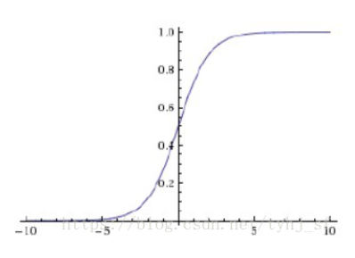
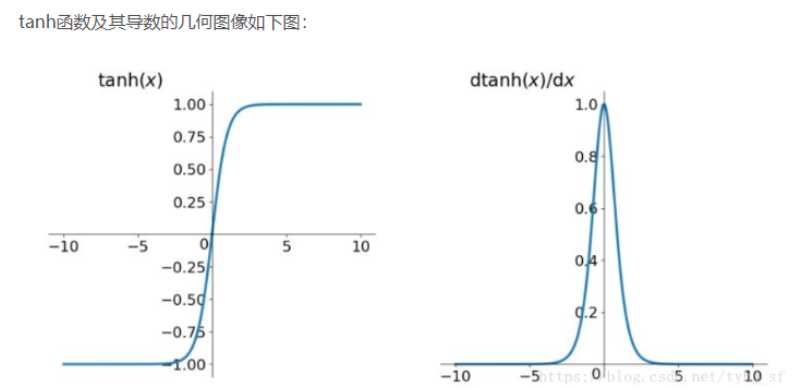

# 【关于 激活函数】那些你不知道的事

## 一、动机篇

### 1.1 为什么要有激活函数？

1. 数据角度：由于数据是线性不可分的，如果采用线性化，那么需要复杂的线性组合去逼近问题，因此需要非线性变换对数据分布进行重新映射;
2. 线性模型的表达力问题：由于线性模型的表达能力不够，引入激活函数添加非线性因素

## 二、激活函数介绍篇

### 2.1 sigmoid 函数篇

#### 2.1.1 什么是 sigmoid 函数？

- 公式
  
$$\sigma(x)=\frac {1}{1+e^{-x}}$$

- 图像

#### 2.1.2 为什么选 sigmoid 函数 作为激活函数？

sigmoid 函数 能够把输入的连续实值变换为0和1之间的输出，特别的，如果是非常大的负数，那么输出就是0；如果是非常大的正数，输出就是1.

#### 2.1.3 sigmoid 函数 有什么缺点？

1. 如果我们初始化神经网络的权值为[0,1]之间的随机数，由反向传播算法的数学推导可以知道，梯度从后向前传播时，每传递一层梯度值都会下降为原来原来的0.25倍，如果神经网络层比较多是时，那么梯度会穿过多层之后变得接近于0，也就出现梯度消失问题，当权值初始化为 [1,+]期间内的值时，则会出现梯度爆炸问题；

2. output 不是0均值（即zero-centered）；
   1. 后果：会导致后一层的神经元将得到上一层输出的非0均值的信号作为输入。 产生的一个结果就是：x>0, f=wTx+b那么对w求局部梯度则都为正，这样在反向传播的过程中w要么都往正方向更新，要么都往负方向更新，导致有一种捆绑的效果；
3. 幂函数耗时；

### 2.2 tanh 函数篇

#### 2.2.1 什么是 tanh 函数？

- 公式：

$$tanh(x)=\frac{e^x-e^{-x}}{e^x+e^{-x}}$$

- 图像

#### 2.2.2 为什么选 tanh 函数 作为激活函数？

tanh 函数 能够 解决 sigmoid 函数 非 0 均值 问题

#### 2.2.3 tanh 函数 有什么缺点？

1. 梯度爆炸和梯度消失；
2. 幂函数耗时；

### 2.3 relu 函数篇

#### 2.3.1 什么是 relu 函数？

- 公式

$$f(x)=max(0, x)$$

- 图像

#### 2.3.2 为什么选 relu 函数 作为激活函数？

1. 解决了gradient vanishing问题 (在正区间)
2. 计算速度非常快，只需要判断输入是否大于0
3. 收敛速度远快于sigmoid和tanh

#### 2.3.3 relu 函数 有什么缺点？

1. ReLU的输出不是zero-centered；
2. Dead ReLU Problem，指的是某些神经元可能永远不会被激活，导致相应的参数永远不能被更新；

## 三、激活函数选择篇

1. 深度学习往往需要大量时间来处理大量数据，模型的收敛速度是尤为重要的。所以，总体上来讲，训练深度学习网络尽量使用zero-centered数据 (可以经过数据预处理实现) 和zero-centered输出。所以要尽量选择输出具有zero-centered特点的激活函数以加快模型的收敛速度；
2. 如果使用 ReLU，那么一定要小心设置 learning rate，而且要注意不要让网络出现很多 “dead” 神经元，如果这个问题不好解决，那么可以试试 Leaky ReLU、PReLU 或者 Maxout；
3. 最好不要用 sigmoid，你可以试试 tanh，不过可以预期它的效果会比不上 ReLU 和 Maxout.

