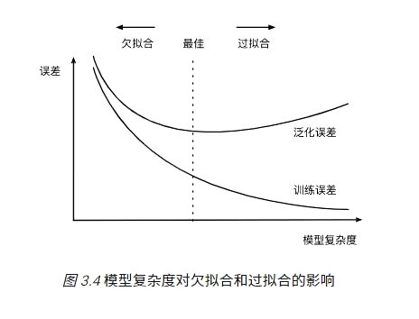

# 【关于 过拟合和欠拟合】那些你不知道的事

## 一、过拟合和欠拟合 是什么？

欠拟合和过拟合属于对立情况，都是导致模型泛化能力不高的两种常见原因，均是模型学习能力和数据复杂性失调的表现

## 二、过拟合/高方差（overfiting / high variance）篇

### 2.1 过拟合是什么及检验方法？

- 问题表现：高方差
  - 当训练集和测试集的误差之间有大的差距时，为高方差;
  - 当方差很高，训练集和验证集的准确率相差太多，应该是过拟合;
  - 表现为训练效果好,但是测试效果差，即模型的泛化能力差。可以通过观察模型在训练集和测试集上的损失函数值随着epoch的变化，如果是过拟合，模型在测试集上的损失函数值一般是先下降后上升。

### 2.2 导致过拟合的原因是什么？

1. 训练数据太少，样本单一。如果训练样本只有负样本，然后拿生成的模型去预测正样本，这肯定预测不准。所以训练样本要尽可能的全面，覆盖所有的数据类型；
2. 存在噪声。噪声指训练数据中的干扰数据。过多的干扰会导致记录了很多噪声特征，忽略了真实输入和输出之间的关系；
3. 模型过于复杂。模型太复杂，已经能够死记硬背记录下了训练数据的信息，但是遇到没有见过的数据的时候不能够变通，泛化能力太差。我们希望模型对不同的数据都有稳定的输出。模型太复杂是过拟合的重要因素。

### 2.3 过拟合的解决方法是什么？

1. 增加样本，要覆盖全部的数据类型。数据经过清洗之后再进行模型训练，防止噪声数据干扰模型；
2. 降低模型复杂度。在训练和建立模型的时候，从相对简单的模型开始，不要一开始就把特征做的非常多，模型参数挑的非常复杂；
3. 正则化。在模型算法中添加惩罚函数来防止过拟合。常见的有L1，L2正则化。而且 L1正则还可以自动进行特征选择；
4. 集成学习方法bagging(如随机森林）能有效防止过拟合；
5. 减少特征个数(不是太推荐，但也是一种方法)。可以使用特征选择，减少特征数或使用较少的特征组合，对于按区间离散化的特征，增大划分的区间；
6. 交叉检验，通过交叉检验得到较优的模型参数；
7. 早停策略。本质上是交叉验证策略，选择合适的训练次数，避免训练的网络过度拟合训练数据；
8. DropOut策略。核心思想就是bagging，可以看作是低成本的集成学习。所谓的Dropout指的是在用前向传播算法和反向传播算法训练DNN模型时，一批数据迭代时，随机的从全连接DNN网络中去掉一部分隐藏层的神经元。　在对训练集中的一批数据进行训练时，我们随机去掉一部分隐藏层的神经元，并用去掉隐藏层的神经元的网络来拟合我们的一批训练数据。使用基于dropout的正则化比基于bagging的正则化简单，这显而易见，当然天下没有免费的午餐，由于dropout会将原始数据分批迭代，因此原始数据集最好较大，否则模型可能会欠拟合。

## 三、欠拟合/高偏差（underfiting / high bias）篇

### 3.1 欠拟合是什么及检验方法？

- 问题表现：高偏差
  - 当训练集和测试集的误差收敛但却很高时，为高偏差;
  - 当偏差很高，训练集和验证集的准确率都很低，很可能是欠拟合；
  - 表现为不能很好的拟合数据，训练集和测试集效果都不佳。

### 3.2 导致欠拟合的原因是什么？

- 原因：模型没有很好的捕捉数据特征，不能很好地拟合数据

### 3.3 过拟合的解决方法是什么？

1. 做特征工程，添加更多的特征项，比如特征组合、高次特征，来增大假设空间。如果欠拟合是由于特征项不够，没有足够的信息支持模型做判断；
2. 集成学习方法boosting（如GBDT）能有效解决high bias；
3. 增加模型复杂度。如果模型太简单，不能够应对复杂的任务。可以使用更复杂的模型。比如说可以使用SVM的核函数，增加了模型复杂度，把低维不可分的数据映射到高维空间，就可以线性可分，减小欠拟合；
4. 减小正则化系数。

## 参考资料

1. [为什么PCA不被推荐用来避免过拟合？](https://www.zhihu.com/question/47121788)
