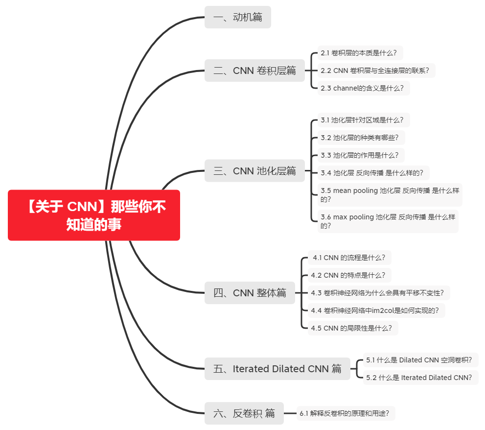
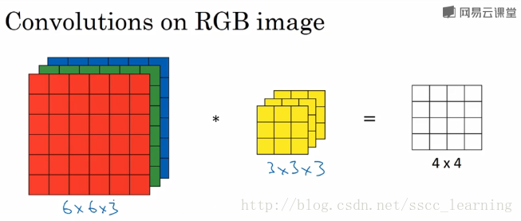
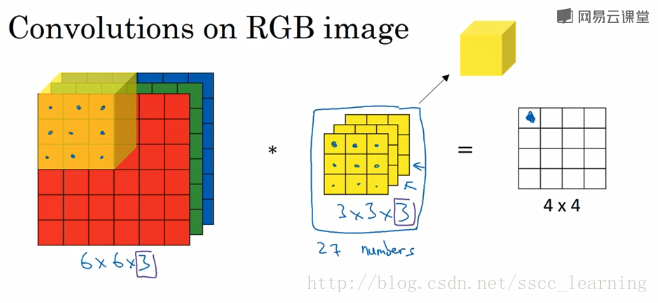
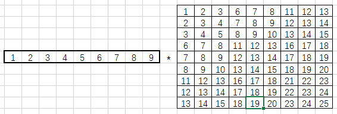
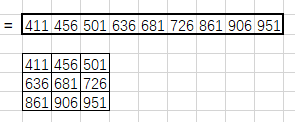

# 【关于 CNN】那些你不知道的事

> 贡献者：天骄，小猪呼噜，沐风，杨夕，芙蕖，李玲

## 一、动机篇

- 全连接网络：任意一对输入与输出神经元间都存在连接，现成稠密结构
- 局部特征存在相关性

## 二、CNN 卷积层篇

### 2.1 卷积层的本质是什么？

- 稀疏交互
  - 动机：全连接网络，任意一对输入与输出神经元间都存在连接，现成稠密结构
  - 思路：卷积核尺度远小于输入维度，每个输出神经元仅与前一层特定局部区域内的神经元存在连接
  - 优点：全连接层的 参数 为 m*n；卷积层为 k*n (m为输入，n为输出，k 为 卷积维度)
- 参数共享
  - 思路：在同一模型的不同模块中使用相同参数，为卷积运算的固有属性
  - 区别
    - NN：计算每层输出时，权值参数矩阵中每个元素只作用于每个输入元素一次
    - CNN：卷积核中每个元素将作用于每个局部输入的特定位置上
  - 物理意义：使卷积层具有平移不变性 (满足 f(g(x)) = g(f(x)) 时，称 f(x) 关于g 具有等变性)

### 2.2 CNN 卷积层与全连接层的联系？

1. 卷积核中的权值每次滑动计算时只是局部连接，且在卷积列中的神经元共享参数——计算局部信息，而全连接层神经元的权值与所有输入相连——计算全局信息。
2. 两者都是采用的矩阵点积运算，具有相似的计算形式，能够实现互相转化。
   1. **卷积——>全连接：** 权重矩阵参数增大，权重补0，由于参数共享性质，在其中大部分块中，存在大量相等参数。
   2. **全连接——>全卷积：** 将卷积核的尺寸设置为和输入数据体的尺寸一致（NxWxHxC）。除第一层全连接外，其他通道数都为1，N表示本层神经元的个数，为一个提前设定的超参数，结果与初始的那个全连接层一致。
3. 一个深度卷积神经网络模型通常由若干卷积层叠加若干全连接层组成，中间也包含各种非线性操作以及池化操作。卷积层的作用是从输入数据中采集关键数据内容。全连接层在深度卷积神经网络中的作用是将前面经过多次卷积后高度抽象的特征进行整合。最后一层作归一化，然后输出概率。卷积层提供了一个有意义、低维度且几乎不变的特征空间，然后全连接层在这个空间里学习一个非线性的方程。通俗的说，卷积层是特征提取器，全连接层执行分类操作。
4. 全连接层可以视作一种特殊的卷积。考虑下面两种情况：
   1. (1) 特征图和全连接层相连，AlexNet经过五次池化后得到7\*7\*512的特征图，下一层全连接连向4096个神经元，这个过程可以看作有4096个7\*7\*512的卷积核和7\*7\*512的特征图进行卷积操作，最终得到1\*1\*4096的特征图，等价于全连接得到4096个神经元。
   2. (2) 全连接层和全连接层相连，AlexNet的再下一层依然是4096个神经元，即4096个神经元和4096个神经元全连接，由(1)得到了1\*1\*4096的特征图，本次全连接过程可以看作存在4096个1\*1\*4096的卷积核，依次和1\*1\*4096的特征图进行卷积操作，等价于全连接。

### 2.3 channel的含义是什么？

在卷积神经网络中，channel的含义是每个卷积层中卷积核的数量。卷积层的卷积个数就等于卷积层输出的out_channels。这个值也与下一层卷积的in_channels相同。下面举例说明。

如下图，假设现有一个为 6×6×3 的图片样本，使用 3×3×3 的卷积核（filter）进行卷积操作。此时输入图片的 `channels` 为 3 ，而**卷积核中**的 `in_channels` 与 需要进行卷积操作的数据的 `channels` 一致（这里就是图片样本，为3）。

接下来，进行卷积操作，卷积核中的27个数字与分别与样本对应相乘后，再进行求和，得到第一个结果。依次进行，最终得到 4×4的结果。

上面步骤完成后，由于只有一个卷积核，所以最终得到的结果为 4×4×1， `out_channels` 为 1 。

在实际应用中，都会使用多个卷积核。这里如果再加一个卷积核，就会得到 4×4×2 的结果。

总结一下， `channels` 分为三种：

1. 最初输入的图片样本的 `channels` ，取决于图片类型，比如RGB；
2. 卷积操作完成后输出的 `out_channels` ，取决于卷积核的数量。此时的 `out_channels` 也会作为下一次卷积时的卷积核的 `in_channels`；
3. 卷积核中的 `in_channels` ，就是上一次卷积的 `out_channels` ，如果是第一次做卷积，就是样本图片的 `channels` 。

## 三、CNN 池化层篇

### 3.1 池化层针对区域是什么？

池化层针对区域是非重叠区域。

### 3.2 池化层的种类有哪些？

- 均值池化
  - 思路：对领域内特征值取平均
  - 优点：抑制由领域大小受限造成的估计值方差增大现象
  - 特点：对背景的保留效果好
- 最大值池化
  - 思路：取领域内最大值
  - 优点：抑制网络参数误差造成估计均值偏移问题
  - 特点：更好提取纹理信息

### 3.3 池化层的作用是什么？

除降低参数量外，能够保持对平移、伸缩、旋转操作的不变性

### 3.4 池化层 反向传播 是什么样的？

- 动机：由于 Pooling 操作容易改变 feature map 的 尺寸大小，使得 Pooling 层不可导；
- 举例说明：假定 2*2 的 池化，会生成 2*2*2*2 = 16 个梯度，即梯度无法传递到对应的位置；
- 方法：将一个像素的loss (梯度) 传递给4个像素，且需要保证传递的 loss （梯度）总和不变。

### 3.5 mean pooling 池化层 反向传播 是什么样的？

- mean pooling 前向传播介绍：将 patch 中的值求平均来做 pooling;
- mean pooling 反向传播介绍：将值的梯度均等分为 n*n 份 分配给上一层，以保证 池化 前后 梯度之和保存不变；

### 3.6 max pooling 池化层 反向传播 是什么样的？

- max pooling 前向传播介绍：将 patch 中的值取 max 来做 pooling 结果 传递给下一层;
- max pooling 反向传播介绍：把梯度直接传给前一层 值最大的一个像素，而其他像素不接受梯度，也就是为0；

## 四、CNN 整体篇

### 4.1 CNN 的流程是什么？

- s1  输入变长的字符串或单词串
- s2 利用滑动窗口加池化的方式将原先的输入转化为固长的向量表示

### 4.2 CNN 的特点是什么？

CNN 能够捕获文本中的局部特征

### 4.3 卷积神经网络为什么会具有平移不变性？

平移不变性：即目标在空间内发生平移，但是结果（标签）不变

平移不变性=卷积+最大池化。卷积层具有平移等变性，池化层具有平移不变性。**卷积神经网络的平移不变性，是池化层赋予的**。

如果一个函数满足“输入改变，输出也以同样的方式进行改变”这一性质，我们就说该函数是**等变的**（equivariant）。形式化地，如果函数$f(x)$与$g(x)$满足$f(g(x))=g(f(x))$，我们就说$f(x)$对于变换$g$具有等变性。

卷积层具有**平移等变性**，也就是说卷积层对平移是敏感的，输入的平移能等价地影响输出。直观地，如果把一张输入图像先平移后卷积，其结果与先卷积后平移效果是一样的。如果我们移动输入图像中的物体，它的表示也会在输出中移动同样的量。

卷积层的**参数共享**（Parameter Sharing）特性使得卷积层具有平移等变性。参数共享是指在一个模型的多个函数中使用相同的参数。在传统的神经网络中，当计算一层的输出时，权重矩阵的每个元素只使用一次。当它乘以输入的一个元素后，就再也不会用到了。但是在卷积神经网络中，卷积核的每一个元素都作用在输入的每一个位置上。卷积运算中的参数共享保证了我们只需要学习一个参数集合，而不是对于每个位置都需要学习一个单独的参数集合。

如果一个函数满足“输入改变，输出不会受影响”这一性质，我们就说该函数是**不变的**（invariant）。形式化地，如果函数$f(x)$与$g(x)$满足$g(x)=x'$且$f(x)=f(x')=f(g(x))$，我们就说$f(x)$对于变换$g$具有不变性。

池化层具有（近似）**平移不变性**，也就是说池化层对平移不敏感。不管采用什么样的池化函数，当输入做出少量平移时，池化能够帮助输入的表示近似不变。例如我们**使用最大池化，只要变换不影响到最大值，我们的池化结果不会收到影响**。对于一个卷积核来说，只有一个值的变动会影响到输出， 其他的变换都不会造成扰动。平均池化的近似不变性就稍弱些。

局部平移不变性是一个很有用的性质，尤其是当我们关心某个特征是否出现而不关心它出现的具体位置时。

### 4.4 卷积神经网络中im2col是如何实现的？

卷积的运算量十分巨大，如果将卷积运算转化为矩阵运算，便能利用GPU来提升性能。

im2col全称image to column（从图像到矩阵），作用为加速卷积运算。即把包含批数量的4维数据转换成2维数据。也就是将输入数据降维，然后通过numpy的矩阵运算后得到结果，再将结果的形状还原，从而通过用矩阵运算来代替for循环语句。

`im2col`将卷积核和卷积核扫过的区域都转化为列(行)向量。举个例子方便理解：

假设一个3*3卷积核为：

输入图像是5*5像素的单通道图像：

卷积核会锁定3*3的滑动窗口：

`im2col`会将每个滑动窗口内的像素转为列向量：

就这样转化所有滑动窗口的列向量，将其拼接成9行的矩阵（行数与滑动窗口数目相关，列数则与卷积核大小相关）：

`im2col`还会将卷积核转化为行向量：

最后使用卷积核行向量乘以滑动窗口元素组成的矩阵：

得到1*9的列向量，将其拼接成特征图：

### 4.5 CNN 的局限性是什么？

1. 以CNN为代表的前馈神经网络使用了条件独立假设，其特征提取范围受到限制；而循环神经网络或者Attention机制的模型能够看到序列整体的信息，因此对于序列建模任务，单纯的CNN存在先天不足。
2. 卷积神经网络的核心思想是捕捉局部特征。对于序列任务，比如文本来说，局部特征就是由若干单词组成的滑动窗口（类似N-Gram）。卷积神经网络的优势在于能够自动地对N-Gram特征进行组合和筛选，获得不同抽象层次的语义信息。
   1. 解决方法：加入更多卷积层 -> 网络深度增加 -> 参数量增大 -> 容易过拟合 -> 引入 Dropout 正则化 -> 引入超参数 -> 网络庞大冗余，难以训练
3. 使用CNN做序列任务的优点在于其共享权重的机制，使得训练速度相对较快；但是其最大的缺点在于CNN无法构建长距离依存关系。
4. 有许多研究者试图改进CNN模型，使其能够应用于序列任务。诸如用于句子语义建模的动态卷积神经网络DCNN、可以在整个序列的所有窗口上进行卷积的时延神经网络TDNN等。

## 五、Iterated Dilated CNN 篇

### 5.1 什么是 Dilated CNN 空洞卷积？

- 动机：
  - 正常CNN 的 filler 作用于输入矩阵连续位置，利用 卷积 和 池化 整合多尺度的上下文信息，导致分辨率损失
  - pooling 会损失信息，降低精度，不加则导致感受野变小，学不到全局信息
  - CNN提取特征的能力受到卷积核大小的限制，特别是对于序列问题，容易造成长距离依赖问题
- 介绍：Dilated Convolutions，翻译为扩张卷积或空洞卷积。空洞卷积与普通的卷积相比，除了卷积核的大小以外，还有一个扩张率参数，主要用来表示扩张的大小，以及去掉 pooling。
- 空洞卷积与普通卷积的相同点：卷积核的大小是一样的，在神经网络中即参数数量不变，区别在于扩张卷积具有更大的感受野。感受野指的是特征图上某个元素的计算受输入图像影响区域的范围，即特征图上神经元能够“看到”的图像范围，例如3×3卷积核的感受野大小为9。

具体地，空洞卷积通过给卷积核插入“空洞”变相增加其大小。如果在卷积核的每两个元素之间插入$D-1$个空洞，该卷积核的有效大小为$K'=K+(K-1)\times (D-1)$。其中$K$为原始卷积核大小，$D$称为膨胀率(扩张率，dilation rate)。当$D=1$时卷积核为普通的卷积核。

例如下图中

- (a) 普通卷积，1-dilated convolution，卷积核的感受野为3×3=9。
- (b) 空洞卷积，2-dilated convolution，卷积核的感受野为7×7=49。
- (c) 空洞卷积，4-dilated convolution，卷积核的感受野为15×15=225。

- 优点：dilated width 会随着层数增加而指数增加，层数 增加，参数量线性增长， 感受野 指数增加，可覆盖全部信息

**例如卷积核大小为3，步长为1，膨胀率为2的空洞卷积动态示意图：**

- 空洞卷积的作用
  - 扩大感受野。如果希望增加输出单元的感受野，一般可以通过增加卷积核大小、增加卷积层数，或在卷积前增加池化操作来实现。但是前两者会增加参数数目，第三种方式会损失信息。空洞卷积就是一种增加感受野的同时不增加参数数量的方法。
  - 捕获多尺度上下文信息：在进行空洞卷积前，通过双线性插值，对feature map进行上采样之后，再进行空洞卷积，这样可以在提高feature map的像素的同时，提取更多的全局信息

### 5.2 什么是 Iterated Dilated CNN？

- 思路：利用四个结构相同的 Dilated CNN 拼接起来，每个 block 里面 dilated width 为 1，1，2 的三层 DCNN，能够捕获更大感受野的信息

## 六、反卷积 篇

### 6.1 解释反卷积的原理和用途？

**1.反卷积原理**

​    反卷积=上采样=（转置卷积+微步卷积）⊆ 空洞卷积=一般意义上的广义卷积（包含上采样和下采样）。

上采样：在应用在计算机视觉的深度学习领域，由于输入图像通过卷积神经网络(CNN)提取特征后，输出的尺寸往往会变小，而有时我们需要将图像恢复到原来的尺寸以便进行进一步的计算(e.g.:图像的语义分割)，这个采用扩大图像尺寸，实现图像由小分辨率到大分辨率的映射的操作，叫做上采样(Upsample)。

反卷积是一种特殊的正向卷积，先按照一定的比例通过补0来扩大输入图像的尺寸，接着旋转卷积核，再进行正向卷积。

反卷积又被称为Transposed(转置) Convolution，其实卷积层的前向传播过程就是反卷积层的反向传播过程，卷积层的反向传播过程就是反卷积层的前向传播过程。因为卷积层的前向反向计算分别为乘 $C$ 和 $C^T$,而反卷积层的前向反向计算分别为乘 $C^T$ 和 $(C^T)^T$，所以它们的前向传播和反向传播刚好交换过来。

上图展示一个反卷积的工作过程，乍看一下好像反卷积和卷积的工作过程差不多，主要的区别在于反卷积输出图片的尺寸会大于输入图片的尺寸，通过增加padding来实现这一操作，上图展示的是一个strides(步长)为1的反卷积。下面看一个strides不为1的反卷积

上图中的反卷积的stride为2，通过间隔插入padding来实现的。同样，可以根据反卷积的o、s、k、p参数来计算反卷积的输出i，也就是卷积的输入。公式如下：**i=(o−1)∗s+k−2∗p**。

**2.作用**

- 通过反卷积可以用来可视化卷积的过程

- 反卷积在GAN等领域中有着大量的应用。 比如用GANs生成图片，其中的generator和discriminator均采用深度学习，generator生成图片过程中采用的就是反卷积操作（当然discriminator采用卷积对generator生成的图片判别真伪）。

- 将一些低分辨率的图片转换为高分辨率的图片。

参考：

https://kknews.cc/code/zb2jr43.html

https://zhuanlan.zhihu.com/p/48501100

## 参考

1. [理解为什么要将全连接层转化为卷积层](https://www.cnblogs.com/liuzhan709/p/9356960.html)
2. [What do the fully connected layers do in CNNs?](https://stats.stackexchange.com/questions/182102/what-do-the-fully-connected-layers-do-in-cnns?utm_medium=organic&utm_source=google_rich_qa&utm_campaign=google_rich_qa)
3. [CNN全连接层和卷积层的转化](https://blog.csdn.net/weixin_43199584/article/details/105125620)
4. [【CNN】理解卷积神经网络中的通道 channel](https://blog.csdn.net/sscc_learning/article/details/79814146)
5. [万字长文概述NLP中的深度学习技术](https://www.linkresearcher.com/information/6c7a15b5-236a-40f3-879f-af2ac06c2557)