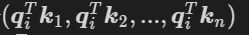
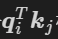
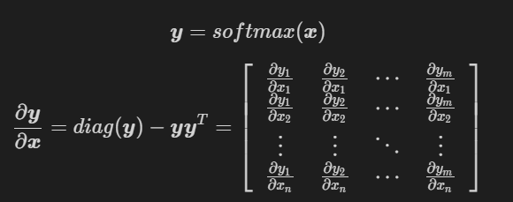

# 【关于Transformer】那些你不知道的事

> 作者：杨夕
> 
> 论文链接：https://arxiv.org/pdf/1706.03762.pdf
> 
> 【注：手机阅读可能图片打不开！！！】

本章主要介绍 Transformer 常见的问题，如下图所属：


> Transformer 常见问题

## 一、动机篇

### 1.1 为什么要有 Transformer?

为什么要有 Transformer? 首先需要知道在 Transformer 之前都有哪些技术，这些技术所存在的问题：

- RNN：能够捕获长距离依赖信息，但是无法并行；
- CNN: 能够并行，无法捕获长距离依赖信息（需要通过层叠 or 扩张卷积核 来 增大感受野）；
- 传统 Attention
  - 方法：基于源端和目标端的隐向量计算Attention，
  - 结果：源端每个词与目标端每个词间的依赖关系 【源端->目标端】
  - 问题：忽略了 远端或目标端 词与词间 的依赖关系

### 1.2 Transformer 作用是什么？

基于Transformer的架构主要用于建模语言理解任务，它避免了在神经网络中使用递归，而是完全依赖于self-attention机制来绘制输入和输出之间的全局依赖关系。

## 二、整体结构篇

### 2.1 Transformer 整体结构是怎么样？

- Transformer 整体结构：
  -  encoder-decoder 结构
- 具体介绍：
  - 左边是一个 Encoder;
  - 右边是一个 Decoder;


> Transformer 整体结构

1. 整体结构放大一点
   
从上一张 Transformer 结构图，可以知道 Transformer 是一个 encoder-decoder 结构，但是 encoder 和 decoder 又包含什么内容呢？
- Encoder 结构：
  - 内部包含6层小encoder 每一层里面有2个子层；
- Decoder 结构：
  - 内部也是包含6层小decoder ，每一层里面有3个子层


> Transformer encoder-decoder 结构

1. 整体结构再放大一点
   
 其中上图中每一层的内部结构如下图所求。
 - 上图左边的每一层encoder都是下图左边的结构；
 - 上图右边的每一层的decoder都是下图右边的结构；
  
具体内容，后面会逐一介绍。


> Transformer encoder-decoder 内部结构

- 代码讲解【注：代码采用 tensorflow 框架编写】

```s
    class Transformer(tf.keras.Model):
        def __init__(self, num_layers, d_model, num_heads, dff, input_vocab_size, target_vocab_size, pe_input, pe_target, rate=0.1):
            super(Transformer, self).__init__()
            # Encoder 模块
            self.encoder = Encoder(num_layers, d_model, num_heads, dff, input_vocab_size, pe_input, rate)
            # Decoder 模块
            self.decoder = Decoder(num_layers, d_model, num_heads, dff, target_vocab_size, pe_target, rate)
            # 全连接层
            self.final_layer = tf.keras.layers.Dense(target_vocab_size)
        
        def call(self, inp, tar, training, enc_padding_mask, look_ahead_mask, dec_padding_mask):
            # step 1： encoder
            enc_output = self.encoder(inp, training, enc_padding_mask)
            # step 2：decoder
            dec_output, attention_weights = self.decoder(tar, enc_output, training, look_ahead_mask, dec_padding_mask)
            # step 3：全连接层
            final_output = self.final_layer(dec_output)

            return final_output, attention_weights
```

### 2.2 Transformer-encoder 结构怎么样？


> Transformer encoder 结构

- 特点：
  - 与 RNN,CNN 类似，可以当成一个特征提取器；
- 组成结构介绍
  - embedding 层：将 input 转化为 embedding 向量 $X$；
  - Position encodding: input的位置与 input 的 embedding $X$ 相加 得到 向量 $X$；
  - self-attention : 将融合input的位置信息 与 input 的 embedding 信息的 $X$ 输入 Self-Attention 层得到 $Z$;
  - 残差网络：$Z$ 与 $X$ 相加后经过 layernorm 层；
  - 前馈网络：经过一层前馈网络以及 Add&Normalize，（线性转换+relu+线性转换 如下式）
  


- 举例说明（假设序列长度固定，如100，如输入的序列是“我爱中国”）：
  - 首先需要 **encoding**：
    - 将词映射成一个数字，encoding后，由于序列不足固定长度，因此需要padding，
    - 然后输入 embedding层，假设embedding的维度是128，则输入的序列维度就是100*128；
  - 接着是**Position encodding**，论文中是直接将每个位置通过cos-sin函数进行映射；
    - 分析：这部分不需要在网络中进行训练，因为它是固定。但现在很多论文是将这块也embedding，如bert的模型，至于是encoding还是embedding可取决于语料的大小，语料足够大就用embedding。将位置信息也映射到128维与上一步的embedding相加，输出100*128
  - 经过**self-attention层**：
    - 操作：假设v的向量最后一维是64维(假设没有多头)，该部分输出100*64；
  - 经过残差网络：
    - 操作：即序列的embedding向量与上一步self-attention的向量加总；
  - 经过 **layer-norm**：
    - 原因：
      - 由于在self-attention里面更好操作而已；
      - 真实序列的长度一直在变化；
  - 经过 **前馈网络**：
    - 目的：增加非线性的表达能力，毕竟之前的结构基本都是简单的矩阵乘法。若前馈网络的隐向量是512维，则结构最后输出100*512；
- Transformer Encoder 单元 代码讲解【注：代码采用 tensorflow 框架编写】

```s
    class EncoderLayer(tf.keras.layers.Layer):
        def __init__(self, d_model, num_heads, dff, rate=0.1):
            super(EncoderLayer, self).__init__()
            
            self.mha = MultiHeadAttention(d_model, num_heads)
            self.ffn = point_wise_feed_forward_network(d_model, dff)

            self.layernorm1 = tf.keras.layers.LayerNormalization(epsilon=1e-6)
            self.layernorm2 = tf.keras.layers.LayerNormalization(epsilon=1e-6)

            self.dropout1 = tf.keras.layers.Dropout(rate)
            self.dropout2 = tf.keras.layers.Dropout(rate)
        
        def call(self, x, training, mask):
            # step 1：多头自注意力
            attn_output, _ = self.mha(x, x, x, mask)
            # step 2：前馈网络
            attn_output = self.dropout1(attn_output, training=training)
            # step 3：Layer Norml 
            out1 = self.layernorm1(x + attn_output)
            # step 4：前馈网络
            ffn_output = self.ffn(out1)
            ffn_output = self.dropout2(ffn_output, training=training)
            # step 5：Layer Norml
            out2 = self.layernorm2(out1 + ffn_output)

            return out2
```

- Transformer Encoder 模块代码讲解【注：代码采用 tensorflow 框架编写】

```s
    class Encoder(tf.keras.layers.Layer):
        def __init__(self, num_layers, d_model, num_heads, dff, input_vocab_size, maximum_position_encoding, rate=0.1):
            super(Encoder, self).__init__()

            self.d_model = d_model
            self.num_layers = num_layers     # encoder 层数
            # 词嵌入
            self.embedding = tf.keras.layers.Embedding(input_vocab_size, d_model)
            # 位置编码
            self.positional_encoding_obj = Positional_Encoding()
            self.pos_encoding = self.positional_encoding_obj.positional_encoding(maximum_position_encoding, self.d_model)
            # Encoder 模块构建
            self.enc_layers = [EncoderLayer(d_model, num_heads, dff, rate) for _ in range(num_layers)]

            self.dropout = tf.keras.layers.Dropout(rate)
            
        def call(self, x, training, mask):
            seq_len = tf.shape(x)[1]
            # step 1：词嵌入
            x = self.embedding(x)
            x *= tf.math.sqrt(tf.cast(self.d_model, tf.float32))
            # step 2：位置编码
            x += self.pos_encoding[:, :seq_len, :]
            x = self.dropout(x, training=training)
            # step 3：Encoder 模块构建
            for i in range(self.num_layers):
                x = self.enc_layers[i](x, training, mask)
            return x
```

### 2.3 Transformer-decoder 结构怎么样?


> Transformer decoder 结构

- 特点：与 encoder 类似
- 组成结构介绍
  - masked 层：
    - 目的：确保了位置 i 的预测仅依赖于小于 i 的位置处的已知输出;
  - Linear layer：
    - 目的：将由解码器堆栈产生的向量投影到一个更大的向量中，称为对数向量。这个向量对应着模型的输出词汇表；向量中的每个值，对应着词汇表中每个单词的得分；
  - softmax层:
    - 操作：这些分数转换为概率（所有正数，都加起来为1.0）。选择具有最高概率的单元，并且将与其相关联的单词作为该时间步的输出
- Transformer Decoder 单元 代码讲解【注：代码采用 tensorflow 框架编写】

```s
    class DecoderLayer(tf.keras.layers.Layer):
        def __init__(self, d_model, num_heads, dff, rate=0.1):
            super(DecoderLayer, self).__init__()

            self.mha1 = MultiHeadAttention(d_model, num_heads)
            self.mha2 = MultiHeadAttention(d_model, num_heads)

            self.ffn = point_wise_feed_forward_network(d_model, dff)

            self.layernorm1 = tf.keras.layers.LayerNormalization(epsilon=1e-6)
            self.layernorm2 = tf.keras.layers.LayerNormalization(epsilon=1e-6)
            self.layernorm3 = tf.keras.layers.LayerNormalization(epsilon=1e-6)

            self.dropout1 = tf.keras.layers.Dropout(rate)
            self.dropout2 = tf.keras.layers.Dropout(rate)
            self.dropout3 = tf.keras.layers.Dropout(rate)
        
        
        def call(self, x, enc_output, training, look_ahead_mask, padding_mask):
            # step 1：带 sequence mask 的 多头自注意力
            attn1, attn_weights_block1 = self.mha1(x, x, x, look_ahead_mask)
            attn1 = self.dropout1(attn1, training=training)
            # step 2：Layer Norm
            out1 = self.layernorm1(attn1 + x)
            # step 3：带 padding mask 的 多头自注意力
            attn2, attn_weights_block2 = self.mha2(enc_output, enc_output, out1, padding_mask)
            attn2 = self.dropout2(attn2, training=training)
            # step 4：Layer Norm
            out2 = self.layernorm2(attn2 + out1)
            # step 5：前馈网络
            ffn_output = self.ffn(out2)
            ffn_output = self.dropout3(ffn_output, training=training)
            # step 6：Layer Norm
            out3 = self.layernorm3(ffn_output + out2)
            return out3, attn_weights_block1, attn_weights_block2

```

- Transformer Decoder 模块代码讲解【注：代码采用 tensorflow 框架编写】

```s
    class Decoder(tf.keras.layers.Layer):
        def __init__(self, num_layers, d_model, num_heads, dff, target_vocab_size, maximum_position_encoding, rate=0.1):
            super(Decoder, self).__init__()

            self.d_model = d_model
            self.num_layers = num_layers            # encoder 层数
            # 词嵌入
            self.embedding = tf.keras.layers.Embedding(target_vocab_size, d_model)
            # 位置编码
            self.positional_encoding_obj = Positional_Encoding()
            self.pos_encoding = self.positional_encoding_obj.positional_encoding(maximum_position_encoding, d_model)
            # Dncoder 模块构建
            self.dec_layers = [DecoderLayer(d_model, num_heads, dff, rate) for _ in range(num_layers)]
            self.dropout = tf.keras.layers.Dropout(rate)
        
        def call(self, x, enc_output, training, look_ahead_mask, padding_mask):
            seq_len = tf.shape(x)[1]
            attention_weights = {}
            # step 1：词嵌入
            x = self.embedding(x)
            x *= tf.math.sqrt(tf.cast(self.d_model, tf.float32))
            # step 2：位置编码
            x += self.pos_encoding[:, :seq_len, :]

            x = self.dropout(x, training=training)
            # step 3：Dncoder 模块构建
            for i in range(self.num_layers):
                x, block1, block2 = self.dec_layers[i](x, enc_output, training, look_ahead_mask, padding_mask)

                attention_weights['decoder_layer{}_block1'.format(i+1)] = block1
                attention_weights['decoder_layer{}_block2'.format(i+1)] = block2
        
            return x, attention_weights

```

## 三、模块篇

### 3.1 self-attention 模块

#### 3.1.1 传统 attention 是什么?

在介绍 self-attention 之前，首先需要介绍一下 传统的 attention，其结构如下图所示：


> 传统的 attention 结构

- 注意力机制是什么呢？
  - 就是将精力集中于某一个点上
  - 举个例子：
    - 你在超市买东西，突然一个美女从你身边走过，这个时候你会做什么呢？
    - 没错，就是将视线【也就是注意力】集中于这个美女身上，而周围环境怎么样，你都不关注。
- 思路
  - 输入 给定 Target 中某个 query；
  - 计算权值 Score：
    - 计算 query 和 各个 Key 的相似度或相关性，得到每个 Key 对应 value 的权值系数；
  - 对 权值 Score 和 value 进行加权求和
- 核心：
  - Attention 机制 是对 source 中各个元素 的 value 进行加权求和，而 query 和 key 用于计算 对应 value 的权值系数


> $L_x=||Source||$代表Source的长度

- 概念：
  - attention 的核心 就是从 大量信息中 筛选出少量的 重要信息；
  - 具体操作：每个 value 的 权值系数，代表 其 重要度； 
  

> 传统的 attention 流程

- 具体流程介绍
  - step 1：计算权值系数
    - 采用 不同的函数或计算方式，对 query 和 key 进行计算，求出相似度或相关性
    - 采用的计算方法：
      - 向量点积：
        
      
        
      - Cosine 相似度计算：
        
      

      - MLP 网络：
        
      
        
  - step 2: softmax 归一化
    - 原因：
      1. score 值分布过散，将原始计算分值整理成所有元素权重之和为1 的概率分布；
      2. 可以通过SoftMax的内在机制更加突出重要元素的权重；
    - 公式介绍

    

  - step 3: 加权求和
    - 公式介绍：
      - 计算结果 $a_i$ 即为 $value_i$ 对应的权重系数，然后进行加权求和即可得到Attention数值


- 存在问题
  - 忽略了 源端或目标端 词与词间 的依赖关系【以上面栗子为例，就是把注意力集中于美女身上，而没看自己周围环境，结果可能就扑街了！】

#### 3.1.2 为什么 会有self-attention?

-  CNN 所存在的长距离依赖问题；
-  RNN 所存在的无法并行化问题【虽然能够在一定长度上缓解 长距离依赖问题】；
- 传统 Attention
  - 方法：基于源端和目标端的隐向量计算Attention，
  - 结果：源端每个词与目标端每个词间的依赖关系 【源端->目标端】
  - 问题：忽略了 远端或目标端 词与词间 的依赖关系

#### 3.1.3 self-attention 的核心思想是什么?

- 核心思想：self-attention的结构在计算每个token时，总是会考虑整个序列其他token的表达；
  - 举例：“我爱中国”这个序列，在计算"我"这个词的时候，不但会考虑词本身的embedding，也同时会考虑其他词对这个词的影响

#### 3.1.4 self-attention 的目的是什么?

- 目的：学习句子内部的词依赖关系，捕获句子的内部结构。

#### 3.1.5 self-attention 的怎么计算的?


> self-attention 计算公式


> self-attention 结构图

- 步骤
  - embedding层：
    - 目的：将词转化成embedding向量；
  - Q，K，V 向量计算：
    - 根据 embedding 和权重矩阵，得到Q，K，V；
      - Q：查询向量，目标字作为 Query；
      - K：键向量，其上下文的各个字作为 Key；
      - V：值向量，上下文各个字的 Value；
  - 权重 score 计算：
    - 查询向量 query 点乘 key;
    - 目的：计算其他词对这个词的重要性，也就是权值；
  - scale 操作：
    - 乘以 $\frac{1}{\sqrt{d_{k}}}$；
    - 目的：起到调节作用，使得内积不至于太大。实际上是Q，K，V的最后一个维度，当 $d_k$ 越大， $QK^T$ 就越大，可能会将 Softmax 函数推入梯度极小的区域；
  - Softmax 归一化：
    - 经过 Softmax 归一化；
  - Attention 的输出计算：
    - 权值 score 和各个上下文字的 V 向量 的加权求和
    - 目的：把上下文各个字的 V 融入目标字的原始 V 中
- 举例
  - 答案就是文章中的Q，K，V，这三个向量都可以表示"我"这个词，但每个向量的作用并不一样，Q 代表 query，当计算"我"这个词时，它就能代表"我"去和其他词的 K 进行点乘计算其他词对这个词的重要性，所以此时其他词(包括自己)使用 K 也就是 key 代表自己，当计算完点乘后，我们只是得到了每个词对“我”这个词的权重，需要再乘以一个其他词(包括自己)的向量，也就是V(value)，才完成"我"这个词的计算，同时也是完成了用其他词来表征"我"的一个过程

- 优点
  - 捕获源端和目标端词与词间的依赖关系
  - 捕获源端或目标端自身词与词间的依赖关系
- 代码讲解【注：代码采用 tensorflow 框架编写】

```s
    def scaled_dot_product_attention(q, k, v, mask):
        # s1：权重 score 计算：查询向量 query 点乘 key
        matmul_qk = tf.matmul(q, k, transpose_b=True)
        # s2：scale 操作：除以 sqrt(dk)，将 Softmax 函数推入梯度极小的区域
        dk = tf.cast(tf.shape(k)[-1], tf.float32)
        scaled_attention_logits = matmul_qk / tf.math.sqrt(dk)
        # s3：
        if mask is not None:
            scaled_attention_logits += (mask * -1e9)  
        # s4：Softmax 归一化
        attention_weights = tf.nn.softmax(scaled_attention_logits, axis=-1)
        # s5：加权求和
        output = tf.matmul(attention_weights, v)
        return output, attention_weights
```

#### 3.1.6 self-attention 为什么Q和K使用不同的权重矩阵生成，为何不能使用同一个值进行自身的点乘？

因为Q、K、V的不同，可以保证在不同空间进行投影，增强了表达能力，提高了泛化能力。

#### 3.1.7 为什么采用点积模型的 self-attention 而不采用加性模型？

主要原因：在理论上，加性模型和点积模型的复杂度差不多，但是点积模型在实现上可以更好地利用矩阵乘法，而矩阵乘法有很多加速策略，因此能加速训练。但是论文中实验表明，当维度$d$越来越大时，加性模型的效果会略优于点积模型，原因应该是加性模型整体上还是比点积模型更复杂（有非线性因素）。

#### 3.1.8 Transformer 中在计算 self-attention 时为什么要除以 $\sqrt{d}$？

- 因为对于,如果某个相对于其他元素很大的话，那么对此向量softmax后就容易得到一个onehot向量，不够“soft”了，而且反向传播时梯度为0会导致梯度消失；
  


- 原论文是这么解释的：假设每个$\boldsymbol q\in R^d$和$\boldsymbol k\in R^d$的每个维度都是服从均值为0方差为1的，那么二者的内积$\boldsymbol q^T\boldsymbol k$的均值就是0，方差就是$d$，所以内积的方差和原始方差之间的比例大约是维度值$d$，为了降低内积各个维度值的方差（这样各个维度取值就在均值附近，不会存在某个维度偏离均值太远），所以要除以$\sqrt{d}$（标准差）

#### 3.1.9 self-attention 如何解决长距离依赖问题？

- 引言：
  - 在上一个问题中，我们提到 CNN 和 RNN 在处理长序列时，都存在 长距离依赖问题，那么你是否会有这样 几个问题：
    - 长距离依赖问题 是什么呢？
    - 为什么 CNN 和 RNN 无法解决长距离依赖问题？
    - 之前提出过哪些解决方法？
    - self-attention 是如何 解决 长距离依赖问题的呢?

下面，我们将会围绕着几个问题，进行一一解答。

- 长距离依赖问题 是什么呢？
  - 介绍：对于序列问题，第 $t$ 时刻 的 输出 $y_t$ 依赖于 $t$ 之前的输入，也就是 说 依赖于 $x_{t-k}, k=1,...,t$，当间隔 $k$ 逐渐增大时，$x_{t-k}$ 的信息将难以被 $y_t$ 所学习到，也就是说，很难建立 这种 长距离依赖关系，这个也就是 长距离依赖问题（Long-Term Dependencies Problem）。
- 为什么 CNN 和 RNN 无法解决长距离依赖问题？
  - CNN:
    - 捕获信息的方式：
      - CNN 主要采用 卷积核 的 方式捕获 句子内的局部信息，你可以把他理解为 **基于 n-gram 的局部编码方式**捕获局部信息
    - 问题：
      - 因为是 n-gram 的局部编码方式，那么当 $k$ 距离 大于 $n$ 时，那么 $y_t$ 将难以学习 $x_{t-k}$ 信息；
    - 举例：
      - 其实 n-gram 类似于 人的 视觉范围，人的视觉范围 在每一时刻 只能 捕获 一定 范围内 的信息，比如，你在看前面的时候，你是不可能注意到背后发生了什么，除非你转过身往后看。
  - RNN:
    - 捕获信息的方式：
      - RNN 主要 通过 循环 的方式学习(记忆) 之前的信息$x_{t}$；
    - 问题：
      - 但是随着时间 $t$ 的推移，你会出现**梯度消失或梯度爆炸**问题，这种问题使你只能建立短距离依赖信息。
    - 举例：
      - RNN 的学习模式好比于 人类 的记忆力，人类可能会对 短距离内发生的 事情特别清楚，但是随着时间的推移，人类开始 会对 好久之前所发生的事情变得印象模糊，比如，你对小时候发生的事情，印象模糊一样。
    - 解决方法：
      - 针对该问题，后期也提出了很多 RNN 变体，比如 LSTM、 GRU，这些变体 通过引入 门控的机制 来 有选择性 的记忆 一些 重要的信息，但是这种方法 也只能在 一定程度上缓解 长距离依赖问题，但是并不能 从根本上解决问题。


> 基于卷积网络和循环网络的变长序列编码

- 之前提出过哪些解决方法？
  - 引言：
    - 那么 之前 主要采用 什么方法 解决问题呢?
  - 解决方法：
    - 增加网络的层数
      - 通过一个深层网络来获取远距离的信息交互
    - 使用全连接网络
      - 通过全连接的方法对 长距离 建模；
      - 问题：
        - 无法处理变长的输入序列；
        - 不同的输入长度，其连接权重的大小也是不同的；


> 全连接模型和自注意力模型

- self-attention 是如何 解决 长距离依赖问题的呢?
  - 解决方式：
    - 利用注意力机制来“动态”地生成不同连接的权重，从而处理变长的信息序列
  - 具体介绍：
    - 对于 当前query，你需要 与 句子中 所有 key 进行点乘后再 Softmax ，以获得 句子中 所有 key 对于 当前query 的 score(可以理解为 贡献度)，然后与 所有词 的 value 向量进行加权融合之后，就能使 当前 $y_t$ 学习到句子中 其他词$x_{t-k}$的信息；

#### 3.1.10 self-attention 如何并行化？

- 引言：
  - 在上一个问题中，我们主要讨论了 CNN 和 RNN 在处理长序列时，都存在 长距离依赖问题，以及 Transformer 是 如何解决 长距离依赖问题，但是对于 RNN ,还存在另外一个问题：
    - 无法并行化问题
  - 那么，Transformer 是如何进行并行化的呢？
- Transformer 如何进行并行化？
  - 核心：self-attention
  - 为什么 RNN 不能并行化：
    - 原因：RNN 在 计算 $x_i$ 的时候，需要考虑到 $x_1 ~ x_{i-1}$ 的 信息，使得 RNN 只能 从 $x_1$ 计算到 $x_i$;
  - 思路：
    - 在 self-attention 能够 并行的 计算 句子中不同 的 query，因为每个 query 之间并不存在 先后依赖关系，也使得 transformer 能够并行化；


### 3.2 multi-head attention 模块

#### 3.2.1 multi-head attention 的思路是什么样?

- 思路：
  - 相当于 $h$ 个 不同的 self-attention 的集成
  - 就是把self-attention做 n 次，取决于 head 的个数；论文里面是做了8次。

#### 3.2.2 multi-head attention 的步骤是什么样?

- 步骤：
  - step 1 : 初始化 N 组 $Q，K，V$矩阵(论文为 8组)；
  

> 初始化 N 组 $Q，K，V$矩阵

  - step 2 : 每组 分别 进行 self-attention;
  - step 3：
    - 问题：多个 self-attention 会得到 多个 矩阵，但是前馈神经网络没法输入8个矩阵；
    - 目标：把8个矩阵降为1个
    - 步骤：
      - 每次self-attention都会得到一个 Z 矩阵，把每个 Z 矩阵拼接起来，
      - 再乘以一个Wo矩阵，
      - 得到一个最终的矩阵，即 multi-head Attention 的结果；


> 合并 8 个矩阵

最后，让我们来看一下完整的流程：


> 完整的流程

换一种表现方式：


> multi-head attention 表示方式

- 动图介绍


> multi-head attention 动图展示

#### 3.2.3 Transformer为何使用多头注意力机制？（为什么不使用一个头）

为了让 Transformer 能够注意到不同子空间的信息，从而捕获到跟多的特征信息。【本质：实验定律】

#### 3.2.4 为什么在进行多头注意力的时候需要对每个head进行降维？

Transformer的多头注意力看上去是借鉴了CNN中同一卷积层内使用多个卷积核的思想，原文中使用了 8 个“scaled dot-product attention”，在同一“multi-head attention”层中，输入均为“KQV”，同时进行注意力的计算，彼此之前参数不共享，最终将结果拼接起来，这样可以允许模型在不同的表示子空间里学习到相关的信息，在此之前的 A Structured Self-attentive Sentence Embedding 也有着类似的思想。简而言之，就是希望每个注意力头，只关注最终输出序列中一个子空间，互相独立。其核心思想在于，抽取到更加丰富的特征信息。

#### 3.2.5 multi-head attention 代码介绍
- multi-head attention 模块代码讲解【注：代码采用 tensorflow 框架编写】
```s
    class MultiHeadAttention(tf.keras.layers.Layer):
        def __init__(self, d_model, num_heads):
            super(MultiHeadAttention, self).__init__()
            self.num_heads = num_heads
            self.d_model = d_model
            assert d_model % self.num_heads == 0
            self.depth = d_model // self.num_heads
            # 初始化 Q，K，V 矩阵
            self.wq = tf.keras.layers.Dense(d_model)
            self.wk = tf.keras.layers.Dense(d_model)
            self.wv = tf.keras.layers.Dense(d_model)
            self.dense = tf.keras.layers.Dense(d_model)
            
        def split_heads(self, x, batch_size):
            x = tf.reshape(x, (batch_size, -1, self.num_heads, self.depth))
            return tf.transpose(x, perm=[0, 2, 1, 3])
        
        def call(self, v, k, q, mask):
            batch_size = tf.shape(q)[0]
            # step 1：利用矩阵计算 q,k,v
            q = self.wq(q)
            k = self.wk(k)
            v = self.wv(v)
            # step 2：
            q = self.split_heads(q, batch_size)
            k = self.split_heads(k, batch_size)
            v = self.split_heads(v, batch_size)
            # step 3：每组 分别 进行 self-attention
            scaled_attention, attention_weights = scaled_dot_product_attention(
                q, k, v, mask)
            # step 4：矩阵拼接
            scaled_attention = tf.transpose(scaled_attention, perm=[0, 2, 1, 3])
            concat_attention = tf.reshape(scaled_attention, (batch_size, -1, self.d_model))
            # step 5：全连接层
            output = self.dense(concat_attention)
            return output, attention_weights
```

### 3.3 位置编码（Position encoding）模块

#### 3.3.1 为什么要 加入 位置编码（Position encoding） ？

- 问题：
  - 介绍：缺乏 一种 表示 输入序列中 单词顺序 的方法
  - 说明：因为模型不包括Recurrence/Convolution，因此是无法捕捉到序列顺序信息的，例如将K、V按行进行打乱，那么Attention之后的结果是一样的。但是序列信息非常重要，代表着全局的结构，因此必须将序列的分词相对或者绝对position信息利用起来
- 目的：加入词序信息，使 Attention 能够分辨出不同位置的词

#### 3.3.2 位置编码（Position encoding）的思路是什么 ？

- 思路：
  - 在 encoder 层和 decoder 层的输入添加了一个额外的向量Positional Encoding，维度和embedding的维度一样，让模型学习到这个值

#### 3.3.3 位置编码（Position encoding）的作用是什么 ？

- 位置向量的作用：
  - 决定当前词的位置；
  - 计算在一个句子中不同的词之间的距离

#### 3.3.4 位置编码（Position encoding）的步骤是什么 ？

- 步骤：
  - 将每个位置编号，
  - 然后每个编号对应一个向量，
  - 通过将位置向量和词向量相加，就给每个词都引入了一定的位置信息。


> 位置编码（Position encoding） 结构图

- 论文的位置编码是使用三角函数去计算的。好处：
  - 值域只有[-1,1]
  - 容易计算相对位置。


> 注：<br/>
> pos 表示当前词在句子中的位置<br/>
> i 表示向量中每个值 的 index<br/>
> 在偶数位置：使用 正弦编码 sin();<br/>
> 在奇数位置：使用 余弦编码 cos();<br/>

#### 3.3.5 Position encoding为什么选择相加而不是拼接呢？

因为$[W1 W2][e; p] = W1e + W2p,W(e+p)=We+Wp$，就是说求和相当于拼接的两个权重矩阵共享（W1=W2=W），但是这样权重共享是明显限制了表达能力的。

#### 3.3.6 Position encoding和 Position embedding的区别？

- Position encoding 构造简单直接无需额外的学习参数；能兼容预训练阶段的最大文本长度和训练阶段的最大文本长度不一致；
- Position embedding 构造也简单直接但是需要额外的学习参数；训练阶段的最大文本长度不能超过预训练阶段的最大文本长度（因为没学过这么长的，不知道如何表示）；但是Position embedding 的潜力在直觉上会比 Position encoding 大，因为毕竟是自己学出来的，只有自己才知道自己想要什么（前提是数据量得足够大）。

#### 3.3.7 为何17年提出Transformer时采用的是 Position Encoder  而不是Position Embedding？而Bert却采用的是 Position Embedding ？

- Transformer 的作者在论文中对比了 Position Encoder 和 Position Embedding,在模型精度上没有明显区别。出于对序列长度限制和参数量规模的考虑,最终选择了 Encode 的形式。那么为什么Bert不这么干呢？主要原因如下：
	- 模型的结构需要服务于模型的目标：Transformer最开始提出是针对机器翻译任务的，而机器翻译任务对词序特征要求不高，因此在效果差不多的情况下选择Position Encoder 足矣。但是Bert是作为通用的预训练模型，下游任务有很多对词序特征要求很高，因此选择潜力比较大的Position Embedding会更好；
	- 数据量的角度：Transformer用的数据量没有Bert的数据量大，所以使用潜力无限的 Position Embedding 会有大力出奇迹的效果；

#### 3.3.8 位置编码（Position encoding）的代码介绍 

- 位置编码（Position encoding）模块代码讲解【注：代码采用 tensorflow 框架编写】

```s
    # 位置编码 类
    class Positional_Encoding():
        def __init__(self):
            pass
        # 功能：计算角度 函数
        def get_angles(self, position, i, d_model):
            '''
                功能：计算角度 函数
                input:
                    position    单词在句子中的位置
                    i           维度 
                    d_model     向量维度
            '''
            angle_rates = 1 / np.power(10000, (2 * (i // 2)) / np.float32(d_model))
            return position * angle_rates
        # 功能：位置编码 函数
        def positional_encoding(self, position, d_model):
            '''
                功能：位置编码 函数
                input:
                    position    单词在句子中的位置
                    d_model     向量维度
            '''
            angle_rads = self.get_angles(
                np.arange(position)[:, np.newaxis],
                np.arange(d_model)[np.newaxis, :],
                d_model
            )

            # apply sin to even indices in the array; 2i
            angle_rads[:, 0::2] = np.sin(angle_rads[:, 0::2])

            # apply cos to odd indices in the array; 2i+1
            angle_rads[:, 1::2] = np.cos(angle_rads[:, 1::2])

            pos_encoding = angle_rads[np.newaxis, ...]

            return tf.cast(pos_encoding, dtype=tf.float32)
```

### 3.4 残差模块模块

#### 3.4.1 为什么要 加入 残差模块？

- 动机：因为 transformer 堆叠了 很多层，容易 梯度消失或者梯度爆炸

### 3.5 Layer normalization 模块

#### 3.5.1 为什么要 加入 Layer normalization 模块？

- 动机：因为 transformer 堆叠了 很多层，容易 梯度消失或者梯度爆炸；
- 原因：
  - 数据经过该网络层的作用后，不再是归一化，偏差会越来越大，所以需要将 数据 重新 做归一化处理；
- 目的：
  - 在数据送入激活函数之前进行normalization（归一化）之前，需要将输入的信息利用 normalization 转化成均值为0方差为1的数据，避免因输入数据落在激活函数的饱和区而出现 梯度消失或者梯度爆炸 问题

#### 3.5.2 Layer normalization 模块的是什么？

- 介绍：
  - 归一化的一种方式
  - 对每一个样本介绍均值和方差【这个与 BN 有所不同，因为他是在 批方向上 计算均值和方差】

#### 3.5.3 Batch normalization 和 Layer normalization 的区别？
- 公式
  
> BN 计算公式


> LN 计算公式


- Batch normalization — 为每一个小batch计算每一层的平均值和方差
- Layer normalization — 独立计算每一层每一个样本的均值和方差

#### 3.5.4 Transformer 中为什么要舍弃 Batch normalization 改用 Layer normalization 呢?

原始BN是为CNN而设计的，对整个batchsize范围内的数据进行考虑，而对于RNN以及transformer等等处理文本序列信息的模型来说，BN会变得非常复杂，而LN是对单个样本就可以进行处理，更加方便简单，自然选择用LN了。

#### 3.5.5  Layer normalization 模块代码介绍

- Layer normalization 模块代码讲解【注：代码采用 tensorflow 框架编写】
```s
    class EncoderLayer(tf.keras.layers.Layer):
        def __init__(self, d_model, num_heads, dff, rate=0.1):
            ...
            self.layernorm1 = tf.keras.layers.LayerNormalization(epsilon=1e-6)
            self.layernorm2 = tf.keras.layers.LayerNormalization(epsilon=1e-6)
            ...
        
        def call(self, x, training, mask):
            ...
            # step 3：Layer Norml 
            out1 = self.layernorm1(x + attn_output)
            # step 4：前馈网络
            ffn_output = self.ffn(out1)
            ffn_output = self.dropout2(ffn_output, training=training)
            # step 5：Layer Norml
            out2 = self.layernorm2(out1 + ffn_output)

            return out2
```

### 3.6 Mask 模块

#### 3.6.1 什么是 Mask？

- 介绍：掩盖某些值的信息，让模型信息不到该信息；

#### 3.6.2 Transformer 中用到 几种 Mask？

- 答案：两种
- 类别：padding mask and sequence mask

#### 3.6.3 能不能介绍一下 Transformer 中用到几种 Mask？

1. padding mask
   
- 作用域：每一个 scaled dot-product attention 中
- 动机：输入句子的长度不一问题
- 方法：
  - 短句子：后面 采用 0 填充
  - 长句子：只截取 左边 部分内容，其他的丢弃
- 原因：对于 填充 的位置，其所包含的信息量 对于 模型学习 作用不大，所以 self-attention 应该 抛弃对这些位置 进行学习；
- 做法：在这些位置上加上 一个 非常大 的负数（负无穷），使 该位置的值经过 Softmax 后，值近似 0，利用 padding mask 标记哪些值需要做处理；
- 实现：
```s
    # 功能： padding mask
    def create_padding_mask(seq):
        '''
            功能： padding mask
            input:
                seq    序列
        '''
        seq = tf.cast(tf.math.equal(seq, 0), tf.float32)
        return seq[:, tf.newaxis, tf.newaxis, :]
```

2. sequence mask
   
- 作用域：只作用于 decoder 的 self-attention 中
- 动机：不可预测性；
- 目标：sequence mask 是为了使得 decoder 不能看见未来的信息。也就是对于一个序列，在 time_step 为 t 的时刻，我们的解码输出应该只能依赖于 t 时刻之前的输出，而不能依赖 t 之后的输出。因此我们需要想一个办法，把 t 之后的信息给隐藏起来。
- 做法：
  - 产生一个下三角矩阵，上三角的值全为0，下三角全是 1。把这个矩阵作用在每一个序列上，就可以达到我们的目的


> sequence mask 公式


> 注意力矩阵， 每个元素 $a_{ij}$ 代表  第 i 个词和第 j 个词的内积相似度


> 下三角矩阵，上三角的值全为0，下三角全是 1

> 注：
> 
> 在 decoder 的 scaled dot-product attention 中，里面的 attn_mask = padding mask + sequence mask
> 
> 在 encoder 的 scaled dot-product attention 中，里面的 attn_mask = padding mask

- 实现：
```s
    # 功能：sequence mask
    def create_look_ahead_mask(size):
        '''
            功能： sequence mask
            input:
                seq    序列
        '''
        mask = 1 - tf.linalg.band_part(tf.ones((size, size)), -1, 0)
        return mask
```

## 参考

1. [Transformer理论源码细节详解](https://zhuanlan.zhihu.com/p/106867810)
2. [论文笔记：Attention is all you need（Transformer）](https://zhuanlan.zhihu.com/p/51089880)
3. [深度学习-论文阅读-Transformer-20191117](https://zhuanlan.zhihu.com/p/92234185)
4. [Transform详解(超详细) Attention is all you need论文](https://zhuanlan.zhihu.com/p/63191028)
5. [目前主流的attention方法都有哪些？](https://www.zhihu.com/question/68482809/answer/597944559)
6. [transformer三部曲](https://zhuanlan.zhihu.com/p/85612521)