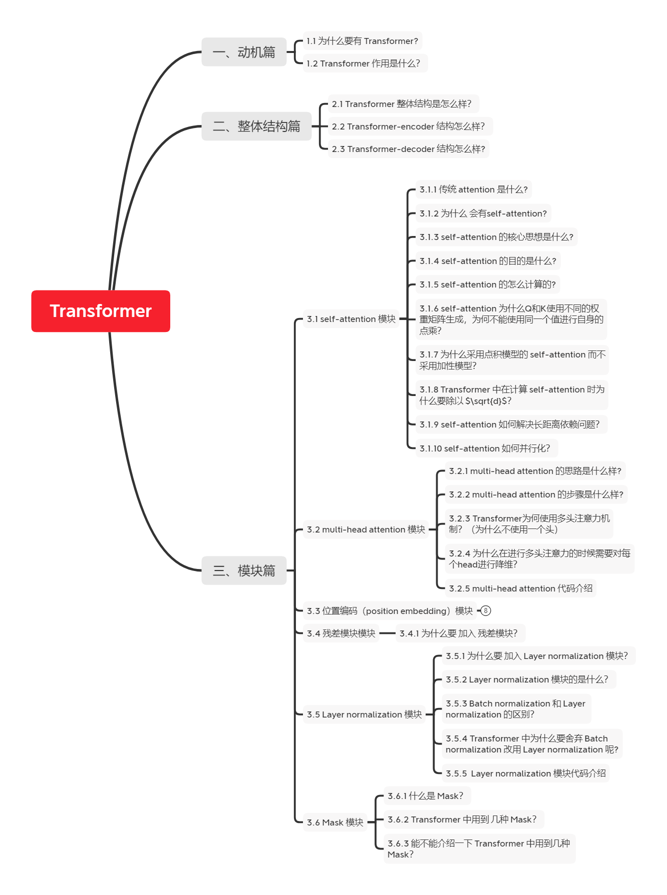

# 【关于 Transformer 问题及改进】那些的你不知道的事

> 作者：杨夕
> 
> 论文链接：https://arxiv.org/pdf/1706.03762.pdf
> 
> 【注：手机阅读可能图片打不开！！！】

本章主要介绍 Transformer 常见的问题，如下图所属：

> Transformer 常见问题

## 一、Transformer 问题篇

### 1.1 既然 Transformer 怎么牛逼，是否还存在一些问题？

- 问题一：Transformer 不能很好的处理超长输入问题；
- 问题二：方向信息以及相对位置 的 缺失 问题【这个问题在 NER 任务上表现明显，这也是为什么 Transformer 在 NER 任务上，效果要 差于 BiLSTM-CRF 和 IDCNN-CRF 的原因】；
- 问题三：缺少Recurrent Inductive Bias；
- 问题四：Transformer是非图灵完备的： 非图灵完备通俗的理解，就是无法解决所有的问题；
- 问题五：transformer缺少conditional computation；
- 问题六：transformer 时间复杂度 和 空间复杂度 过大问题；

## 二、每个问题的解决方法是什么？

### 2.1 问题一：Transformer 不能很好的处理超长输入问题

#### 2.1.1 Transformer 固定了句子长度？

- 介绍：Transformer 固定了句子长度
- 举例：
  - 例如 ：在 Bert 里面，输入句子的默认长度 为 512；
    - 对于 短于 512：填充句子方式；
    - 长于 512：会采用不同的方式进行处理

#### 2.1.2 Transformer 固定了句子长度 的目的是什么？

- 考虑了计算与运行效率综合做出的限制：
  - GPU memory：由于 self-attention 的计算开销 为 O(n^2)，如果序列长度太长，资源消耗大；
  - word piece tokenizer会把句子拆解成很细碎的token，远超过之前句子的长度。所以512其实不是很大的数字。

#### 2.1.3 Transformer 针对该问题的处理方法？

1. 方法一：直接截断的方法

截断句子方式（Transformer 处理方式）【这个也是 Transformer 和 Bert 中用到的方法】

2. 方法二：抽取重要片段

抽取长文本中比较主要的段落作为摘要，然后输入模型

3. 方法三：将句子划分为 多个 seg ([Vanilla Transformer](https://aaai.org/ojs/index.php/AAAI/article/view/4182) 处理方式);
   
- 思路：
  - 将文本划分为多个segments；
  - 训练的时候，对每个segment单独处理；
- 问题：
  - 因为 segments 之间独立训练，所以不同的token之间，最长的依赖关系，就取决于segment的长度 (如图(a))；
  - 出于效率的考虑，在划分segments的时候，不考虑句子的自然边界，而是根据固定的长度来划分序列，导致分割出来的segments在语义上是不完整的 (如图(a))；
  - 在预测的时候，会对固定长度的 segment 做计算，一般取最后一个位置的隐向量作为输出。为了充分利用上下文关系，在每做完一次预测之后，就对整个序列向右移动一个位置，再做一次计算，这导致计算效率非常低 (如图(b))；
    
    

4. 方法四：Segment-Level Recurrenc ( [Transformer-XL](https://aaai.org/ojs/index.php/AAAI/article/view/4182) 处理方式)

- 思路：
  - 在对当前segment进行处理的时候，**缓存**并利用上一个segment中所有layer的隐向量序列；
  - 上一个segment的所有隐向量序列只参与前向计算，不再进行反向传播；

### 2.2 问题二：Transformer 方向信息以及相对位置 的 缺失 问题

- 动机：
  - 方向信息和位置信息的缺失，导致 Transformer 在 NLP 中表现性能较差，例如在 命名实体识别任务中；
    - 举例：
      - 【李华住在北京】；李华是人名，北京是地名，如果忽视了方向，那么【北京住在李华】，这个肯定是说不通的。
- 解释：每类NER实体在哪种位置是有着某种关系或者规则的。所以方向很重要，普通TRM中的正弦位置编码能够捕捉到距离信息，但是不能捕捉到方向信息。而且这种基本性质（distance-awareness）会在sefl-attention消失；
- 解决方法：
  - 使用了经过改进的相对位置编码，弃用了绝对位置编码 [TENER: Adapting Transformer Encoder for Name Entity Recognition](https://arxiv.org/pdf/1911.04474.pdf) 

### 2.3  问题三：缺少Recurrent Inductive Bias

- 动机：
  - 学习算法中Inductive Bias可以用来预测从未遇到的输入的输出。对于很多序列建模任务（如需要对输入的层次结构进行建模时，或者在训练和推理期间输入长度的分布不同时），Recurrent Inductive Bias至关重要【可以看论文[The Importance of Being Recurrent for Modeling Hierarchical Structure](https://arxiv.org/abs/1803.03585)】

### 问题四：问题四：Transformer是非图灵完备的： 非图灵完备通俗的理解，就是无法解决所有的问题

- 动机：
  - 在Transformer中，单层中sequential operation (context two symbols需要的操作数)是$O(1)$ time，独立于输入序列的长度。那么总的sequenctial operation仅由层数$T$决定。这意味着transformer不能在计算上通用，即无法处理某些输入。如：输入是一个需要**对每个输入元素进行顺序处理**的函数，在这种情况下，对于任意给定的深度$T$的transformer，都可以构造一个长度为 $N>T$;

### 问题五：transformer缺少conditional computation；

- 动机：
  -  transformer在encoder的过程中，所有输入元素都有相同的计算量，比如对于“I arrived at the bank after crossing the river", 和"river"相比，需要更多的背景知识来推断单词"bank"的含义，然而transformer在编码这个句子的时候，无条件对于每个单词应用相同的计算量，这样的过程显然是低效的。

### 问题六：transformer 时间复杂度 和 空间复杂度 过大问题；

- 动机：
  - Transformer 中用到的自注意力与长度n呈现出$O(n^2)$的时间和空间复杂度
- 思路
  - 使用一个高效的（线性）广义注意力框架（generalized attention framework），允许基于不同相似性度量（核）的一类广泛的注意力机制 【[Rethinking Attention with Performers](https://arxiv.org/abs/2009.14794)】。
- 优点
  - 该方法在保持线性空间和时间复杂度的同时准确率也很有保证，也可以应用到独立的 softmax 运算。此外，该方法还可以和可逆层等其他技术进行互操作。

## 参考

1. [Vanilla Transformer](https://aaai.org/ojs/index.php/AAAI/article/view/4182)
2. [Transformer-XL](https://aaai.org/ojs/index.php/AAAI/article/view/4182)
3. [TENER: Adapting Transformer Encoder for Named Entity Recognition](https://arxiv.org/pdf/1911.04474.pdf)
4. [Rethinking Attention with Performers](https://arxiv.org/abs/2009.14794)