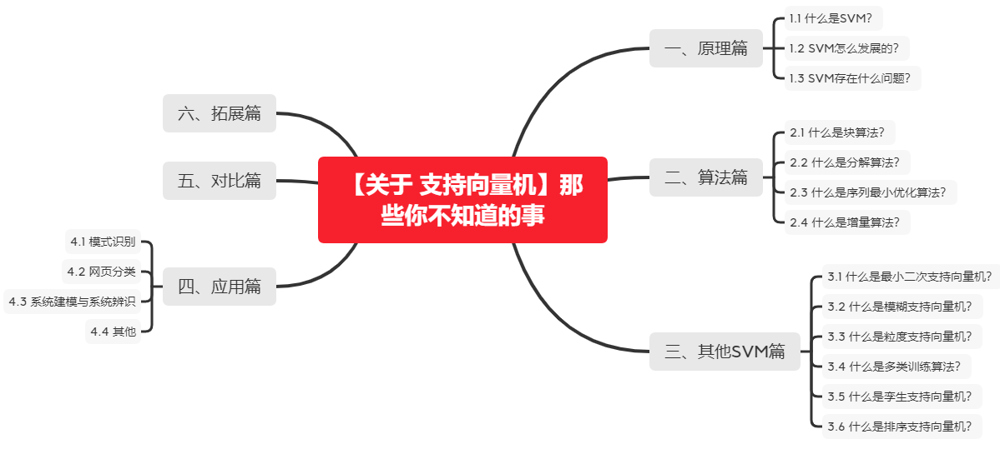

# 【关于 支持向量机】那些你不知道的事

> 作者：芙蕖

## 一、原理篇

### 1.1 什么是SVM？

- 数学模型

    支持向量机的提出基于统计学习理论和结构风险最小化准则，统计学习理论避免分类模型受样本量的限制，结构风险最小化准则避免模型训练时出现的模型问题。在这样的背景下，支持向量机技术的推广及其判别能力较强，其最终的目的是根据输入数据样本寻找到一个最优分类超平面。

    支持向量机最优分类面的求解问题可转化为求数据样本分类间隔最大化的二次函数的解，关键是求得分类间隔最大值的目标解。以两类线性可分数据为例，一类数据用圆形代表，另一类数据用菱形代表,则最优分类线示例图如图1所示。

    图1中， margin代表分类平面间的最大分类间隔，处于分类线两侧的数据点为待分类的样本。在该例图中，基本分类判别面方程如公式(1)所示，若对线性可分的样本集进行数据归一化处理，分类间隔表达式如公式(2)所示。

    基于上述分析，通过加入有效约束条件，引入拉格朗日乘子后，解得最优分类判别函数，且其参数的确定依赖于支持向量。实际应用中，核函数结合最优分类判别面形成的支持向量机模型解决了其只处理线性可分样本的弊端，两者结合形成最终的支持向量机模型。

    相应的通用支持向量机分类函数表达式如公式(3)所示。

    公式(3)中, a*i和b*i是调控支持向量机确定最优分类平面的参数。

- 核支持向量机

    支持向量机是基于两类线性可分的样本数据发展而来，但是在实际应用中，需要识别和分类的数据大多数情况下都处于非线性不可分状态，并非理想化状态。由此，研究人员设计一个核函数应用于支持向量机的分类过程中解决该问题，其主要目的是将原低维空间中非线性不可分数据映射到高维空间中，即解决低维特征空间无法构造分类超平面的问题。支持向量机的应用性能关键在于核函数方法的选取。

    核函数方法计算公式如下所示:

    公式(4)表示在特征空间直接计算内积，φ代表x映射到内积特征空间的过程。

    研究人员在解决不同的数据分类问题的时候需选择不同的参数，简单来说就是选择不同的核函数。核函数主要分为线性核、多项式核、Sigmoid核和Gauss径向基核。

   (1)**线性核**

    公式(5)代表数据所处的原空间中的内积计算。其作用是统一两空间数据形式，即数据处于原空间的形式与数据经映射后所处空间的形式。

   (2)**多项式核**

    公式(6)代表多项式空间中的内积计算,注重数据的全局性。其计算过程不同于线性核,这是由于直接在多项式空间计算会造成维数灾难，所以其计算包含一个转换过程,即从高维空间转到低维空间，利用低维空间计算其内积值。

   (3) **Sigmoid核**

    公式(7)实现将 Sigmoid函数作为核函数，其近似为多层感知器神经网络，注重样本数据的全局最优值。

   (4)**Gauss径向基核(RBF)**

    公式(8)可将原始特征空间映射到无穷维特征空间中，其性能好坏在于y参数的调控,局部性较强。y参数选取的值较小,映射后的特征空间近似一个低维空间；y参数选取的值较大,易造成过拟合问题.正因为其具有较强的可调控性,其在实际应用中更为广泛。

    实际应用中，研究者通过权衡各个核函数的优势与劣势，通常将最佳的核函数应用于特定数据分类领域中。将上述介绍的核函数与支持向量机结合后用于实验中的Matlab 代码实现如表1所示。

参考：刘方园, 王水花, 张煜东. 支持向量机模型与应用综述[J]. 计算机系统应用, 2018.

#### Q.A

- **那你讲一下SVM吧**。（面试题）

- **讲了下SVM的推导**：hard margin, soft margin, 几何距离、函数距离，最优化，拉格朗日乘子法，对偶问题，KKT条件，损失函数，惩罚系数等。面试题）
    
    或者直接问：**手推SVM**（面试题）

 
 
 注：手推SVM还可参考 https://blog.csdn.net/Oscar6280868/article/details/88391530
 
              https://www.cnblogs.com/hello-ai/p/11332654.html
              
              http://blog.sina.com.cn/s/blog_4298002e010144k8.html
    
- **讲一讲SVM，知道多少说多少？为什么要用对偶问题求解?**(今日头条)（面试题）
    
    1）首先是我们有不等式约束方程，这就需要我们写成min max的形式来得到最优解。而这种写成这种形式对x不能求导，所以我们需要转换成max min的形式，这时候，x就在里面了，这样就能对x求导了。而为了满足这种对偶变换成立，就需要满足KKT条件（KKT条件是原问题与对偶问题等价的必要条件，当原问题是凸优化问题时，变为充要条件）。
    
    2）对偶问题将原始问题中的约束转为了对偶问题中的等式约束
    
    3）方便核函数的引入
    
    4）改变了问题的复杂度。由求特征向量w转化为求比例系数a，在原始问题下，求解的复杂度与样本的维度有关，即w的维度。在对偶问题下，只与样本数量有关。
    
参考：https://www.cnblogs.com/shiyublog/p/10580603.html
    
- **支持向量机中到底什么是支持向量，即支持向量中的向量是指什么**

    支持向量本质是向量，而这些向量却起着很重要的作用，如果做分类，它们就是离分界线最近的向量。也就是说分界面是靠这些向量确定的，它们支撑着分类面。即就是离最优分类平面最近的离散点,也可以称为向量。
    
- 既然有很多的核函数，针对具体问题该怎么选择？ 如果使用核函数向高维空间映射后，问题仍然是线性不可分的，那怎么办？

    对核函数的选择，现在还缺乏指导原则，各种实验的观察结果（不光是文本分类）的确表明，某些问题用某些核函数效果很好，用另一些就很差，但是一般来讲，径向基核函数（rbf）是不会出太大偏差的一种首选。（在做文本分类系统的时候，使用径向基核函数，没有参数调优的情况下，绝大部分类别的准确和召回都在85%以上，可见。虽然libSVM的作者林智仁认为文本分类用线性核函数效果更佳，待考证）
    
    对于松弛变量来说。它是控制近似可分样本的对错分样本惩罚程度C，而这个参数没有一定的公式作参考，只能凭借经验核试验选取。

参考：https://blog.csdn.net/qq_23291783/article/details/51271468

- **SVM中惩罚参数C的理解（正则化参数对支持向量数的影响）**

    C理解为调节优化方向中两个指标（间隔大小，分类准确度）偏好的权重
    
    soft-margin SVM针对hard-margin SVM容易出现的过度拟合问题，适当放宽了margin的大小，容忍一些分类错误（violation），把这些样本当做噪声处理，本质上是间隔大小和噪声容忍度的一种trade-off，至于具体怎么trade-off，对哪个指标要求更高，那就体现在C这个参数上了。

    - 当C趋于无穷大时，这个问题也就是不允许出现分类误差的样本存在，那这就是一个hard-margin SVM问题（过拟合）
    - 当C趋于0时，我们不再关注分类是否正确，只要求间隔越大越好，那么我们将无法得到有意义的解且算法不会收敛。（欠拟合）

参考：https://blog.csdn.net/csdn_lzw/article/details/80185529

参考：https://blog.csdn.net/abcdefg90876/article/details/105283341

- **如何解决线性不可分问题？**

- **高维一定线性可分？**（面试题）

- **传统机器学习算法了解吗，比如XGBoost和SVM这些？**（面试题）

了解。

参考：https://blog.csdn.net/abcdefg90876/article/details/105283341

- **SVM的核函数了解多少？**（面试题）

- **SVM引入核函数本质？**（面试题）
    
    提高维度，增加模型复杂度

- **介绍下SVM以及它的核函数**（面试题）

- **SVM加核函数用过吗？讲一讲其中的差别？**(今日头条)（面试题）
  
    训练样本多，维度大就可以用核函数；如果样本少，用核函数比较容易过拟合

- **SVM核函数的选择？多项式核和RBF核的关系？**（面试题）
    
- **核函数的选择就是svm中的难点，也是核心问题（举出不同的例子？）**（面试题）
    
- **核函数是什么?高斯核映射到无穷维是怎么回事?**（面试题）
    
- **一个核函数都隐式定义了一个成为“再生核希尔伯特空间”的特征空间(iff条件)？**（面试题）
    
- **SVM 中有哪些核函数？**
- **为什么SVM要引入核函数？**
    
    当样本在原始空间线性不可分时，可将样本从原始空间映射到一个更高维的特征空间，使得样本在这个特征空间内线性可分。

- **SVM核函数有哪些？**

    线性（Linear）核函数：主要用于线性可分的情形。参数少，速度快。
    
    多项式核函数
    
    高斯（RBF）核函数：主要用于线性不可分的情形。参数多，分类结果非常依赖于参数。
    
    Sigmoid核函数
    
    拉普拉斯（Laplac）核函数
    
注：如果feature数量很大，跟样本数量差不多，建议使用LR或者Linear kernel的SVM。如果feature数量较少，样本数量一般，建议使用Gaussian Kernel的SVM。

 - **SVM在训练的时候有没有遇到hard example？**(今日头条)（面试题）
 
        SVM对hard example的应用很重要，先用一部分训练集训练一个模型，然后用剩下的一部分训练集的一部分做测试，把出错的再送入重新训练，重复二三次，效果会比较好

- **函数间隔/几何间隔是什么，有什么意义？**（面试题）

    相关关键词：硬间隔最大化（几何间隔）、函数间隔、学习的对偶问题、软间隔最大化（引入松弛变量）、非线性支持向量机（核技巧）、Hinge Loss（面试题）
    
  - SVM中硬间隔和软间隔

硬间隔分类即线性可分支持向量机，软间隔分类即线性不可分支持向量机，利用软间隔分类时是因为存在一些训练集样本不满足函数间隔（泛函间隔）大于等于1的条件，于是加入一个非负的参数 ζ （松弛变量），让得出的函数间隔加上 ζ 满足条件。于是软间隔分类法对应的拉格朗日方程对比于硬间隔分类法的方程就多了两个参数（一个ζ ，一个 β），但是当我们求出对偶问题的方程时惊奇的发现这两种情况下的方程是一致的。下面我说下自己对这个问题的理解。

我们可以先考虑软间隔分类法为什么会加入ζ 这个参数呢？硬间隔的分类法其结果容易受少数点的控制，这是很危险的，由于一定要满足函数间隔大于等于1的条件，而存在的少数离群点会让算法无法得到最优解，于是引入松弛变量，从字面就可以看出这个变量是为了缓和判定条件，所以当存在一些离群点时我们只要对应给他一个ζi，就可以在不变更最优分类超平面的情况下让这个离群点满足分类条件。

综上，我们可以看出来软间隔分类法加入ζ 参数，使得最优分类超平面不会受到离群点的影响，不会向离群点靠近或远离，相当于我们去求解排除了离群点之后，样本点已经线性可分的情况下的硬间隔分类问题，所以两者的对偶问题是一致的。
    
- **SVM为什么采用间隔最大化？**

当训练数据线性可分时，存在无穷个分离超平面可以将两类数据正确分开。

感知机利用误分类最小策略，求得分离超平面，不过此时的解有无穷多个。

线性可分支持向量机利用间隔最大化求得最优分离超平面，这时，解是唯一的。另一方面，此时的分隔超平面所产生的分类结果是最鲁棒的，对未知实例的泛化能力最强。

然后应该借此阐述，几何间隔，函数间隔，及从函数间隔—>求解最小化1/2 ||w||^2 时的w和b。即线性可分支持向量机学习算法—最大间隔法的由来。

- **怎么理解SVM的损失函数?**（面试题）

- **使用高斯核函数，请描述SVM的参数C和σ对分类器的影响**（面试题）

- **SVM 为什么可以处理非线性问题？**

### 1.2 SVM怎么发展的？

SVM是由模式识别中广义肖像算法（generalized portrait algorithm）发展而来的分类器，其早期工作来自前苏联学者Vladimir N. Vapnik和Alexander Y. Lerner在1963年发表的研究。1964年，Vapnik和Alexey Y. Chervonenkis对广义肖像算法进行了进一步讨论并建立了硬边距的线性SVM。此后在二十世纪70-80年代，随着模式识别中最大边距决策边界的理论研究  、基于松弛变量（slack variable）的规划问题求解技术的出现 ，和VC维（Vapnik-Chervonenkis dimension, VC dimension）的提出，SVM被逐步理论化并成为统计学习理论的一部分。1992年，Bernhard E. Boser、Isabelle M. Guyon和Vapnik通过核方法得到了非线性SVM。1995年，Corinna Cortes和Vapnik提出了软边距的非线性SVM并将其应用于手写字符识别问题，这份研究在发表后得到了关注和引用，为SVM在各领域的应用提供了参考。

参考：https://baike.baidu.com/item/%E6%94%AF%E6%8C%81%E5%90%91%E9%87%8F%E6%9C%BA/9683835?fr=aladdin

### 1.3 SVM存在什么问题？

(1) SVM算法对大规模训练样本难以实施

     SVM的空间消耗主要是存储训练样本和核矩阵，由于SVM是借助二次规划来求解支持向量，而求解二次规划将涉及m阶矩阵的计算（m为样本的个数），当m数目很大时该矩阵的存储和计算将耗费大量的机器内存和运算时间。针对以上问题的主要改进有有J.Platt的SMO算法、T.Joachims的SVM、C.J.C.Burges等的PCGC、张学工的CSVM以及O.L.Mangasarian等的SOR算法。

     如果数据量很大，SVM的训练时间就会比较长，如垃圾邮件的分类检测，没有使用SVM分类器，而是使用了简单的naive bayes分类器，或者是使用逻辑回归模型分类。

 
(2) 用SVM解决多分类问题存在困难

     经典的支持向量机算法只给出了二类分类的算法，而在数据挖掘的实际应用中，一般要解决多类的分类问题。可以通过多个二类支持向量机的组合来解决。主要有一对多组合模式、一对一组合模式和SVM决策树；再就是通过构造多个分类器的组合来解决。主要原理是克服SVM固有的缺点，结合其他算法的优势，解决多类问题的分类精度。如：与粗集理论结合，形成一种优势互补的多类问题的组合分类器。

 
(3)对缺失数据敏感，对参数和核函数的选择敏感

    支持向量机性能的优劣主要取决于核函数的选取,所以对于一个实际问题而言,如何根据实际的数据模型选择合适的核函数从而构造SVM算法.目前比较成熟的核函数及其参数的选择都是人为的,根据经验来选取的,带有一定的随意性.在不同的问题领域,核函数应当具有不同的形式和参数,所以在选取时候应该将领域知识引入进来,但是目前还没有好的方法来解决核函数的选取问题.

参考：https://www.cnblogs.com/hanxiaosheng/p/9908763.html

(1)支持向量机算法的核心是核函数及其参数,它们的正确选取对SVM的预测及泛化性能影响很大。对于具体的研究问题,究竟选择哪种核函数并找到最优的参数对求解问题至关重要。因此,如何快速准确地选择核函数及对应的参数来满足快速性和准确性要求是迄待解决的问题。

(2)在大规模及实时性要求较高的系统中，SVM算法受制于求解问题的收敛速度和系统规模的复杂程度。在非线性系统的SVM训练算法中，尤其要处理大规模数据时,需要解决样本规模和速度间的矛盾,提高训练算法的效率和精度。

(3）如何有效地将二类别分类器有效地扩展到多类别问题上,多类SVM的优化设计也是今后研究的内容。

(4)针对特定问题如何实现支持向量机与其他算法的融合,从而顺利解决待求问题也是需要研究的方向。

(5)目前的SVM研究侧重于理论研究,真正的实践应用还有一段距离。

目前, SVM仍然存在很多问题需进一步的研究,可将SVM与离散余弦变换、小波包分解、主元分析、独立分量分析﹑聚类﹑粗糙集理论等方法结合,提高应用效果并不断探索SVM新的应用领域。

参考：张松兰. 支持向量机的算法及应用综述[J]. 江苏理工学院学报(2):14-17.

#### Q.A

    1、精通svm，那你说一下svm中的难点是什么？以及你是怎么解决这个难点的？（熟悉的问法）
    
    2、SVM 中的优化技术有哪些？

## 二、算法篇

    基本的支持向量机算法基本思想是在二次规划的基础上不断迭代寻找支持向量,主要有块算法、分解算法、序列最小优化算法﹑增量算法等，下面介绍这几种基本的支持向量机算法。

### 2.1 什么是块算法？

    Chunking算法的出发点是删除矩阵中对应Lagrange乘数为零的行和列将不会影响最终的结果。对于给定的样本，Chunking算法的目标是通过某种迭代方式逐步排除非支持向量，从而降低训练过程对存储器容量的要求。具体做法是，将一个大型QP问题分解为一系列较小规模的QP问题,然后找到所有非零的Lagrange乘数并删除。在算法的每步中Chunking都解决一个QP问题，其样本为上一步所剩的具有非零Lagrange乘数的样本以及M个不满足KKT条件的最差样本。如果在某一步中,不满足KKT条件的样本数不足M个，则这些样本全部加入到新的QP问题中。每个QP子问题都采用上一个QP子问题的结果作为初始值。在算法进行到最后一步时，所有非零Lagrange乘数都被找到，从而解决了初始的大型QP问题。
    
    Chunking算法将矩阵规模从训练样本数的平方减少到具有非零Lagrange乘数的样本数的平方，在很大程度上降低了训练过程对存储容量的要求。Chunking算法能够大大提高训练速度，尤其是当支持向量的数目远远小于训练样本的数目时。然而，如果支持向量个数比较多，随着算法迭代次数的增多，所选的块也会越来越大，算法的训练速度依旧会变得十分缓慢。

参考：丁世飞, 齐丙娟, 谭红艳. 支持向量机理论与算法研究综述[J]. 电子科技大学学报, 2011, 40(001):2-10.

### 2.2 什么是分解算法？

    分解算法最早在1997年OSUNA等人中提出，是目前有效解决大规模问题的主要方法。分解算法将二次规划问题分解成一系列规模较小的二次规划子问题，进行迭代求解。在每次迭代中，选取拉格朗日乘子分量的一个子集做为工作集，利用传统优化算法求解一个二次规划的子问题。以分类SVM为例，分解算法的主要思想是将训练样本分成工作集B和非工作集N，工作集B中的样本个数为q，q远小于训练样本总数。每次只针对工作集B中的样本进行训练，而固定N中的训练样本。该算法的关键在于选择一种最优工作集选择算法，而在工作集的选取中采用了随机的方法，因此限制了算法的收敛速度。
    
    1998年，JOACHIMS等人在分解算法的基础上对工作集的选择做了重要改进。采用类似可行方向法的策略确定工作集B。如果存在不满足KTT条件的样本，利用最速下降法，在最速下降方向中存在q个样本，然后以这q个样本构成工作集,在该工作集上解决QP问题，直到所有样本满足KTT条件。如此改进提高了分解算法的收敛速度，并且实现了sVMlieht算法。
    
    1998年，PLATT等人提出的序列最小优化(sequentialminimal optimization，SMO)算法是分解算法的一个特例，工作集中只有2个样本，其优点是针对2个样本的二次规划问题可以有解析解的形式，从而避免多样本情况下的数值解不稳定及耗时问题，且不需要大的矩阵存储空间，特别适合稀疏样本。工作集的选择不是传统的最陡下降法，而是启发式。通过两个嵌套的循环寻找待优化的样本，然后在内环中选择另一个样本，完成一次优化，再循环，进行下一次优化，直到全部样本都满足最优条件。SMO算法主要耗时在最优条件的判断上，所以应寻找最合理即计算代价最低的最优条件判别式。
    
    SMO算法提出后，许多学者对其进行了有效的改进。DAI等人在2005年提出了在内循环中每次优化3个变量，因为3个变量的优化问题同样可以解析求解，实验表明该算法比SMO的训练时间更短。KEERTHI和PLATT等人在迭代过程中的判优条件和循环策略上做了一定的修改，加快了算法的速度。

参考：丁世飞, 齐丙娟, 谭红艳. 支持向量机理论与算法研究综述[J]. 电子科技大学学报, 2011, 40(001):2-10.

### 2.3 什么是序列最小优化算法？

    PLATT等人在1998年提出的序列最小优化(sequential minimal optimization,SMO)算法是在分解算法的基础上发展起来的,它将工作集减少为只有2个样本。通过两个嵌套的循环寻找待优化的两个样本,外层循环主要寻找工作集的第一个样本;然后采用启发式规则选择第二个样本,选择的原则是使目标函数靠近最优点的速度达到最快;最后用解析的方法快速对选定的样本进行优化。工作集的选择采用启发式选择策略加快了算法的收敛速度，同时减小了矩阵存储空间,适合于稀疏样本。

参考：张松兰. 支持向量机的算法及应用综述[J]. 江苏理工学院学报(2):14-17.

### 2.4 什么是增量算法？

    增量学习是机器学习系统在处理新增样本时，能够只对原学习结果中与新样本有关的部分进行增加修改或删除操作，与之无关的部分则不被触及。增量训练算法的一个突出特点是支持向量机的学习不是一次离线进行的，而是一个数据逐一加入反复优化的过程。
    
    SYED等人在1999年最早提出了SVM增量训练算法，每次只选一小批常规二次算法能处理的数据作为增量，保留原样本中的支持向量和新增样本混合训练，直到训练样本用完。GAUWENBERGHS等人提出了增量训练的精确解，即增加一个训练样本或减少一个样本对Lagrange系数和支持向量的影响。RALAIVOLA等人提出了另一种增量式学习方法，其思想是基于高斯核的局部特性，只更新对学习机器输出影响最大的Lagrange系数，以减少计算复杂度。孔锐等人提出了一种“快速增量学习算法”，该算法依据边界向量不一定是支持向量，但支持向量一定是边界向量的原理，首先选择那些可能成为支持向量的边界向量，进行SVM的增量学习，找出支持向量，最终求出最优分类面，提高训练速度。孔波等人提出了基于中心距离比值的增量运动向量机，利用中心距离比值，在保证训练和测试准确率没有改变的情况下，提高收敛速度。李东晖等人提出了基于壳向量的线性SVM增量学习算法，通过初始样本集求得壳向量，进行SVM训练，得到支持向量集降低二次规划过程的复杂度，提高整个算法的训练速度和分类精度。

    以上几种基本算法本质上都是将一个大规模的二次规划问题分解为小的二次规划问题,不同的是分解策略和工作集的选取方法,这也是导致算法收敛速度快慢的原因。

参考：丁世飞, 齐丙娟, 谭红艳. 支持向量机理论与算法研究综述[J]. 电子科技大学学报, 2011, 40(001):2-10.

#### Q.A

    

## 三、其他SVM篇

### 3.1 什么是最小二次支持向量机？

    在求解大型QP问题时,基本支持向量机算法中的块算法和分解算法会存在维数灾难和求解速度过慢等问题,在支持向量机的求解过程中约束条件为不等式约束,为简化寻优过程并保证一定的学习速度,用等式约束来代替式(1)中的不等式约束，用最小二乘损失函数代替不敏感损失函数来简化求解过程,从而得到最小二乘支持向量机算法，如下所示：

参考：张松兰. 支持向量机的算法及应用综述[J]. 江苏理工学院学报(2):14-17.

### 3.2 什么是模糊支持向量机？

    由于实际样本检测时存在不同程度的噪声，需要从样本数据中将非正常数据筛以除降低其影响。具体实施方法为:通过在训练样本数据集中增加每个样本的隶属度项,如对样本中的噪声数据和孤立点给予较小的隶属度,正常的样本赋予较大的隶属度,从而对不同的样本起到惩罚作用，降低噪声数据对分类最优平面的影响。模糊支持向量机算法结合模糊数学方法通过在基本支持向量机算法的基础上增加隶属度值对最优平面起到调节作用,提高分类精度。但样本数据中如果异常数据较多时,会影响支持向量机的泛化学习能力,另外由于增加了隶属度项,使得核函数计算复杂,训练速度降低。

    为了克服噪声和野值点对支持向量机的影响，LIN等人将模糊数学和支持向量机相结合，提出了模糊支持向量机，主要用于处理训练样本中的噪声数据。其主要思想是针对支持向量机对训练样本内的噪音和孤立点的敏感性，在训练样本集中增加一项隶属度，并赋予支持向量较高的隶属度，而非支持向量及噪声野值点赋予较小的隶属度，从而降低非支持向量、噪声和野值点对最优超平面的影响。
    
    FSVM中存在的问题是如何确定隶属度值，即如何确定各个样本的权重。LIN等人提出了基于类中心的隶属度确定方法，将样本点到其类中心的距离的线性函数作为隶属度函数，但是隶属函数会严重依赖训练样本集的几何形状，降低支持向量的隶属度。HUANG和张翔等人也提出相似的隶属度确定方法。张贵香等人提出一种基于类内超平面距离的隶属度确定方法，将样本点到类内平面距离的线性函数作为隶属度函数，降低了隶属度函数对训练样本集几何形状的依赖，提高了支持向量的隶属度。李苗苗等人提出了一种新的核隶属度函数，该新的隶属度函数不仅依赖于每个样本点到类型中心的距离，还依赖于该样本点最邻近的K个其他样本点的距离。孙名松等人通过对每个样本赋予不同的双隶属度，得到最优分类器。吴青和YAN等人提出了去边缘的FSVM主要是根据训练集的几何形状，将其分成两个子集，认为其中一个子集不包含支持向量并将其舍去;另一子集包含支持向量并在该子集中进行训练，但会人为地去除一些支持向量而导致分类精度降低。针对一般模糊支持向量机训练时间过长，训练效率低下的问题，刘宏冰等人对边缘数据赋予较大的隶属度，而对类中心附近的数据赋予较小的隶属度，体现加大对容易错分样本进行惩罚的改进策略。施其权等人进一步对离分类超平面较远不可能成为支持向量的数据赋予较小的隶属度，使训练样本集中的数据大大减少。

参考：丁世飞, 齐丙娟, 谭红艳. 支持向量机理论与算法研究综述[J]. 电子科技大学学报, 2011, 40(001):2-10.
参考：张松兰. 支持向量机的算法及应用综述[J]. 江苏理工学院学报(2):14-17.

### 3.3 什么是粒度支持向量机？

    GSVM的主要思想是通过常用的粒度划分方法构建粒度空间获得一系列信息粒，然后在每个信息粒上进行学习，最后通过聚合信息粒上的信息(或数据、规则知识、属性等)获得最终的支持向量机决策函数。该学习机制通过数据的粒化可以将一个线性不可分问题转化为一系列线性可分问题，从而获得多个决策函数;该学习机制还使数据的泛化性能增强，即可在SVM的训练中得到间隔更宽的超平面。
    
    原空间的GSVM模型在原空间进行粒划分，然后在核空间进行SVM学习。基于关联规则的GSVM是TANG等人提出的，其基本思想是通过RBF核函数原空间的样本映射到特征空间并展开成麦克劳林级数，并从展开式中挖掘对分类分析起重要作用的关联规则，利用这些有用的相关关联规则划分粒度，从而在SVM的分类模式中学习出关联规则分类器。基于聚类的GSVM，其基本思想是首先采用常用的聚类方法结合一定的评价规则将原始数据划分为若干个粒，然后选择其中含有较多信息量的粒参与SVM的分类或者回归，使SVM在大规模数据集的训练中能得到较高的效率和泛化能力。基于粗糙集的GSVM，其基本思想是首先用粗糙集对数据进行预处理，以达到减少冗余数据，压缩数据规模的目的，进而提高支持向量机的分类速度。基于树形层次结构的GSVM33其基本思想是根据聚类训练结果对正类数据与负类数据分别构造两棵“支持向量粒度树”，离边缘较近的继续延伸，直到达到需要的精度为止。此外，我国还有很多学者研究基于商空间(34-35]、决策树、神经网络的GSVM学习算法。
    
    GUO和王文剑等人提出的核空间的GSVM(KGSVM)模型首先将原始数据映射到核空间，然后在核空间进行粒的划分和粒的代替，最后在相同的核空间中进行粒的SVM训练。与传统的GSVM模型相比，KGSVM模型克服了核空间数据分布不一致的问题。传统的GSVM由于分粒是在原空间中进行的，粒划分时非常可能丢失大量有用的信息。但是GSVM是在核空间中进行粒的划分和替代，因此可以利用半径规则获得更好的分类精度和泛化性能。张文浩等人对KGSVM模型进行了改进,提出了核粒度下基于关联规则的GSVM。

参考：丁世飞, 齐丙娟, 谭红艳. 支持向量机理论与算法研究综述[J]. 电子科技大学学报, 2011, 40(001):2-10.

### 3.4 什么是多类训练算法？

    随着研究问题的复杂化,现实的分类问题不单纯是正反两类,会存在多类的现象。对多分类问题需构造多类SVM分类器,主要通过目标函数和分类器来完成。对应的实现途径主要有两种:一种是通过选取合适的目标函数来实现k类分类支持向量机。由于实际问题存在多类,因而选择的目标函数变量多,求解过程复杂,一般只用于解决小型问题。另--种实现方法基于两分类器的分类思想,将多个两分类器进行组合,主要方法有一对多算法、一对一算法﹑决策导向无环图。一对多算法对k个类的样本需构造k个分类器,样本对应的决策函数最大即为所对应的类。一对一算法对k类训练样本中的任两类构造一个分类器,两两组合构造多个分类器,然后在这些分类器中使用投票法累计各个类的投票数,其中得票数最多的类即为样本点所属的类。当类别较大时组合分类器数量较多,影响分类预测速度。对此Platt等提出了一个新的学习架构:决策导向无环图。每个分类器有两类,类似于二叉树,在分类过程中由根部开始经各层中间节点逐步向叶节点分类,这种分类方法能提高支持向量机的分类速度和性能。

参考：张松兰. 支持向量机的算法及应用综述[J]. 江苏理工学院学报(2):14-17.

### 3.5 什么是孪生支持向量机？

    JAYADCVA等人提出了一种二值数据的分类器——孪生支持向量机(又称双分界面支持向量机)。TWSVMs在形式上类似于传统的支持向量机,不仅具有传统支持向量机的优点，而且对大规模数据具有更好的处理能力。TWSVMs为两个类各自得到一个分类平面，属于每个类的数据尽量围绕在与之相对应的分类平面周围，然后TWSVMs通过优化一对分类平面来构建分类超平面。也就是说，TWSVMs需要解决一对QP问题，而SVM则是解决一个QP问题，但是在TWSVMs中，其中一个类的数据要作为另一个QP问题的约束条件，反之亦然。
    
    尽管TWSVMs相比较于SVM具有更为快速的训练速度，但如今信息时代面临的是“数据海量，知识匮乏”，对于机器学习是一个很大的挑战，同样，对TWSVMs而言，训练速度也非常重要。尽管目前传统SVM已有许多成熟的学习算法,并且也可以推广到孪生模型，但这些算法并没有考虑到孪生模型的具体区别，因而有必要提出基于具体孪生模型的高效学习算法，以体现TWSVMs的具体特性。另外，现有的孪生模型并不具有类似于传统支持向量机的特性，即间隔。因此，如果能将孪生模型与传统支持向量的优点成功结合在一起，则可以得到既具有较快训练速度又具有较好理论基础的孪生支持向量机模型。
    
    有了好的模型、好的算法之后，可以考虑将孪生模型推广到一些具体问题，如半监督学习问题、模糊或区间数据的学习问题、回归问题，并将该模型推广到各类实际问题，特别是生物信息学方面的应用，如基因调控网络预测。

参考：丁世飞, 齐丙娟, 谭红艳. 支持向量机理论与算法研究综述[J]. 电子科技大学学报, 2011, 40(001):2-10.

### 3.6 什么是排序支持向量机？

    排序学习是当前信息检索和机器学习领域的热点问题，广泛应用于许多领域，包括文档检索、协同过滤、关键字提取、定义发现等等。排序学习问题大致分为基于回归的排序学习和基于分类的排序学习两类。从上面的介绍可以看出，SVM的排序学习模型可以基于分类又可以基于顺序回归，所以自RSVM 61提出以来，该排序学习方法便得到了很大的发展。
    
    RSVM在应用中大部分用于信息检索，其中最主要的问题是如何针对检索问题建立适用于具体应用的损伤函数。可以与基本的SVM一样，两类数据使用相同的代价函数;也可以针对两类数据分别建立不同的代价函数，对某些应用会大大提高排序的精确度。
    
    YAJIMA等人将RSVM用于推荐系统，文中使用1-SVM对给定数据的相关度顺序进行预测，通过使用图核处理数据集，取得了很好的效果。SVM的回归排序模型也能用于推荐系统，与传统的使用启发式的推荐系统相比，该方法在大样本下的性能是相当高效的。
    
    在实际应用中，速度永远是人们追求的目标。传统的RSVM都是使用2-SVM进行学习，YU等人使用1-SVM学习排序，该方法可以使用更少的支持向量，大大提高训练速度。参数选择对于SVM的训练速度起着至关重要的作用，使用用于核方法的正则化路径方法可以加速RSVM中的参数选择并使该过程自动化，从而提高训练速度。在分子测序中，由于数据为结构数据，RSVM的训练速度很长，将粒度计算与RSVM结合，使用粒度计算进行属性约简和问题分割，在保证学习质量的情况下提高训练速度。
    
    传统的RSVM在应用中有其局限性，即模型过于简单而不能用于复杂的排序;很难将先验知识加入模型中。为了克服这些局限，一种新的排序支持向量机被提出，它将一般RSVM输出的打分函数映射为一个概率sigmoid函数，该函数用交叉检验进行训练，实际上该函数就是输入数据集的后验概率，可以用其进行一些后处理的工作，避免传统RSVM的应用局限性。

参考：丁世飞, 齐丙娟, 谭红艳. 支持向量机理论与算法研究综述[J]. 电子科技大学学报, 2011, 40(001):2-10.

#### Q.A

- SVM如何解决多分类问题（面试题）
    或者SVM可以用来划分多类别吗? 如果可以，要怎么实现？（面试题）

    一般有两种做法：
    
    1）直接法：直接在目标函数上修改，将多个分类面的参数求解合并到一个最优化问题里面。看似简单但是计算量却非常的大。
    
    2）间接法：对训练器进行组合。其中比较典型的有一对一，和一对多。
    
     - 一对多：对每个类都训练出一个分类器，由svm是二分类，所以将此而分类器的两类设定为目标类为一类，其余类为另外一类。这样针对k个类可以训练出k个分类器，当有一个新的样本来的时候，用这k个分类器来测试，那个分类器的概率高，那么这个样本就属于哪一类。这种方法效果不太好，bias比较高。
     - 一对一：针对任意两个类训练出一个分类器，如果有k类，一共训练出C(2,k) 个分类器，这样当有一个新的样本要来的时候，用这C(2,k) 个分类器来测试，每当被判定属于某一类的时候，该类就加一，最后票数最多的类别被认定为该样本的类。
     

## 四、应用篇

### 4.1 模式识别

    在手写字体识别方面,当采用5层神经网络算法时,其识别的错误率为5.1%;贝尔实验室最先将SVM应用于手写字体识别研究,选取三种不同的核函数时,得到的误识率分别为4.0% ,4.1%和4.2%,可看出支持向量机方法比神经网络算法具有更好的分类准确性。柳回春等在SVM 的基础上结合与RBF神经网络将其用于UK心理测试自动分析系统的手写体数字识别问题。手写体识别属于多类问题。相关专家学者在研究2类问题的SVM前提下,形成了能够处理多类问题的相关SVM，其中主要核函数就是sigmoid核函数、径向基核函数、多项式核函数。不但可以支持比较其他分类和支持向量机，还能够支持比较不同形式的SVM,经过大量实践可以发现，存在很大优势。

    在人脸识别方面,由于人脸图像存储和SVM训练需要大量的存储空间,周志明等人将小波变换与支持向量机相结合,由小波变换提取人脸特征,减小特征向量维数并将其输入到SVM中,并结合最近邻分类器进行分类,提高了分类器的鲁棒性和分类精度。相关学者和专家经过不断研究和分析以后形成以层次结构形式的支持向量机分类器,由一个非线性和线性支持向量机构成，上述方式不但具备比较低的误差率和比较高的检测率，还存在比较快的速度。此后，人们利用SVM方式来有效判断人脸姿态，并且合理分为6个类别，手工标定方式在多姿态人脸库中发现测试样本和训练样本集，在SVM基础上的训练集姿态分类器,可以降低到1.67%的错误率。在支持向量机和小波技术上形成的识别人脸技术,压缩提取人脸特征的时候应用小波技术,然后结合支持向量机技术和邻近分类器进行分类，确保具备比较好的鲁棒性能和分类性能。

    在语音识别方面,由于背景环境中存在不同程度的噪杂声,根据支持向量机和隐式马尔可夫模型相结合的特点,忻栋等建立SVM和隐式马尔可夫模型两者相结合的混合模型,算法比较复杂,用来解决语音识别问题。

参考：张松兰. 支持向量机的算法及应用综述[J]. 江苏理工学院学报(2):14-17.

### 4.2 网页分类

    在中文网页分类问题上,贺海军等在网页文本的特征表示和二分类问题的基础上,把二叉决策树和SVM算法相结合构成多类分类器,实现网页文本的分类,取得了较好的分类效果和训练速度。
    
    在网络入侵检测分类方面,网络入侵检测其实也是一种网页分类。徐文龙等提出了一种基于从特殊到特殊的直推式支持向量机,从获取的网络数据中进行归纳式学习和标记样本,从中提出特征输入到TSVM学习机中进行学习,检测其异常的网络入侵,提高了测试样本的分类准确度。

参考：张松兰. 支持向量机的算法及应用综述[J]. 江苏理工学院学报(2):14-17.

### 4.3 系统建模与系统辨识

    在未知非线性系统建模方面,张浩然等'利用对象的输入输出数据集,在非线性系统的控制结构设计中采用支持向量机建模来获取对象的动态特性,以SVM作为辨识器在控制器中采用指数梯度法实现控制作用。
    
    在非线性系统的辨识方面,崔万照等将最小二乘方法应用于支持向量机算法中并选择小波函数作为支持向量机的核函数,构造最小二乘小波支持向量机来解决单输人单输出(SISO)非线性系统的辨识问题,仿真结果表明此方法能提高辨识效果,加快系统响应时间。

参考：张松兰. 支持向量机的算法及应用综述[J]. 江苏理工学院学报(2):14-17.

### 4.4 其他

    支持向量机具备一定的优越性,已经得到大量应用。专家学者提出了支持向量机基础上的水印算法,在数字水印中合理应用支持向量机，存在十分良好的应用效果。并且入侵监测系统已经是十分重要的网络安全技术之一，在分析入侵检测系统的时候，主要应用的就是SVM基础上的主动学习算法，可以在一定程度上降低学习样本,能够增加入侵监测系统整体分类性能。在处理图像中迷糊噪音的时候,依据SVM模糊推理方式形成的一种噪音检测系统,上述方式能够合理除去检测中的噪音,适当保存图像相关信息。在分析混合气体定量和多维光谱定性的时候，不能应用同一种方式来定性和定量分析组合气体吸收普线重叠、输入光谱的维数,训练样本数目有限，在分析地混合气体多维光谱的时候应用支持向量机,依据核函数有效把重叠光谱数据变为支持向量机回归模型,此时可以定量分析混合气体的组分浓度以及定性分析种类。

## 五、对比篇

- **SVM和LR的区别与联系？**（面试题）
    
    或者SVM和Logistic回归的异同？（面试题）

1）相同点

    第一，LR和SVM都是分类算法。

    看到这里很多人就不会认同了，因为在很大一部分人眼里，LR是回归算法。我是非常不赞同这一点的，因为我认为判断一个算法是分类还是回归算法的唯一标准就是样本label的类型，如果label是离散的，就是分类算法，如果label是连续的，就是回归算法。很明显，LR的训练数据的label是“0或者1”，当然是分类算法。其实这样不重要啦，暂且迁就我认为它是分类算法吧，再说了，SVM也可以回归用呢。

    第二，如果不考虑核函数，LR和SVM都是线性分类算法，也就是说他们的分类决策面都是线性的。

    这里要先说明一点，那就是LR也是可以用核函数的，至于为什么通常在SVM中运用核函数而不在LR中运用，后面讲到他们之间区别的时候会重点分析。总之，原始的LR和SVM都是线性分类器，这也是为什么通常没人问你决策树和LR什么区别，决策树和SVM什么区别，你说一个非线性分类器和一个线性分类器有什么区别？

    第三，LR和SVM都是监督学习算法。

    这个就不赘述什么是监督学习，什么是半监督学习，什么是非监督学习了。

    第四，LR和SVM都是判别模型。

    判别模型会生成一个表示P(Y|X)的判别函数（或预测模型），而生成模型先计算联合概率p(Y,X)然后通过贝叶斯公式转化为条件概率。简单来说，在计算判别模型时，不会计算联合概率，而在计算生成模型时，必须先计算联合概率。或者这样理解：生成算法尝试去找到底这个数据是怎么生成的（产生的），然后再对一个信号进行分类。基于你的生成假设，那么那个类别最有可能产生这个信号，这个信号就属于那个类别。判别模型不关心数据是怎么生成的，它只关心信号之间的差别，然后用差别来简单对给定的一个信号进行分类。常见的判别模型有：KNN、SVM、LR，常见的生成模型有：朴素贝叶斯，隐马尔可夫模型。当然，这也是为什么很少有人问你朴素贝叶斯和LR以及朴素贝叶斯和SVM有什么区别（哈哈，废话是不是太多）。

2）不同点

    第一，本质上是其损失函数（loss function）不同。lr的损失函数是 cross entropy loss， adaboost的损失函数是 expotional loss ,svm是hinge loss，常见的回归模型通常用 均方误差 loss。

    SVM 和正则化的逻辑回归它们的损失函数：

    第二，支持向量机只考虑局部的边界线附近的点，而逻辑回归考虑全局（远离的点对边界线的确定也起作用）。

    第三，在解决非线性问题时，支持向量机采用核函数的机制，而LR通常不采用核函数的方法。

    第四，线性SVM依赖数据表达的距离测度，所以需要对数据先做normalization，LR不受其影响。

    第五，SVM的损失函数就自带正则（损失函数中的1/2||w||^2项），这就是为什么SVM是结构风险最小化算法的原因；而LR必须另外在损失函数上添加正则项。

- 说LR和SVM损失函数。（面试题）  

- SVM框架下引入Logistic函数:输出条件后验概率？（面试题）

- 感知机的对偶形式和SVM对偶形式的对比（面试题）

- 为什么要用对偶形式？如何理解对偶函数的引入对计算带来的优势？（面试题）

## 六、拓展篇

- SVM用于回归问题:SVR（面试题）

## 参考资料

1.https://github.com/datawhalechina/Daily-interview/blob/master/machine-learning/SVM.md

2.刘方园, 王水花, 张煜东. 支持向量机模型与应用综述[J]. 计算机系统应用, 2018.

3.https://www.cnblogs.com/shiyublog/p/10580603.html

4.https://blog.csdn.net/qq_23291783/article/details/51271468

5.https://blog.csdn.net/csdn_lzw/article/details/80185529

6.https://blog.csdn.net/abcdefg90876/article/details/105283341

7.https://blog.csdn.net/abcdefg90876/article/details/105283341

8.https://baike.baidu.com/item/%E6%94%AF%E6%8C%81%E5%90%91%E9%87%8F%E6%9C%BA/9683835?fr=aladdin

9.https://www.cnblogs.com/hanxiaosheng/p/9908763.html

10.张松兰. 支持向量机的算法及应用综述[J]. 江苏理工学院学报(2):14-17.

11.丁世飞, 齐丙娟, 谭红艳. 支持向量机理论与算法研究综述[J]. 电子科技大学学报, 2011, 40(001):2-10.

