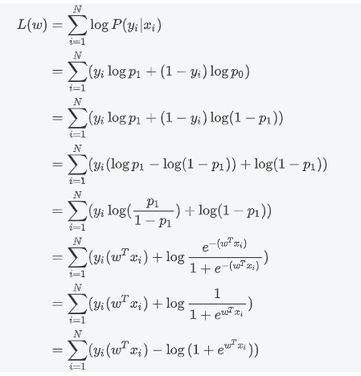
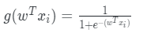
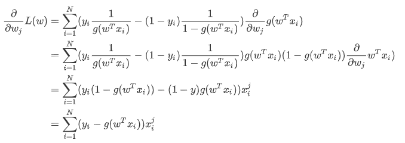
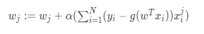

# 【关于 逻辑回归】那些你不知道的事

> 贡献者：姚鑫、艾春辉，芙蕖，李玲

## 一、介绍篇

### 1.1什么是逻辑回归

LR是Logistic Regression Classifier，本质上是线性回归，特殊之处在于特征到结果的映射中加入了一层逻辑函数g(z)，即先把特征线性求和，然后使用函数g(z)作为假设函数来预测。g(z)可以将连续值映射到0 和1。逻辑回归使用的g(z)函数是sigmoid函数。因此逻辑回归=线性回归 + sigmoid。

逻辑回归的表达式为

$\sigma(w^Tx)=\frac{1}{1+e^{-w^Tx}}$

图像

### 1.2逻辑回归的优势

逻辑回归的优点：

1. 它是直接对分类可能性进行建模，无需实现假设数据分布，这样就避免了假设分布不准确所带来的问题；
2. 它不是仅预测出“类别”，而是可得到近似概率预测，这对许多需利用概率辅助决策的任务很有用；
3. 逻辑回归函数是任意阶可导的凸函数，有很好的数学性质，现有的许多数值优化算法都可直接用于求取最优解。
4. 对于线性数据，（大部分时候）逻辑回归的拟合和计算都非常快，计算效率优于SVM和随机森林

## 二、推导篇

### 2.1逻辑回归推导

假设数据集为
$$
Data: {\{(x_i, y_i)\}}^{N}_{i=1} \\
x_i\in \mathbb{R}^p,y_i\in\{0,1\}
$$
sigmoid函数为
$$
sigmoid:\sigma(z)=\frac{1}{1+e^{-z}}
$$
在线性回归中有
$$
y=w^Tx+b
$$
为了方便，我们将其中的权值向量$w$和输入向量$x$进行扩充，即$w=(w_1,w_2,...,w_n,b)$；$x=(x_1,x_2,...,x_n,1)$，则式(3)可以改写为$y=w^Tx$

线性回归是将向量$x$映射为具体的数值$y$（连续），而逻辑回归是用来解决分类问题（通常为二分类问题），希望得到$0$或$1$的概率（区间$[0,1]$），即通过某种方式将数值$y$映射到区间$[0,1]$范围内。逻辑回归采用sigmoid函数来完成这样的映射，从而建立$y$与$x$之间的概率判别模型
$$
P(Y|X)
$$
有
$$
p_1=P(y=1|x)=\frac{1}{1+e^{-(w^Tx)}}
$$

$$
p_0=P(y=0|x)=1-P(y=1|x)=\frac{e^{-(w^Tx)}}{1+e^{-(w^Tx)}}
$$

得到
$$
P(Y|X)=p_1^Yp_0^{1-Y},Y\in\{0,1\}
$$
对应的似然函数为
$$
\prod_{i=1}^NP(y_i|x_i)
$$
取对数，得到对数似然函数

对$L(w)$求极大值（即极大似然估计），即可得到$w$的估计值
$$
\hat w=\mathop{\arg\max}_{w}L(w)
$$

这样，问题就变成了以对数似然函数为目标的最优化问题，可采用梯度下降法或拟牛顿法。

### 2.2 求解优化

令

此时，

因为这里是求最大值，采用梯度上升法：

