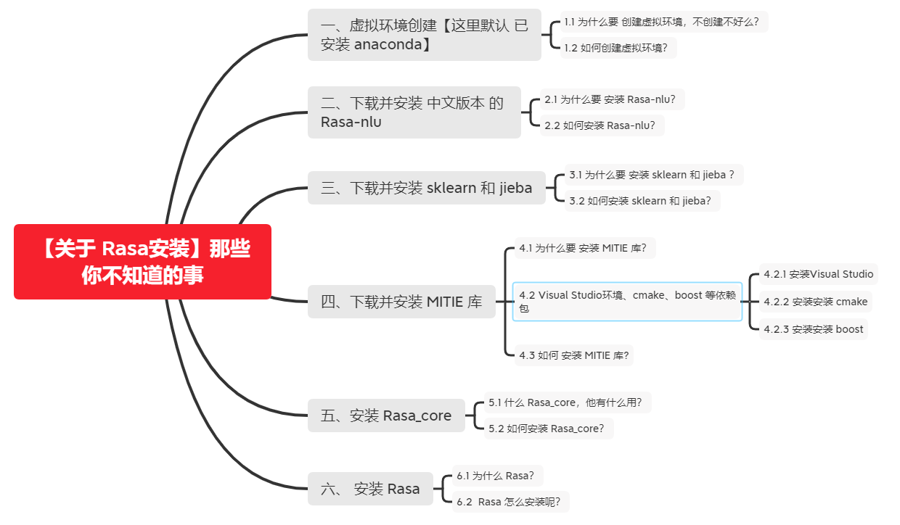

# 【关于 Rasa安装】那些你不知道的事

> 作者：杨夕
> 
> 项目地址：https://github.com/km1994/nlp_paper_study
> 
> 个人介绍：大佬们好，我叫杨夕，该项目主要是本人在研读顶会论文和复现经典论文过程中，所见、所思、所想、所闻，可能存在一些理解错误，希望大佬们多多指正。



## 一、虚拟环境创建【这里默认 已安装 anaconda】

### 1.1 为什么要 创建虚拟环境，不创建不好么？

由于 安装 Rasa 过程中，会安装各种 乱七八糟的 依赖库（eg：tensorflow 2.0，...），导致 安装失败，所以建议 用 conda ，新建 一个 conda 环境，然后在 该环境上面开发。

### 1.2 如何创建虚拟环境？

- 创建环境
```
  $ conda create -n rasa python=3.6
```
- 激活环境
```
  $conda activate rasa
```

## 二、下载并安装 中文版本 的 Rasa-nlu

### 2.1 为什么要 安装 Rasa-nlu？

因为 Rasa-nlu 内置的版本只支持 英文版本，不支持中文版本，所以需要 安装 Rasa_NLU_Chi，使 其支持中文。

### 2.2 如何安装 Rasa-nlu？

1. 下载 Rasa_NLU_Chi 包【如果没梯子，建议 直接下载 zip，节约时间】
   
```s
    $ git clone https://github.com/crownpku/Rasa_NLU_Chi.git
    $ cd rasa_nlu
```

2. 安装 python 必要包

由于 Rasa_NLU_Chi 需要依赖一些包，所以需要提前安装好，避免报错。
```s
    $ pip install -r requirements.txt -i https://pypi.tuna.tsinghua.edu.cn/simple
```

3. 安装  Rasa_NLU_Chi 包

```s
    $ python setup.py install
    >>>
    Welcome to Rasa NLU!
    If any questions please visit documentation page https://nlu.rasa.com
    or join community chat on https://gitter.im/RasaHQ/rasa_nlu
```
> 注：若未出现其他报错信息，而且出现上述信息，则表示安装成功

## 三、下载并安装 sklearn 和 jieba 

### 3.1 为什么要 安装 sklearn 和 jieba ？

- sklearn：因为 Rasa 使用到 sklearn 一些相关 函数，所以需要提前安装，避免后期出错；
- jieba：中文需要利用 jieba 包分词；

### 3.2 如何安装 sklearn 和 jieba？
 
```s
    $ pip install -U scikit-learn sklearn-crfsuite -i https://pypi.tuna.tsinghua.edu.cn/simple
    >>>
    ...
    Installing collected packages: threadpoolctl, tabulate, python-crfsuite, joblib, sklearn-crfsuite, scikit-learn
    Successfully installed joblib-1.0.0 python-crfsuite-0.9.7 scikit-learn-0.24.1 sklearn-crfsuite-0.3.6 tabulate-0.8.7 threadpoolctl-2.1.0

    $ pip install jieba -i https://pypi.tuna.tsinghua.edu.cn/simple
    Looking in indexes: https://pypi.tuna.tsinghua.edu.cn/simple
    Collecting jieba
    Downloading https://pypi.tuna.tsinghua.edu.cn/packages/c6/cb/18eeb235f833b726522d7ebed54f2278ce28ba9438e3135ab0278d9792a2/jieba-0.42.1.tar.gz (19.2 MB)
        |████████████████████████████████| 19.2 MB 504 kB/s
    Building wheels for collected packages: jieba
    Building wheel for jieba (setup.py) ... done
    Created wheel for jieba: filename=jieba-0.42.1-py3-none-any.whl size=19314477 sha256=ecc685a8bf469323e6fbaed0450debd65e934ea11ae791a9b8b9f9247405410a
    Stored in directory: c:\users\86130\appdata\local\pip\cache\wheels\de\9e\4f\5a72ec71510dfe06f9bbc96ad06077629654f87fb05766ab46
    Successfully built jieba
    Installing collected packages: jieba
    Successfully installed jieba-0.42.1
```

> 安装过程中遇到的问题 

- 有些包 可能会下载 错误，若出现下载错误可以尝试手动下载，以 scipy 为例 下载方法如下

1. 复制一下网址到 浏览器下载

```s
    Downloading https://pypi.tuna.tsinghua.edu.cn/packages/f3/9f/80522344838ae24cac9e945240436269cbb92349f7f1f4c9dfc10cb6bad5/scipy-1.5.4-cp36-cp36m-win_amd64.whl (31.2 MB)
        |█████████████████▌              | 17.1 MB 8.3 kB/s eta 0:28:23ERROR: Exception:
```

2. 通过 浏览器下载得到 scipy-1.5.4-cp36-cp36m-win_amd64.whl，执行以下命令

```s
    pip install scipy-1.5.4-cp36-cp36m-win_amd64.whl
    >>>
    Processing e:\pythonwp\nlp\new\conversation_wp\rasa_study\worryfreegrocerystore\plugin\scipy-1.5.4-cp36-cp36m-win_amd64.whl
    Collecting numpy>=1.14.5
    Using cached numpy-1.19.5-cp36-cp36m-win_amd64.whl (13.2 MB)
    Installing collected packages: numpy, scipy
    Attempting uninstall: numpy
        Found existing installation: numpy 1.14.0
        Uninstalling numpy-1.14.0:
        Successfully uninstalled numpy-1.14.0
    Successfully installed numpy-1.19.5 scipy-1.5.4
```

## 四、下载并安装 MITIE 库 

### 4.1 为什么要 安装 MITIE 库？

因为 MITIE 整合到Rasa而言，它是Rasa的few backend choices之一。它提供few pipeline components，可以同时进行意图分类和NER。两者都使用SVM并使用total_word_feature_extractor.dat来提供单个单词向量。

### 4.2 Visual Studio环境、cmake、boost 等依赖包

#### 4.2.1 安装Visual Studio

做过C#开发的童鞋，肯定很熟悉Visual Studio，即VS。windows 的集成开发环境。安装该环境的同时，它会附带安装很全的windows的类库。后面boost库运行的时候，需要使用其中的类库。

具体安装过程很简单，完全傻瓜式安装即可，下一步下一步搞定。这里提供一个下载地址：

http://download.microsoft.com/download/0/7/5/0755898A-ED1B-4E11-BC04-6B9B7D82B1E4/VS2015_RTM_ULT_CHS.iso

https://visualstudio.microsoft.com/zh-hans/thank-you-downloading-visual-studio/?sku=Community&rel=15#

Microsoft Visual C++ Build Tools 2015：http://go.microsoft.com/fwlink/?LinkId=691126

#### 4.2.2 安装安装 cmake

- 官网下载：https://cmake.org/download/
- cmake 下载：https://github.com/Kitware/CMake/releases/download/v3.19.4/cmake-3.19.4-win64-x64.zip

解压后把bin目录路径，配置到path环境变量中。 例如：D:\develop-environment\cmake-3.12.3-win64-x64\bin 执行文件为：

- 验证是否安装成功
```s
	cmake.exe
    >>>
    Usage

    cmake [options] <path-to-source>
    cmake [options] <path-to-existing-build>
    cmake [options] -S <path-to-source> -B <path-to-build>

    Specify a source directory to (re-)generate a build system for it in the
    current working directory.  Specify an existing build directory to
    re-generate its build system.

    Run 'cmake --help' for more information.

	cmake-gui.ext

	cmcldeps.exe
    >>>
    ninja: FATAL: Couldn't parse arguments.
    usage:
        cmcldeps <language C, CXX or RC>  <source file path>  <output path for *.d file>  <output path for *.obj file>  <prefix of /showIncludes>  <path to cl.exe>  <path to tool (cl or rc)>  <rest of command ...>

	cpack.exe
```

#### 4.2.3 安装安装 boost

- 官网下载：https://www.boost.org/
- boost 下载：https://dl.bintray.com/boostorg/release/1.67.0/source/boost_1_67_0.zip

> 因为官网下载需要翻墙，百度网盘提供一个： https://pan.baidu.com/s/1LOgKv_S-JdvUNZ2UQBNCjA 提取码: eeuw

我本机boost的解压目录为： D:\develop-environment\boost\boost_1_67_0

```s
	$ cd D:\develop-environment\boost\boost_1_67_0\tools\build

	$ bootstrap.bat
    >>>
    Bootstrapping the build engine
    Bootstrapping is done. To build, run:
    .\b2 --prefix=DIR install

	$ .\b2 --prefix=DIR install
    >>>
    ...
    common.copy DIR\share\boost-build\src\build\generators.jam
    D:\program\boost\tools\build\src\build\generators.jam
    已复制         1 个文件。
    common.copy DIR\share\boost-build\src\build\generators.py
    D:\program\boost\tools\build\src\build\generators.py
    已复制         1 个文件。
    common.copy DIR\share\boost-build\src\build\project.jam
    D:\program\boost\tools\build\src\build\project.jam
    已复制         1 个文件。
    common.copy DIR\share\boost-build\src\build\project.py
    D:\program\boost\tools\build\src\build\project.py
    已复制         1 个文件。
    ...updated 435 targets...
```

### 4.3 如何 安装 MITIE 库?

```s
  pip install -U scikit-learn sklearn-crfsuite
  pip install git+https://github.com/mit-nlp/MITIE.git
```
- 下载 中文词向量 total_word_feature_extractor_zh.dat https://mega.nz/#!EWgTHSxR!NbTXDAuVHwwdP2-Ia8qG7No-JUsSbH5mNQSRDsjztSA

> 注：MITIE 库比较大，所以这种 安装方式容易出现问题，所以我用另一种安装方式

```s
  $ git clone https://github.com/mit-nlp/MITIE.git
  $ cd MITIE/
  $ python setup.py install
```

> 安装结果

```s
  Compiling src/text_feature_extraction.cpp
  Compiling ../dlib/dlib/threads/multithreaded_object_extension.cpp
  Compiling ../dlib/dlib/threads/threaded_object_extension.cpp
  Compiling ../dlib/dlib/threads/threads_kernel_1.cpp
  Compiling ../dlib/dlib/threads/threads_kernel_2.cpp
  Compiling ../dlib/dlib/threads/threads_kernel_shared.cpp
  Compiling ../dlib/dlib/threads/thread_pool_extension.cpp
  Compiling ../dlib/dlib/misc_api/misc_api_kernel_1.cpp
  Compiling ../dlib/dlib/misc_api/misc_api_kernel_2.cpp
  Linking libmitie.so
  Making libmitie.a
  Build Complete
  make[1]: Leaving directory `/web/workspace/yangkm/python_wp/nlu/DSWp/MITIE/mitielib'
  running build_py
  creating build
  creating build/lib
  creating build/lib/mitie
  copying mitielib/__init__.py -> build/lib/mitie
  copying mitielib/mitie.py -> build/lib/mitie
  copying mitielib/libmitie.so -> build/lib/mitie
  running install_lib
  copying build/lib/mitie/__init__.py -> /home/amy/.conda/envs/yangkm/lib/python3.6/site-packages/mitie
  copying build/lib/mitie/mitie.py -> /home/amy/.conda/envs/yangkm/lib/python3.6/site-packages/mitie
  copying build/lib/mitie/libmitie.so -> /home/amy/.conda/envs/yangkm/lib/python3.6/site-packages/mitie
  byte-compiling /home/amy/.conda/envs/yangkm/lib/python3.6/site-packages/mitie/__init__.py to __init__.cpython-36.pyc
  byte-compiling /home/amy/.conda/envs/yangkm/lib/python3.6/site-packages/mitie/mitie.py to mitie.cpython-36.pyc
  running install_egg_info
  Writing /home/amy/.conda/envs/yangkm/lib/python3.6/site-packages/mitie-0.7.0-py3.6.egg-info
```
> 注：会存在 一些 warning 警告，对结果 影响不大

## 五、安装 Rasa_core

### 5.1 什么 Rasa_core，他有什么用？

- Rasa Core：是一个对话管理平台，用于举行对话和决定下一步做什么。

### 5.2 如何安装 Rasa_core？

```s
    pip install rasa_core==0.9.0 -i https://pypi.tuna.tsinghua.edu.cn/simple
    >>> 
    ...
    Successfully built ConfigArgParse jsonpickle mattermostwrapper docopt slackclient twilio
    Installing collected packages: MarkupSafe, Jinja2, itsdangerous, click, websocket-client, tzlocal, redis, PyJWT, h5py, flask, docopt, decorator, coloredlogs, twilio, slackclient, scikit-learn, ruamel.yaml, python-telegram-bot, pykwalify, networkx, mattermostwrapper, keras, jsonpickle, graphviz, flask-cors, fbmessenger, fakeredis, ConfigArgParse, colorhash, apscheduler, rasa-core
    Attempting uninstall: coloredlogs
        Found existing installation: coloredlogs 9.0
        Uninstalling coloredlogs-9.0:
        Successfully uninstalled coloredlogs-9.0
    Attempting uninstall: scikit-learn
        Found existing installation: scikit-learn 0.24.1
        Uninstalling scikit-learn-0.24.1:
        Successfully uninstalled scikit-learn-0.24.1
    Successfully installed ConfigArgParse-0.13.0 Jinja2-2.11.2 MarkupSafe-1.1.1 PyJWT-1.7.1 apscheduler-3.7.0 click-7.1.2 coloredlogs-10.0 colorhash-1.0.3 decorator-4.4.2 docopt-0.6.2 fakeredis-0.10.3 fbmessenger-5.6.0 flask-1.1.2 flask-cors-3.0.10 graphviz-0.8.4 h5py-2.10.0 itsdangerous-1.1.0 jsonpickle-0.9.6 keras-2.4.3 mattermostwrapper-2.2 networkx-2.5 pykwalify-1.6.0 python-telegram-bot-10.1.0 rasa-core-0.9.0 redis-2.10.6 ruamel.yaml-0.15.100 scikit-learn-0.19.2 slackclient-1.3.2 twilio-6.51.1 tzlocal-2.1 websocket-client-0.54.0
```
> 注：这里需要避免版本问题，所以指定了版本号

## 六、 安装 Rasa 

### 6.1 为什么 Rasa？

有同学一定会问，我们不是安装了 Rasa-nlu 和 Rasa_core 了，为什么还要安装 Rasa 呢？

- 原因：因为 Rasa-nlu 和 Rasa_core 只是 两个主要模块如下，我们还需要 安装 Rasa 框架，才能确保 Rasa 能够 运行起来。
  - Rasa NLU ：用于理解用户消息，包括意图识别和实体识别，它会把用户的输入转换为结构化的数据。
  - Rasa Core：是一个对话管理平台，用于举行对话和决定下一步做什么。

### 6.2  Rasa 怎么安装呢？

```s
  pip --default-timeout=500 install -U rasa==1.10.12  -i https://pypi.tuna.tsinghua.edu.cn/simple
  pip install --upgrade --ignore-installed tensorflow  -i https://pypi.tuna.tsinghua.edu.cn/simple
  >>>

```

## 参考

1. [在Win10上搭建Rasa_NLU_Chi中文语义识别](https://www.jianshu.com/p/063d7cd598d3)
2. [Rasa开发使用 Rasa_NLU及Rasa_Core模型训练与测试](https://blog.csdn.net/ling620/article/details/99845885)