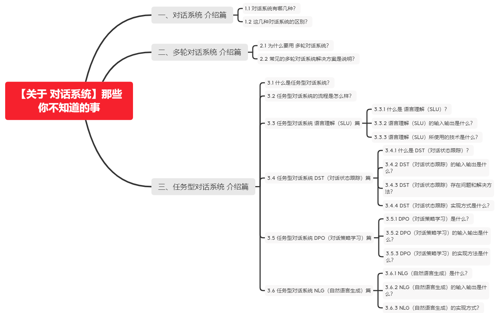
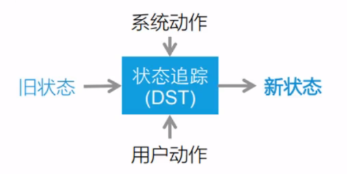
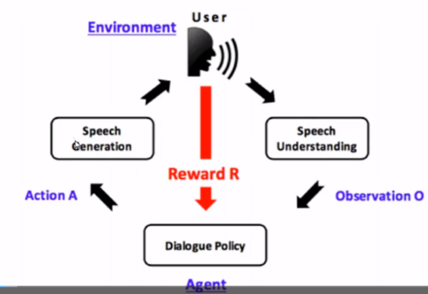

# 【关于 对话系统】那些你不知道的事

> 作者：杨夕
> 
> 项目地址：https://github.com/km1994/nlp_paper_study
> 
> 个人介绍：大佬们好，我叫杨夕，该项目主要是本人在研读顶会论文和复现经典论文过程中，所见、所思、所想、所闻，可能存在一些理解错误，希望大佬们多多指正。

## 一、对话系统 介绍篇

### 1.1 对话系统有哪几种？

- 类别：
  - 任务型对话系统
    - 目标：通过对话系统能够找到用户完成一项特定任务
    - 类别：
      - 基于规则
      - 基于数据
  - 面向开放域的对话系统
    - 支持类型：闲聊
    - 类别：
      - 基于 海量 FAQ 的检索方式
      - 端到端方式
 
### 1.2 这几种对话系统的区别？

- 区别：是否有明确的目标和任务
- 面向开放域的对话系统
  - 特点：有户一般具有不确定的目的性
  - 如何衡量质量：以用户的主观体验为主
- 任务型对话系统
  - 特点：具有目前的目的性
  - 如何衡量质量：以任务的完成情况来衡量对话质量

## 二、多轮对话系统 介绍篇

### 2.1 为什么要用 多轮对话系统？

对于一项特定任务，需要多个不同的必要信息（eg：订餐任务：用户地址，用户电话等），单轮请求无法提供用户满足条件的充足信息。

### 2.2 常见的多轮对话系统解决方案是什么？

- 基于手写规则，状态机state machines
  - 缺陷：硬编码，不灵活，各种 if-else 的集合，一个场景对应一段代码，逻辑会越来越复杂，基本没有扩展性，泛化能力较差；
  - 举例介绍：

- 增强学习， reinforcement learning (RL)
  - 方法：采用增强学习的方法，对机器人的回答结果进行鼓励或惩罚；
  - 问题：需要大量数据和不停的与机器人对话，给予奖励才会变的智能，但是用户的对话是非理想状态不可控的

## 三、任务型对话系统 介绍篇

### 3.1 什么是任务型对话系统？

- 介绍:完成用户所指定的一项特定任务（天气、订餐等）

### 3.2 任务型对话系统的流程是怎么样？

- ASR（语音识别）
  - 介绍：识别用户输入的语音信息，将其转化为文本。
  - 例如：将 "定云海肴中关村店" 语音转化为 文本；
- SLU（语言理解）
  - 介绍：将用户输入的自然语言语句映射为机器可读的结构化语义表述；
    - 结构化语义：
      - 意图识别：
      - 槽值：
  - 例如：对于文本 "定云海肴中关村店"，SLU 会抽取出 如下结构化语义信息：
    - 意图识别：预订
    - 槽位提取：
      - 槽位：（restaurant_name，云海肴）、（subbranch，中关村店）
- DST（对话状态跟踪）
  - 目标：跟踪用户需求并判断当前的对话状态
  - 工作原理：以多轮对话历史、当前用户动作为输入，通过总结和推理理解在上下文环境下用户当前输入自然语言的具体含义
  - 举例：根据 SLU 结果 {意图识别：预订，slot:{（restaurant_name，云海肴）、（subbranch，中关村店）}} 推理出 用户 想 预订（意图识别） 云海肴（restaurant_name）中关村店（subbranch）的餐位，更新 当前对话的意图和槽位信息；
- DPO（对话策略学习）
  - 工作原理：根据当前的对话状态，对话策略决定下一步执行什么系统动作
  - 举例：根据 DST 的结果，判断用户的意图，已经完成该意图工作需要的槽位信息 request（phone，name）
- NLG（自然语言生成）
  - 工作原理：负责将对话策略模块选择的系统动作转化到自然语言，最终反馈给用户
  - 举例：根据 DPL 的信息，输出对话："麻烦请提供一下手机号和姓名"
- TTS（语音合成）
  - 工作原理：将 NLG 的 文本回复转化为语音信息；
  - 举例：将 文本信息 "麻烦请提供一下手机号和姓名" 转化为 语音信息

### 3.3 任务型对话系统 语言理解（SLU）篇

#### 3.3.1 什么是 语言理解（SLU）？

将用户输入的自然语言映射为机器可读的结构化语义表述，即用户的意图信息和对应的槽位值信息。

#### 3.3.2 语言理解（SLU）的输入输出是什么？

- 输入：用户当前的对话信息 Xn
- 输出：解析 语句Xn 后所得到的用户动作信息 Un (意图，槽位);

#### 3.3.3 语言理解（SLU）所使用的技术是什么？

- 意图识别->意图信息
  - 介绍：将用户输入的自然语言会谈划分为不同用户意图；
  - 举例：
    - query: 定云海肴中关村店
    - 意图 ： 预订
- 命名实体识别->槽位信息
  - 介绍：意图所带的参数，一个意图可以携带若干个相应槽位
  - 举例：
    - query: 定云海肴中关村店
    - 槽位：（restaurant_name，云海肴）、（subbranch，中关村店）
  - 目标：在已知特定领域或意图的语义框架下，从输入语句中抽取处该语义框架中余弦定义好的语义槽的值

### 3.4 任务型对话系统 DST（对话状态跟踪）篇

#### 3.4.1 什么是 DST（对话状态跟踪）？

根据旧状态、最新的系统动作和用户动作，更新对话状态，以获得新的对话状态。

#### 3.4.2 DST（对话状态跟踪）的输入输出是什么？

- 输入：以旧状态、最新的系统动作和当前用户动作 （意图识别，槽位值） ；
- 输出：DST 模块判定得到的当前对话状态

#### 3.4.3 DST（对话状态跟踪）存在问题和解决方法？

- 存在问题：由于 语音识别不准确 或 自然语言 本身存在 歧义问题，导致 NLU 的识别结果 往往 和真实结果间存在误差，所以 NLU 的 输出 是带概率的，及每一种可能的结果由一个相应的置信程度；
- DST 在判断当前对话存在两种选择：
  - 第一种选择所对应的处理方法：1-Best
    - 介绍：DSt 判断当前对话状态时只考虑置信程度最高的情况，维护对话状态的表示时，只需要等同于槽位数量的空间；
  - 第二种选择所对应的处理方法：N-Best
    - 介绍：DST 判断当前对话时会综合考虑所有槽位的置信程度，每一个槽位的N-best 结构都要考虑和维护，且最终还需要维护一个槽位组合在一起的整体置信程度，作为最终的对话状态判断依据；

#### 3.4.4 DST（对话状态跟踪）实现方式是什么？

- 基于CRF的系列跟踪模型
- 基于 RNN 或 LSTM 的序列跟踪模型

### 3.5 任务型对话系统 DPO（对话策略学习）篇

#### 3.5.1 DPO（对话策略学习）是什么？

根据当前的对话状态，对话策略决定下一步执行什么系统动作

#### 3.5.2 DPO（对话策略学习）的输入输出是什么？

- 输入：DST 模块输出的当前对话状态；
- 输出：通过预设的对话策略，选择系统动作作为输出；

#### 3.5.3 DPO（对话策略学习）的实现方法是什么？

- 实现方式：增强学习，针对 DST 模块输出的当前对话状态 ，作为序列决策过程进行优化；

### 3.6 任务型对话系统 NLG（自然语言生成）篇

#### 3.6.1 NLG（自然语言生成）是什么？

- 工作原理：负责将对话策略模块选择的系统动作转化到自然语言，最终反馈给用户

#### 3.6.2 NLG（自然语言生成）的输入输出是什么？

- 输入：DPO 模块输出的当前系统动作；
- 输出：系统对用户输入 Xn 的回复；

#### 3.6.3 NLG（自然语言生成）的实现方式？

- 基于模板：麻烦请提供一下{phone}和{name}
- 基于语法规则
- 生成式模型方法

