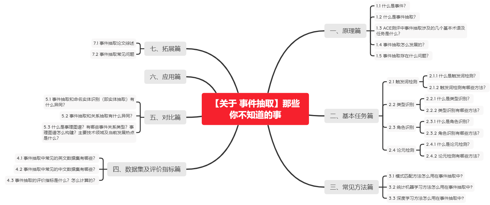

# 【关于 事件抽取】那些你不知道的事

> 作者：芙蕖



## 一、原理篇

### 1.1 什么是事件？

事件在不同领域中有着不同的含义， 对于事件目前还没有统一的定义。在 IE ( Information Extraction) 中， 事件是指在某个特定的时间片段和地域范围内发生的， 由一个或多个角色参与， 由一个或多个动作组成的一件事情， 一般是句子级的。在 TDT ( Topic Detection Tracking) 中， 事件是指关于某一主题的一组相关描述， 这个主题可以是由分类或聚类形成的。

### 1.2 什么是事件抽取？

事件抽取技术是从非结构化的信息中抽取出用户感兴趣的事件， 并以结构化的形式呈现给用户。

1、Closed-domain

事件抽取使用预定义的事件模式从文本中发现和提取所需的特定类型的事件。事件模式包含多个事件类型及其相应的事件结构。D.Ahn首先提出将ACE事件抽取任务分成四个子任务:触发词检测、事件/触发词类型识别、事件论元检测和参数角色识别。我们使用ACE术语来介绍如下事件结构:
- 「事件提及」：描述事件的短语或句子，包括触发词和几个参数。
- 「事件触发词」：最清楚地表达事件发生的主要词，一般指动词或名词。
- 「事件论元」：一个实体，时间表达式，作为参与者的值和在事件中具有特定角色的属性。
- 「论元角色」：论元与它所参与的事件之间的关系


2、Open domain

在没有预定义的事件模式的情况下，开放域事件抽取的目的是从文本中检测事件，在大多数情况下，还可以通过提取的事件关键词聚类相似的事件。事件关键词指的是那些主要描述事件的词/短语，有时关键词还进一步分为触发器和参数。
- 「故事分割」：从新闻中检测故事的边界。
- 「第一个故事检测」：检测新闻流中讨论新话题的故事。
- 「话题检测」：根据讨论的主题将故事分组。
- 「话题追踪」：检测讨论先前已知话题的故事。
- 「故事链检测」：决定两个故事是否讨论同一个主题。

前两个任务主要关注事件检测;其余三个任务用于事件集群。虽然这五项任务之间的关系很明显，但每一项任务都需要一个不同的评价过程，并鼓励采用不同的方法来解决特定问题。

事件抽取涉及自然语言处理、机器学习、模式匹配等多个学科，对于相关学科理论的完善和发展起到积极的推进作用。同时，在情报研究工作中事件抽取技术能帮助情报人员从海量信息中快速提取相关事件， 提高了情报研究工作的时效性， 并为开展定量情报分析提供技术支撑。事件抽取在情报研究领域具有广阔的应用前景。

### 1.3 ACE测评中事件抽取涉及的几个基本术语及任务是什么？

1、实体(Entity)。属于某个语义类别的对象或对象集合。其中包括:人(PER)、地理政治区域名( GPE)、组织机构（ORG)、地名(LOC)、武器(WEA)、建筑设施(FAC)和交通工具( VEH)。

2、事件触发词(Event Trigger)。表示事件发生的核心词,多为动词或名词。

3、事件论元(Event Argument)。事件的参与者,主要由实体、值、时间组成。值是一种非实体的事件参与者,例如工作岗位( Job-Title)。和实体一样,ACE05也标记出了句子中出现的值和时间。下文中,即将实体、值、时间统称为实体。

4、论元角色(Argument Role)。事件论元在事件中充当的角色。共有35类角色,例如,攻击者( Attacker)、受害者( Victim)等。

其中，我常用的ACE 2005定义了8种事件类型和33种子类型。其中,大多数事件抽取均采用33种事件类型。事件识别是基于词的34类( 33类事件类型+None)多元分类任务,角色分类是基于词对的36类(35类角色类型+None)多元分类任务。这里,参考文献


### 1.4 事件抽取怎么发展的？

从事件抽取的发展历史来看,事件抽取的研究几乎与信息抽取的研究同时开始 。 20世纪七、八十年代 ,耶鲁大学就针对新闻报道如地震 、工人罢工等领域或场景 ,开展有关故事理解的研究, 并根据故事脚本理论建立信息抽取系统,就是针对事件抽取的研究 ,开创了事件抽取研究的先河 。但是真正推进事件抽取研究进一步发展的动力主要是相关的评测会议的推动。

消息理解会议(MessageUnderstandingConference, MUC)对事件抽取这一研究方向的确立和发展起到了巨大的推动作用。 MUC定义的抽取任务的各种规范以及确立的评价体系已经成为事件抽取研究事实上的标准,同时也为事件抽取技术的研究奠定了坚实的基础。 MUC是由美国国防高级研究计划委员会(Defense Advanced Research Projects Agency, DARPA)资助 ,从 1987年开始到 1998年 , 会议共举行了 7届 ,具体的历次会议信息如表 1所示 。当前， 由 MUC 定义的概念、模型和技术规范对整个信息抽取领域起着主导作用， 其主要的评测项目是从新闻报道中提取特定的信息， 填入某种数据库中， 事件抽取 ( Scenario Template， ST) 始终是这一会议的评测项目之一。MUC 会议的很多研究都是探索性的， 对信息抽取领域起到了巨大的推动作用， 并为事件抽取的研究打下了坚实的基础。每一届 MUC 都针对一个特定领域和场景，并且提供预先定义好的模板 ( Template) 进行填充， 填充之后的模板形成了对文本核心事件的整体描述。


在强烈的应用需求下 ,来自美国国家标准技术研究所 (NIST)组织的 ACE评测会议应运而生, 这项评测真正推动了事件抽取研究的发展 。从 1999年开始酝酿, 2000年正式开始启动 。研究的主要内容是自动抽取新闻语料中出现的实体 、关系 、事件等内容, 即对新闻语料中实体 、关系、事件的识别与描述。

与 MUC相比, ACE评测不针对某个具体的领域或场景, 采用基于漏报 (标准答案中有而系统输出中没有)和误报 (标准答案中没有而系统输出中有 )为基础的一套评价体系 , 还对系统跨文档处理 (CrossDocumentProcessing)能力进行评测。这一新的评测会议把事件抽取技术研究引向新的高度 。具体的历次会议信息如表 2所示 。ACE 会议作为 MUC 会议的延伸， 是事件抽取领域最具影响力的评测会议， 该会议从 2000 年到 2007 年共举办了 7 届。目前大多数研究都是围绕 ACE 的评测任务开展，它把事件抽取的研究推向一个新的高度。会议研究的主要内容是自动抽取新闻语料中出现的实体、关系、事件等内容。ACE 定义的事件属于元事件的范畴， 包括事件类别和事件元素的识别。与 MUC 相比， ACE 评测不针对某个具体的领域或场景， 也不提供预先定义好的模板， 而是强调对文本基本意义或基本概念的刻画， 因此所定义的任务显得更为细致和深入。用户指定要检测的事件的类别， 系统给出检测文本中这些事件的出现， 但最后的输出并未形成对核心事件的整体描述， 并且 ACE 同 MUC 一样都是篇章级 ( Document Level) 的事件抽取， 不涉及跨文档抽取。


自 2009年 , ACE成为文本分析会议(TextAnalysisConference, TAC)中的一个任务 。 TAC主要由 3个评测任务组成 ,主要目的是促进自然语言处理技术发展和相关的应用 。

总而言之,从 20世纪七 、八十年代开始,事件抽取一直发展到今天 ,已经走过了几十年的研究历程 ,其所取得的进步与上述评测会议的推动密不可分 ,但从评测会议公布的结果来看, 抽取的精度离实用还相差甚远, 在领域扩展性和移植性方面的表现还不能令人满意, 注定今后事件抽取技术的研究还有很长的路要走。

### 1.5 事件抽取存在什么问题？

1）对实体、关系识别、语法分析等相关技术的底层技术研究不够成熟，导致级联错误。事件抽取是在实体和关系识别的基础上发展起来的。它在某种程度上取决于实体、关系识别和文本预处理的效果，但是这些基础技术仍然不够成熟。并且，目前缺乏对子任务输出结果的评估及矫正技术。

2）事件抽取系统的现场可伸缩性和便携性并不理想。例如，有关中文事件抽取的相关研究主要集中在生物医学、微博、新闻、紧急情况等方面。其他领域和开放领域的研究很少。关于领域和跨语言事件抽取技术的研究很少。 

3）缺乏大规模成熟的语料和标注语料，需要进一步完善。手动标注语料库既费时又费力，而且缺少语料库限制了事件抽取技术研究的发展。因此，大型语料库的自动构建技术方法需要进一步研究。

4）如何设计神经网络模型以实现多任务联合是一大难点。

## 二、基本任务篇

### 2.1 触发词检测

#### 2.1.1 什么是触发词检测？

表示事件发生的核心词，多为动词或名词

#### 2.1.2 触发词检测有哪些方法？

现有的检测事件句的方法主要是基于触发词的方法。Grisman、赵妍妍等都是采用这种方法来发现文本中的事件句。在这类方法中,将每个词作为一个实例来训练并判断是否为触发词的机器学习模型,但引入了大量的反例,导致正反例严重不平衡。为了解决了上述问题,哈尔滨工业大学的谭红叶提出了一种基于局部特征选择和正负特征相结合的事件检测与分类方法,取得了不错的识别效果。厦门大学的许红磊等人也提出了一种新的事件类别自动识别算法,很好地克服了传统基于触发词方法所带来的正反例失衡和数据稀疏问题。

### 2.2 类型识别

#### 2.2.1 什么是类型识别？

ACE2005 定义了8种事件类型和33种子类型。其中，大多数事件抽取均采用33 种事件类型。事件识别是基于词的34 类(33类事件类型+None) 多元分类任务，角色分类是基于词对的36 类(35类角色类型+None) 多元分类任务。

事件类别识别是指从文本中检测出事件句,并依据一定的特征判断其所归属的类别。不难看出,事件类别识别是典型的分类问题,其重点在于事件句的检测和事件句的分类。

#### 2.2.2 类型识别有哪些方法？

在已有的研究中 ,事件句分类主要采用最大熵模型 (MaximumEntropyModel, MEM)和支持向量机(SupportVectorMachine, SVM)。赵妍妍和许红磊等人分别使用上述两种分类器基于二元分类策略实现了候选事件句的类别识别,但二元分类的最大缺陷就是无法处理一个事件句属于多个事件类别的情况 ,多元分类应该是更合理的选择 。事件句分类的难点主要是如何选择合适的描述事件句的特征提高分类精度 。赵妍妍等人选取词法 、上下文和词典信息等语言学特征对候选事件进行描述 ,在 ACE2005中文语料上取得F-值为 61.2%的效果 。 付剑锋等人在此基础上引入依存分析发掘触发词与其它词之间的句法关系 ,并以此为特征在 SVM分类器上对事件句进行分类 F-值提高到 69.3%

可见,事件类别的识别率还有很大的提升空间,选择更加合适的分类器以及事件特征进一步提高识别效果仍有待于下一步研究与探讨。

### 2.3 角色识别

#### 2.3.1 什么是角色识别？

事件角色识别是事件抽取中又一核心任务 。该任务主要从众多命名实体(Entity)、时间表达式 (Time Expression)和属性值 (Value)中识别出真正的事件元素 ,并给予其准确的角色标注。事件句中通常包含大量的 Entity、TimeExpression和 Value等事件信息, 要想从中筛选出真正的事件元素, 首先要把所有信息识别并标注出来,而这也正是 MUC会议的主要研究内容 。在事件元素识别中 ,假定在文本预处理阶段已完成事件信息的识别与标注 。

事件的参与者，主要由实体、值、时间组成。值是一种非实体的事件参与者，例如工作岗位。

#### 2.3.2 角色识别有哪些方法？

事件角色识别与语义角色标注 (SemanticRoleLabeling, SRL)任务有一定的相似性。所谓语义角色标注是根据一个句子中的动词(谓词)与相关的各类短语等句子成分之间的语义关系而赋予这些句子成分的语义角色信息 ,如施事、受事 、工具或附加语等。于江德等探索了基于条件随机场 (Conditional Random Fields, CRFs)的方法对任职事件和会见事件的事件元素进行角色标注 ,取得了不错标注效果,也从侧面揭示了事件元素与语义角色之间存在着一定的对应关系 。吴刚等利用这种对应关系实现了事件角色的识别,然而该方法依赖的底层模块较多,如 :分词、句法分析、SRL等 ,如果底层处理模块不够成熟, 将会导致级联错误过多 ,影响事件元素识别效果 。赵妍妍等是将事件元素识别看作分类问题 ,使用最大熵模型 ,选取词法、类别、上下文和句法结构等 4类特征多角度地描述候选元素 ,采用二元分类和多元分类两种策略实现了事件元素的自动识别 。

### 2.4 论元检测

#### 2.4.1 什么是论元检测？

事件论元在事件中充当的角色。共有35类角色，例如，攻击者 、受害者等。

#### 2.4.2 论元检测有哪些方法？

## 三、常见方法篇

### 3.1 模式匹配方法怎么用在事件抽取中?

早期的事件抽取方法主要是基于规则的方法，后来发展成为基于模式匹配的方法。这些方法本质上是相同的，也就是说，它们需要构建规则或模式。基于模式匹配的事件抽取方法是指将要抽取的事件语句与相应的模式进行匹配的方法，其基本原理如图2所示。


基于模式匹配事件抽取主要分为有监督的模式匹配方法和弱监督的模式匹配方法两大类。

有监督的模式匹配方法依赖于人工标注语料进行事件模式学习。Ellen等1993年通过建立触发词词典和13种事件匹配模式进行事件识别与抽取，事件匹配模式主要利用事件元素初始描述和事件元素上下文语义的进行构建，并开发了AutoSlog模式匹配事件抽取系统，在MUC语料上取得优异的性能。Kim等1995年引入WordNet语义词典，利用语义框架和短语结构进行事件抽取，并开发了PALKA模式匹配事件抽取系统。

弱监督的模式匹配方法只需对语料进行预分类或制定种子模式的少量人工标注工作,然后自动进行事件模式学习。Ellen等1995年在AutoSlog基础上开发出AutoSlog-ST系统，不需要对语料中的所有事件元素进行标注,只需标注事件类型,然后利用预分类语料自动学习事件模式。姜吉发2005年提出一种领域通用事件模式匹配方法IEPAM，将事件抽取模式分为语义模式、触发模式、抽取模式，在MUC-7语料的飞行事故事件抽取中获得优异结果。

北京科技大学的Meiying Jia用模式匹配法研究军事演习信息的抽取。它在抽取的不同阶段使用分层自动分类方法、基于子模式的引导方法和基于语料库的标注。其模式匹配方法侧重于模式获取和匹配算法，如图3所示。


以上研究表明，模式匹配方法的核心是事件抽取模式的构建。Jifa Jiang研究了模式的自动获取，并提出了一种基于领域无关的概念知识库的事件抽取模型学习方法。只要定义了IE任务，他构建的系统就可以从原始语料库自动学习IE模式，而无需提供子模式和语料库的预处理，从而大大提高了效率。另一名学者Ming Luo基于有限状态机构建了层次化的词汇语义规则模型，用于自动抽取各种财务事件信息，具有较高的准确性。Liao et al.在构造事件抽取模式时使用谓词论元模式，并通过相似性扩展原始模式。

基于模式匹配的方法较好地应用于特定领域，但该方法的可移植性和灵活性较差。当它是跨域的时，它需要重建模型。模式匹配事件抽取方法在领域事件抽取任务中性能优异,但模板的制作需要耗费大量人力和时间，且模板局限于领域背景，很难在通用领域事件抽取任务中应用。使用机器学习和其他方法可以加快模式的获取，但是会带来不同模式之间的冲突。


### 3.2 统计机器学习方法怎么用在事件抽取中?

通过机器学习抽取事件本质上是将事件抽取视为分类问题。主要任务是选择合适的特征并构造合适的分类器。与模式匹配方法相比，机器学习方法可应用于不同领域，具有较高的可移植性和灵活性，并已被广泛使用。

分类器通常是基于统计模型构建的。事件抽取中的主要统计模型主要包括最大熵模型、隐马尔可夫模型、条件随机场模型和支持向量机模型。

例如，2002年，Chieu et al.在事件元素的识别中首次应用最大熵模型，并抽取了演讲公告和人员管理事件。另一位学者H. Llorens在语义角色注释中引入了条件随机字段模型（CRF），并将其应用于TimeML事件抽取中，以提高系统的性能。国内Jiangde Yu et al.提出了中文文本，基于隐马尔可夫模型（HMM）的事件抽取方法。当抽取每种类型的事件元素时，此方法将构造一个独立的隐马尔可夫模型。

为了提高事件抽取的效果，有时会结合使用多种机器学习算法。 2006年，David Ahn集成了MegaM和Timbl机器学习方法来识别事件类别和事件元素。事件类型识别存在向后依赖事件元素识别的问题。 2012年，Bolei Hu et al.解决这个问题很好。他们将事件抽取视为序列标注，并构建了改进的条件随机域联合标注模型。主要思想是在图模型中同时标注事件类型和事件元素。改进的CRF模型如图4所示。


许多机器学习方法都是基于触发词进行事件识别的。基于触发词的方法在训练中引入了大量的负例，导致正例与负例之间失衡。为了解决这个问题，哈尔滨工业大学的Yanyan Zhao通过结合触发词扩展和二进制分类来识别事件类别。另外，Honglei Xu提出了一种基于事件实例的事件类型识别方法。该方法通过使用句子代替词作为识别示例，克服了正负大小写不平衡和数据稀疏的问题。

当前在事件抽取研究中的主导作用是基于机器学习的方法，但是该方法需要大规模的标注训练语料库。如果训练语料不足或类别单一，将严重影响事件的抽取效果，语料库的建设成为一项重要任务。但是，语料库的建设需要大量的人力和时间。为了减轻这个问题，学者们进一步探索了深度学习的方法。 


### 3.3 深度学习方法怎么用在事件抽取中?

深度学习是机器学习研究领域中的一个新方向。与浅层神经网络相比，深层神经网络（DNN）具有更好的特征学习能力，其抽象数学的无监督逐层预训练。可以更有效地表征原始数据基本特征的特征。Yajun Zhang et al.建立了基于深度学习的事件识别模型，并利用BP神经网络对事件进行识别，通过深度信念网络抽取词的深度语义信息。同时，文献还提出了一种混合式监督深度信念网络，将监督和非监督学习方法相结合，可以提高识别效果，控制训练时间。

传统的基于特征的事件抽取方法需要大量的特征设计工作，并且需要复杂的自然语言处理工具，这会消耗大量的人力和时间，并且会产生数据稀疏的问题。在这方面，Kai Wang提出了一种基于递归神经网络（RNN）的事件抽取方法，该方法可以自动学习句子中的特征，而无需进行大量的人工特征设计工作，并克服了复杂的特征工程。

递归神经网络（RNN）广泛用于自然语言处理领域。它主要用于解决序列问题，对事件抽取有很好的效果。这是因为递归神经网络模型的结构由三层组成，即输入层x、隐藏层h和输出层y，其中隐藏层h表示递归神经的内部状态网络，如图5所示。


在时间t，隐藏层的输入h（t）由当前时间的输入x（t）和上一次隐藏层的输出h（t-1）组成，而h（t-1 ）包含前一瞬间的输入信息和上一隐藏层中的信息。这样，通过添加前一时刻输入的隐藏层，添加了序列的历史信息，从而可以利用距离更长的信息。

另外，为避免复杂的特征工程，相关学者构建了联合学习的神经网络模型，并提出了基于联合模型的神经网络事件抽取方法。例如，Nguyen et al.提出了一种基于RNN模型的联合学习，用于事件类型识别和事件元素识别。北京邮电大学的Zhengkuan Zhang 设计了一种新的事件抽取框架，结合了window-winding卷积神经网络和递归神经网络，形成了一种连通学习方法，可以同时抽取事件触发词和事件元素，不仅避免了复杂的特征工程，而且还解决了错误传播的问题。

深度学习方法克服了浅层机器学习的局限性，可以学习更多抽象的数学特征，并使数据具有更好的特征表达，从而实现文本事件的有效抽取。与浅层机器学习相比，深度学习框架可以有效地指数捕获数据特征，已应用于事件抽取领域。

## 四、数据集及评价指标篇

### 4.1 事件抽取中常见的英文数据集有哪些？

- ACE2005 English Corpus

ACE 2005多语种训练语料库包含了用于2005年自动内容抽取(ACE)技术评价的完整的英语、阿拉伯语和汉语训练数据集。语料库由语言数据联盟(LDC)为实体、关系和事件注释的各种类型的数据组成，该联盟得到了ACE计划的支持和LDC的额外帮助。下载地址为：https://catalog.ldc.upenn.edu/LDC2006T06

- Rich ERE

Rich ERE扩展了实体、关系和事件本体，并扩展了什么是taggable的概念。Rich ERE还引入了事件跳跃的概念，以解决普遍存在的事件共引用的挑战，特别是关于在文档内和文档之间的事件提及和事件参数粒度变化，从而为创建(分层的或嵌套的)跨文档的事件表示铺平了道路。下载地址为：https://www.aclweb.org/old_anthology/W/W15/W15-0812.pdf

- TAC 2015

TAC KBP事件跟踪的目标是提取关于事件的信息，以便这些信息适合作为知识库的输入。轨迹包括用于检测和链接事件的事件块任务，以及用于提取属于同一事件的事件参数和链接参数的事件参数(EA)任务。2015年TAC KBP赛事轨迹分为5个子任务。下载地址为：https://tac.nist.gov//2015/KBP/Event/index.html

- KBP 2017

TAC知识库填充(KBP)的目标是开发和评估从非结构化文本中填充知识库的技术。KBP包括为KBP开发特定组件和功能的组件跟踪，以及称为“冷启动”的端到端KB构建任务，该任务通过在技术成熟时集成选定的组件从头开始构建KB。与在冷启动KB任务中执行的功能相比，组件跟踪中所需的功能可以“更多”，也可以“更少”。组件轨道比冷启动“更多”，因为每个轨道可能探索未立即集成到冷启动任务中的试点任务; 他们是“少”,将组件集成到一个KB需要额外协调与和解各个组件之间的不匹配,这样KB符合知识库模式(例如,知识库不能断言一个实体是一个事件的“地方”如果它还断言,实体是一个“人”)。 下载地址为：https://tac.nist.gov/2017/KBP/

- Twitter datasets【CrisisLexT26 datasets】

CrisisLexT26来自26次危机的推文，贴有丰富的信息，信息类型和来源，2014年11月

此集合包括在2012年和2013年的26次大型危机事件中收集的推文，每个危机中大约有1,000条推文被标记为信息性（即“信息性”或“非信息性”），信息类型和来源。

- Genia Event Extraction dataset\Genia dataset

GENIA语料库是为GENIA项目编写并标注的最初的生物医学文献集合。这个语料库是为了发展和评估分子生物学信息检索及文本挖掘系统而创建的。

这个语料库包含1999条Medline的摘要，这些摘要是由PubMed按照human、blood cells以及transcription factors三个医学主题词（medical subject heading terms ）为搜索条件搜索到的。这个语料库已经被按照不同级别的语言信息、语义信息进行标注。

包含36种实体种类（医学数据集）, 我们把所有的DNA子类别都合并为DNA种类。同样的设置也适用于RNA、蛋白质、细胞系和细胞类类别。最终只保留5种类别。
最初始的GENIA语料库标注类别以及对应的资料如下：
    •	Part-of-Speech annotation
    •	Constituency (phrase structure) syntactic annotation
    •	Term annotation
    •	Event annotation
    •	Relation annotation
    •	Coreference annotation
    •	词性标注
    •	句法标注
    •	术语标注
    •	事件标注
    •	关系表述
    •	共指标注


其他的还有，Spainish ERE Corpus, Wikipedia article, BioNLP Cancer Genetics (CG) Shared Task 2013 等等


### 4.2 事件抽取中常见的中文数据集有哪些？

- ACE2005 Chinese Corpus

ACE 2005多语种训练语料库包含了用于2005年自动内容抽取(ACE)技术评价的完整的英语、阿拉伯语和汉语训练数据集。语料库由语言数据联盟(LDC)为实体、关系和事件注释的各种类型的数据组成，该联盟得到了ACE计划的支持和LDC的额外帮助。下载地址为：https://catalog.ldc.upenn.edu/LDC2006T06

- CEC 中文突发事件语料库

事件本体是以“事件”为认知单元，研究事件的组成以及事件之间的关系，并对事件进行归纳和概括，形成事件类，进而构建事件本体模型。研究本体，必然要先构建语料库，所以在互联网上选取了突发事件语料来进行语料的事件标注，突发事件的分类体系，包括三个层次：一级4个大类（自然灾害类N、事故灾难类A、公共卫生事件P、社会安全事件S），二级33个子类，三级94个小类。我们标注的语料库称为CEC（Chinese Emergency Corpus），主要包括五类：地震、火灾、交通事故、恐怖袭击、食物中毒。合计332篇，下载地址为：https://github.com/shijiebei2009/CEC-Corpus

中文突发事件语料库是由上海大学（语义智能实验室）所构建。根据国务院颁布的《国家突发公共事件总体应急预案》的分类体系，从互联网上收集了5类（地震、火灾、交通事故、恐怖袭击和食物中毒）突发事件的新闻报道作为生语料，然后再对生语料进行文本预处理、文本分析、事件标注以及一致性检查等处理，最后将标注结果保存到语料库中，CEC合计332篇。

- CEEC 中文环境突发事件语料库

中文环境突发事件语料库是由上海大学（语义智能实验室）所构建。根据国务院颁布的《国家突发公共事件总体应急预案》的分类体系，从互联网上收集了6类环境污染类突发事件的新闻报道作为生语料，然后再对生语料进行文本预处理、文本分析、事件标注以及一致性检查等处理，最后将标注结果保存到语料库中，CEEC合计100篇。下载地址为：https://github.com/shijiebei2009/CEEC-Corpus

CEEC 采用了 XML 语言作为标注格式，其中包含了六个最重要的数据结构（标记）：Event、Denoter、Time、Location、Participant 和 Object。Event用于描述事件；Denoter、Time、Location、Participant 和Object用于描述事件的指示词和要素。此外，我们还为每一个标记定义了与之相关的属性。与ACE和TimeBank语料库相比，CEEC语料库的规模虽然偏小，但是对事件和事件要素的标注却最为全面。


### 4.3 事件抽取的评价指标是什么？怎么计算的？

事件抽取主要采用准确率（Precision，P）、 召回率（Recall,R） 和 F1 值（F1-Measure,F1） 3 项作为基本评价指标。其中，准确率是指系统中抽取出的正确个数占抽取出总数的比例，用来衡量抽取准确程度；召回率是指系统中正确抽取的个数占所有正确总数的比例，用来衡量抽取全面程度；F1 值是准确率和召回率的加权平均值，作为系统性能的总体评价。事件抽取所采用的这三个评价指标的具体公式如下:


其中，TP (True Positive）是正确抽取的预测为正例的数目，FP (False Positive）是被错误抽取的预测为正例的数目，FN (False Negative)则是被错误抽取的预测为负例的数目。事件抽取模型的性能通常通过 F1 值来综合判断， F1 值越大，模型性能越好。

远程监督兴起后，模型所需要处理的数据规模量级增加，在考察系统性能时，也将运行时间和内存占用作为评价指标的一部分进行考量。

F1平均值法一般多用于单一事件抽取任务中，如: 突发事件、门户网站、金融资讯的事件抽取。对于话题追踪任务而言，相对于正确率，人们对系统作出的错误判断往往更为敏感，这些错误包括：本应为是的判断为否 (丢失) ，本应为否的判断为是 (误报) ，因此常采用错误识别代价作为效果评价方法。另外，事件抽取的各种算法在实际应用中，除考虑其识别结果的正确率外，还应该考虑算法的复杂程度及其可实现性。一些抽取效果好的算法往往是以牺牲时间为代价的。一些算法可能由于硬件要求太高，或训练时间太长而不具备可行性。

## 五、对比篇

### 5.1 事件抽取和命名实体识别（即实体抽取）有什么异同？

**命名实体识别**

实体抽取：也就是命名实体识别，包括实体的检测（find）和分类（classify）

1)主要任务：

要识别出文本中出现的专有名称和有意义的数量短语并加以归类。

2)主要研究内容：

就整个的命名实体识别的研究结果而言，时间表达式和数字表达式的识别相对简单，其规则的设计、数据的统计训练等也比较容易。而对于实体中的组织名、人名、地名，因为其具有开放性和发展性的特点，而且构成规律有很大的随意性，所以其识别就可能会有较多的错选或漏选。现在大多数的命名实体识别的研究都集中于对这三种实体的识别技术的研究。

3)发展历程：

基于规则的方法->基于统计的方法->混合方法

4)汉语命名实体识别中的特殊难点：

- 分词：边界模糊不仅存在于非实体词之间，也出现于实体词和非实体词之间。

- 汉语命名实体的生成规律以及结构更加复杂，尤其是缩略语的表示形式具有多样性，很难提取构成规则，因此不可能用一种识别模型应用于所有的命名实体。

- 与西方语言比较，汉语缺少在命名实体识别中起重要作用的词形变换特征。

- 汉语中除比较特殊的字词外，命名实体也可包含普通字词。

- 能用于汉语命名实体识别的开放型语料还很少，因此一方面需要开发大型命名实体标注语料库，另一方面研究不依赖大型命名实体标注文本库的算法也具有重要意义。

5)命名实体识别的结果：

- 正确（correct） ：系统识别结果和标准结果相同。

- 丢失（missing）：系统未识别而标准结果中有。

- 虚假（spurious）：系统识别但标准结果中没有。

6)主要的两个评价指标：

查全率：正确/（正确+丢失）

查准率：正确/（正确+虚假）

有时为了综合评价系统的性能，通常还计算查全率和查准率的加权几何平均值即F指数。

7)方法：

- 基于规则：

- 如：NTU系统、FACILE系统、OKI系统。

- 缺点：缺乏鲁棒性和可移植性，对于每个新领域的文本都需要更新规则来保持最优性能，而这需要大量的专门知识和人力，代价往往非常大。

- 基于统计：

- 如：n元模型、隐马尔科夫模型（HMM）、最大熵模型（ME）、决策树、基于转换的学习方法、推进方法、表决感知器方法、条件马尔科夫模型等。评价性能最好的是HMM。而ME因其自身的特点仍是当前主要的研究方向。

- 缺点：性能较基于规则的方法而言偏低，因为基于统计的方法获取的概率知识总赶不上人类专家的专业知识的可靠性，而且有些知识获取必需专家的经验。

- 混合方法：

借助规则知识及早剪枝，再用统计模型是比较好的方法。

### 5.2 事件抽取和关系抽取有什么异同？

**关系抽取**

定义：自动识别实体之间具有的某种语义关系。根据参与实体的多少可以分为二元关系抽取（两个实体）和多元关系抽取（三个及以上实体）。

通过关注两个实体间的语义关系，可以得到（arg1, relation, arg2）三元组，其中arg1和arg2表示两个实体，relation表示实体间的语义关系。（比如通过Hanlp分析工具可以得到句子中各词之间的语义关系）

1）抽取数据源分类：

面向结构化文本的关系抽取：包括表格文档、XML文档、数据库数据等

面向非结构化文本的关系抽取：纯文本

面向半结构化文本的关系抽取：介于结构化和非结构化之间

2）抽取范围分类：

句子级关系抽取：从一个句子中判别两个实体间是何种语义关系
语料（篇章）级关系抽取：不限定两个目标实体所出现的上下文

3）抽取领域分类：

限定域关系抽取：在一个或者多个限定的领域内对实体间的语义关系进行抽取，限定关系的类别，可看成是一个文本分类任务
开放域关系抽取：不限定关系的类别

事件抽取：相当于一种多元关系的抽取

4）限定域关系抽取方法：

基于模板的关系抽取方法：通过人工编辑或者学习得到的模板对文本中的实体关系进行抽取和判别，受限于模板的质量和覆盖度，可扩张性不强。（自己做的法院文书属于基于模板的抽取）

基于机器学习的关系抽取方法：将关系抽取看成是一个分类问题

其中，基于机器学习的关系抽取方法又可分为 有监督 和 弱监督。

5）有监督的关系抽取方法：

基于特征工程的方法：需要显示地将关系实例转换成分类器可以接受的特征向量

基于核函数的方法：直接以结构树为处理对象，在计算关系之间距离的时候不再使用特征向量的内积而是用核函数

基于神经网络的方法：直接从输入的文本中自动学习有效的特征表示，端到端

6）弱监督的关系抽取方法：不需要人工标注大量数据。

距离监督：用开放知识图谱自动标注训练样本，不需要人工逐一标注，属弱监督关系抽取的一种。

7）开放域关系抽取方法：

不需要预先定义关系类别，使用实体对上下文中的一些词语来描述实体之间的关系。

**事件抽取**


定义：从描述事件信息的文本中抽取出用户感兴趣的事件并以结构化的形式呈现出来。

步骤：首先识别出事件及其类型，其次要识别出事件所涉及的元素（一般是实体），最后需要确定每个元素在事件中所扮演的角色。

1）事件抽取相关概念：

事件指称：对一个客观发生的具体事件进行的自然语言形式的描述，通常是一个句子或句群
事件触发词：指一个事件指称中最能代表事件发生的词，是决定事件类别的重要特征，一般是动词或名词
事件元素：事件中的参与者，主要由实体、时间和属性值组成
元素角色：事件元素在相应的事件中扮演什么角色
事件类别：事件元素和触发词决定了事件的类别（类别又定义了若干子类别）

2）限定域事件抽取：在进行抽取之前，预先定义好目标事件的类型及每种类型的具体结构（包含哪些具体的事件元素），通常会给出一定数量的标注数据。

限定域事件抽取方法：

- 基于模式匹配的方法：对某种类型事件的识别和抽取是在一些模式的指导下进行的（步骤：模式获取、模式匹配）

    - 有监督的事件模式匹配：模式的获取完全基于人工标注的语料
    
    - 弱监督的事件模式匹配：不需要对语料进行完全标注，只需要人工对语料进行一定的预分类或者制定少量种子模式
    
- 基于机器学习的方法

    - 有监督事件抽取方法：将事件抽取建模成一个多分类问题
    
        - 基于特征工程的方法：需要显示地将事件实例转换成分类器可以接受的特征向量，研究重点在于怎样提取具有区分性的特征
        
        - 基于神经网络的方法：自动从文本中获取特征进而完成事件抽取，避免使用传统自然语言处理工具带来的误差累积问题
        
    - 弱监督事件抽取方法：不需要人工大量标注样本，但需要给出具有规范语义标签（事件类别、角色名称等）的标注训练数据
    
        - 基于Bootstrapping的事件抽取：利用少部分人工标注的数据自动生成大规模标注数据（高置信度抽取结果会作为训练样本，然后再训练，不断迭代）
        - 基于Distant Supervison的事件抽取：完全自动生成事件标注样本，利用结构化的事件知识库直接在非结构化文本中回标训练样本

3）开放域事件抽取：在进行事件识别之前，可能的事件类型以及事件的结构都是未知的，因此该任务通常没有标注数据，主要基于无监督的方法和分布假设理论。

分布假设理论：如果候选事件触发词或者候选事件元素具有相似的语境，那么这些候选事件触发词倾向于触发相同类型的事件，相应的候选事件元素倾向于扮演相同的事件元素。

开放域事件抽取方法：

- 基于内容特征的事件抽取方法
- 基于异常检测的事件抽取方法

事件关系抽取，以事件为基本语义单元，实现事件逻辑关系的深层检测和抽取，包括：

- 事件共指关系抽取
- 事件因果关系抽取
- 子事件关系抽取
- 事件时序关系抽取


### 5.3 什么是事理图谱？有哪些事件关系类型？事理图谱怎么构建？主要技术领域及当前发展热点是什么？

事理图谱（Event Logic Graph，缩写ELG）是一个事理逻辑知识库，描述了事件之间的演化规律和模式。结构上，事理图谱是一个有向有环图，其中节点代表事件，有向边代表事件之间的顺承、因果、条件和上下位等事理逻辑关系。

理论上，事理图谱中的事件是具有一定抽象程度的泛化事件。表示为抽象、语义完备的谓词短语或句子，也可以表示为可变长度的、结构化的(主体、事件词、客体)多元组，其中必然包含一个事件词，标志事件的发生，例如：“跑步”，而事件的主体和客体都可以在不同的应用场景下被省略，例如：“（元首，出访）”可以省略事件的客体，“（购买，机票）”可以省略事件的主体。一般情况下，事件以及事件的抽象程度与该事件发生的场景紧密关联在一起，脱离了具体的场景，一个单独的事件可能变得过度抽象而难以理解。

例如，虽然脱离了具体的场景，但“吃火锅”, “看电影”, “去机场”,“地震” 仍是合理的事件表达；但“做事情”,“吃”等事件由于过度抽象，属于不合理或不完整的事件表达。事件词可以是动词或名词，但是绝大多数事件都是动词触发的。其中，按动词的内容意义进行划分，可将事件分为动作类事件、状态类事件、关系类事件与能愿类事件四个大类。

1）事理图谱中的事件关系类型

我们认为，现实世界中有四种事理逻辑关系特别重要，也是我们提出的事理图谱中主要关注的事理逻辑关系，包括事件之间的顺承关系、因果关系、条件关系和上下位关系。

- 顺承关系是指两个事件在时间上相继发生的偏序关系。我们借鉴TimeML时序关系类别中的before和after偏序关系，在事理图谱中的顺承关系包括两种情况：一种情况是顺承的前序事件a结束后，后序事件b紧接着发生；另一种情况是前序事件a结束后，隔一段时间后序事件b才会发生，具体如图1所示。两个前后顺承的事件之间存在一个介于0到1之间的转移概率，表示从一个事件按时序顺承关系演化到下一事件的置信度。


图1 两种顺承关系示例

- 因果关系是指两个事件之间，前一事件（原因）的发生导致后一事件（结果）的发生。在事理图谱中，因果关系满足原因事件在前，结果事件在后的时间上的偏序关系，因此在一定意义上，可以认为因果关系是顺承关系的子集。因果事件对之间存在一个介于0到1之间的因果强度值，表示该因果关系成立的置信度。

- 条件关系是指前一个事件是后一个事件发生的条件。条件关系属于思想中命题的某种逻辑关系，因果关系属于对客观事实的某种认识，我们认为“原因≠理由”，“原因”指的是事件之间的因果关系，是关于事实的，“理由”是前提与结论或论据与论点的内在联系，是关于逻辑的。举例来说，“如果买票的人多，那么电影好看”这一条件是成立的，而“因为买票的人多，所以电影好看”这一因果是不成立的。

- 上下位关系：事件之间的上下位关系有两种：名词性上下位关系和动词性上下位关系。例如，事件“食品价格上涨”与“蔬菜价格上涨”构成名词性上下位关系；事件“杀害”与“刺杀”互为动词性上下位关系。需要注意的是，上下位关系一般是没有疑义的确定知识，因此可认为该类关系的置信度为常数1或0，即表示该知识是正确的或者是错误的。

2）事理图谱中的事件属性

事理图谱除了关注事件之间的事理逻辑关系外，还关注事件自身的属性。事件属性用来描述事件发生的程度、持续时间等。在进行推理时，事件属性会起到非常重要的作用，例如，从金融文本中可以抽取到“货币超发”会导致“汇率贬值”，“汇率贬值”又会导致“货币紧缩”，而实际上“货币持续超发”才会导致“汇率贬值”，而“汇率大幅贬值”才会导致“货币紧缩”，这里面“持续”和“大幅”作为事件的属性，可以影响到事件未来的走势情况。此外，“股票下跌/上涨”的百分比也是事件重要的属性，股票上涨0.1%和上涨10%对未来事件的影响是有非常明显的区别的。

3）事理图谱与知识图谱的关系

“知识图谱”这一术语有两层含义。如果认为“知识图谱”表示广义上的知识库，是一种用以存储知识的本体的话，那么“事理图谱”可以认为是一种存储事理逻辑关系的“知识图谱”；如果认为“知识图谱”特指狭义上现阶段谷歌、百度所构建的以实体为中心、用于提升用户搜索体验的知识库，以及Freebase、 YAGO、 DBpedia、ConceptNet和微软的Concept Graph等产品的话，那么“事理图谱”便是与“知识图谱”相并列的一种新型常识知识库。


事理图谱与传统知识图谱有本质上的不同。如表1所示，事理图谱以事件为核心研究对象，有向边表示事理逻辑关系，即顺承、因果、条件和上下位；边上标注有概率信息说明事理图谱是一种事件间相继发生可能性的刻画，不是确定性关系。而知识图谱以实体为核心研究对象，实体属性以及实体间关系种类往往成千上万。知识图谱以客观真实性为目标，某一条属性或关系要么成立，要么不成立。

4）事理图谱的构建

- 基本技术原理

事理图谱课题主要研究从大规模无结构化（或者结构化、半结构化）文本数据中自动获取事理逻辑知识，并将这些知识组织成有向有环图结构，用以描述事件之间的演化规律和模式。这样的知识库我们称之为“事理图谱”。

事理图谱项目包含“构建”、“推理”和“应用”三个关键技术点：

(1) 事理图谱的构建

事理图谱的构建主要用到以下具体的自然语言处理技术：事件定义、开放域或限定域事件抽取，事理关系抽取（包含事件顺承、因果、上下位关系抽取等），事理关系置信强度计算，事件相似度计算，事件抽象与泛化等。

(2) 事理图谱的推理

事理图谱的推理可以用于事件及关系的补全，主要涉及到的技术有：结构化事件表示学习，短语级、句子级事件表示学习，事理图谱图结构上的图神经网络技术等。

(3) 事理图谱的应用

事理图谱的应用是指将构建好的事理图谱用于下游任务，例如消费意图识别和商品推荐、对话系统回复生成、股市涨跌预测、未来事件预测等，帮助提升具体任务的效果。此阶段用到的技术主要有：事理图谱的存储与查询（事件的搜索与匹配），事件表示学习，事理图谱表示学习等。

5）主要技术领域及当前发展热点

与事理图谱项目密切相关的技术领域主要包含以下几个方面：

- 常识知识库资源构建

传统的常识知识库资源构建主要围绕实体及其关系展开。2012年谷歌成功将大规模知识图谱商业化，显著改善了搜索结果的呈现方式，并提升了搜索引擎的用户体验。之后以实体为中心的知识图谱获得了长足的发展以及广泛的应用。时至今日，知识图谱仍然是学术界的一个发展热点。知识图谱上的知识表示学习、实体链接、实体消歧、知识图谱补全等等研究方向仍然是当下研究的热点问题。

然而，已有研究者注意到事件常识的重要性，部分最新的研究工作开始研究以事件为中心的常识知识库构建。

- 统计脚本学习

给出多个事件组成的上文，统计脚本学习研究下一个可能发生的事件是什么，可以认为是建模事件预测的能力。

传统方法多在无监督抽取的结构化事件链条上进行模型的搭建，这条技术路线仍然在发展当中，不断有新的模型涌现；最近，学者们提出故事结尾预测的评估方式，是对传统评估方法的进一步完善。

- 事件顺承关系抽取

由于语料标注的限制，事件时序关系抽取研究进展相当缓慢。虽然曾经连续举办多个技术评测，推动了该技术的发展，但是进步仍然十分有限。最近，时序关系抽取重新引起了学者的研究兴趣，有许多相关研究发表。从预料的构建，识别方法的改进等多个方面继续推动该研究走向使用阶段。目前，已有开放域的时序关系抽取系统发布。

- 事件因果关系抽取

文本中的因果关系抽取一直是一个难点。虽然学者们提出了许多方法，但是仍以因果模板匹配的方法抽取精确度最好。模板匹配的缺点在于召回率难以保证，许多有价值的因果关系无法召回。目前，高效准确的因果关系抽取方法仍然是一个难点及研究热点。

- 知识表示学习与网络表示学习

知识表示学习是指将知识图谱中的实体及关系映射到低维稠密向量，进而可以更加方便地用于后续任务当中。网络表示学习的研究对象不仅仅包含知识图谱这种网络，而是更广义上的网络。这两个研究方向都是当下研究的热点问题，属于事理图谱应用阶段的实用技术。

## 六、应用篇

事件抽取在网络舆情监控、突发事件告警﹑情报收集领域有着重要应用。网络舆情变化通常是由某些热点社会事件引发的,事件抽取技术可以在第一时间发现这些热点事件,从而为预测网络舆情变化提供帮助。互联网传播消息的速度很快,如果能够及时地从互联网中挖掘突发事件,将为政府部门做好应对赢得时间。在情报收集领域,事件抽取技术可以帮助情报分析人员从大量的低价值情报数据中自动获取事件信息,大大减小情报人员的工作量,在数据量急剧膨胀的今天，自动化的事件抽取技术显得尤为重要。

新闻推荐:根据用户感兴趣的话题推送相关事件的周边报道可以提高个性化新闻系统的表现

医疗:从语料库中提取类似蛋白质分子行为的生物学事件

金融:实时监测突发经济新闻，如公司的兼并和收购、股票交易、分红等，帮助决策者迅速应对市场变化


- 关于短句子事件短语抽取的论文：


- 用 event embedding 做股票预测：


- 爬虫：该爬虫爬取了 36 kr（科技资讯网站） 的新闻快讯，以 json 的格式储存，适合用来做信息提取的测试样本或自动摘要的语料。

相关地址：https://github.com/HughWen/wen_spiders

- 中文 NER 识别：作者希望大家可以贡献自己的力量一起维护一个开源的中文 NER 项目。

相关地址：https://github.com/zjy-ucas/ChineseNER

## 七、拓展篇

### 7.1 事件抽取论文综述

元事件抽取研究综述, 2019[https://doi.org/10.11896/j.issn.1002-137X.2019.08.002]
事件抽取是信息抽取领域的一个重要研究方向，在情报收集、知识提取、文档摘要、知识问答等领域有着广泛应用。写了一篇对当前事件抽取领域研究得较多的元事件抽取任务的综述。

首先，简要介绍了元事件和元事件抽取的基本概念，以及元事件抽取的主要实现方法。然后，重点阐述了元事件抽取的主要任务，详细介绍了元事件检测过程，并对其他相关任务进行了概述。最后,总结了元事件抽取面临的问题，在此基础上展望了元事件抽取的发展趋势。

An Overview of Event Extraction from Text, 2019[http://ceur-ws.org/Vol-779/derive2011_submission_1.pdf]
文本挖掘的一个常见应用是事件抽取，它包括推导出与事件相关的特定知识，这些知识重新映射到文本中。事件抽取可处理各种类型的文本，如(在线)新闻消息、博客和手稿。本文献回顾了用于各种事件抽取目的的文本挖掘技术。它提供了关于如何根据用户、可用内容和使用场景选择特定事件抽取技术的一般指南。

A Survey of Event Extraction from Text, 2019[https://doi.org/10.1109/ACCESS.2019.2956831]
事件抽取的任务定义、数据源和性能评估，还为其解决方案方法提供了分类。在每个解决方案组中，提供了最具代表性的方法的详细分析，特别是它们的起源、基础、优势和弱点。最后，对未来的研究方向进行了展望。

A Survey of Textual Event Extraction from Social Networks, 2017[http://ceur-ws.org/Vol-1988/LPKM2017_paper_15.pdf]
过去的十年中，在社交网络上挖掘文本内容以抽取相关数据和有用的知识已成为无所不在的任务。文本挖掘的一种常见应用是事件抽取，它被认为是一个复杂的任务，分为不同难度的多个子任务。

在本文中，对现有的主要文本挖掘技术进行了概述，这些技术可用于许多不同的事件抽取目标。首先，介绍基于统计模型将数据转换为知识的主要数据驱动方法。其次，介绍了基于专家知识的知识驱动方法，通常通过基于模式的方法来抽取知识。然后，介绍结合了数据驱动和知识驱动方法的主要现有混合方法。最后，比较社交网络事件抽取研究，概括了每种提出的方法的主要特征。

A Survey of event extraction methods from text for decision support systems, 2016[https://doi.org/10.1016/j.dss.2016.02.006]
事件抽取是一种可以追溯到20世纪80年代的专门的信息抽取流程，由于大数据的出现以及文本挖掘和自然语言处理等相关领域的发展，事件抽取技术得到了极大的普及。然而，到目前为止，对这一特殊领域的概述仍然是难以捉摸的。

因此，总结了文本数据的事件抽取技术，划分成数据驱动、知识驱动和混合方法三类，并对这些方法进行了定性评价。此外，还讨论了从文本语料库中抽取事件的常见决策支持应用。最后，对事件抽取系统的评价进行了阐述，并指出了当前的研究问题。

### 7.2 事件抽取常见问题

① **事件抽取的定义/概念是什么？哪些比赛/会议给出了定义？**

A: 时间，地点，人物，故事情节。
A: ACE 05 中对事件进行了明确的定义。
A: 属性信息（Attribute），包括：类型（Type）、子类（Subtype）、模态（Modality）、倾向性（Polairty）、普遍性（Genericity）和时态（Tense）。

Q:**不同任务对事件的定义不同吧，能具体解释下这些字段吗？**

A: 属性是实体、数值和时间的集合。
A: 我认为关系抽取一般来说是针对两个实体的，而事件抽取的话，不同事件类型会对应不同的元素元素（事件要素）。
A: 一般来说是的，需要提前定义好事件的类型以及每种类型包含的属性。
A: ACE05 中给出了类似的 schema，此处给出 ace05 对事件抽取的定义：


Q:**能简单介绍一些事件抽取的应用背景吗？**

A: 比如一个事件里的被杀人数就是个数值，我记得最开始是用于反恐情报收集的。
A: 之前看过有人写事件是一种特殊的关系，不知道是否正确。
A: 新闻撰写机器人，比如百度知识图谱团队研发的写稿机器人，基于事件图谱自动生成一些大事件文章。

Q:**事件是要分类型的吧？**

A: 看描述好像也有实体那种感觉。
A: 事件类型要先定义出来。
A: 有些研究是针对微博，将事件分为 4 元组：命名实体， 事件短句，日期，事件类型。
A: 觉得定义事件跟抽取语义是一样的，此处放上一张分类ace05事件抽取分类图：


Q:**事件抽取针对的是一段话还是一篇文章呢？**

A: 针对一句话是 sentence-level 的，还有 document-level，cross-sentence level，cross-document level 的等等。

② **有哪些常用的评测数据集和评测标准？**

A: ACE2005

③ **国内外有哪些研究团队和学者，它们主要研究的目标是什么？**

A: 国内好像苏州大学周国栋团队，哈工大刘挺，秦兵团队。
A: 国外有韩家炜，继桓团队。
A: 国内企业有百度知识图谱团队。
A: 国内外相关研究团队发表的论文：


④ **事件抽取有哪些应用场景和实际的产品？**

A: 股票，金融，QA，新闻趋势跟踪，舆情，事件型投资，并购。
A: 反恐，反诈骗，政策性投资。
A: 生物医学有类似药物不良反应的事件抽取。
A: 通过对新闻热点事件的抽取，也许可以用来预测 IT 基础设施的故障，这个案例 NTT 做过，通过大量新闻事件的分析抽取预测了大规模网络故障。

Q: **为什么通过新闻可以预测网络故障呢？**

A: 如果突然有个突发事件，网络上也许会引发大规模的群体关注，相关网络的服务器也许突然大规模负载上升。
A: 百度的知识图谱团队在事件图谱这块开展了不少前沿性的工作，并已经落地在了一些产品上；他们的目标是打造一个覆盖面最全时效性最快分析最全面精准的中文事件图谱。目前的产品形态比如事件脉络，明星事件追踪，明星历史热点等产品。

⑤ **事件抽取的一般过程，有标注数据开展研究，如何扩展，没有数据怎么做？**

A: 种子迭代，规则，模板。机器学习也可以用，比如论元的检测，就是构建一些特征，然后分类。
A: 这个还是要做垂直领域，从规则和模板开始。
A: 一些门户网站倒是可以通过访问量（检测波峰）的方法来看是不是发生了事件。

Q: **事件抽取一般有什么方法呢？**

A: 带监督的深度卷积网络肯定是一个。
A: CNN 用的比较多。
A: 估计从规则到机器学习都有，看具体的场景和数据。
A: 经典方法就是：规则+模板，前沿方法：强化+模版（深度卷积）。
A: 基于模板的抽取方法、半监督学习的模板抽取方法、经典机器学习方法、latent model 等等。

⑥ **深度学习在事件抽取上有哪些应用，与传统方法比有什么优势/劣势？**

A: 性能好，不用人工构造特征。
A: 触发词的识别和分类，CNN 模型要好。

⑦ **事件抽取与其他信息抽取任务（关系抽取、NER 等）有什么联系，难点在哪？**

A: 得先 NER。
A: 时间是不是直接抽取就好了，其它属性该怎么办呢？
A: 配模板的嘛，时间也是模板的一部分。

Q: **触发词一般是预定义好的，还是需要做检测任务？**

A: 一般是定义好的，也有检测触发词的任务。

⑧ **事件之间的关系如何表示，如何做事件之间的关系抽取，目前有哪些研究？** 

A: 我个人看法：事件也许应该是在时间轴上，有明确开始和结束的一段实体与实体产生关系的“运动”。
A: 外国一般都是只做二元关系或者时序上的关系。
A: 研究“事件”必须给他来个操作性定义。
A: Semeval 2015 task4 是有定义的，但是产出产出太少。

⑨ **有哪些值得阅读的论文？有哪些开源了代码的工作？**


A: 基于符号特征的方法：


A: 基于表示学习的方法：


⑩ **最新的前沿进展有哪些？**

A: 我觉得事件之间的关系或网络会是将来的热点。
A: 事件抽取必然会和监控视频结合。
A: 和关系抽取在一起应用。检测事件的关系，舆情监测。其实对话系统也能用。
A: 适合社交媒体，通过分析过往当事人发布的微信及 Facebook，可以做性格分析工作介绍、相亲配对。
A: 延伸过去也可以做推荐系统，顾客销售行为预测。

## 参考资料

1.秦彦霞, 张民, 郑德权. 神经网络事件抽取技术综述[J]. 智能计算机与应用, 2018, 008(003):1-5,10.

2.许旭阳,韩永峰,宋文政.事件抽取技术的回顾与展望[J].信息工程大学学报,2011,12(01):113-118.

3.https://github.com/xiaoqian19940510/Event-Extraction

4.https://blog.csdn.net/weixin_42691585/article/details/106025951

5.项威, 王邦. 中文事件抽取研究综述[J]. 计算机技术与发展, 2020, 030(002):1-6.

6.https://www.sohu.com/a/156430929_500659

7.https://www.cnblogs.com/cyandn/p/10915394.html

8.https://blog.csdn.net/feng_zhiyu/article/details/80246690

9.https://baijiahao.baidu.com/s?id=1639726139800018430&wfr=spider&for=pc


```python

```
