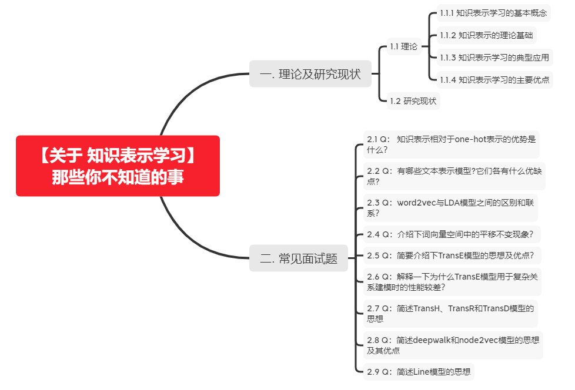

# 【关于 知识表示学习】那些你不知道的事

> 作者：JimmyDU

## 一. 理论及研究现状

### 1.1 理论

#### 1.1.1 知识表示学习的基本概念

**知识表示学习**的目标是**通过机器学习将研究对象的语义信息表示为稠密低维实值向量**。以知识库中的实体$e$和关系$r$为例，我们将学校得到的模型表示为%l_e%和l_r。在该向量空间中，我们可以通过欧氏距离或余弦距离等方式，计算任意两个对象之间的语义相似度。像我们常说的词向量就属于知识表示学习。

#### 1.1.2 知识表示的理论基础

知识表示学习得到的低维向量表示是一种**分布式表示（distributed representation）**，之所以这么命名，是因为孤立地看向量中的每一维，都没有明确对应的含义；而综合各维形成一个向量，则能够表示对象的语义信息。这种表示方案并非凭空而来，而是受到人脑的工作机制启发而来（具体详见参考文献【1】）。

#### 1.1.3 知识表示学习的典型应用

知识表示学习是面向知识库中实体和关系的表示学习，通过将实体或关系投影到低维向量空间，我们能够实现对实体和关系的语义信息的表示，可以高效地计算实体、关系及其之间的复杂语义关联。这对知识库的构建、推理和应用均有重要意义。

知识表示学习得到的分布式表示有以下典型应用：

1. **语义相似度计算**：利用实体的分布式表示，我们可以快速计算实体间的语义相似度，这对于自然语言和信息检索的很多任务具有重要意义。
2. **知识图谱补全**：构建大规模知识图谱，需要不断补充实体间的关系。利用知识表示学习模型，可以预测2个实体的关系，这一般称为知识库的链接预测（link prediction），又称为知识图谱补全（knowledge graph completion）。
3. 其他应用，知识表示学习已被广泛应用于关系抽取、自动问答、实体链指等任务，展现出巨大的应用潜力。随着深度学习在自然语言处理各项任务中得到广泛应用，这将为知识表示学习带来更广阔的应用空间。 

#### 1.1.4 知识表示学习的主要优点

知识表示学习实现了对实体和关系的分布式表示，它具有以下主要优点：

1. **显著提升计算效率**：知识库的三元组表示实际就是基于独热表示（one-hot representation）的，独热表示的问题在于，需要设计专门的图算法计算实体键的语义和推理关系，计算复杂度高、可扩展性差。而表示学习得到的分布式表示，则能够**高效地实现语义相似度计算**等操作，显著提升计算效率。
2. **有效缓解数据稀疏**：由于**表示学习将对象投影到统一的低维空间**中，使每个对象均对应一个稠密向量，从而有效缓解数据稀疏问题，这主要体现在2个方面。一方面，每个对象的向量均为稠密有值的，因此可以度量任意对象之间的语义相似程度。**而基于独热表示的图算法，由于受到大规模知识图谱稀疏特性的影响，往往无法有效计算很多对象之间的语义相似度。**另一方面，将大量对象投影到统一空间的过程，也能够将高频对象的语义信息用于帮助低频对象的语义表示，提高低频对象的语义表示准确性。
3. **实现异质信息融合**：不同来源的异质信息需要融合为整体，才能够得到有效应用。大量实体和关系在不同知识库中的名称不同，如何实现多知识库的有机融合，对知识库应用具有重要意义。如果基于独热表示和网络表示，该任务只能通过设计合理的表示学习模型，将不同来源的对象投影到同一个语义空间中，就能够建立统一的表示空间，实现多知识库的信息融合。此外，当我们在信息检索或自然语言处理中应用知识库时，往往需要计算查询词、句子、文档和知识库实体之间的复杂语义关联。由于这些对象的异质性，计算它们的语义关联往往是棘手问题。而表示学习亦能为异质对象提供统一表示空间，轻而易举实现异质 对象之间的语义关联计算。

### 1.2 研究现状

知识表示学习的代表模型：

1. 距离模型
2. 单层神经网络模型
3. 能量模型
4. 双线性模型
5. 张量神经网络模型
6. 矩阵分解模型
7. 翻译模型
8. 图表示学习模型

以上【1-7】模型的具体说明，可以去看参考文献【1】，图表示学习模型请阅读文献【2】【3】。

## 二. 常见面试题

### 2.1 Q： 知识表示相对于one-hot表示的优势是什么？

A：**独热表示**的问题在于，需要设计专门的图算法计算实体键的语义和推理关系，**计算复杂度高、可扩展性差，**同时在大规模语料的建模中，会出现**数据稀疏**的问题。而知识表示学习实现了对实体和关系的分布式表示，它具有以下主要优点：

1. **显著提升计算效率**：知识表示学习得到的分布式表示，则**能够高效地实现语义相似度计算等操作**，显著提升计算效率。
2. **有效缓解数据稀疏**：由于**表示学习将对象投影到统一的低维空间**中，使每个对象均对应一个稠密向量，从而有效缓解数据稀疏问题，这主要体现在2个方面。一方面，每个对象的向量均为稠密有值的，因此可以度量任意对象之间的语义相似程度。**而基于独热表示的图算法，由于受到大规模知识图谱稀疏特性的影响，往往无法有效计算很多对象之间的语义相似度。**另一方面，将大量对象投影到统一空间的过程，也能够将高频对象的语义信息用于帮助低频对象的语义表示，提高低频对象的语义表示准确性。
3. **实现异质信息融合**：不同来源的异质信息需要融合为整体，才能够得到有效应用。大量实体和关系在不同知识库中的名称不同，如何实现多知识库的有机融合，对知识库应用具有重要意义。如果基于独热表示和网络表示，该任务只能通过设计合理的表示学习模型，将不同来源的对象投影到同一个语义空间中，就能够建立统一的表示空间，实现多知识库的信息融合。此外，当我们在信息检索或自然语言处理中应用知识库时，往往需要计算查询词、句子、文档和知识库实体之间的复杂语义关联。由于这些对象的异质性，计算它们的语义关联往往是棘手问题。而表示学习亦能为异质对象提供统一表示空间，轻而易举实现异质 对象之间的语义关联计算。

### 2.2 Q：有哪些文本表示模型?它们各有什么优缺点?

A：

（1）词袋模型和**N-gram**模型

最基础的文本表示模型是词袋模型。顾名思义，就是将每篇文章看成一袋子词，并忽略每个词出现的顺序。具体地说，就是将整段文本以词为单位切分开， 然后每篇文章可以表示成一个长向量，向量中的每一维代表一个单词，而该维对应的权重则反映了这个词在原文章中的重要程度。常用TF-IDF来计算权重，公式为
$$
TF-IDF(t, d) = TF(t, d) \times IDF(t)
$$
其中TF(*t*,*d*)为单词*t*在文档*d*中出现的频率，IDF(*t*)是逆文档频率，用来衡量单词*t*对表达语义所起的重要性，表示为
$$
IDF(t) = log(\frac{文章总数}{包含单词t的文章总数+1})
$$
直观的解释是，如果一个单词在非常多的文章里面都出现，那么它可能是一个比较通用的词汇，对于区分某篇文章特殊语义的贡献较小，因此对权重做一定惩罚。

将文章进行单词级别的划分有时候并不是一种好的做法，比如英文中的natural language processing(自然语言处理)一词，如果将natural，language，processing这 3个词拆分开来，所表达的含义与三个词连续出现时大相径庭。通常，可以将连续 出现的*n*个词(*n*≤*N*)组成的词组(N-gram)也作为一个单独的特征放到向量表示 中去，构成N-gram模型。另外，同一个词可能有多种词性变化，却具有相似的含义。在实际应用中，一般会对单词进行词干抽取(Word Stemming)处理，即将不 同词性的单词统一成为同一词干的形式。

（2）主题模型

基于词袋模型或N-gram模型的文本表示模型有一个明显的缺陷，就是无法识 别出两个不同的词或词组具有相同的主题。因此，需要一种技术能够将具有相同 主题的词或词组映射到同一维度上去，于是产生了主题模型。主题模型是一种特 殊的概率图模型。想象一下我们如何判定两个不同的词具有相同的主题呢?这两 个词可能有更高的概率同时出现在同一篇文档中;换句话说，给定某一主题，这 两个词的产生概率都是比较高的，而另一些不太相关的词汇产生的概率则是较低 的。假设有*K*个主题，我们就把任意文章表示成一个*K*维的主题向量，其中向量的 每一维代表一个主题，权重代表这篇文章属于这个特定主题的概率。主题模型所 解决的事情，就是从文本库中发现有代表性的主题(得到每个主题上面词的分 布)，并且计算出每篇文章对应着哪些主题。常见的主题模型有：pLSA(Probabilistic Latent Semantic Analysis)，LDA(Latent Dirichlet Allocation)。

（3）词嵌入与深度学习模型

词嵌入是一类将词向量化的模型的统称，核心思想是将每个词都映射成低维 空间(通常*K*=50~300维)上的一个稠密向量(Dense Vector)。*K*维空间的每一维也可以看作一个隐含的主题，只不过不像主题模型中的主题那样直观。

由于词嵌入将每个词映射成一个*K*维的向量，如果一篇文档有*N*个词，就可以用一个*N*×*K*维的矩阵来表示这篇文档，但是这样的表示过于底层。在实际应用中，如果仅仅把这个矩阵作为原文本的表示特征输入到机器学习模型中，通常很 难得到令人满意的结果。因此，还需要在此基础之上加工出更高层的特征。在传统的浅层机器学习模型中，一个好的特征工程往往可以带来算法效果的显著提升。而深度学习模型正好为我们提供了一种自动地进行特征工程的方式，模型中的每个隐层都可以认为对应着不同抽象层次的特征。从这个角度来讲，深度学习模型能够打败浅层模型也就顺理成章了。卷积神经网络和循环神经网络的结构在文本表示中取得了很好的效果，主要是由于它们能够更好地对文本进行建模，抽取出一些高层的语义特征。与全连接的网络结构相比，卷积神经网络和循环神经网络一方面很好地抓住了文本的特性，另一方面又减少了网络中待学习的参数， 提高了训练速度，并且降低了过拟合的风险。

### 2.3 Q：word2vec与LDA模型之间的区别和联系？

A：首先，LDA是利用**文档中单词的共现关系**来对单词按主题聚类，也可以理解为对“文档-单词”矩阵进行分解，得到“文档- 主题”和“主题-单词”两个概率分布。而Word2Vec其实是对“上下文-单词”矩阵进行 学习，其中上下文由周围的几个单词组成，由此得到的词向量表示更多地融入了 上下文共现的特征。也就是说，如果两个单词所对应的Word2Vec向量相似度较高，那么它们很可能经常在同样的上下文中出现。需要说明的是，上述分析的是 LDA与Word2Vec的不同，不应该作为主题模型和词嵌入两类方法的主要差异。主题模型通过一定的结构调整可以基于“上下文-单词”矩阵进行主题推理。同样地，词嵌入方法也可以根据“文档-单词”矩阵学习出词的隐含向量表示。主题模型和词嵌入两类方法最大的不同其实在于模型本身，主题模型是一种基于概率图模型的生成式模型，其似然函数可以写成若干条件概率连乘的形式，其中包括需要推测的隐含变量(即主题)；而词嵌入模型一般表达为神经网络的形式，似然函数定义在网络的输出之上，需要通过学习网络的权重以得到单词的稠密向量表示。

### 2.4 Q：介绍下词向量空间中的平移不变现象？

表示学习在自然语言处理领域受到广泛关注起源于Mikolov等人与2013年提出的word2vec词表示学习模型和工具包，利用该模型，Mikolov等人发现词向量空间中的平移不变现象，例如：
$$
C(KING)-C(QUEEN) \approx C(MAN)-C(WOMAN)
$$
这里的$c(w)$表示利用word2vec学习得到的单词$w$的词向量。也就是说，词向量能够捕捉到单词KING和QUEEN之间、MAN和WOMAN之间的某种相同的隐含语义关系。Mikolov等人通过类比推理实验【4， 5】发现，这种平移不变现象普遍存在于词汇的语义关系和句法关系中。

### 2.5 Q：简要介绍下TransE模型的思想及优点？

A：受到词向量空间平移不变现象的启发，Bordes等人提出了TransE模型【6】，将知识库中的关系看做实体间的某种平移向量。对于每个三元组（h, r, t），TransE模型用关系r的向量$l_r$作为头实体向量$l_h$和尾实体向量$l_t$之间的平移。我们也可以将$l_r$看作从$l_h$到$l_t$的翻译，因此TransE也被称为翻译模型。

对于每个三元组(h, r, t)，TransE希望
$$
l_h +l_r \approx l_t
$$
TransE模型定义了如下损失函数：
$$
f_r(h, t) = |l_h + l_r - l_t|_{L_1/L_2}
$$
即向量$l_h+l_r$和$l_t$的$L_1$或$L_2$距离。

与以往模型相比，TransE模型参数较少，计算复杂度较低，却能直接建立实体和关系之间的复杂语义联系。实验表明，TransE的性能较以往模型有显著提升，特别是在大规模稀疏知识图谱上，TransE的性能尤其惊人。

### 2.6 Q：解释一下为什么TransE模型用于复杂关系建模时的性能较差？

A：主要原因是因为模型过于简单，在对1-N、N-1、N-N等复杂关系进行建模时，我们可以推出以下结论：如果关系r是N-1关系，我们将会得到
$$
l_{h_0} \approx l_{h_1} \approx ... \approx  l_{h_m}
$$
同样的，这样的问题在关系r是N-1关系时也会发生，得到
$$
l_{t_0} \approx l_{t_1} \approx ... \approx  l_{t_m}
$$
具体来说，例如在知识库中有两个三元组，分别是(美国, 总统, 奥巴马)和(美国, 总统, 布什)。这里的关系“总统”是典型的1-N负责关系，如果用TransE模型从这两个三元组学习知识表示，将会使奥巴马和布什的向量变得相同，这显然不符合事实。

### 2.7 Q：简述TransH、TransR和TransD模型的思想

为了解决TransE模型在处理1-N、N-1、N-N等复杂关系时的局限性，TransH模型【8】提出让一个实体在不同的关系下拥有不同的表示。对于关系r，TransH模型同时使用平移向量$l_r$和超平面法向量$w_r$来表示它。对于一个三元组(h, r, t)，TransH首先将头实体向量$l_h$和尾实体向量$l_t$延法线$w_r$投影到关系r对应的超平面上，用$l_{h_r}$ 和 $l_{t_r}$表示如下：
$$
l_{h_r} = l_h - w_r^Tl_hw_r
$$

$$
l_{t_r} = l_t - w_r^Tl_tw_r
$$

因此，TransH定义了如下损失函数：
$$
f_r(h, t) = ||l_{h_r}+l_r-l_{t_r}||_{L_1/L_2}
$$
需要主要的是，由于关系r可能存在无限个超平面，TransH简单地令$l_r$与$w_r$正交来选取一个超平面。

虽然TransH模型使每个实体在不同关系下拥有了不同的表示，但它仍然建设实体和关系处于相同的语义空间中，这在一定程度上限制了TransH的表示能力。TransR模型【9】则认为，一个实体是多种属性的综合体，不同关系关注实体的不同属性，而不同的关系拥有不同的语义空间。TransR模型在两个不同的空间，即**实体空间**和**多个关系空间**(关系特定的实体空间)中建模实体和关系，并在对应的关系空间中进行转换，因此命名为TrandR。

虽然TransR模型交TransE和TransH有了显著的改进，它仍然拥有很多缺点：

（1）在同一个关系r下，头、尾实体共享相同的投影矩阵，然而，一个关系的头、尾实体的类型或属性可能差异巨大。

（2）从实体空间到关系空间的投影是实体和关系之间的交互过程，因此TransR让投影矩阵仅与关系有关是不合理的。

（3）与TransE和TransH相比，TransR由于引入了空间投影，是的TransR模型参数急剧增加，计算复杂度大大提高。

为了解决这些问题，Ji等人提出了TransD模型【10】。TransD模型设置了两个投影矩阵，分别将头实体和尾实体投影到关系空间，显然这两个投影矩阵与关系和实体都有关，这样就解决了上述问题（1）（2）。而且，只利用两个投影向量构建投影矩阵，这也解决了上述问题（3）中的参数过多的现象。

### 2.8 Q：简述deepwalk和node2vec模型的思想及其优点

A：DeepWalk算法【2】借鉴了word2vec算法的思想，word2vec是NLP中一种常用的word embedding方法，word2vec通过语料库中的句子序列来描述词与词的共现关系，进而学习到词语的向量表示。DeepWalk算法与word2vec类似，使用图中节点与节点的共现关系来学习节点的向量表示。在DeepWalk中通过使用随机游走(RandomWalk)的方式在图中进行节点采样来模拟语料库中的预料，进而使用word2vec的方式学习出节点的共现关系。

具体来说，DeepWalk 通过将节点视为单词并生成短随机游走作为句子来弥补网络嵌入和单词嵌入之间的差距。然后，可以将诸如 Skip-gram 之类的神经语言模型应用于这些随机游走以获得网络嵌入。其优点是首先其可以按需生成随机游走。由于 Skip-gram 模型也针对每个样本进行了优化，因此随机游走和 Skip-gram 的组合使 DeepWalk 成为在线算法。其次，DeepWalk 是可扩展的，生成随机游走和优化 Skip-gram 模型的过程都是高效且平凡的并行化。最重要的是，DeepWalk 引入了深度学习图形的范例。

node2vec模型【3】是在DeepWalk的架构上，优化了随机游走的序列抽取策略。node2vec采用有偏随机游走，在广度优先（bfs）和深度优先（dfs）图搜索之间进行权衡，从而产生比DeepWalk更高质量和更多信息量的嵌入。

### 2.9 Q：简述Line模型的思想

A：LINE【7】也是一种基于邻域相似假设的方法，只不过与DeepWalk使用DFS构造邻域不同的是，LINE可以看作是一种使用BFS构造邻域的算法。此外，LINE还可以应用在带权图中(DeepWalk仅能用于无权图)。

LINE适用于任意类型的信息网络：无向、有向和无权、有权。该方法优化了精心设计的目标函数，能够保留局部和全局网络结构。此外，LINE中还提出了边缘采样算法，解决了经典随机梯度下降的局限性，提高了算法的有效性和效率。具体来说，LINE明确定义了两个函数，分别用于一阶和二阶近似，并最小化了这两个函数的组合。一阶邻近函数与图分解（GF）相似，都是为了保持嵌入的邻接矩阵和点积接近。区别在于GF通过直接最小化两者的差异来实现这一点。相反，LINE为每对顶点定义了两个联合概率分布，一个使用邻接矩阵，另一个使用嵌入。然后，LINE最小化了这两个分布的Kullback–Leibler（KL）散度。

## 参考文献

- 【1】刘知远, 孙茂松, 林衍凯, 等. 知识表示学习研究进展[J]. 计算机研究与发展, 2016, 53(2): 247.
- 【2】Perozzi B, Al-Rfou R, Skiena S. Deepwalk: Online learning of social representations[C]//Proceedings of the 20th ACM SIGKDD international conference on Knowledge discovery and data mining. 2014: 701-710.
- 【3】Grover A, Leskovec J. node2vec: Scalable feature learning for networks[C]//Proceedings of the 22nd ACM SIGKDD international conference on Knowledge discovery and data mining. 2016: 855-864
- 【4】Mikolov T, Sutskever I, Chen K, et al. Distributed representations of words and phrases and their compositionality[J]. arXiv preprint arXiv:1310.4546, 2013.
- 【5】Mikolov T, Chen K, Corrado G, et al. Efficient estimation of word representations in vector space[J]. arXiv preprint arXiv:1301.3781, 2013.
- 【6】Bordes A, Usunier N, Garcia-Duran A, et al. Translating embeddings for modeling multi-relational data[C]//Neural Information Processing Systems (NIPS). 2013: 1-9.
- 【7】Tang J, Qu M, Wang M, et al. Line: Large-scale information network embedding[C]//Proceedings of the 24th international conference on world wide web. 2015: 1067-1077
- 【8】Wang Z, Zhang J, Feng J, et al. Knowledge graph embedding by translating on hyperplanes[C]//Proceedings of the AAAI Conference on Artificial Intelligence. 2014, 28(1).
- 【9】Lin Y, Liu Z, Sun M, et al. Learning entity and relation embeddings for knowledge graph completion[C]//Proceedings of the AAAI Conference on Artificial Intelligence. 2015, 29(1).
- 【10】Ji G, He S, Xu L, et al. Knowledge graph embedding via dynamic mapping matrix[C]//Proceedings of the 53rd annual meeting of the association for computational linguistics and the 7th international joint conference on natural language processing (volume 1: Long papers). 2015: 687-696.
- 【11】《百面机器学习》