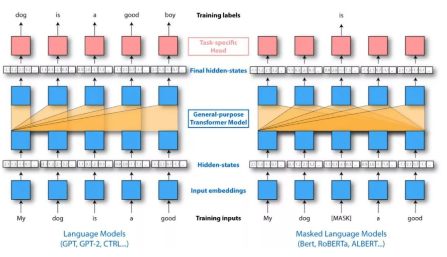
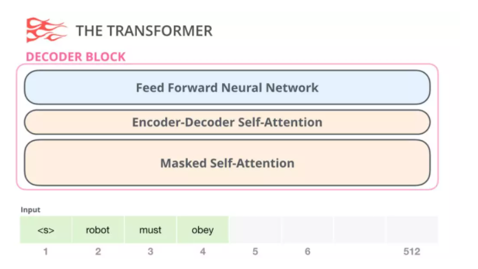
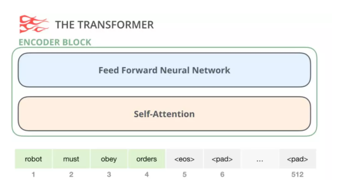
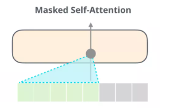
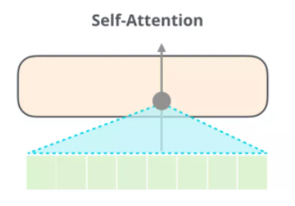
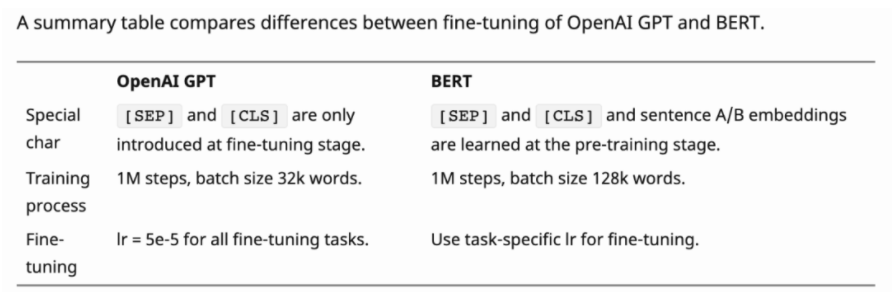

# 【关于Bert】 那些的你不知道的事

> 作者：杨夕
> 
> NLP 论文读书笔记：https://github.com/km1994/nlp_paper_study
> 
> 面经：https://github.com/km1994/NLP-Interview-Notes/blob/main/NLPinterview/PreTraining/bert/readme.md
> 
> 论文链接：https://arxiv.org/pdf/1810.04805.pdf
> 
> 代码链接：https://github.com/google-research/bert
> 
> 【注：手机阅读可能图片打不开！！！】

## 一、动机篇

### 1.1 【演变史】one-hot 存在问题?

- 问题：
  - 维度灾难：容易受维数灾难的困扰，每个词语的维度就是语料库字典的长度；
  - 离散、稀疏问题：因为 one-Hot 中，句子向量，如果词出现则为1，没出现则为0，但是由于维度远大于句子长度，所以句子中的1远小于0的个数；
  - 维度鸿沟问题：词语的编码往往是随机的，导致不能很好地刻画词与词之间的相似性。

### 1.2【演变史】wordvec 存在问题?
 
- 多义词问题
  - 因为 word2vec 为静态方式，即训练好后，每个词表达固定；
  
### 1.3【演变史】fastText 存在问题? 

- 多义词问题
  - 因为 word2vec 为静态方式，即训练好后，每个词表达固定；

### 1.4【演变史】elmo 存在问题? 

- 问题：
  - 在做序列编码任务时，使用 LSTM；
  - ELMo 采用双向拼接的融合特征，比Bert一体化融合特征方式弱；

## 二、Bert 篇

### 2.1 Bert 介绍篇

#### 2.1.1【BERT】Bert 是什么?

BERT（Bidirectional Encoder Representations from Transformers）是一种T**ransformer的双向编码器**，旨在**通过在左右上下文中共有的条件计算来预先训练来自无标号文本的深度双向表示**。因此，经过预先训练的BERT模型只需一个额外的输出层就可以进行微调，从而为各种自然语言处理任务生成最新模型。

这个也是我们常说的 **【预训练】+【微调】**

#### 2.1.2【BERT】Bert 三个关键点？

- 基于 transformer 结构
- 大量语料预训练：
  - 介绍：在包含整个维基百科的无标签号文本的大语料库中（足足有25亿字！） 和图书语料库（有8亿字）中进行预训练；
  - 优点：大语料 能够 覆盖 更多 的 信息；
- 双向模型：
  - BERT是一个“深度双向”的模型。双向意味着BERT在训练阶段从所选文本的左右上下文中汲取信息
  - 举例
    - > BERT同时捕获左右上下文
    - 问题：
      - 如果仅取左上下文或右上下文来预测单词“bank”的性质，那么在两个给定示例中，至少有一个会出错；
    - 解决方法：
      - 在做出预测之前同时考虑左上下文和右上下文

### 2.2 Bert 输入输出表征篇

#### 2.2.1 【BERT】Bert 输入输出表征长啥样？

- input 组成：
  - Token embedding 字向量: BERT模型通过查询字向量表将文本中的每个字转换为一维向量，作为模型输入；
  - Segment embedding 文本向量: 该向量的取值在模型训练过程中自动学习，用于刻画文本的全局语义信息，并与单字/词的语义信息相融合；
  - Position embedding 位置向量：由于出现在文本不同位置的字/词所携带的语义信息存在差异（比如：“我爱你”和“你爱我”），因此，BERT模型对不同位置的字/词分别附加一个不同的向量以作区分
- output 组成：输入各字对应的融合全文语义信息后的向量表示

- 特点：
  - 在30000个词上使用了WordPiece嵌入，把拆分的词片段(word pieces)用"##"标注；
    - eg：在图中"playing"-"play ##ing"；
  - 最大长度：使用了学习过的位置嵌入，支持序列长度达512的 Token;
  - 特殊分类嵌入([CLS])：位于句首，在最终的隐藏层中（也就是转换器的输出）对应的是分类任务中序列标识的**聚合表征**。非分类任务中这一标记将被忽略；
  - 区分句子对在 序列 中位置的方式：
    - s1：用特殊词块([SEP])将它们分开；
    - s2：给第一句的每一个标记添加一个学习到的句子 A 的嵌入，给第二句的每个标记添加一个学习到的句子 B 的嵌入；
  - 对于单句输入，我们只使用句子A嵌入

### 2.3 【BERT】Bert 预训练篇

#### 2.3.1 【BERT】Bert 预训练任务介绍

- 预训练 包含 两个 Task:
  - Task 1：Masked LM
  - Task 2：Next Sentence Prediction

#### 2.3.2 【BERT】Bert 预训练任务 之 Masked LM 篇

##### 2.3.2.1 【BERT】 Bert 为什么需要预训练任务 Masked LM ？

- 普通的自注意力模块允许一个位置看到它左右侧单词的信息，使得 每个词 都能 通过多层 上下文 “看到自己”；

##### 2.3.2.2 【BERT】 Bert 预训练任务 Masked LM 怎么做？

- 做法：
  -  s1：随机遮蔽输入词块的某些部分；
  -  s2：仅预测那些被遮蔽词块；
  -  s3：被遮盖的标记对应的最终的隐藏向量被当作softmax的关于该词的一个输出，和其他标准语言模型中相同

##### 2.3.2.3 【BERT】 Bert 预训练任务 Masked LM 存在问题？

- 预训练和微调之间的不匹配：
 - 解释：在微调期间从未看到[MASK]词块
- 收敛速度慢问题：
 - 原因：每 batch 中只预测了15％的词块，导致 收敛速度慢

##### 2.3.2.4 【BERT】 预训练和微调之间的不匹配的解决方法？

 - 以一定概率用 [MASK] 词块替换“遮蔽”单词，论文采用 15% 的概率 随机选择 词块
 - 举例：
   - 句子：我的狗是毛茸茸的
   - 操作：
     - 80％的概率：用[MASK]词块替换单词，例如，我的狗是毛茸茸的！我的狗是[MASK]；
     - 10％的概率：用随机词替换遮蔽词，例如，我的狗是毛茸茸的！我的狗是苹果；
     - 10％的概率：保持单词不变，例如，我的狗是毛茸茸的！我的狗毛茸茸的。
       - 目的：是将该表征偏向于实际观察到的单词
   - 目的：模型需要学习每个输入词块的分布式语境表征

#### 2.3.3 【BERT】Bert 预训练任务 之 Next Sentence Prediction 篇 

##### 2.3.3.1 【BERT】Bert 为什么需要预训练任务 Next Sentence Prediction ？

- 动机：很多重要的下游任务，例如问答(QA)和自然语言推理(NLI)，都是基于对两个文本句子间关系的理解，而这种关系并非通过语言建模直接获得

##### 2.3.3.2 【BERT】 Bert 预训练任务 Next Sentence Prediction 怎么做？

- 方法：
  - 预训练 一个 二值化 NSP 任务 学习 句子间关系；
- 操作：
  - 选择句子A和B作为预训练样本：B有50%的可能是A的下一句，也有50%的可能是来自语料库的随机句子
  - 举例：

> 输入=[CLS]男子去[MASK]商店[SEP]他买了一加仑[MASK]牛奶[SEP]  
> Label= IsNext  
> 输入=[CLS]男人[面具]到商店[SEP]企鹅[面具]是飞行##少鸟[SEP]  
> Label= NotNext  

### 2.4 【BERT】 fine-turning 篇？

#### 2.4.1 【BERT】为什么 Bert 需要 fine-turning？

- 动机：获得输入序列的固定维度池化表征

#### 2.4.2 【BERT】 Bert 如何 fine-turning？

- 对该输入第一个词块采取最终隐藏状态(例如，该变换器输出)，通过对应于特殊[CLS]词嵌入来构造。我们将该向量表示为$C∈R^H$。
- 微调期间添加的唯一新参数是分类层向量$W∈R^{KxH}$，其中K是分类器标签的数量。
- 该标签概率$P∈R^K$用标准softmax函数，P=softmax(CWT)计算。BERT和W的所有参数都经过联动地微调，以最大化正确标签的对数概率

### 2.5 【BERT】 Bert 损失函数篇？

#### 2.5.1 【BERT】BERT的两个预训练任务对应的损失函数是什么(用公式形式展示)？

- Bert 损失函数组成：
  - 第一部分是来自 Mask-LM 的单词级别分类任务；
  - 另一部分是句子级别的分类任务；
- 优点：通过这两个任务的联合学习，可以使得 BERT 学习到的表征既有 token 级别信息，同时也包含了句子级别的语义信息。
- 损失函数

> 注： 
>  θ：BERT 中 Encoder 部分的参数； 
>  θ1：是 Mask-LM 任务中在 Encoder 上所接的输出层中的参数； 
>  θ2：是句子预测任务中在 Encoder 接上的分类器参数； 

- 在第一部分的损失函数中，如果被 mask 的词集合为 M，因为它是一个词典大小 |V| 上的多分类问题，所用的损失函数叫做负对数似然函数（且是最小化，等价于最大化对数似然函数），那么具体说来有：

- 在第二部分的损失函数中，在句子预测任务中，也是一个分类问题的损失函数：

- 两个任务联合学习的损失函数是：

## 三、 对比篇？

### 3.1 【对比】多义词问题是什么？

- 问题：什么是多义词？
  - 一个单词在不同场景下意思不同
    - 举例：
      - 单词 Bank，有“银行”、“河岸”两个含义

### 3.2 【对比】word2vec 为什么解决不了多义词问题？

- 由于 word2vec 采用静态方式，
  - 第一阶段：训练结束后，每个单词 只对应 一个固定的词向量；
  - 第二阶段：在使用时， 该词向量 不会 根据上下文场景 而变化
- 因此 word2vec 解决不了 多义词 问题

### 3.3 【对比】GPT和BERT有什么不同？

- 模块选择：
  - GPT-2 是使用「transformer 解码器模块」构建的
  - BERT 则是通过「transformer 编码器」模块构建的。

> Transformer 编码层

> Transformer 解码层

- 方向性：
  - GPT是单向的：然后体现？ 解码层 有一个 Masked Self-Attention 层，它将后面的单词掩盖掉了。但并不像 BERT 一样将它们替换成特殊定义的单词<mask>，而是在自注意力计算的时候屏蔽了来自当前计算位置右边所有单词的信息。
  - Bert 是双向的;

> GPT是单向的体现：如果我们重点关注位置单词及其前续路径，模型只允许注意当前计算的单词以及之前的单词：

> Bert是双向的体现：Bert的自注意力模块允许一个位置看到它左右侧单词的信息，为了 避免 当前位置经过多层之后看到自己，所以 引入了 [MLP 任务](#232-bertbert-预训练任务-之-masked-lm-篇)【见上面介绍】；

- 机制：
  - GPT-2 自回归（auto-regression）:效果好因为是在每个新单词产生后，该单词就被添加在之前生成的单词序列后面，这个序列会成为模型下一步的新输入
  - Bert 自编码（auto-encoder）：获得了结合单词前后的上下文信息的能力，从而取得了更好的效果
- BERT在训练中加入了下一个句子预测任务，所以它也有 segment嵌入;

### 3.4 【对比】为什么 elmo、GPT、Bert能够解决多义词问题？（以 elmo 为例）

- elmo 的 解决方式：
  - 预训练时，使用语言模型学习一个单词的emb（**多义词无法解决**）；
  - 使用时，单词间具有特定上下文，可根据上下文单词语义调整单词的emb表示（**可解决多义词问题**）
    - 理解：因为预训练过程中，**emlo 中 的 lstm 能够学习到 每个词 对应的 上下文信息**，并保存在网络中，在 fine-turning 时，**下游任务 能够对 该 网络进行 fine-turning，使其 学习到新特征**； 
  - 因此 elmo能够解决 多义词 问题（GPT、Bert 采用 的 是 transformer）

## 参考

1. [CS224n](http://web.stanford.edu/class/cs224n/index.html)
2. [关于BERT的若干问题整理记录](https://zhuanlan.zhihu.com/p/95594311)
3. [完全图解GPT-2：看完这篇就够了（一）](https://mp.weixin.qq.com/s?__biz=MzI4MDYzNzg4Mw==&mid=2247522366&idx=4&sn=7d49958abf158875bb8ceab2ed688437&chksm=ebb7a0eadcc029fc77ad3f3a3edbc8545d6b91da4955d86d6a8389a91bf100ad82fb7b3f1847&mpshare=1&scene=22&srcid=0120jmuqnbHH6yG3kNqlZKZ4&sharer_sharetime=1611116751597&sharer_shareid=da84f0d2d31380d783922b9e26cacfe2#rd)
4. [完全图解GPT-2：看完这篇就够了（二）](https://mp.weixin.qq.com/s?__biz=MzI4MDYzNzg4Mw==&mid=2247522366&idx=5&sn=53ca90dfb791e8b1bbf22710b6e675b4&chksm=ebb7a0eadcc029fc3688aae44af144e8d8fa7a80cd7f4ad387a4b317d6939017e2829b68719f&mpshare=1&scene=22&srcid=0120zi6UD58buvsh3QUhyUla&sharer_sharetime=1611116758797&sharer_shareid=da84f0d2d31380d783922b9e26cacfe2#rd)

