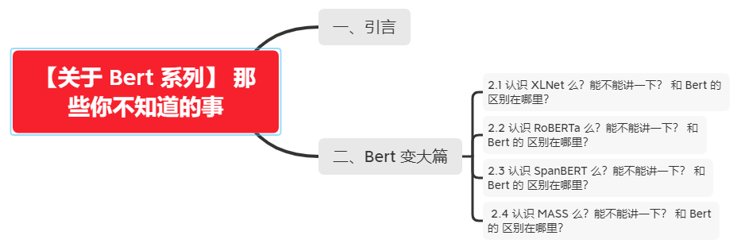
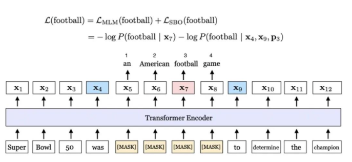
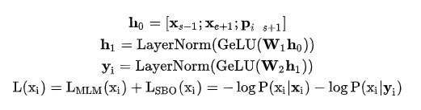
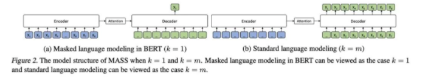

# 【关于 Bert 系列】 那些你不知道的事

> 作者：杨夕
> 
> 项目地址：https://github.com/km1994/nlp_paper_study
> 
> 个人介绍：大佬们好，我叫杨夕，该项目主要是本人在研读顶会论文和复现经典论文过程中，所见、所思、所想、所闻，可能存在一些理解错误，希望大佬们多多指正。

## 一、引言

- Bert 模型 之后，存在两个方向的优化：
  - 第一个：性能方面优化->变大 (XLNet、RoBERTa、SpanBERT、MASS、UNILM、BART等) 【本章主要从该方面做介绍】
  - 第二个：工业界应用->变小 (ALBERT、Q-BERT、DistilBERT、FastBERT、TinyBERT等)

## 二、Bert 变大篇

### 2.1 认识 XLNet 么？能不能讲一下？ 和 Bert 的 区别在哪里？
 
- AR vs AE
  - AR：只利用到单向 context 的信息（前向或后向）；
  - AE（这里特指 BERT）：Pre-training 阶段引入的 [MASK] 占位符在 Fine-tuning 阶段并不存在；同一个 sequence 如果有多个位置 [MASK]，BERT 假定它们之间是独立的，这与事实不符
- Bert 的问题：
  - Bert 预训练和微调之间的不匹配
  - Bert 的 Max Len 为 512
- XLNet 改进方法
  - 预训练：
    - Permutation Language Modeling【解决Bert 预训练和微调之间的不匹配】
    - Two-Stream Self-Attention for Target-Aware Representations【解决PLM出现的目标预测歧义】 
    - XLNet将最先进的自回归模型Transformer-XL的思想整合到预训练中【解决 Bert 的 Max Len 为 512】
  - 微调：直接利用 特定任务数据 微调

### 2.2 认识 RoBERTa 么？能不能讲一下？ 和 Bert 的 区别在哪里？

- 动机：
  - 确定方法的哪些方面贡献最大可能是具有挑战性的
  - 训练在计算上是昂贵的的，限制了可能完成的调整量
- 介绍：A Robustly Optimized BERT Pretraining Approach 
- 思路：
  - 预训练：
    - 训练时间更长：更大规模的训练数据（16GB -> 160GB）、更大的 batch_size（256 -> 8K）；
    - 去掉下一句预测(NSP)任务
    - 去除 NSP 任务，输入格式相应修改为 FULL-SENTENCES；
    - 输入粒度：由 character-level BPE 改为 byte-level BPE；
    - masking 机制：由 static masking改为dynamic masking：
      - static masking：仅在数据预处理阶段做一次随机 mask，每条数据在每个 epoch 中的 mask 方式不变；
      - dynamic masking：每条数据在训练时随机mask，每个 epoch 中的 mask 方式不同。
  - 微调：直接利用 特定任务数据 微调

### 2.3 认识 SpanBERT 么？能不能讲一下？ 和 Bert 的 区别在哪里？

- 思路：
  - Span Masking：首先根据几何分布 l~Geo(p=0.2) 采样出 span 的长度（大于 10 则重新采样），然后根据均匀分布随机选择起始点，最后从起始点开始将 span 内的 token 进行 mask；注意，这个过程会进行多次，直到被 mask 的 token 数量达到阈值，如输入序列的 15%；
  - Span Boundary Objective（SBO）：对于 span 内的每一个 token，除了原始的 MLM 的 loss，再加 SBO 的 loss;
- Single-Sequence Training：去掉 NSP 任务，用一个长句替代原来的两个句子。

> Span Boundary Objective（SBO）

### 2.4 认识 MASS 么？能不能讲一下？ 和 Bert 的 区别在哪里？

- 动机：
  - BERT 在 NLU 任务上的成功，但是 NLG 面临着训练数据（paired data）匮乏的问题
  - 在大量 unpaired data 上做 pre-training 然后在少量 paired data 上做 fine-tuning，对 NLU 任务而言是同样有益的。然而，直接采用类似 BERT 的预训练结构（仅用 encoder 或 decoder）是不可取的，因为 NLG 任务通常是基于 encoder-decoder 的框架
  - GPT 或 Bert 只能单独对 encoder 或 decoder 进行 pre-training，MASS 可以对二者进行联合 pre-training
- 模型结构
  - 整体基于 Transformer，Encoder 被 mask 的 token 是连续的，Decoder 将 Encoder 中未被 mask 的 token 进行 mask，预测 Encoder 中被 mask 的 token。

- 思路
  - Pre-training：
    - 由于 NMT 涉及跨语言，因此采用了 4 种语言的数据，并在 Encoder、Decoder 的 input 中给每个 token 加上了一个 language embedding
    - Encoder，mask 的 token 数量为序列长度的 50%，随机选择起点，mask 方式同 BERT（80% 替换为 [M]，10%替换为其它随机 token，10% 不变）
    - Decoder，移除被 mask 的 token，未 mask 的 token 依然保持它们的 positional encoding 不变
  - Fine-tuning：
    - 同常规 Seq2Seq 任务

## 参考

1. XLNet: Generalized Autoregressive Pretraining for Language Understanding
2. RoBERTa: A Robustly Optimized BERT Pretraining Approach
3. SpanBERT: Improving Pre-training by Representing and Predicting Spans
4. MASS: Masked Sequence to Sequence Pre-training for Language Generation

