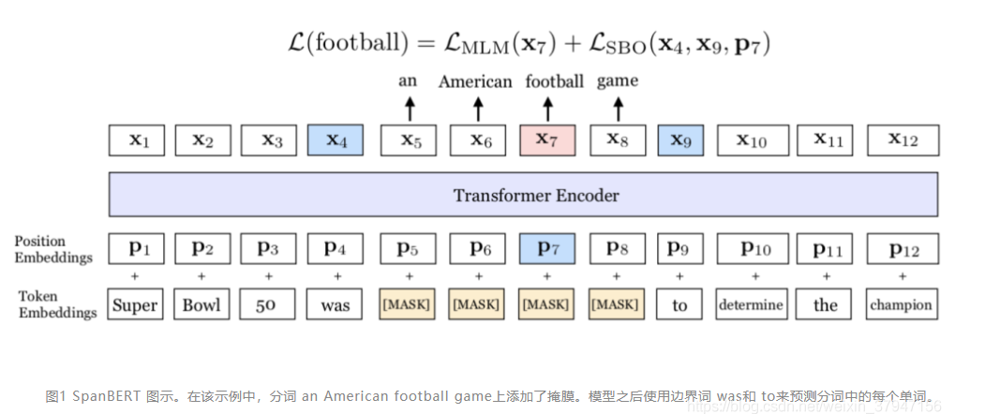

# 【关于 Bert 越大越精序列 】那些的你不知道的事

> 作者：杨夕
> 
> 介绍：本项目是作者们根据个人面试和经验总结出的搜索引擎(search engine) 面试准备的学习笔记与资料，该资料目前包含 搜索引擎各领域的 面试题积累。
> 
> NLP 百面百搭 地址：https://github.com/km1994/NLP-Interview-Notes
> 
> 推荐系统 百面百搭 地址：https://github.com/km1994/RES-Interview-Notes
> 
> **[手机版推荐系统百面百搭](https://mp.weixin.qq.com/s/b_KBT6rUw09cLGRHV_EUtw)**
> 
> 搜索引擎 百面百搭 地址：https://github.com/km1994/search-engine-Interview-Notes 【编写ing】
> 
> NLP论文学习笔记：https://github.com/km1994/nlp_paper_study
> 
> 推荐系统论文学习笔记：https://github.com/km1994/RS_paper_study
> 
> GCN 论文学习笔记：https://github.com/km1994/GCN_study
>
> 关注公众号 **【关于NLP那些你不知道的事】** 加入 【NLP && 推荐学习群】一起学习！！！

> 注：github 网页版 看起来不舒服，可以看 **[手机版推荐系统百面百搭](https://mp.weixin.qq.com/s/b_KBT6rUw09cLGRHV_EUtw)**

## 目录

- [【关于 Bert 越大越精序列 】那些的你不知道的事](#关于-bert-越大越精序列-那些的你不知道的事)
  - [目录](#目录)
  - [总结](#总结)
  - [一、Bert](#一bert)
    - [1.1 【BERT】介绍](#11-bert介绍)
    - [1.2 【BERT】Bert 预训练任务？](#12-bertbert-预训练任务)
      - [1.2.1 【BERT】任务介绍](#121-bert任务介绍)
      - [1.2.2 【MLM】Bert 预训练任务 Masked LM 怎么做？](#122-mlmbert-预训练任务-masked-lm-怎么做)
        - [1.2.2.1【MLM】动机](#1221mlm动机)
        - [1.2.2.2【MLM】做法](#1222mlm做法)
      - [1.2.3【NSP】Bert 预训练任务 Next Sentence Prediction 怎么做？](#123nspbert-预训练任务-next-sentence-prediction-怎么做)
        - [1.2.3.1 【NSP】动机](#1231-nsp动机)
        - [1.2.3.2 【NSP】方法](#1232-nsp方法)
        - [1.2.3.3【NSP】操作](#1233nsp操作)
    - [1.3 【Bert】问题](#13-bert问题)
      - [1.3.1 【Bert】问题 1：预训练和微调之间的不匹配](#131-bert问题-1预训练和微调之间的不匹配)
      - [1.3.2 【Bert】问题2：收敛速度慢问题](#132-bert问题2收敛速度慢问题)
  - [二、XLNet](#二xlnet)
    - [2.1 【XLNet】 介绍](#21-xlnet-介绍)
    - [2.2 【XLNet】动机](#22-xlnet动机)
    - [2.3 【XLNet】AR vs AE](#23-xlnetar-vs-ae)
    - [2.4 【XLNet】 预训练](#24-xlnet-预训练)
      - [2.4.1 【XLNet】Permutation Language Modeling](#241-xlnetpermutation-language-modeling)
      - [2.4.2 【XLNet】 Two-Stream Self-Attention for Target-Aware Representations](#242-xlnet-two-stream-self-attention-for-target-aware-representations)
        - [2.4.2.1 介绍](#2421-介绍)
        - [2.4.2.2 计算两个self-attention](#2422-计算两个self-attention)
        - [2.4.2.3 Transformer-XL](#2423-transformer-xl)
  - [三、RoBERTa](#三roberta)
    - [3.1 【RoBERTa】动机](#31-roberta动机)
    - [3.2 【RoBERTa】工作](#32-roberta工作)
    - [3.3 【RoBERTa】预训练](#33-roberta预训练)
      - [3.3.1 动态掩码](#331-动态掩码)
      - [3.3.2 去掉NSP任务](#332-去掉nsp任务)
      - [3.3.3 更大的数据量](#333-更大的数据量)
      - [3.3.4 更大的batch_size](#334-更大的batch_size)
      - [3.3.5 Byte-level BPE编码](#335-byte-level-bpe编码)
  - [四、ELECTRA](#四electra)
    - [4.1 【ELECTRA】动机](#41-electra动机)
    - [4.2 【ELECTRA】介绍](#42-electra介绍)
    - [4.3 【ELECTRA】核心任务](#43-electra核心任务)
    - [4.4 【ELECTRA】判别器 & 生成器](#44-electra判别器--生成器)
    - [4.5 【ELECTRA】算法流程](#45-electra算法流程)
  - [五、ERNIE 1.0](#五ernie-10)
    - [5.1 【ERNIE 1.0】动机](#51-ernie-10动机)
    - [5.2 【ERNIE 1.0】预训练](#52-ernie-10预训练)
      - [5.2.1 Knowledge Integration](#521-knowledge-integration)
      - [5.2.2 Dialogue Language Model（DLM）](#522-dialogue-language-modeldlm)
  - [六、ERNIE 2.0](#六ernie-20)
    - [6.1 【ERNIE 2.0】动机](#61-ernie-20动机)
    - [6.2 【ERNIE 2.0】架构](#62-ernie-20架构)
    - [6.3 【ERNIE 2.0】预训练](#63-ernie-20预训练)
      - [6.3.1 预训练连续学习](#631-预训练连续学习)
      - [6.3.2 更多的无监督预训练任务](#632-更多的无监督预训练任务)
  - [七、ERNIE-T](#七ernie-t)
    - [7.1 【ERNIE-T】动机](#71-ernie-t动机)
    - [7.2 【ERNIE-T】架构](#72-ernie-t架构)
    - [7.3 【ERNIE-T】预训练](#73-ernie-t预训练)
      - [7.3.1 引入知识图谱](#731-引入知识图谱)
      - [7.3.2 异构信息融合](#732-异构信息融合)
      - [7.3.3 dAE](#733-dae)
  - [八、ChineseBERT](#八chinesebert)
    - [8.1 【ChineseBERT】动机](#81-chinesebert动机)
    - [8.2 【ChineseBERT】方法介绍](#82-chinesebert方法介绍)
      - [8.2.1 模型整体架构介绍](#821-模型整体架构介绍)
      - [8.2.2 模型改进点介绍](#822-模型改进点介绍)
    - [8.3 【ChineseBERT】预训练](#83-chinesebert预训练)
  - [九、SpanBERT](#九spanbert)
    - [9.1 【SpanBERT】动机](#91-spanbert动机)
    - [9.2 【SpanBERT】预训练](#92-spanbert预训练)
    - [9.3 【SpanBERT】微调](#93-spanbert微调)
    - [9.4 【SpanBERT】效果](#94-spanbert效果)
  - [十、MacBERT](#十macbert)
    - [10.1 【MacBERT】动机](#101-macbert动机)
    - [10.2 【MacBERT】预训练](#102-macbert预训练)
      - [10.2.1 MLM](#1021-mlm)
    - [10.2.2 NSP](#1022-nsp)
    - [10.3 【MacBERT】微调](#103-macbert微调)
    - [10.4 【MacBERT】效果](#104-macbert效果)
  - [参考](#参考)

## 总结

<table>
    <tr>
        <td style="width: 10%;">名称</td>
        <td style="width: 10%;">介绍</td>
        <td style="width: 15%;">动机</td>
        <td style="width: 25%;">预训练方法</td>
        <td style="width: 25%;">微调</td>
        <td style="width: 15%;">问题</td>
    </tr>
    <tr>
        <td>Bert</td>
        <td>Transformer的双向编码器</td>
        <td>多义词问题 && GPT 单向 Transformer</td>
        <td>Task 1：Masked LM && Task 2：Next Sentence Prediction</td>
        <td>直接利用 特定任务数据 微调</td>
        <td>1. [MASK]预训练和微调之间的不匹配 2. Max Len 为 512</td>
    </tr>
    <tr>
        <td>XLNet</td>
        <td>广义自回归预训练方法</td>
        <td>1. Bert 预训练和微调之间的不匹配 2. Bert 的 Max Len 为 512</td>
        <td>（1） Permutation Language Modeling【解决Bert 预训练和微调之间的不匹配】  （2）Two-Stream Self-Attention for Target-Aware Representations【解决PLM出现的目标预测歧义】   （3）XLNet将最先进的自回归模型Transformer-XL的思想整合到预训练中【解决 Bert 的 Max Len 为 512】</td>
        <td>直接利用 特定任务数据 微调</td>
        <td>问题</td>
    </tr>
    <tr>
        <td>RoBERTa</td>
        <td>A Robustly Optimized BERT Pretraining Approach </td>
        <td>1. 确定方法的哪些方面贡献最大可能是具有挑战性的 2. 训练在计算上是昂贵的的，限制了可能完成的调整量</td>
        <td>1. 去掉下一句预测(NSP)任务 2. 动态掩码 3. 文本编码  4. 更大的数据量  5. 更大的batch_size</td>
        <td>直接利用 特定任务数据 微调</td>
        <td>问题</td>
    </tr>
    <tr>
        <td>ELECTRA</td>
        <td>判别器 & 生成器</td>
        <td>1. 只有15%的输入上是会有loss</td>
        <td>利用一个基于MLM的Generator来替换example中的某些个token，然后丢给Discriminator来判别</td>
        <td>直接利用 特定任务数据 微调</td>
        <td>问题</td>
    </tr>
    <tr>
        <td>ERNIE 1.0</td>
        <td>ERNIE: Enhanced Representation through Knowledge Integration</td>
        <td>随机【MASK】会让模型不能充分学习到语义信息</td>
        <td>1. Knowledge Integration  2. Dialogue Language Model（DLM）</td>
        <td>--</td>
        <td>问题</td>
    </tr>
    <tr>
        <td>ERNIE 2.0</td>
        <td>ERNIE 2.0: A Continual Pre-Training Framework for Language Understanding</td>
        <td>之前的工作主要**通过词或句子的共现信号，构建语言模型任务进行模型预训练**。**除了语言共现信息之外，语料中还包含词法、语法、语义等更多有价值的信息**。</td>
        <td>1. 预训练连续学习  2. 更多的无监督预训练任务</td>
        <td>--</td>
        <td>问题</td>
    </tr>
    <tr>
        <td>ERNIE-T</td>
        <td>ERNIE: Enhanced Language Representation with Informative Entities</td>
        <td>引入外部图谱</td>
        <td>1. 引入知识图谱  2. 异构信息融合 2. dAE</td>
        <td>--</td>
        <td>问题</td>
    </tr>
    <tr>
        <td>ChineseBERT</td>
        <td>ChineseBERT: Chinese Pretraining Enhanced by Glyph and Pinyin Information</td>
        <td>引入 字形 和 拼音</td>
        <td>1. Masking 操作  2. Packed Input 与 Single Input 之间交替训练</td>
        <td>--</td>
        <td>--</td>
    </tr>
    <tr>
        <td>SpanBERT</td>
        <td>SpanBERT: Improving Pre-training by Representing and Predicting Spans</td>
        <td>旨在更好地表示和预测文本的 span</td>
        <td>1. Span Mask  2. Span Boundary Objective (SBO)  训练目标 Single-Sequence Training</td>
        <td>--</td>
        <td>--</td>
    </tr>
    <tr>
        <td>MacBERT</td>
        <td>Revisiting Pre-trained Models for Chinese Natural Language Processing</td>
        <td>为了解决与训练阶段和微调阶段存在的差异性</td>
        <td>1. 使用Whole Word Masking、N-gram Masking  2. 使用相似的word进行替换[MASK]  3. 采用ALBERT提出的SOP替换NSP</td>
        <td>--</td>
        <td>--</td>
    </tr>
</table>

## 一、Bert

> 论文名称：《BERT: Pre-training of Deep Bidirectional Transformers for Language Understanding》 
> 论文：https://arxiv.org/pdf/1810.04805.pdf  
> 代码：https://github.com/google-research/bert 

### 1.1 【BERT】介绍

BERT（Bidirectional Encoder Representations from Transformers）是一种Transformer的双向编码器，旨在通过在左右上下文中共有的条件计算来预先训练来自无标号文本的深度双向表示。因此，经过预先训练的BERT模型只需一个额外的输出层就可以进行微调，从而为各种自然语言处理任务生成最新模型。

### 1.2 【BERT】Bert 预训练任务？

#### 1.2.1 【BERT】任务介绍

- 预训练 包含 两个 Task:
  - Task 1：Masked LM
  - Task 2：Next Sentence Prediction

#### 1.2.2 【MLM】Bert 预训练任务 Masked LM 怎么做？

##### 1.2.2.1【MLM】动机
- 双向模型 由于 可以分别 从左到右 和 从右到左 训练，使得 每个词 都能 通过多层 上下文 “看到自己”；

#####  1.2.2.2【MLM】做法
-  s1：随机遮蔽输入词块的某些部分；
-  s2：仅预测那些被遮蔽词块；
-  s3：被遮盖的标记对应的最终的隐藏向量被当作softmax的关于该词的一个输出，和其他标准语言模型中相同

#### 1.2.3【NSP】Bert 预训练任务 Next Sentence Prediction 怎么做？

#####  1.2.3.1 【NSP】动机

很多重要的下游任务，例如问答(QA)和自然语言推理(NLI)，都是基于对两个文本句子间关系的理解，而这种关系并非通过语言建模直接获得

#####  1.2.3.2 【NSP】方法

预训练 一个 二值化 NSP 任务 学习 句子间关系；

#####  1.2.3.3【NSP】操作
- 选择句子A和B作为预训练样本：B有50%的可能是A的下一句，也有50%的可能是来自语料库的随机句子
> 举例： 
> - 输入=[CLS]男子去[MASK]商店[SEP]他买了一加仑[MASK]牛奶[SEP]  
> - Label= IsNext  
> - 输入=[CLS]男人[面具]到商店[SEP]企鹅[面具]是飞行##少鸟[SEP]  
> - Label= NotNext  

### 1.3 【Bert】问题

#### 1.3.1 【Bert】问题 1：预训练和微调之间的不匹配
1. 解释：在微调期间从未看到[MASK]词块
2. 解决方法：
- 以一定概率用 [MASK] 词块替换“遮蔽”单词，论文采用 15% 的概率 随机选择 词块
- 目的：模型需要学习每个输入词块的分布式语境表征
- 举例：

> 句子：我的狗是毛茸茸的  
> 操作：  
> - 80％的概率：用[MASK]词块替换单词，例如，我的狗是毛茸茸的！我的狗是[MASK]；  
> - 10％的概率：用随机词替换遮蔽词，例如，我的狗是毛茸茸的！我的狗是苹果；  
> - 10％的概率：保持单词不变，例如，我的狗是毛茸茸的！我的狗毛茸茸的。【目的：是将该表征偏向于实际观察到的单词】  

#### 1.3.2 【Bert】问题2：收敛速度慢问题
1. 原因：每 batch 中只预测了15％的词块，导致 收敛速度慢

## 二、XLNet

> 论文名称：《XLNet: Generalized Autoregressive Pretraining for Language Understanding》 
> 论文：https://arxiv.org/abs/1906.08237  
> 代码：https://github.com/zihangdai/xlnet 

### 2.1 【XLNet】 介绍

本文结合AR LM和AE LM，在Transformer-XL的基础上提出generalized autoregressive method，XLNet。

- 所有的分解序列作为一个集合，从中采样一个序列，XLNet按照AR LM的计算方式最大化有关序列所有可能的因式分解的排列的对数似然函数的期望。通常，当前token的上文包含left和right的tokens：比如原始序列为1-2-3-4，分解序列中采样一个为2-4-1-3，那么如果当前token为3，XLNet的方式就可以看到所有的信息，当然这也是理想情况。
- 引入Transformer-XL的segment recurrence mechanism和relative encoding scheme。
- 引入Masked Two-Stream Self-Attention解决PLM出现的目标预测歧义【the ambiguity in target prediction】问题。举个例子，比如分解序列中采样一个为2-4-6-1-3-5的序列，假设要预测[1]的token，按照经典的Transformer来计算next-token的概率分布，位置[1]token的概率就是通过[2,4,6]位置上的tokens来计算softmax，不会把[1]作为输入来计算的。但是如果以这种方式去预测next-token，这对[3,5]的预测就会产生影响，因为如果[1]的预测出现错误会把错误传给后面。对后面每一个token的预测，需要建立在之前token都已知的条件下。因此本文计算了两个self-attention计算方式，一个mask当前词，attention值记为$g$；一个已知当前词，attention值记为$h$。最后假设self-attention一共有$M$层，用第$M$层、$t$时刻的$g_t$，去预测词$x_t$。

### 2.2 【XLNet】动机

1. Bert 预训练和微调之间的不匹配
2. Bert 的 Max Len 为 512

### 2.3 【XLNet】AR vs AE

文章从AR(autoregressive，自回归)和AE(autoencoding，自编码)的角度出发，解释论文动机。

AR LM，即自回归语言模型。具体而言，给定一个序列，当前token时刻只知道前面的信息，而不知道后面的信息，即使分成正向和反向计算当前token时刻的概率分布，也是同样的原则，ELMo、GPT是属于这个范畴。对于一些自然语言理解任务而言，是给定上下文的，即使ELMo把两个的方向计算的信息concat，但也是独立计算，对上下文的编码是有缺陷的。

AE LM，即自编码语言模型。BERT通过预测原始数据里MASK掉的token来预训练语言模型，预测[MASK]使用了上下文信息，弥补了AR LM的缺陷。但是[MASK]只在预训练的时候用到，finetune的时候是不用的，这使得pretrain/train不一致。并且，BERT假定每个[MASK]与其他[MASK]是相互独立的，不能计算序列、长期依赖的联合概率。即使BERT的NSP预训练任务一定程度上给了模型建模句间关系的能力，但是还是对长文本不敏感。

### 2.4 【XLNet】 预训练

#### 2.4.1 【XLNet】Permutation Language Modeling

首先代码会根据输入序列的长度采样一个排列，然后用Transformer中attention mask的方式实现排列，如果原始序列长度为T，那么理论上一共有T的阶乘种情况。PLM的目标函数就是所有排列情况（论文里设定：统共T种）的期望最大：

这样pretrain和finetune阶段就一样了，输入都是原始序列，通过attention mask实现随机产生的排列。下图是排列语言模型的表现形式：

> 注：假设要预测t=3的词，按照不同的排列顺序，h_3的上文都不一样，用attention-mask的方式得到t=3的上文。

#### 2.4.2 【XLNet】 Two-Stream Self-Attention for Target-Aware Representations

##### 2.4.2.1 介绍

上面是构造输入，这里就是自回归地得到每一时刻的概率分布，示意图如下：

##### 2.4.2.2 计算两个self-attention

- (a) 代表context stream self-attention，以[1,t]时刻的词作为K、V，t时刻的词作为Q计算当前词的信息，把排列之后的原始序列信息用h记忆起来。
- (b) 代表query stream self-attention，mask掉当前词，以[1,t-1]时刻的词作为K、V，t时刻的词作为Q预测当前词，得到概率分布。
- (c) 代表通过多层的masked two-stream attention，最后用t时刻的$g_t$来预测x_t。

##### 2.4.2.3 Transformer-XL

确定好目标函数之后，框架确定为Transformer-XL自回归语言模型。特点是relative positional encoding scheme和segment recurrence mechanism，更好地处理长文本，提升计算效率。具体不介绍了，详见参考文献[2]。

## 三、RoBERTa

> 论文名称：《RoBERTa: A Robustly Optimized BERT Pretraining Approach》 
> 论文：https://arxiv.org/pdf/1907.11692.pdf  
> 代码：https://github.com/pytorch/fairseq 

### 3.1 【RoBERTa】动机

- Bert 序列模型的问题
> 确定方法的哪些方面贡献最大可能是具有挑战性的;
> 
> 训练在计算上是昂贵的的，限制了可能完成的调整量

### 3.2 【RoBERTa】工作

- 更大的模型参数量（论文提供的训练时间来看，模型使用 1024 块 V100 GPU 训练了 1 天的时间）
- 更大bacth size。RoBERTa 在训练过程中使用了更大的bacth size。尝试过从 256 到 8000 不等的bacth size。
- 更多的训练数据（包括：CC-NEWS 等在内的 160GB 纯文本。而最初的BERT使用16GB BookCorpus数据集和英语维基百科进行训练）
另外，RoBERTa在训练方法上有以下改进：

### 3.3 【RoBERTa】预训练

#### 3.3.1 动态掩码

- 动态掩码。BERT 依赖随机掩码和预测 token。原版的 BERT 实现在数据预处理期间执行一次掩码，得到一个静态掩码。 而 RoBERTa 使用了动态掩码：每次向模型输入一个序列时都会生成新的掩码模式。这样，在大量数据不断输入的过程中，模型会逐渐适应不同的掩码策略，学习不同的语言表征。

#### 3.3.2 去掉NSP任务

- 动机：虽然是句子对输入，但其实一个句子不只有一句，而是文章里面的连续片段，可以包含多句。
- 操作：采用去掉NSP而且一个样本是从同一个文档里面进行采样

#### 3.3.3 更大的数据量

在BERT采用的数据BOOKCORPUS + English WIKIPEDIA（共16G）基础上

- 增加 CC-NEWS（76GB）
- 增加 OPENWEBTEXT（38GB）
- 增加 STORIES（31GB）

也就是RoBERTa一共用了160GB语料进行预训练。

#### 3.3.4 更大的batch_size

BERT的batch_size是256，一共训练了1M步，实验证明，采用更大的batch_size以及训练更多步，可以提高性能。最后RoBERTa采用的batch_size是8K。

#### 3.3.5 Byte-level BPE编码

- BERT：采用的是基于character level的Byte-Pair Encoding（BPE）编码，词表大小是30K；
- RoBERTa：文本编码。Byte-Pair Encoding（BPE）是字符级和词级别表征的混合，支持处理自然语言语料库中的众多常见词汇。原版的 BERT 实现使用字符级别的 BPE 词汇，大小为 30K，是在利用启发式分词规则对输入进行预处理之后学得的。Facebook 研究者没有采用这种方式，而是考虑用更大的 byte 级别 BPE 词汇表来训练 BERT，这一词汇表包含 50K 的 subword 单元，且没有对输入作任何额外的预处理或分词。

## 四、ELECTRA

> 论文名称：《ELECTRA: Pre-training Text Encoders as Discriminators Rather Than Generator》 
> 论文：https://arxiv.org/abs/2003.10555  
> 代码：https://github.com/google-research/electra 

### 4.1 【ELECTRA】动机

- Bert MLM 方式： 在训练Bert的时候，在输入上操作把15%的词语给替换成Mask，然后这其中有80%是Mask，有10%是替换成其他词语，最后剩下10%保持原来的词语。
- 问题： 可以看到，Bert的训练中，每次相当于**只有15%的输入上是会有loss**的，而其他位置是没有的，这就导致了每一步的训练并没有被完全利用上，导致了训练速度慢。换句话说，就是模型只学习到 15%的 token 信息；

### 4.2 【ELECTRA】介绍

提出了一种更有效的样本预训练任务，称为替换令牌检测。我们的方法不是掩盖输入，而是通过使用从 small generator network 采样的合理替代物替换一些令牌来破坏输入。然后，我们训练一个判别模型，该模型预测损坏的输入中的每个标记是否被生成器采样器代替，而不是训练一个预测损坏的令牌的原始身份的模型。

### 4.3 【ELECTRA】核心任务

- 核心：将生成式的Masked language model(MLM)预训练任务改成了判别式的Replaced token detection(RTD)任务，判断当前token是否被语言模型替换过；
- 思路：利用一个基于MLM的Generator来替换example中的某些个token，然后丢给Discriminator来判别

### 4.4 【ELECTRA】判别器 & 生成器

如下图所示，首先会训练一个生成器来生成假样本，然后Electra去判断每个token是不是被替换了。

### 4.5 【ELECTRA】算法流程

1. Generator G:
   1. 输入经过随机选择设置为[MASK];
   2. 输入给 G，G 负责把[MASK]变成替换过的词;
2. Discriminator D:
   1. 预测 输入的句子 每个位置上的词语是否被替换过；
   
> 注： 
>
> 1. Discriminator是训练完之后我们得到的预训练模型，Generator在训练完之后就没有用了

## 五、ERNIE 1.0

> 论文名称：《ERNIE: Enhanced Representation through Knowledge Integration》 
> 论文：https://arxiv.org/pdf/1904.09223.pdf  
> 代码：https://github.com/PaddlePaddle/ERNIE/tree/develop/ERNIE 

### 5.1 【ERNIE 1.0】动机

原生BERT是采用随机【MASK】会让模型不能充分学习到语义信息，降低学习难度。

> 注：Harry Potter的Harry被【MASK】掉，这时候让模型去预测被【MASK】掉的token，这种情况下，模型很可能是根据Potter从而预测Harry（毕竟Harry Potter在语料中共同出现频率的比较高），在这种情况下，模型也许并不是根据Harry Potter和J.K.Rowling的关系来预测出Harry的，换个角度，这样BERT学到的是规则，而并非语义信息。

### 5.2 【ERNIE 1.0】预训练

#### 5.2.1 Knowledge Integration

针对 MASK 存在问题，ERNIE 1.0 将 MASK 分为三部分：

- Basic-level Masking：与BERT一样；
- Entity-level Masking：把实体作为一个整体【MASK】，例如 J.K.Rowling 这个词作为一个实体，被一起【MASK】；
- Phrase-Level Masking：把短语作为一个整体【MASK】，如 a series of 作为一个短语整体，被一起【MASK】。

#### 5.2.2 Dialogue Language Model（DLM）

在 Bert 已有的预训练任务中，加入了 Dialogue Language Model 任务：

- 作用：ERNIE 1.0 通过引入 多轮问答数据，使 ERNIE 学习到对话中的隐含关系，增加模型的语义表达能力。
- 具体操作：把里面的单个token、实体、短语【MASK】掉，然后预测它们，另外在生成预训练数据的时候，有一定几率用另外的句子替代里面的问题和答案，所以模型还要预测是否是真实的问答对。

> 注：注意看Segment Embedding被Dialogue Embedding代替了，但其它结构跟MLM模型是一样的，所以DLM任务可以和MLM任务联合训练，即Dialogue Embedding只会跟随DLM任务更新，Segment Embedding指挥跟随MLM任务跟新，而模型其它参数是随着DLM任务和MLM任务一起更新。

## 六、ERNIE 2.0

> 论文名称：《ERNIE 2.0: A Continual Pre-Training Framework for Language Understanding》 
> 论文：https://ojs.aaai.org//index.php/AAAI/article/view/6428 
> 代码：https://github.com/PaddlePaddle/ERNIE 

### 6.1 【ERNIE 2.0】动机

近两年，以 BERT、XLNet 为代表的无监督预训练技术在多个自然语言处理任务上取得了技术突破。基于大规模数据的无监督预训练技术在自然语言处理领域变得至关重要。

百度发现，之前的工作主要**通过词或句子的共现信号，构建语言模型任务进行模型预训练**。例如，**BERT 通过掩码语言模型和下一句预测任务进行预训练**。**XLNet 构建了全排列的语言模型，并通过自回归的方式进行预训练**。

然而，**除了语言共现信息之外，语料中还包含词法、语法、语义等更多有价值的信息**。例如，人名、地名、机构名等词语概念知识，句子间顺序和距离关系等结构知识，文本语义相似度和语言逻辑关系等语义知识。那么如果持续地学习各类任务，模型的效果能否进一步提升？这就是 ERNIE 2.0 希望探索的。

### 6.2 【ERNIE 2.0】架构

ERNIE 2.0 中有一个很重要的概念便是连续学习(Continual Learning)，**连续学习的目的是在一个模型中顺序训练多个不同的任务以便在学习下个任务当中可以记住前一个学习任务学习到的结果**。通过使用连续学习，可以不断积累新的知识，模型在新任务当中可以用历史任务学习到参数进行初始化，一般来说比直接开始新任务的学习会获得更好的效果

### 6.3 【ERNIE 2.0】预训练

#### 6.3.1 预训练连续学习

ERNIE 2.0 提出三种策略来让模型同时学习3个任务：

- 策略一：**Multi-task Learning**，就是让模型同时学这3个任务，具体的让这3个任务的损失函数权重双加，然后一起反向传播更新参数；
- 策略二：**Continual Learning**，先训练任务1，再训练任务2，再训练任务3，这种策略的缺点是容易遗忘前面任务的训练结果，最后训练出的模型容易对最后一个任务过拟合；
- 策略三：**Sequential Multi-task Learning**，连续多任务学习，即第一轮的时候，先训练任务1，但不完全让它收敛训练完，第二轮，一起训练任务1和任务2，同样不让模型收敛完，第三轮，一起训练三个任务，直到模型收敛完。

论文采用策略三的思想。具体的，如下图所示，每个任务有独立的损失函数，句子级别的任务可以和词级别的任务一起训练，相信做过联合训练的同学并不陌生。

#### 6.3.2 更多的无监督预训练任务

由于是多任务学习，模型输入的时候额外多了一个Task embedding。

具体的三种类型的无监督训练任务是哪三种呢？每种里面又包括什么任务呢？

1. 任务一：词法级别预训练任务

- Knowledge Masking Task：这任务同ERNIE 1.0一样，把一些字、短语、实体【MASK】掉，预测【MASK】词语；
- Capitalization Prediction Task：预测单词是大写还是小写；
- Token-Document Relation Prediction Task：预测在段落A中出现的token，是否在文档的段落B中出现。

2. 任务二：语言结构级别预训练任务

- Sentence Reordering Task：把文档中的句子打乱，预测正确顺序；
- Sentence Distance Task：分类句子间的距离（0：相连的句子，1：同一文档中不相连的句子，2：两篇文档间的句子）。
  
1. 任务三：语句级别预训练任务

- Discourse Relation Task：计算两句间的语义和修辞关系；
- IR Relevance Task：短文本信息检索关系，搜索数据（0：搜索并点击，1：搜素并展现，2：无关）。

## 七、ERNIE-T

> 论文名称：《ERNIE: Enhanced Language Representation with Informative Entities》 
> 论文：https://arxiv.org/pdf/1905.07129.pdf 
> 代码：https://github.com/thunlp/ERNIE 

### 7.1 【ERNIE-T】动机

例如下面的句子，我们的任务目标是对“Bob Dylan”进行实体类别识别（Entity Typing）。所谓Entity Typing，是指给定一个实体指代（entity mention），根据实体的上下文信息来对实体的具体语义类别进行预测。例如在示例1中，Bob Dylan的entity typing的值为“songwriter”和“writer”，因为“Blowin' in the wind”是一首歌，“Chronicies：Volume One”是一本书。对于BERT来说，仅仅通过上下文是很难预测出正确的结果的，因为它没有关于这两个作品类别的信息。

但是如果我们引入了实体额外的知识图谱呢，如图1。根据图谱提供的信息，我们知道了Blowin' in the wind”是一首歌以及“Chronicies：Volume One”是一本书，那么我们再对“Boby Dylan”进行实体类别识别时就容易多了。

> 示例1： Bob Dylan wrote Blowin' in the Wind in 1962, and wrote Chronicies: Volume One in 2004.

### 7.2 【ERNIE-T】架构

### 7.3 【ERNIE-T】预训练

#### 7.3.1 引入知识图谱

ERNIE-T 引入知识图谱来增强预训练模型的语义表达能力，其实预训练时就是在原来bert的基础上增加了一个实体对齐的任务。

#### 7.3.2 异构信息融合 

因为词向量和实体的知识图谱是两个异构的信息，那么如何设计一个网络来融合这两个信息则是我们需要解决的首要问题。如图2所示，ERNIE-T由两个模块组成，它们是底层文本编码器（underlying textual encoder，T-Encoder）和上层知识编码器（upper knowledge encoder，K-Encoder）。

#### 7.3.3 dAE 

提出了随机mask tokens-entity中的entity，然后去预测该位置对应的entity，本质上和MLM（mask language model）任务一致，都属于去噪自编码。具体mask的细节：

1. 5%的tokens-entity对采用随机用其他的entity来替换，这主要是引入噪声，因为在实际的任务中也存在这种情况。
2. 15%的tokens-entity对采用随机maskentity，然后来预测这个entity。
3. 80%保持正常。

这篇论文主要的工作就是增加了这个任务，另外也提出了在实体类型和关系抽取两个任务上新的预训练方式，具体如下图：

就是引入了一些特殊的token来表明另外一些特殊token的身份。因为引入了实体对齐任务，因此该模型在一些和知识图谱相关的下游任务上要优于bert。

## 八、ChineseBERT

> 论文名称：ChineseBERT: Chinese Pretraining Enhanced by Glyph and Pinyin Information 
> 论文：https://arxiv.org/abs/2106.16038 
> 代码：https://github.com/ShannonAI/ChineseBert 

### 8.1 【ChineseBERT】动机

1. 中文与英文不同，其包含 字形 和 拼音：

- 字形：在 汉字中 字形 包含一些特殊的语义信息，而这些语义信息能够增强 中文自然语言处理任务模型的表达能力。

> eg：“液”、“河”和“湖”都有“氵”，表示这些字符都与“水”的语义相关；

- 拼音：利用 拼音 的 方式表示 汉字发音，在建模语义和语法信息是至关重要的；

> 同样的汉字在不同的读音下，有着不同的涵义。例如： “乐”字，读“yuè”时表示音乐，读“lè” 时表示快乐;  
> 形近字发音类似。例如：“博” 和 “搏” 等；

### 8.2 【ChineseBERT】方法介绍

#### 8.2.1 模型整体架构介绍

1. embedding 层：将 字符嵌入（char embedding）、字形嵌入（glyph embedding）和拼音嵌入（pinyin embedding） 做拼接；
2. Fusion Layer 层：将 拼接后的 embedding 向量 做 Fusion 得到 一个 d 维的 Fusion embedding;
3. 位置拼接：将 Fusion embedding 和 位置嵌入（position embedding）、片段嵌入（segment embedding）相加；
4. Transformer-Encoder层

#### 8.2.2 模型改进点介绍

1. 在底层的融合层（Fusion Layer）融合了除字嵌入（Char Embedding）之外的字形嵌入（Glyph Embedding）和拼音嵌入（Pinyin Embedding），得到融合嵌入（Fusion Embedding），再与位置嵌入相加，就形成模型的输入；
2. 抛弃预训练任务中的NSP任务。 由于预训练时没有使用NSP任务，因此模型结构图省略了片段嵌入（segment embedding）。实际上下游任务输入为多个段落时（例如：文本匹配、阅读理解等任务），是采用了segment embedding；

### 8.3 【ChineseBERT】预训练

1. Masking 操作。预训练的一大关键步骤是确定如何掩码（Masking）输入文本。ChineseBERT 综合使用两种掩码策略：全词掩码（Whole Word Masking, WWM）与字掩码（Char Masking, CM）。

- 字掩码（Char Masking, CM）：最简洁最直观的掩码方法，以单个汉字为单位进行掩码。
- 全词掩码（Whole Word Masking, WWM）：以词为单位，将词中的所有字掩码。注意基本的输入单元依然是字，只是一个词包含的所有汉字都被掩码。比如，“我喜欢紫禁城”在掩码词“紫禁城”之后就是“我喜欢[M][M][M]”，而非“我喜欢[M]”。

使用两种掩码方式易于模型从不同的角度融合字、字形、拼音及上下文信息。

2. Packed Input 与 Single Input 之间交替训练。 为了习得短期上下文与长期上下文，ChineseBERT 在 Packed Input 与 Single Input 之间交替训练：

- Packed Input 是将模型的输入扩展到最大长度 512，作为输入的概率为 0.9；
- Single Input 则将单个句子作为输入，Single Input 作为输入的概率是 0.1。

## 九、SpanBERT

> 论文名称：SpanBERT: Improving Pre-training by Representing and Predicting Spans 
> 论文：https://arxiv.org/abs/1907.10529 
> 代码：https://github.com/facebookresearch/SpanBERT 

### 9.1 【SpanBERT】动机

- 动机：旨在更好地表示和预测文本的 span;

### 9.2 【SpanBERT】预训练

- 论文方法->扩展了BERT：
  - （1）Span Mask。屏蔽连续的随机跨度，而不是随机标记；
  - （2）Span Boundary Objective (SBO) 训练目标。训练跨度边界表示来预测屏蔽跨度的整个内容，而不依赖其中的单个标记表示。
  - (3) Single-Sequence Training。弃用 Next Sentence Prediction (NSP) 任务，改用 Single-Sequence Training
    - 原因：（a）更长的语境对模型更有利，模型可以获得更长上下文（类似 XLNet 的一部分效果；（b）加入另一个文本的语境信息会给MLM 语言模型带来噪音。

### 9.3 【SpanBERT】微调

### 9.4 【SpanBERT】效果

在 TACRED 关系抽取任务中的表现也超过了基线，获得 70.8% 的 F1 score，在 GLUE 数据集上的表现也有所提升

## 十、MacBERT

> 论文名称：Revisiting Pre-trained Models for Chinese Natural Language Processing  
> 论文：https://arxiv.org/abs/2004.13922 
> 代码：https://github.com/ymcui/MacBERT 

### 10.1 【MacBERT】动机

- 主要为了解决与训练阶段和微调阶段存在的差异性

### 10.2 【MacBERT】预训练

#### 10.2.1 MLM

1. 使用Whole Word Masking、N-gram Masking：single token、2-gram、3-gram、4-gram分别对应比例为0.4、0.3、0.2、0.1；
2. 由于finetuning时从未见过[MASK]token，因此使用相似的word进行替换。使用工具Synonyms toolkit 获得相似的词。如果被选中的N-gram存在相似的词，则随机选择相似的词进行替换，否则随机选择任意词替换；
3. 对于一个输入文本，15%的词进行masking。其中80%的使用相似的词进行替换，10%使用完全随机替换，10%保持不变。

### 10.2.2 NSP

采用ALBERT提出的SOP替换NSP

### 10.3 【MacBERT】微调

### 10.4 【MacBERT】效果

## 参考

1. [《BERT: Pre-training of Deep Bidirectional Transformers for Language Understanding》](https://arxiv.org/pdf/1810.04805.pdf)
2. [《XLNet: Generalized Autoregressive Pretraining for Language Understanding》](https://arxiv.org/abs/1906.08237)
3. [《RoBERTa: A Robustly Optimized BERT Pretraining Approach》](https://arxiv.org/pdf/1907.11692.pdf)
4. [《ELECTRA: Pre-training Text Encoders as Discriminators Rather Than Generator》](https://arxiv.org/abs/2003.10555)
5. [《ERNIE: Enhanced Representation through Knowledge Integration》](https://arxiv.org/pdf/1904.09223.pdf)
6. [《ERNIE 2.0: A Continual Pre-Training Framework for Language Understanding》](https://ojs.aaai.org//index.php/AAAI/article/view/6428)
7. [《ERNIE: Enhanced Language Representation with Informative Entities》](https://arxiv.org/pdf/1905.07129.pdf)