# 【关于 GPT->GPT2-> ... 】那些的你不知道的事

> 作者：杨夕
> 
> 介绍：本项目是作者们根据个人面试和经验总结出的搜索引擎(search engine) 面试准备的学习笔记与资料，该资料目前包含 搜索引擎各领域的 面试题积累。
> 
> NLP 百面百搭 地址：https://github.com/km1994/NLP-Interview-Notes
> 
> 推荐系统 百面百搭 地址：https://github.com/km1994/RES-Interview-Notes
> 
> **[手机版推荐系统百面百搭](https://mp.weixin.qq.com/s/b_KBT6rUw09cLGRHV_EUtw)**
> 
> 搜索引擎 百面百搭 地址：https://github.com/km1994/search-engine-Interview-Notes 【编写ing】
> 
> NLP论文学习笔记：https://github.com/km1994/nlp_paper_study
> 
> 推荐系统论文学习笔记：https://github.com/km1994/RS_paper_study
> 
> GCN 论文学习笔记：https://github.com/km1994/GCN_study
>
> 关注公众号 **【关于NLP那些你不知道的事】** 加入 【NLP && 推荐学习群】一起学习！！！

> 注：github 网页版 看起来不舒服，可以看 **[手机版推荐系统百面百搭](https://mp.weixin.qq.com/s/b_KBT6rUw09cLGRHV_EUtw)**

## 目录

- [【关于 GPT->GPT2-> ... 】那些的你不知道的事](#关于-gpt-gpt2---那些的你不知道的事)
  - [目录](#目录)
  - [总结](#总结)
  - [一、Generative Pre-trained Transformer（GPT）](#一generative-pre-trained-transformergpt)
    - [1.1 动机](#11-动机)
    - [1.2 GPT 思想](#12-gpt-思想)
    - [1.3 GPT 处理的 有监督任务有哪些？](#13-gpt-处理的-有监督任务有哪些)
    - [1.4 GPT 训练](#14-gpt-训练)
      - [1.4.1 无监督预训练](#141-无监督预训练)
      - [1.4.2 有监督微调](#142-有监督微调)
    - [1.5 优点](#15-优点)
    - [1.6 缺点](#16-缺点)
    - [1.7 主要贡献](#17-主要贡献)
  - [二、Generative Pre-trained Transformer 2（GPT-2）](#二generative-pre-trained-transformer-2gpt-2)
    - [2.1 动机](#21-动机)
    - [2.2 GPT-2 核心思想](#22-gpt-2-核心思想)
  - [三、MASS](#三mass)
    - [3.1 动机](#31-动机)
    - [3.2 MASS 核心思想](#32-mass-核心思想)
      - [3.2.1 预训练阶段](#321-预训练阶段)
      - [3.2.2 微调阶段](#322-微调阶段)
    - [3.3 优点](#33-优点)
  - [四、UniLM 1.0](#四unilm-10)
    - [4.1 动机](#41-动机)
    - [4.2 方向性语言模型](#42-方向性语言模型)
    - [4.3 UniLM 1.0 核心思路](#43-unilm-10-核心思路)
      - [4.3.1 预训练阶段](#431-预训练阶段)
      - [4.3.2 微调阶段](#432-微调阶段)
    - [4.4 UniLM 1.0 优点](#44-unilm-10-优点)
  - [五、Bart](#五bart)
    - [5.1 动机](#51-动机)
    - [5.2 Bart 思路](#52-bart-思路)
    - [5.3 BART 预训练](#53-bart-预训练)
    - [5.4 BART 微调](#54-bart-微调)
      - [5.4.1 Sequence Classification Task 序列分类任务](#541-sequence-classification-task-序列分类任务)
      - [5.4.2 Token Classification Task 序列分类任务](#542-token-classification-task-序列分类任务)
      - [5.4.3 Sequence Generation Task 序列生成任务](#543-sequence-generation-task-序列生成任务)
      - [5.4.4 Machine Translation 机器翻译](#544-machine-translation-机器翻译)
  - [六、T5](#六t5)
    - [6.1 动机](#61-动机)
    - [6.2 T5 的基本思想](#62-t5-的基本思想)
    - [6.3 T5 预训练任务](#63-t5-预训练任务)
      - [6.3.1 T5 预训练任务介绍](#631-t5-预训练任务介绍)
      - [6.3.2 T5 预训练任务——无监督训练](#632-t5-预训练任务无监督训练)
      - [6.3.3 T5 预训练任务——有监督训练](#633-t5-预训练任务有监督训练)
    - [6.4 T5 微调任务](#64-t5-微调任务)
  - [参考](#参考)

## 总结

<table>
    <tr>
        <td style="width: 10%;">名称</td>
        <td style="width: 10%;">介绍</td>
        <td style="width: 15%;">动机</td>
        <td style="width: 25%;">预训练方法</td>
        <td style="width: 25%;">微调</td>
         <td style="width: 15%;">优点</td>
        <td style="width: 15%;">问题</td>
    </tr>
    <tr>
        <td>GPT</td>
        <td>Generative Pre-trained Transformer</td>
        <td>标注数据昂贵 && 根据一个任务训练的模型很难泛化到其它任务中</td>
        <td>利用无监督语料对 GPT 模型进行预训练，学习得到一个生成式的语言模型</td>
        <td>根据特定热任务对 生成式的语言模型 进行微调</td>
        <td>GPT-1的模型要比基于LSTM的模型稳定</td>
        <td>泛化能力远远低于经过微调的有监督任务&在 NLU 任务性能低下</td>
    </tr>
    <tr>
        <td>GPT-2</td>
        <td>Generative Pre-trained Transformer 2</td>
        <td>GPT-1 能力不够问题</td>
        <td>GPT-2 利用 更大的语料进行预训练</td>
        <td>根据特定热任务对 生成式的语言模型 进行微调 & 增大其网络参数</td>
        <td>NLG 能力提升</td>
        <td>在 NLU 任务性能低下</td>
    </tr>
    <tr>
        <td>MASS</td>
        <td>Masked Sequence to Sequence Pre-training for Language Generation</td>
        <td>Bert 只适用于 NLU 类型任务，无法直接用于 生成式任务（eg：翻译、摘要等）</td>
        <td>利用 encoder 信息和 decoder 信息，预测 被 mask 的 连续 k 个词</td>
        <td>————</td>
        <td>MASS 在 机器翻译上 取得了 新的SOTA </br> mask掉连续的token，可以得到更好的语言建模能力 </br> 只让decoder从encoder侧获取信息，得到的模型效果更好 </td>
        <td>————</td>
    </tr>
    <tr>
        <td>UniLM 1.0</td>
        <td>Unified Language Model Pre-training for Natural Language Understanding and Generation</td>
        <td>ELMO 和 GPT 无法同时利用上下文 && Bert 在 NLG 效果低下 &&  [MASK] 标记问题 </td>
        <td>混合训练方式 && masking 方式 && Attention 控制</td>
        <td>对于NLU类型的任务UNILM和BERT相同。对于NLG类型的任务，UNILM随机mask decoder中的一些词，然后再预测它们</td>
        <td>1. 预训练阶段 同时训练 双向(bidirectional)语言模型、seq-to-seq语言模型、两种单向学习的语言模型 </br> 2. 预训练阶段 使用 mask 方法 解决 self-attention 中约束问题 </br> 3. 在 NLU 和 NLG 任务上都取得不错效果 </br> 在GLUE上首次不加外部数据打赢了BERT</td>
        <td>————</td>
    </tr>
    <tr>
        <td>Bart</td>
        <td>Denoising sequence-to-sequence pre-training for natural language generation, translation, and comprehension</td>
        <td>BERT 较难用于生成任务 </br> GPT 仅基于左侧上下文预测单词，无法学习双向交互 </td>
        <td>通过破坏文档再优化重建损失</td>
        <td>不同任务微调方式不同</td>
        <td>————</td>
        <td>————</td>
    </tr>
    <tr>
        <td>T5</td>
        <td>Exploring the Limits of Transfer Learning with a Unified Text-to-Text Transformer</td>
        <td> Money is All you Need!!!</td>
        <td>增大训练数据 </br> 转化为 seq2seq 任务进行训练</td>
        <td>Multi-task</td>
        <td>————</td>
        <td>————</td>
    </tr>
</table>


## 一、Generative Pre-trained Transformer（GPT）

### 1.1 动机

在 GPT 之前，传统的NLP模型往往需要使用标注数据对有监督模型进行任务相关的模型训练，这种训练方式存在两个问题：

1. 需要大量标准数据；
2. 根据一个任务训练的模型很难泛化到其它任务中。

### 1.2 GPT 思想

1. 利用无监督语料对 GPT 模型进行预训练，学习得到一个生成式的语言模型；
2. 根据特定热任务对 生成式的语言模型 进行微调；

### 1.3 GPT 处理的 有监督任务有哪些？

1. 自然语言推理（Natural Language Inference 或者 Textual Entailment）：判断两个句子是包含关系（entailment），矛盾关系（contradiction），或者中立关系（neutral）；
2. 问答和常识推理（Question answering and commonsense reasoning）：类似于多选题，输入一个文章，一个问题以及若干个候选答案，输出为每个答案的预测概率；
3. 语义相似度（Semantic Similarity）：判断两个句子是否语义上市是相关的；
4. 分类（Classification）：判断输入文本是指定的哪个类别。

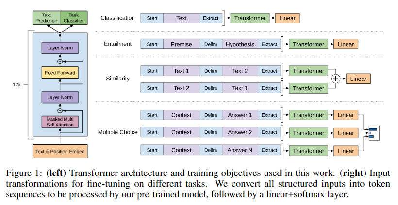

### 1.4 GPT 训练

#### 1.4.1 无监督预训练

- 思路：给定一个未标注序列 U={u1,u2,...,un} ， 利用 语言模型进行训练，目标函数为：

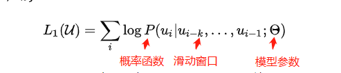

- GPT 模型框架: 利用 12个 transformers 的 block 作为 decoder，每个 transformers 的 block 是一个多头的自注意力机制，然后通过全连接得到输出的概率分布。


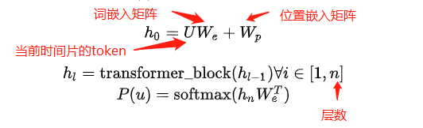

#### 1.4.2 有监督微调

在 第一阶段预训练之后，我们只是得到了 一个预训练模型，当遇到具体有监督任务时，需要利用标注数据集 C 输入到 训练好的预训练模型中，得到最终的特征向量 h，然后通过 全连接层得到 预测结果 y：

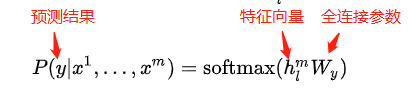

目标函数为：

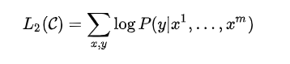

论文 并没有直接使用 L2 ，而向其中加入了 L1 ,目标函数为：

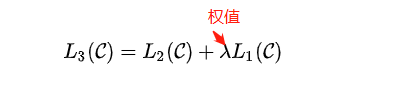

### 1.5 优点

GPT-1的模型要比基于LSTM的模型稳定，且随着训练次数的增加，GPT-1的性能也逐渐提升，表明GPT-1有非常强的泛化能力，能够用到和有监督任务无关的其它NLP任务中。GPT-1证明了transformer对学习词向量的强大能力，在GPT-1得到的词向量基础上进行下游任务的学习，能够让下游任务取得更好的泛化能力。对于下游任务的训练，GPT-1往往只需要简单的微调便能取得非常好的效果。

### 1.6 缺点

GPT-1在未经微调的任务上虽然也有一定效果，但是其泛化能力远远低于经过微调的有监督任务，说明了GPT-1只是一个简单的领域专家，而非通用的语言学家。

### 1.7 主要贡献

- 验证了Transformer在Unsupervised Pretraining中的有效性。
- 验证了更大的模型效果更好： 6 --> 12 层。
- 为下游任务引入了通用的求解框架，不再为任务做模型定制。

## 二、Generative Pre-trained Transformer 2（GPT-2）

### 2.1 动机

GPT-1 能力不够问题

### 2.2 GPT-2 核心思想

1. GPT-2 利用 更大的语料进行预训练；
2. GPT-2把GPT中12层的Transformer提升到48层，增大其网络参数；

GPT-2的核心思想概括为：任何有监督任务都是语言模型的一个子集，当模型的容量非常大且数据量足够丰富时，仅仅靠训练语言模型的学习便可以完成其他有监督学习的任务。

## 三、MASS

### 3.1 动机

1. Bert 只适用于 NLU 类型任务，无法直接用于 生成式任务（eg：翻译、摘要等）；

### 3.2 MASS 核心思想

#### 3.2.1 预训练阶段

MASS 的 结构还是 encoder2decoder 结构，如下图：

1. encoder 模块：随机 mask 掉 输入句子中的连续 k 个词；
2. decoder 模块：将 被 encoder mask 的 k-1 个词 放在 decoder 模块中的对应位置；
3. MASS 目标：利用 encoder 信息和 decoder 信息，预测 被 mask 的 连续 k 个词；

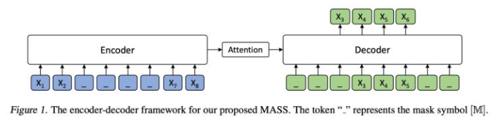

目标函数

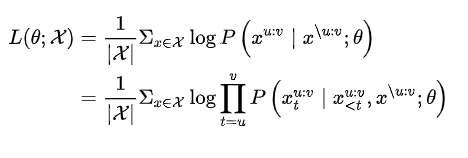

#### 3.2.2 微调阶段

### 3.3 优点

1. MASS 在 机器翻译上 取得了 新的SOTA;
2. mask掉连续的token，可以得到更好的语言建模能力;
3. 只让decoder从encoder侧获取信息，得到的模型效果更好;

## 四、UniLM 1.0

### 4.1 动机

1. ELMO 通过双向都做AR 模型，然后进行拼接，但从结果来看，效果并不是太好；
2. GPT 的 等效性结构 使其无法同时利用上下文；
3. Bert 的 双向性结构 限制了 其在 NLG 问题上的应用；
4. Bert 由于训练中采用了 [MASK] 标记，导致预训练与微调阶段不一致的问题

### 4.2 方向性语言模型

1. 单向训练语言模型，mask词的语境就是其单侧的words，左边或者右边;
2. 双向训练语言模型，mask词的语境就是左右两侧的words;
3. Seq-to-Seq语言模型，左边的seq我们称source sequence，右边的seq我们称为target sequence，我们要预测的就是target sequence，所以其语境就是所有的source sequence和其左侧已经预测出来的target sequence.

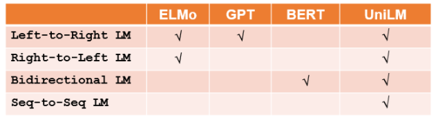

### 4.3 UniLM 1.0 核心思路

#### 4.3.1 预训练阶段

1. 混合训练方式。对于同一个batch，采用以下不同方式进行训练：
   1. 1/3时间采用双向(bidirectional)语言模型的目标；
   2. 1/3的时间采用seq-to-seq语言模型目标；
   3. 最后1/3平均分配给两种单向学习的语言模型，也就是left-to-right和right-to-left方式各占1/6时间
2. masking 方式。和 Bert 一样，对其中 15% ，采用以下方式进行处理：
   1. 80%的情况下直接用[MASK]替代；
   2. 10%的情况下随机选择一个词替代；
   3. 最后10%的情况用真实值。还有就是80%的情况是每次只mask一个词，另外20%的情况是mask掉bigram或者trigram；
3. Attention 控制：不同的训练方式，其关注的语境是不一样的，上面也有介绍，如上图所示，灰色的方格就是不能看到的信息，白色的就是需要attention的信息。如何实现这种控制呢?不让当前预测词看掉的信息就采用掩码隐藏掉，只留下能让当前词可看的信息，换句话说，论文使用了掩码来控制在计算基于上下文的表征时 token 应该关注的上下文的量。

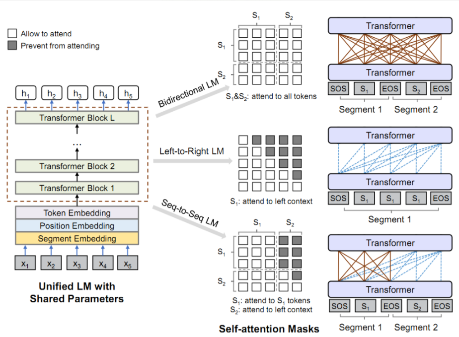
> 模型架构

#### 4.3.2 微调阶段

对于NLU类型的任务UNILM和BERT相同。对于NLG类型的任务，UNILM随机mask decoder中的一些词，然后再预测它们。

### 4.4 UniLM 1.0 优点

1. 预训练阶段 同时训练 双向(bidirectional)语言模型、seq-to-seq语言模型、两种单向学习的语言模型；
2. 预训练阶段 使用 mask 方法 解决 self-attention 中约束问题；
3. 在 NLU 和 NLG 任务上都取得不错效果；
4. 在GLUE上首次不加外部数据打赢了BERT

## 五、Bart

### 5.1 动机

1. BERT：用掩码替换随机 token，双向编码文档。由于缺失 token 被单独预测，因此 BERT 较难用于生成任务;


2. GPT：使用自回归方式预测 token，这意味着 GPT 可用于生成任务。但是，该模型仅基于左侧上下文预测单词，无法学习双向交互


### 5.2 Bart 思路

BART：编码器输入与解码器输出无需对齐，即允许任意噪声变换。使用掩码符号替换文本段，从而破坏文本。使用双向模型编码被破坏的文本（左），然后使用自回归解码器计算原始文档的似然（右）。至于微调，未被破坏的文档是编码器和解码器的输入，研究者使用来自解码器最终隐藏状态的表征。


### 5.3 BART 预训练 

BART 是**通过破坏文档再优化重建损失**（即解码器输出和原始文档之间的交叉熵）训练得到的。

与目前仅适合特定噪声机制的去噪自编码器不同，BART 可应用于任意类型的文档破坏。极端情况下，当源文本信息全部缺失时，BART 也等同于语言模型。

- 破坏原始文本的噪声方法：
  - Token Masking（token 掩码）：按照 BERT 模型，BART 采样随机 token，并用 [MASK]标记 替换它们；
  - Sentence Permutation（句子排列变换）：按句号将文档分割成多个句子，然后以随机顺序打乱这些句子；
  - Document Rotation（文档旋转）：随机均匀地选择 token，旋转文档使文档从该 token 开始。该任务的目的是训练模型识别文档开头；
  - Token Deletion（token 删除）：从输入中随机删除 token。与 token 掩码不同，模型必须确定缺失输入的位置；
  - Text Infilling（文本填充）：采样多个文本段，文本段长度取决于泊松分布 (λ = 3)。用单个掩码 token 替换每个文本段。长度为 0 的文本段对应掩码 token 的插入；

### 5.4 BART 微调 

#### 5.4.1 Sequence Classification Task 序列分类任务

对于序列分类任务，将相同的输入，输入到encoder和decoder中，最后将decoder的最后一个隐藏节点作为输出，输入到分类层（全连接层）中，获取最终的分类的结果。


> 注：其中，decoder的最后一个隐藏节点是一个特殊标记，相当于BERT模型中的[CLS]。

#### 5.4.2 Token Classification Task 序列分类任务

对于 token 分类任务，将完整文档输入到编码器和解码器中，使用解码器最上方的隐藏状态作为每个单词的表征。该表征的用途是分类 token。

#### 5.4.3 Sequence Generation Task 序列生成任务

由于 BART 具备自回归解码器，因此它可以针对序列生成任务进行直接微调，如抽象问答和摘要。在这两项任务中，信息复制自输入但是经过了处理，这与去噪预训练目标紧密相关。这里，编码器的输入是输入序列，解码器以自回归的方式生成输出。

#### 5.4.4 Machine Translation 机器翻译

将BART的encoder端的embedding层替换成randomly initialized encoder，新的encoder也可以用不同的vocabulary。通过新加的Encoder，我们可以将新的语言映射到BART能解码到English(假设BART是在English的语料上进行的预训练)的空间。具体的finetune过程分两阶段:

1. 第一步只更新randomly initialized encoder + BART positional embedding + BART的encoder第一层的self-attention 输入映射矩阵。
2. 第二步更新全部参数，但是只训练很少的几轮。


## 六、T5

### 6.1 动机

Money is All you Need!!!

### 6.2 T5 的基本思想

将每个 NLP 问题都视为“text-to-text”问题，即将文本作为输入并生成新的文本作为输出，这允许将相同的模型、目标、训练步骤和解码过程，直接应用于每个任务。

### 6.3 T5 预训练任务

#### 6.3.1 T5 预训练任务介绍

T5 的 预训练任务可以分为：无监督训练 和 有监督训练 两个；

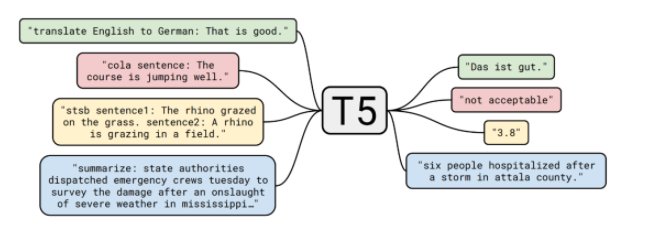

#### 6.3.2 T5 预训练任务——无监督训练

- 预训练语料： 800G 的语料（论文称之为 C4）；
- 训练目标：与 Bert 类似，只是改成 seq2seq（）可视为 升级版完形填空任务

```s
  输入：明月几时有，[M0] 问青天，不知 [M1]，今夕是何年。我欲[M2]归去，唯恐琼楼玉宇，高处 [M3]；起舞 [M4] 清影，何似在人间。 

  输出：[M0] 把酒 [M1] 天上宫阙 [M2] 乘风 [M3] 不胜寒 [M4] 弄
```

#### 6.3.3 T5 预训练任务——有监督训练

- 预训练数据：各种 NLP 标注数据；
- 训练方式：转化为 seq2seq 任务进行训练：

> 文本分类任务
```s
  输入：识别该句子的情感倾向：这趟北京之旅我感觉很不错。
  输出：正面
```

> 主题分类
```s
  输入：下面是一则什么新闻？八个月了，终于又能在赛场上看到女排姑娘们了。
  输出：体育
```

> 阅读理解
```s
  输入：阅读理解：特朗普与拜登共同竞选下一任美国总统。根据上述信息回答问题：特朗普是哪国人？
  输出：美国
```

### 6.4 T5 微调任务

- 也是Multi-task，将所有GLUE/SuperGLUE的数据拼在一起变成精调一个task，减少过拟合，但同时也会牺牲一些精度
- batch size减小到8
- 其实最后同时进行了多任务精调和单独精调，根据dev集选择最好的结果


## 参考

1. [Radford, A., Narasimhan, K., Salimans, T. and Sutskever, I., 2018. Improving language understanding by generative pre-training](https://s3-us-west-2.amazonaws.com/openai-assets/research-covers/language-unsupervised/language_understanding_paper.pdf)
2. [词向量之GPT-1，GPT-2和GPT-3](https://zhuanlan.zhihu.com/p/350017443)
3. [《MASS: Masked Sequence to Sequence Pre-training for Language Generation》](https://arxiv.org/abs/1905.02450)
4. [BERT生成式之MASS解读](https://zhuanlan.zhihu.com/p/67687640)
5. [UniLM(Unified Language Model Pre-training for Natural Language Understanding and Generation)](https://arxiv.org/abs/1905.03197) 【[github](https://github.com/microsoft/unilm)】
6. [paper阅读：UniLM(Unified Language Model Pre-training for Natural Language Understanding and Generation)](https://www.cnblogs.com/gczr/p/12113434.html)
7. [BERT时代与后时代的NLP](https://zhuanlan.zhihu.com/p/66676144)
8. [Lewis, Mike, et al. "Bart: Denoising sequence-to-sequence pre-training for natural language generation, translation, and comprehension." arXiv preprint arXiv:1910.13461 (2019)](https://arxiv.org/abs/1910.13461)
9. [Exploring the Limits of Transfer Learning with a Unified Text-to-Text Transformer](https://arxiv.org/abs/1910.10683) 【[github 源码](https://github.com/google-research/text-to-text-transfer-transformer)】
