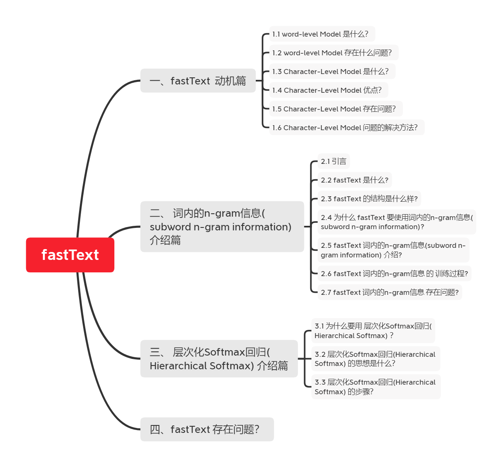

# 【关于 fastText】 那些你不知道的事

> 作者：杨夕
> 
> 项目地址：https://github.com/km1994/NLP-Interview-Notes
> 
> 个人论文读书笔记：https://github.com/km1994/nlp_paper_study
> 
> 【注：手机阅读可能图片打不开！！！】

## 一、fastText  动机篇

### 1.1 word-level Model 是什么？

- 介绍：基于word单词作为基本单位的，这种方式虽然能够很好的对词库中每一个词进行向量表示

### 1.2 word-level Model 存在什么问题？
 
- OOV 问题
  - 问题描述：容易出现单词不存在于词汇库中的情况；
  - 解决方法：最佳语料规模，使系统能够获得更多的词汇量；
- 误拼障碍
  - 问题描述：如果遇到了不正式的拼写, 系统很难进行处理；
  - 解决方法：矫正或加规则约束；
- 做翻译问题时, 音译姓名比较难做到

### 1.3 Character-Level Model 是什么？

- 介绍：基于 Character 作为基本单位的，这种方式虽然能够很好的对字库中每一个 Char 进行向量表示

### 1.4 Character-Level Model 优点？

- 能够解决 Word-level 所存在的 OOV 问题；
- 拼写类似的单词 具有类似的 embedding；

### 1.5 Character-Level Model 存在问题？

- Character-level 的输入句子变长；
- 数据变得稀疏；
- 对于远距离的依赖难以学到；
- 训练速度降低；

### 1.6 Character-Level Model 问题的解决方法？

- Lee 等 提出了利用多层 conv 和 pooling 和 highway layer 的方式来解决该问题，其结构如下所示：
  - 输入的字符首先需要经过 Character embedding 层，并被转化为 character embeddings 表示；
  - 采用 不同窗口大小的卷积核对输入字符的 character embeddings 表示进行卷积操作，论文中采用的窗口的大小分别为 3、4、5 ，也就是说学习 Character-level 的 3-gram、4-gram、5-gram;
  - 对不同卷积层的卷积结果进行 max-pooling 操作，即捕获其最显著特征生成 segment embedding;
  - segment embedding 经过 Highway Network (有些类似于Residual network，方便深层网络中信息的流通，不过加入了一些控制信息流量的gate）；
  - 输出结果 再经过 单层 BiGRU，得到最终 的 encoder output;
  - 之后，decoder再利用Attention机制以及character level GRU进行decode
- 通过这种方式不仅能够解决 Word-level 所存在的 OOV 问题，而且能够捕获 句子的 3-gram、4-gram、5-gram 信息，这个也是 后期 FastText 的想法雏形；

## 二、 词内的n-gram信息(subword n-gram information) 介绍篇

### 2.1 引言

在前面，我们已经介绍和比较了 word-level 和 character-level 的优缺点，并根据其特点，提出一种介于 word-level Model 和 Character-level 之间的 Model —— Subword Model。
   
那么，我们可不可以采取类似于上面的subword的思路来产生更好的word embedding呢？

FAIR的FastText就是利用subword将word2vec扩充，有效的构建embedding。

### 2.2 fastText 是什么?

将每个 word 表示成 bag of character n-gram 以及单词本身的集合，例如对于where这个单词和n=3的情况，它可以表示为 <wh,whe,her,ere,re>, ，其中"<",">"为代表单词开始与结束的特殊标记。
  
假设对于word $w$ ，其n-gram集合用 $G_w$ 表示，每个 n-gram 的矢量表示为,则每个单词可以表示成其所有n-gram的矢量和的形式，而center word $w$ 与context word $c$ 的分数就可表示成

之后就可以按照经典的word2vec算法训练得到这些特征向量。

这种方式既保持了word2vec计算速度快的优点，又解决了遇到training data中没见过的oov word的表示问题，可谓一举两得。

### 2.3 fastText 的结构是什么样?

- 每个单词通过嵌入层可以得到词向量;
- 然后将所有词向量平均可以得到文本的向量表达;
- 在输入分类器，使用softmax计算各个类别的概率；

### 2.4 为什么 fastText 要使用词内的n-gram信息(subword n-gram information)?

- 之前方法：
  - 以词汇表中的独立单词作为基本单元来进行训练学习的
  - 存在问题：
    - 低频词、罕见词：由于在语料中本身出现的次数就少，得不到足够的训练，效果不佳
    - 未登录词：如果出现了一些在词典中都没有出现过的词，或者带有某些拼写错误的词，传统模型更加无能为力

### 2.5 fastText 词内的n-gram信息(subword n-gram information) 介绍?

- s1. 将一个单词打散到字符级别；
- s2. 利用字符级别的n-gram信息来捕捉字符间的顺序关系
  - 目的：以此丰富单词内部更细微的语义
- 举例：
  - 对于一个单词“google”，为了表达单词前后边界，我们加入<>两个字符，即变形为“<google>”；
  - 抽取所有的tri-gram信息：G = { <go, goo, oog,ogl, gle, le>}；
  - 通过这种方式：原始的一个单词google，就被一个字符级别的n-gram集合所表达；

### 2.6 fastText 词内的n-gram信息 的 训练过程?

- s1:每个n-gram都会对应训练一个向量；
- s2:原来完整单词的词向量就由它对应的所有n-gram的向量求和得到；
- s3:所有的单词向量以及字符级别的n-gram向量会同时相加求平均作为训练模型的输入；

### 2.7 fastText 词内的n-gram信息 存在问题?

- 由于需要估计的参数多，模型可能会比较膨胀
- 压缩模型的建议：
  - 采用hash-trick：由于n-gram原始的空间太大，可以用某种hash函数将其映射到固定大小的buckets中去，从而实现内存可控；
  - 采用quantize命令：对生成的模型进行参数量化和压缩；
  - 减小最终向量的维度。

## 三、 层次化Softmax回归(Hierarchical Softmax) 介绍篇

### 3.1 为什么要用 层次化Softmax回归(Hierarchical Softmax) ？

- 传统 softmax 
  - 介绍：
    - 以隐藏层的输出h为输入，经过线性和指数变换后，再进行全局的归一化处理，找到概率最大的输出项；
  - 问题：
    - 当词汇数量V较大时（一般会到几十万量级），Softmax计算代价很大，是O(V)量级。

### 3.2 层次化Softmax回归(Hierarchical Softmax) 的思想是什么？

- 将一个全局多分类的问题，转化成为了若干个二元分类问题，从而将计算复杂度从O(V)降到O(logV)；
- 每个二元分类问题，由一个基本的逻辑回归单元来实现

### 3.3 层次化Softmax回归(Hierarchical Softmax) 的步骤？

- 步骤：
  - 从根结点开始，每个中间结点（标记成灰色）都是一个逻辑回归单元，根据它的输出来选择下一步是向左走还是向右走；
  - 上图示例中实际上走了一条“左-左-右”的路线，从而找到单词w₂。而最终输出单词w₂的概率，等于中间若干逻辑回归单元输出概率的连乘积；
  

## 四、fastText 存在问题？

- 如何构造每个逻辑回归单元的输入
  - 特殊函数 x
    - 如果下一步需要向左走其函数值定义为1，向右则取-1。在训练时，我们知道最终输出叶子结点，并且从根结点到叶子结点的每一步的路径也是确定的。
  - 每个内部结点（逻辑回归单元）对应的一个向量 v'
    - 以在训练过程中学习和更新
  - h 是网络中隐藏层的输出
  - 如何建立这棵用于判断的树形结构?
  - 霍夫曼树的构造
    - 处理机制：将字符信息编码成为0/1二进制串
    - 结构介绍：给出现频繁的字符较短的编码，出现较少的字符以较长的编码，是最经济的方案
    - 构造步骤：

## 参考资料

1. [神经网路语言模型(NNLM)的理解](https://blog.csdn.net/lilong117194/article/details/82018008)
2. [NLP 面试题（一）和答案，附有参考URL](https://www.jianshu.com/p/fbb6d5e75059)