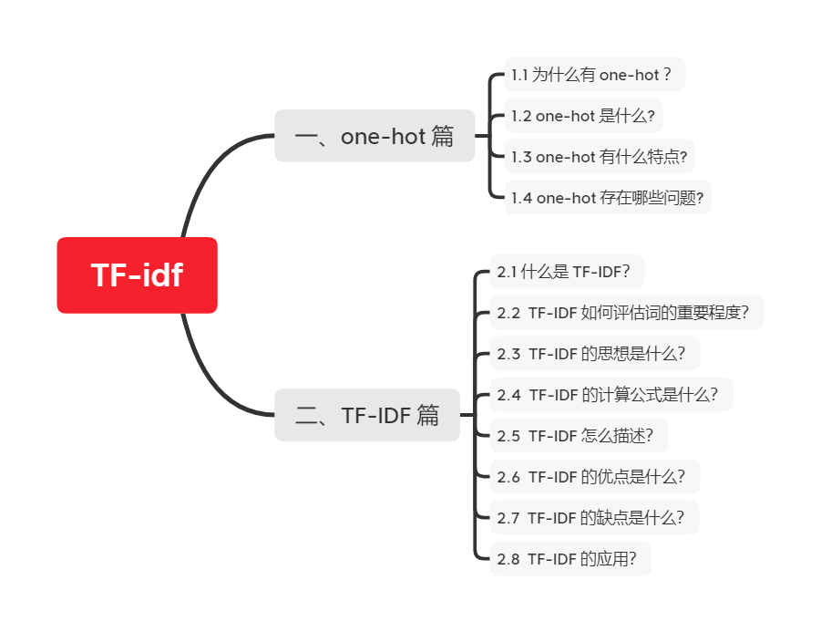

# 【关于 TF-idf】 那些你不知道的事

> 作者：杨夕
> 
> 项目地址：https://github.com/km1994/NLP-Interview-Notes
> 
> 个人论文读书笔记：https://github.com/km1994/nlp_paper_study
> 
> 【注：手机阅读可能图片打不开！！！】

## 一、one-hot 篇

### 1.1 为什么有 one-hot ？

由于计算机无法识别 文本语言，所以需要将文本数字化，one-hot 方法最早的一种将 文本数字化的方法。

### 1.2 one-hot 是什么?

用一个很长的向量来表示一个词，向量长度为词典的大小N，每个向量只有一个维度为1，其余维度全部为0，为1的位置表示该词语在词典的位置。

### 1.3 one-hot 有什么特点?

- 维度长：向量的维度为 **词典大小**；
- 一一其零：每个向量**只有一个维度为1**，其余维度全部为0，**为1的位置表示该词语在词典的位置**；
 
### 1.4 one-hot 存在哪些问题?

- 维度灾难：容易受维数灾难的困扰，每个词语的维度就是语料库字典的长度；
- 离散、稀疏问题：因为 one-Hot 中，句子向量，如果词出现则为1，没出现则为0，但是由于维度远大于句子长度，所以句子中的1远小于0的个数；
- 维度鸿沟问题：词语的编码往往是随机的，导致不能很好地刻画词与词之间的相似性。

## 二、TF-IDF 篇

### 2.1 什么是 TF-IDF？

TF-IDF 是一种统计方法，用以评估句子中的某一个词（字）对于整个文档的重要程度。

### 2.2  TF-IDF 如何评估词的重要程度？

- 对于 句子中的某一个词（字）随着其在整个句子中的出现次数的增加，其重要性也随着增加；（正比关系）【体现词在句子中频繁性】
- 对于 句子中的某一个词（字）随着其在整个文档中的出现频率的增加，其重要性也随着减少；（反比关系）【体现词在文档中的唯一性】

### 2.3  TF-IDF 的思想是什么？

如果某个单词在一篇文章中出现的频率TF高，并且在其他文章中很少出现，则认为此词或者短语具有很好的类别区分能力，适合用来分类；

### 2.4  TF-IDF 的计算公式是什么？

- 词频 （Term Frequency，TF）
  - 介绍：体现 词 在 句子 中出现的频率；
  - 问题：
    - 当一个句子长度的增加，句子中 每一个 出现的次数 也会随之增加，导致该值容易偏向长句子；
    - 解决方法：
      - 需要做归一化（词频除以句子总字数）
  - 公式

- 逆文本频率(Inverse Document Frequency，IDF)
  - 介绍：体现 词 在文档 中出现的频率
  - 方式：某一特定词语的IDF，可以由总句子数目除以包含该词语的句子的数目，再将得到的商取对数得到；
  - 作用：如果包含词条t的文档越少, IDF越大，则说明词条具有很好的类别区分能力
  - 公式：

### 2.5  TF-IDF 怎么描述？

某一特定句子内的高词语频率，以及该词语在整个文档集合中的低文档频率，可以产生出高权重的TF-IDF。因此，TF-IDF倾向于过滤掉常见的词语，保留重要的词语。

### 2.6  TF-IDF 的优点是什么？

- 容易理解；
- 容易实现；

### 2.7  TF-IDF 的缺点是什么？

其简单结构并没有考虑词语的语义信息，无法处理一词多义与一义多词的情况。

### 2.8  TF-IDF 的应用？

- 搜索引擎；
- 关键词提取；
- 文本相似性；
- 文本摘要

## 参考资料

1. [神经网路语言模型(NNLM)的理解](https://blog.csdn.net/lilong117194/article/details/82018008)
2. [NLP 面试题（一）和答案，附有参考URL](https://www.jianshu.com/p/fbb6d5e75059)