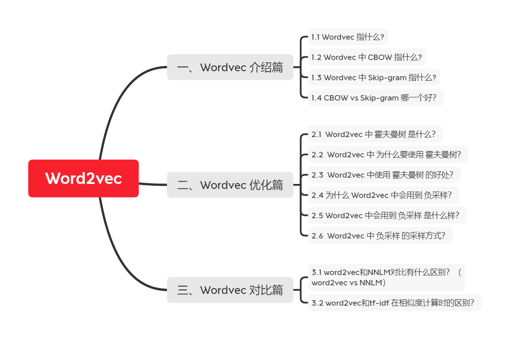
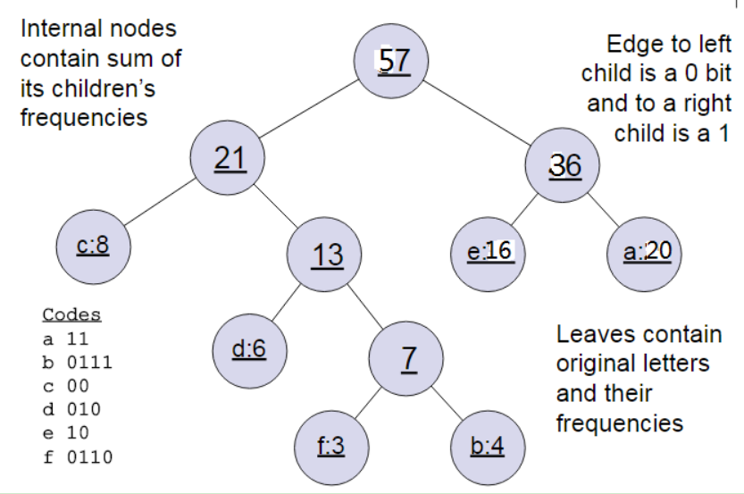
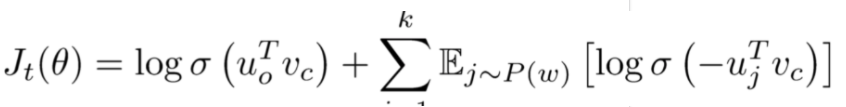

# 【关于 Word2vec】 那些你不知道的事

> 作者：杨夕
> 
> 项目地址：https://github.com/km1994/NLP-Interview-Notes
> 
> 个人论文读书笔记：https://github.com/km1994/nlp_paper_study
> 
> 【注：手机阅读可能图片打不开！！！】

## 一、Wordvec 介绍篇

### 1.1 Wordvec 指什么?

- 介绍：word2vec是一个把词语转化为对应向量的形式。word2vec中建模并不是最终的目的，其目的是获取建模的参数，这个过程称为fake task。
- 双剑客
  - CBOW vs Skip-gram

### 1.2 Wordvec 中 CBOW 指什么?
 
- CBOW
  - 思想：用周围词预测中心词
  - 输入输出介绍：输入是某一个特征词的上下文相关的词对应的词向量，而输出就是这特定的一个词的词向量
  - 

### 1.3 Wordvec 中 Skip-gram 指什么?

- Skip-gram
  - 思想：用中心词预测周围词
  - 输入输出介绍：输入是特定的一个词的词向量，而输出是特定词对应的上下文词向量
  - 

### 1.4 CBOW vs Skip-gram 哪一个好？

- CBOW 可以理解为 一个老师教多个学生；（高等教育）
- Skip-gram 可以理解为 一个学生被多个老师教；（补习班）
- 那问题来了？
  - 最后 哪个学生 成绩 会更好？

## 二、Wordvec 优化篇

### 2.1  Word2vec 中 霍夫曼树 是什么？

HS用哈夫曼树，把预测one-hot编码改成预测一组01编码，进行层次分类。
- 输入输出：
  - 输入：权值为(w1,w2,...wn)的n个节点
  - 输出：对应的霍夫曼树
- 步骤：
  1. 将(w1,w2,...wn)看做是有n棵树的森林，每个树仅有一个节点。
  2. 在森林中选择根节点权值最小的两棵树进行合并，得到一个新的树，这两颗树分布作为新树的左右子树。新树的根节点权重为左右子树的根节点权重之和。
  3. 将之前的根节点权值最小的两棵树从森林删除，并把新树加入森林。
  4. 重复步骤2）和3）直到森林里只有一棵树为止。
- 举例说明：
　　　　
下面我们用一个具体的例子来说明霍夫曼树建立的过程，我们有(a,b,c,d,e,f)共6个节点，节点的权值分布是(20,4,8,6,16,3)。

首先是最小的b和f合并，得到的新树根节点权重是7.此时森林里5棵树，根节点权重分别是20,8,6,16,7。此时根节点权重最小的6,7合并，得到新子树，依次类推，最终得到下面的霍夫曼树。

### 2.2  Word2vec 中 为什么要使用 霍夫曼树？

一般得到霍夫曼树后我们会对叶子节点进行霍夫曼编码，由于权重高的叶子节点越靠近根节点，而权重低的叶子节点会远离根节点，这样我们的高权重节点编码值较短，而低权重值编码值较长。这保证的树的带权路径最短，也符合我们的信息论，即我们希望越常用的词拥有更短的编码。如何编码呢？一般对于一个霍夫曼树的节点（根节点除外），可以约定左子树编码为0，右子树编码为1.如上图，则可以得到c的编码是00。

在word2vec中，约定编码方式和上面的例子相反，即约定左子树编码为1，右子树编码为0，同时约定左子树的权重不小于右子树的权重。

### 2.3  Word2vec 中使用 霍夫曼树 的好处？

1. 由于是二叉树，之前计算量为V,现在变成了log2V；
2. 由于使用霍夫曼树是高频的词靠近树根，这样高频词需要更少的时间会被找到，这符合我们的贪心优化思想。

### 2.4 为什么 Word2vec 中会用到 负采样？

- 动机：使用霍夫曼树来代替传统的神经网络，可以提高模型训练的效率。但是如果我们的训练样本里的中心词w是一个很生僻的词，那么就得在霍夫曼树中辛苦的向下走很久了；
- 介绍：一种概率采样的方式，可以根据词频进行随机抽样，倾向于选择词频较大的负样本；
- 优点：
  - 用来提高训练速度并且改善所得到词向量的质量的一种方法；
  - 不同于原本每个训练样本更新所有的权重，负采样每次让一个训练样本仅仅更新一小部分的权重，这样就会降低梯度下降过程中的计算量。

### 2.5 Word2vec 中会用到 负采样 是什么样？

因为使用softmax时，分母需要将中心词与语料库总所有词做点乘，代价太大：

所以负采样方法将softmax函数换成sigmoid函数。

选取K个负样本，即窗口之外的样本，计算中心词与负样本的点乘，最小化该结果。计算中心词与窗口内单词的点乘，最大化该结果，目标函数为：

### 2.6  Word2vec 中 负采样 的采样方式？

NS是一种概率采样的方式，可以根据词频进行随机抽样，我们倾向于选择词频比较大的负样本，比如“的”，这种词语其实是对我们的目标单词没有很大贡献的。

Word2vec则在词频基础上取了0.75次幂，减小词频之间差异过大所带来的影响，使得词频比较小的负样本也有机会被采到。

极大化正样本出现的概率，同时极小化负样本出现的概率，以sigmoid来代替softmax，相当于进行二分类，判断这个样本到底是不是正样本。

## 三、Wordvec 对比篇

### 3.1 word2vec和NNLM对比有什么区别？（word2vec vs NNLM）
- NNLM：是神经网络语言模型，使用前 n - 1 个单词预测第 n 个单词;
- word2vec ：使用第 n - 1 个单词预测第 n 个单词的神经网络模型。但是 word2vec 更专注于它的中间产物词向量，所以在计算上做了大量的优化。优化如下：
1. 对输入的词向量直接按列求和，再按列求平均。这样的话，输入的多个词向量就变成了一个词向量。
2. 采用分层的 softmax(hierarchical softmax)，实质上是一棵哈夫曼树。
3. 采用负采样，从所有的单词中采样出指定数量的单词，而不需要使用全部的单词

### 3.2 word2vec和tf-idf 在相似度计算时的区别？

1. word2vec 是稠密的向量，而 tf-idf 则是稀疏的向量；
2. word2vec 的向量维度一般远比 tf-idf 的向量维度小得多，故而在计算时更快；
3. word2vec 的向量可以表达语义信息，但是 tf-idf 的向量不可以；
4. word2vec 可以通过计算余弦相似度来得出两个向量的相似度，但是 tf-idf 不可以；

## 四、word2vec 实战篇

### 4.1 word2vec训练trick，window设置多大？

- window设置：
  - 比较大，会提取更多的topic信息
  - 设置比较小的话会更加关注于词本身。
- 默认参数是5，但是在有些任务中window为2效果最好，比如某些英语语料的短文本任务（并非越大越好）

### 4.1 word2vec训练trick，词向量纬度，大与小有什么影响，还有其他参数？

词向量维度代表了词语的特征，特征越多能够更准确的将词与词区分，就好像一个人特征越多越容易与他人区分开来。但是在实际应用中维度太多训练出来的模型会越大，虽然维度越多能够更好区分，但是词与词之间的关系也就会被淡化，这与我们训练词向量的目的是相反的，我们训练词向量是希望能够通过统计来找出词与词之间的联系，维度太高了会淡化词之间的关系，但是维度太低了又不能将词区分，所以词向量的维度选择依赖于你的实际应用场景，这样才能继续后面的工作。一般说来200-400维是比较常见的。

## 参考资料

1. [word2vec原理(一) CBOW与Skip-Gram模型基础](https://www.cnblogs.com/pinard/p/7160330.html)
2. [word2vec原理(二) 基于Hierarchical Softmax的模型](https://www.cnblogs.com/pinard/p/7243513.html)
3. [word2vec原理(三) 基于Negative Sampling的模型](https://www.cnblogs.com/pinard/p/7249903.html)
4. [神经网路语言模型(NNLM)的理解](https://blog.csdn.net/lilong117194/article/details/82018008)
5. [NLP 面试题（一）和答案，附有参考URL](https://www.jianshu.com/p/fbb6d5e75059)