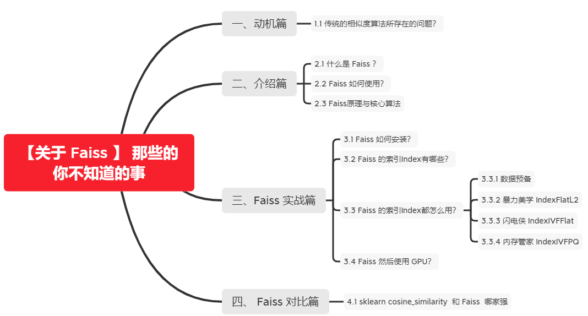

# 【关于 Faiss 】 那些你不知道的事

> 作者：杨夕
> 
> 本文链接：https://github.com/km1994/nlp_paper_study
> 
> 论文名称：Billion-scale similarity search with GPUs
> 
> 论文链接：https://arxiv.org/abs/1702.08734
> 
> 官方源码地址：https://github.com/facebookresearch/Faiss
> 
> 个人介绍：大佬们好，我叫杨夕，该项目主要是本人在研读顶会论文和复现经典论文过程中，所见、所思、所想、所闻，可能存在一些理解错误，希望大佬们多多指正。
> 
> 【注：手机阅读可能图片打不开！！！】



## 一、动机篇

### 1.1 传统的相似度算法所存在的问题？

1. 传统的相似度算法（欧几里得距离、曼哈顿距离、明可夫斯基距离、余弦相似度等[1]）在计算向量相似度时，效率低下；
2. 传统的相似度算法（欧几里得距离、曼哈顿距离、明可夫斯基距离、余弦相似度等[1]）在计算向量相似度时，不支持 GPU 计算；

## 二、介绍篇

### 2.1 什么是 Faiss ？

1. Faiss是针对稠密向量进行相似性搜索和聚类的一个高效类库。
2. 它包含可搜索任意大小的向量集的算法，这些向量集的大小甚至都不适合RAM。
3. 它还包含用于评估和参数调整的支持代码。
4. Faiss用C ++编写，并且有python2与python3的封装代码。
5. 一些最有用的算法在GPU上有实现。
6. Faiss是由Facebook AI Research开发的。

### 2.2 Faiss 如何使用？

Faiss 的使用方式可以分为三个步骤：

1. 构建训练数据以矩阵的形式表示，比如我们现在经常使用的embedding，embedding出来的向量就是矩阵的一行。
2. 为数据集选择合适的index，index是整个Faiss的核心部分，将第一步得到的训练数据add到index当中。
3. search，或者说query，搜索到最终结果。

### 2.3 Faiss原理与核心算法

- Faiss的主要功能是对向量进行相似搜索。
- 具体介绍：就是给定一个向量，在所有已知的向量库中找出与其相似度最高的一些向量；
- 本质：是一个KNN(K近邻)问题，比如google的以图找图功能。根据上面的描述不难看出，Faiss本质是一个向量(矢量)数据库，这个数据库在进行向量查询的时候有其独到之处，因此速度比较快，同时占用的空间也比较小。

## 三、Faiss 实战篇

### 3.1 Faiss 如何安装？

```s
  # 更新conda
    conda update conda
    # 先安装mkl
    conda install mkl
    # faiss提供gpu和cpu版，根据服务选择
    # cpu版本
    conda install faiss-cpu -c pytorch
    # gpu版本 -- 记得根据自己安装的cuda版本安装对应的faiss版本，不然会出异常。使用命令：nvcc -V 查看
    conda install faiss-gpu cudatoolkit=8.0 -c pytorch # For CUDA8
    conda install faiss-gpu cudatoolkit=9.0 -c pytorch # For CUDA9
    conda install faiss-gpu cudatoolkit=10.0 -c pytorch # For CUDA10
    # 校验是否安装成功
    python -c "import faiss"
```

> 【注：这里小编尝试过多次 window 安装，最后都失败，最后Google了一下，发现Faiss不支持 window 系统！】

### 3.2 Faiss 的索引Index有哪些？ 

- Faiss中最重要的是索引 Index
  - 为什么要创建索引？
    - Faiss 创建索引对向量预处理，提高查询效率
  - Faiss中的稠密向量各种索引都是基于 Index实现的，主要的索引方法包括： IndexFlatL2、IndexFlatIP、IndexHNSWFlat、IndexIVFFlat、IndexLSH、IndexScalarQuantizer、IndexPQ、IndexIVFScalarQuantizer、IndexIVFPQ、IndexIVFPQR等。每个方法的具体介绍见：


### 3.3 Faiss 的索引Index都怎么用？

#### 3.3.1 数据预备

- 创建训练数据和测试数据
- 代码：

```s
    import numpy as np
    d = 64                           # dimension
    nb = 100000                      # database size
    nq = 10000                       # nb of queries
    np.random.seed(1234)             # make reproducible
    xb = np.random.random((nb, d)).astype('float32')
    xb[:, 0] += np.arange(nb) / 1000.
    xq = np.random.random((nq, d)).astype('float32')
    xq[:, 0] += np.arange(nq) / 1000.
```

- 解析：
  - 训练集 xb：[100000,64]
  - 查询数据集 xq：[10000,64]

#### 3.3.2 暴力美学 IndexFlatL2

- 介绍：暴力检索 L2 距离的索引；
- 方式：全量搜索
- 流程：

1. 创建索引

```s
    import faiss                   # make faiss available
    index = faiss.IndexFlatL2(d)   # build the index
    print(index.is_trained)
```

> 注：创建索引时必须指定向量的维度d。大部分索引需要训练的步骤。IndexFlatL2 跳过这一步。

当索引创建好并训练(如果需要)之后，我们就可以执行 add 方法，add方法一般添加训练时的样本；

2. 添加 训练集

```s
    index.add(xb)                  # add vectors to the index
    print(index.ntotal)
```

3. 寻找相似相似向量

包含向量的索引后，就可以传入搜索向量查找相似向量，search就是寻找相似相似向量了。

```s
    k = 4                          # we want to see 4 nearest neighbors
    D, I = index.search(xq, k)     # actual search
    print(I[:5])                   # neighbors of the 5 first queries
    print(D[-5:])                  # neighbors of the 5 last queries
    >>>
    [[  0 393 363  78]
    [  1 555 277 364]
    [  2 304 101  13]
    [  3 173  18 182]
    [  4 288 370 531]]

    [[ 0.          7.17517328  7.2076292   7.25116253]
    [ 0.          6.32356453  6.6845808   6.79994535]
    [ 0.          5.79640865  6.39173603  7.28151226]
    [ 0.          7.27790546  7.52798653  7.66284657]
    [ 0.          6.76380348  7.29512024  7.36881447]]
```

> 注： <br/>
> D：numpy array对象，表示与相似向量的距离(distance)，维度<br/>
> I：numpy array对象，表示相似用户的ID<br/>

- 存在问题：虽然查询速度高于 传统相似度计算方法，但是速度还是太慢

#### 3.3.3 闪电侠 IndexIVFFlat

- 引言：暴力美学 IndexFlatL2 查询速度太慢了
- 介绍：IndexIVFFlat 是一种 加速索引方法，其所用的方法 为倒排法；
- 方式：
- 先聚类再搜索，可以加快检索速度，先将xb中的数据进行聚类（聚类的数目是超参）
  - nlist: 聚类的数目；
  - nprobe: 在多少个聚类中进行搜索，默认为1, nprobe越大，结果越精确，但是速度越慢
- 流程：
  - 使用K-means建立聚类中心；
  - 然后通过查询最近的聚类中心；
  - 最后比较聚类中的所有向量得到相似的向量
- 代码：

1. 定义索引 和 聚类簇数

```s
    nlist = 100                       #聚类中心的个数
    k = 4
    quantizer = faiss.IndexFlatL2(d)  # the other index
    index = faiss.IndexIVFFlat(quantizer, d, nlist, faiss.METRIC_L2)
       # here we specify METRIC_L2, by default it performs inner-product search
```
> 注：创建IndexIVFFlat时需要指定一个其他的索引作为量化器(quantizer)来计算距离或相似度。<br/>
> 参数介绍：<br/>
> faiss.METRIC_L2: faiss定义了两种衡量相似度的方法(metrics)，分别为faiss.METRIC_L2、faiss.METRIC_INNER_PRODUCT。一个是欧式距离，一个是向量内积。<br/>
> nlist：聚类中心的个数

2. 添加 训练集

```s
    index.train(xb)
    assert index.is_trained

    index.add(xb)                  # add may be a bit slower as well
```
> 注：与 IndexFlatL2 对比，在 add 方法之前需要先训练

3. 寻找相似相似向量

包含向量的索引后，就可以传入搜索向量查找相似向量，search就是寻找相似相似向量了。

```s
    D, I = index.search(xq, k)     # actual search
    print(I[-5:])                  # neighbors of the 5 last queries
    index.nprobe = 10              # default nprobe is 1, try a few more
    D, I = index.search(xq, k)
    print(I[-5:])                  # neighbors of the 5 last queries
```

> 参数介绍：<br/>
> k：查找最相似的k个向量<br/>
> index.nprobe：查找聚类中心的个数，默认为1个。<br/>

#### 3.3.4 内存管家 IndexIVFPQ

- 动机：索引IndexFlatL2和IndexIVFFlat都会全量存储所有的向量在内存中，如果数据量是海量级别的时候，怎么办呢？
- 介绍：IndexIVFPQ 基于Product Quantizer(乘积量化)的压缩算法编码向量大小到指定的字节数的索引算法，存储的向量时压缩过的，查询的距离也是近似的。关于乘积量化的算法可自行搜索。
- 方式：基于乘积量化（product quantizers）对存储向量进行压缩，节省存储空间
  - m：乘积量化中，将原来的向量维度平均分成多少份，d必须为m的整数倍
  - bits: 每个子向量用多少个bits表示
- 代码：

1. 定义索引 和 聚类簇数

```s
    nlist = 100
    m = 8                             # number of bytes per vector
    k = 4
    quantizer = faiss.IndexFlatL2(d)  # this remains the same
    index = faiss.IndexIVFPQ(quantizer, d, nlist, m, 8)
                                        # 8 specifies that each sub-vector is encoded a
```
> 注：之前我们定义的维度为d = 64，向量的数据类型为float32。这里压缩成了8个字节。所以压缩比率为 (64*32/8) / 8 = 32

2. 添加 训练集

```s
    index.train(xb)
    index.add(xb)
```
> 注：与 IndexFlatL2 对比，在 add 方法之前需要先训练

3. 寻找相似相似向量

包含向量的索引后，就可以传入搜索向量查找相似向量，search就是寻找相似相似向量了。

```s
    D, I = index.search(xb[:5], k) # sanity check
    print(I)
    print(D)
    index.nprobe = 10              # make comparable with experiment above
    D, I = index.search(xq, k)     # search
    print(I[-5:])
    >>>
    [[   0  608  220  228]
    [   1 1063  277  617]
    [   2   46  114  304]
    [   3  791  527  316]
    [   4  159  288  393]]

    [[ 1.40704751  6.19361687  6.34912491  6.35771513]
    [ 1.49901485  5.66632462  5.94188499  6.29570007]
    [ 1.63260388  6.04126883  6.18447495  6.26815748]
    [ 1.5356375   6.33165455  6.64519501  6.86594009]
    [ 1.46203303  6.5022912   6.62621975  6.63154221]]
```

### 3.4 Faiss 然后使用 GPU？

> 注：并不是所有的索引都支持 GPU，所以在使用之前建议 查阅一下 [Basic indexes](https://github.com/facebookresearch/faiss/wiki/Faiss-indexes)

- 可通过faiss.get_num_gpus()查询有多少个gpu

```s
    ngpus = faiss.get_num_gpus()
    print("number of GPUs:", ngpus)
```

- 单 GPU 

```s
    res = faiss.StandardGpuResources()  # use a single GPU, 这个命令需要安装Faiss GPU 版本
    # build a flat (CPU) index
    index_flat = faiss.IndexFlatL2(d)
    # make it into a gpu index
    gpu_index_flat = faiss.index_cpu_to_gpu(res, 0, index_flat)
    gpu_index_flat.add(xb)         # add vectors to the index
    print(gpu_index_flat.ntotal)

    k = 4                          # we want to see 4 nearest neighbors
    D, I = gpu_index_flat.search(xq, k)  # actual search
    print(I[:5])                   # neighbors of the 5 first queries
    print(I[-5:])                  # neighbors of the 5 last queries
```

- 多 GPU 

```s
    ngpus = faiss.get_num_gpus()
    print("number of GPUs:", ngpus)
    cpu_index = faiss.IndexFlatL2(d)
    gpu_index = faiss.index_cpu_to_all_gpus(cpu_index)   # build the index
    gpu_index.add(xb)              # add vectors to the index
    print(gpu_index.ntotal)
    k = 4                          # we want to see 4 nearest neighbors
    D, I = gpu_index.search(xq, k) # actual search
    print(I[:5])                   # neighbors of the 5 first queries
    print(I[-5:])                  # neighbors of the 5 last queries
```

## 四、 Faiss 对比篇

### 4.1 sklearn cosine_similarity  和 Faiss  哪家强


- 方法一：使用 sklearn 中的 cosine_similarity

```s
    # encoding utf8
    import pandas as pd
    import csv
    import numpy as np
    import sys
    from sklearn.metrics.pairwise import cosine_similarity
    # sys.path.append('../')
    # 自定义 包
    from tools.loader import loadDict,saveDict,dictCutBatchSave,dictLoadMerge
    from tools.bert_tools import Bert_Class
    bertModel = Bert_Class()
    from tools.common_tools import timer

    commonPath = "data/"
    inf =  commonPath+"resource/"
    dataType = ""
    fileName = f"medQA.valid.txt"
    QueAnsFileName = f"QueAns{dataType}"
    query = "睡前练瑜伽好吗睡觉之前练习40分钟的瑜伽好吗、能起到瘦身的作用吗？"
    topN = 20

    # 使用 sklearn cosine_similarity 方法 计算相似度
    def use_sklearn_get_sim_query(query,training_vectors,topN):
        # step 1：测试文本 转 bert sent
        test_vecs = bertModel.get_vec_to_sent(query).astype('float32')
        # step 2：计算 相似度
        print("------------sklearn-------------")
        ag=cosine_similarity(test_vecs,training_vectors)
        # step 3：排序
        fe=np.sort(ag,axis=1)
        fe_index = np.argsort(ag,axis=1) 
        score_list = fe[0].tolist()
        index_list = fe_index[0].tolist()
        score_list.reverse()
        index_list.reverse()
        # step 4：取 Top N
        return index_list[:topN],score_list[:topN]

    training_vectors = np.load(f"{inf}training_vectors.npy")
    id2QusAns = loadDict(inf,QueAnsFileName)
    index_list,score_list = use_sklearn_get_sim_query(query,training_vectors,topN)

    for index,score in zip(index_list,score_list):
        print(f"index:{index} => query:{id2QusAns[index]}:{score}\n")
```

- 方法二：Faiss 

```s
    # encoding utf8
    import pandas as pd
    import csv
    import numpy as np
    import sys
    import faiss
    from faiss import normalize_L2
    # sys.path.append('../')
    # 自定义 包
    from tools.loader import loadDict,saveDict,dictCutBatchSave,dictLoadMerge
    from tools.bert_tools import Bert_Class
    bertModel = Bert_Class()
    from tools.common_tools import timer

    commonPath = "data/"
    inf =  commonPath+"resource/"
    dataType = ""
    fileName = f"medQA.valid.txt"
    QueAnsFileName = f"QueAns{dataType}"
    query = "睡前练瑜伽好吗睡觉之前练习40分钟的瑜伽好吗、能起到瘦身的作用吗？"
    topN = 20

    # 使用 sklearn cosine_similarity 方法 计算相似度
    def use_faiss_get_sim_query(query,training_vectors,topN,d=768):
        # step 1：测试文本 转 bert sent
        test_vecs = bertModel.get_vec_to_sent(query).astype('float32')
        # step 2：计算 相似度
        print("------------faiss-------------")
        print('normalize_L2')
        normalize_L2(training_vectors)
        normalize_L2(test_vecs)
        print('IndexFlatIP')
        index=faiss.IndexFlatIP(d)        # the other index，需要以其他index作为基础
        index.train(training_vectors) 
        print(f"training_vectors.shape:{training_vectors.shape}")
        print(index)
        print('train')
        print(index.is_trained)
        print('add')
        print(index)
        index.add(training_vectors)
        print('search')
        print(f"test_vecs.shape:{test_vecs.shape}")
        D, I =index.search(test_vecs, topN)
        print(f"I:{I}")                   # 表示最相近的前5个的index
        print(f"D:{D}")                     # 表示最相近的前5个的相似度的值
        # step 3：排序
        score_list = D.tolist()[0]
        index_list = I.tolist()[0]
        # step 4：取 Top N
        return index_list,score_list

    training_vectors = np.load(f"{inf}training_vectors.npy")
    id2QusAns = loadDict(inf,QueAnsFileName)
    index_list,score_list = use_faiss_get_sim_query(query,training_vectors,topN)

    for index,score in zip(index_list,score_list):
        print(f"index:{index} => query:{id2QusAns[index]}:{score}\n")

```

- 分析：
  - 从预测结果角度看，两者结果雷同；
  - 从计算速度角度看：当 数据集 特别大时，Faiss 秒杀 sklearn cosine_similarity 


## 参考资料

1. [常用的相似度计算方法原理及实现](https://blog.csdn.net/yixianfeng41/article/details/61917158)
2. [Faiss从入门到实战精通](https://blog.csdn.net/bitcarmanlee/article/details/106447629)
2. [Faiss 教程](https://zhuanlan.zhihu.com/p/320653340)
3. [Faiss 用法](https://zhuanlan.zhihu.com/p/40236865)
4. [Basic indexes](https://github.com/facebookresearch/faiss/wiki/Faiss-indexes)
