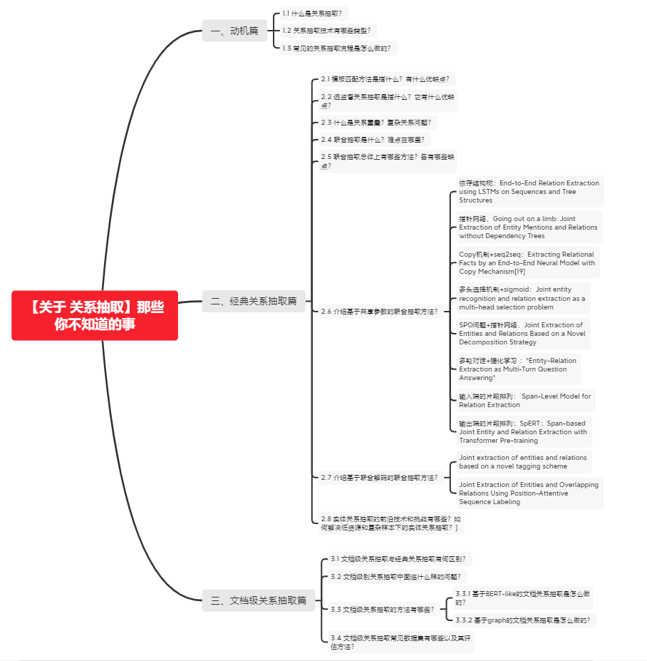

# 【关于 关系抽取】那些你不知道的事

## 一、动机篇

### 1.1 什么是关系抽取？

我们所说的关系抽取一般是指从文本数据中抽取特征抽取结构信息的一种手段。具体而言，我们需要从自由文本中判断其中的两个entity是哪种关系，进而得到其结构化三元组信息，即（主体，关系，客体）。

> Relation extraction is a key task for knowledge graph construction and natural language processing, which aims to extract meaningful relational information between entities from plain texts.

关系抽取既是文本处理任务的基础，又是构建知识图谱的核心任务。抽取实例不仅能提升文本分析的层面，还可为诸如问答系统及语义搜索等下游任务提供知识。

### 1.2 关系抽取技术有哪些类型？

1. 基于模板的关系抽取（Pattern Extraction Models）

使用句法分析工具识别文本中的语法元素，然后根据这些元素自动构建规则。但是由于自动构建的模式通常有错误，大部分这类方法代价较高，需要由专门的人类专家的进一步审查。

2. 基于统计的关系抽取（Statistical Relation Extraction Models）

相较于上一种方法，基于统计的方法代价较小。其中，典型的方法有基于特征的方法，为实体对及其相应的上下文设计语法、句法和语义特征进行分类。

3. 基于神经网络的关系抽取（Neural Relation Extraction Models）

由于神经网络能够更高效抽象语义特征并具有较好的泛化能力，一般来说，不同的网络结构针对关系抽取这一任务的侧重点不同：

* 递归神经网络（Recursive）可以递归地学习句子的构成表示。
* 卷积神经网络（CNN）捕捉句子的局部特征
* 循环神经网络（Recurrent）更好处理长序列语句
* 图神经网络（Graph）构造实体/词汇图用于关系推理
* 基于注意力的神经网络（Attention-based）聚合全局的关系特征
* 基于CNN和RNN来编码最短依赖路径

### 1.3 常见的关系抽取流程是怎么做的？

根据是否在同一个模型里开展实体抽取和关系分类，可以将关系抽取方法分为流水线（pipeline）学习和联合（joint）学习两种。

- Pipeline方法：
  - 先对输入的句子进行实体抽取，将识别出的实体分别组合；
  - 然后再进行关系分类，这两个子过程是前后串联的，完全分离。

- 优点：
  - 易于实现，实体模型和关系模型使用独立的数据集，不需要同时标注实体和关系的数据集；
  - 两者相互独立，若关系抽取模型没训练好不会影响到实体抽取

- 缺点：
  - 关系和实体两者是紧密相连的，互相之间的联系没有捕捉到。具体表现为
    - 误差积累；
    - 实体冗余；
    - 交互缺失。

- 联合抽取方法：在一个模型中实现实体抽取和关系分类子过程。该方法通过使两个子过程共享网络底层参数以及设计特定的标记策略来解决上述问题，其中使用特定的标记策略可以看作是一种序列标注问题。

优点和缺点和Pipline方法相反。

## 二、经典关系抽取篇

### 2.1 模板匹配方法是指什么？有什么优缺点？

模板匹配是关系抽取中最常见的方法，使用一个模板库对输入文本两个给定实体进行上下文匹配，如果满足模板对应的关系，则作为尸体堆之间的关系，常见的模板匹配方法包括：人工模板与统计模板。人工模板通常用于一些表达方式有限的场景，而统计模板则可以从大量的数据中搜寻包含实体对的关系模板，然后筛选出一批可靠的模式。

基于模板匹配的关系分类构建简单，适用于小规模特定领域，但召回率低，可移植性差，当遇到另一个领域的关系分类需要重新构建模板。

### 2.2 远监督关系抽取是指什么？它有什么优缺点？

如果一个实体对满足某个给定的关系，那么同时包含该实体对的所有句子都可能在阐述该关系。因此可以搜寻所有包含该实体对的语料作为训练数据。

优点是可以丰富训练数据，增强泛化性能，缺点是这一假设过强，会引入大量的噪声数据。

### 2.3 什么是关系重叠？复杂关系问题？

正常关系抽取问题是一对一的，即一个实体只与另一个实体有关系，相互间的顺序也有保障。

- 关系重叠问题：一对多，比如“张学友演唱过《吻别》《在你身边》”中，存在2种关系：「张学友-歌手-吻别」和「张学友-歌手-在你身边」 ；一对实体存在多种关系，如“周杰伦作曲并演唱《七里香》”中，存在2种关系：「周杰伦-歌手-七里香」和「周杰伦-作曲-七里香」 

- 复杂关系问题：由实体重叠导致，如《叶圣陶散文选集》中，叶圣陶-作品-叶圣陶散文选集；关系交叉导致，如“张学友、周杰伦分别演唱过《吻别》《七里香》”，「张学友-歌手-吻别」和「周杰伦-歌手-七里香」 

### 2.4 联合抽取是什么？难点在哪里？

顾名思义，联合模型就是一个模型，将两个子模型统一建模。联合抽取可以进一步利用两个任务之间的潜在信息，以缓解错误传播的缺点。

联合抽取的难点是如何加强实体模型和关系模型之间的交互，比如实体模型和关系模型的输出之间存在着一定的约束，在建模的时候考虑到此类约束将有助于联合模型的性能。

### 2.5 联合抽取总体上有哪些方法？各有哪些缺点？

现有联合抽取模型总体上有两大类：

1. 共享参数的联合抽取模型

通过共享参数（共享输入特征或者内部隐层状态）实现联合，此种方法对子模型没有限制，但是由于使用独立的解码算法，导致实体模型和关系模型之间交互不强。

2. 联合解码的联合抽取模型

为了加强实体模型和关系模型的交互，复杂的联合解码算法被提出来，比如整数线性规划等。这种情况下需要对子模型特征的丰富性以及联合解码的精确性之间做权衡：

- 一方面如果设计精确的联合解码算法，往往需要对特征进行限制，例如用条件随机场建模，使用维特比解码算法可以得到全局最优解，但是往往需要限制特征的阶数。
- 另一方面如果使用近似解码算法，比如集束搜索，在特征方面可以抽取任意阶的特征，但是解码得到的结果是不精确的。

因此，需要一个算法可以在不影响子模型特征丰富性的条件下加强子模型之间的交互。

此外，很多方法再进行实体抽取时并没有直接用到关系的信息，然而这种信息是很重要的。需要一个方法可以同时考虑一个句子中所有实体、实体与关系、关系与关系之间的交互。

### 2.6 介绍基于共享参数的联合抽取方法？

在联合抽取中的实体和关系抽取的解码方式与实体抽取的解码方式基本一致，主要包括：序列标注CRF/SoftMax、指针网络、分类SoftMax、Seq2Seq等。基于共享参数的联合抽取，实体抽取loss会与关系抽取loss相加。 

#### 依存结构树：End-to-End Relation Extraction using LSTMs on Sequences and Tree Structures

- 联合抽取顺序：先抽取实体，再进行关系分类

  - 实体抽取：采用BILOU标注，SoftMax解码；
  - 关系抽取：针对实体抽取出的实体对，在当前句子对应的依存句法树中找到能够覆盖该实体对的最小依存句法树，并采用TreeLSTM生成该子树对应的向量表示，最后，根据子树根节点对应的TreeLSTM向量进行SoftMax关系分类。

- 存在问题：

  - 实体抽取未使用CRF解码，没有解决标签依赖问题。
  - 关系抽取仍然会造成实体冗余，会提升错误率、增加计算复杂度
  - 使用句法依存树，只针对句子级别并且只适用于易于依存解析的语言。
  - 不能解决完整的关系重叠问题，本质上是实体重叠问题没有解决。

#### 指针网络，Going out on a limb: Joint Extraction of Entity Mentions and Relations without Dependency Trees

网络结构图和标注框架

- 联合抽取顺序：识别实体的同时进行关系抽取，不再采取依存树。

  - 实体抽取：采用BILOU标注，SoftMax解码；解码时利用前一步的label embedding信息。
  - 关系抽取：采取指针网络解码，指针网络实际上有R层（R为关系总数）。对当前实体查询在其位置前的所有实体（向前查询），并计算注意力得分：

- 存在问题：

  - 只向前查询head实体，会存在对tail实体的遗漏；
  - 在关系指针网络的gold标签中，对于实体span中每一个token平均分配1/N概率，没有充分利用实体边界信息，这会导致注意力分散。

#### Copy机制+seq2seq：Extracting Relational Facts by an End-to-End Neural Model with Copy Mechanism[19]

- 联合抽取顺序：采用Seq2Seq框架，依次抽取关系、head实体、tail实体。

  - Encoder编码：

  - Decoder编码：

    -   为decoder部分t时刻的输入，,主要有两部分组成:

       -  为attention vector，  为前一步的copy entity 或者 relation embedding；

 - 关系预测：将  直接喂入SoftMax进行；

  - head实体预测（Copy the First Entity）：

    - 在当前解码步，从n个token中选择一个作为实体：
    - 为每一个token的编码，加入当前解码的输出；
    - 根据从n个token中选择最大概率的token作为实体；

  - tail实体预测（Copy the Second Entity）

    - 与head实体预测类似，只是需要mask上一步预测的head实体（token）

- 存在问题：

  - 只考虑token维度的实体，丢失了多个token构成的实体，这是一个明显bug；

#### 多头选择机制+sigmoid：Joint entity recognition and relation extraction as a multi-head selection problem

网络结构

本篇文献应用较为广泛，只是不再提供实体信息、需要对实体进行预测。

- 联合抽取顺序：先抽取实体，再利用实体边界信息进行关系抽取。

  - 实体抽取：采用BILOU标注，CRF解码；

  - 关系抽取：采用sigmoid进行多头选择，与文献[15]的做法类似。

    - 对于含n个token的句子，可能构成的关系组合共有  个，其中r为关系总数，即当前token会有多个头的关系组合：

- 该方法并没有分别构建head和tail实体编码，而是直接通过token的编码表示进入sigmoid layer直接构建「多头选择」。
  - 引入实体识别后的entity label embedding进行关系抽取，训练时采用gold label，推断时采用predict label。
  - 在三元组统一解码时，需要利用实体边界信息组建三元组，因为多头选择机制只能知道token和token之间的关系，但并不知道token隶属的实体类别。

- 存在问题：

  - entity label embedding在训练和推断时存在gap，文献[21]提出了Soft Label Embedding ，并引入了BERT。
  - 鲁棒泛化问题：原作者引入了对抗训练机制（如今看来，这种对抗训练机制比较简单了）

#### SPO问题+指针网络，Joint Extraction of Entities and Relations Based on a Novel Decomposition Strategy 

- 联合抽取顺序：是一个spo问题，先抽取实体（主体subject，简称s），再抽取关系（关系predicate及其对应的客体object，简称po）。

  - 如上图所示，主体抽取包含「Trump」和「Queens」，然后基于已抽取的主体再进行po抽取。例如对于「Trump」，其对应的关系包含「PO」-「United States」和「BI」-「Queens」；可以看出「Queens」既可以作为subject，也可以是object。

网络结构图

- 主体（s）抽取：采用指针网络进行解码。

- 关系和客体（po）抽取：同样采用指针网络进行解码，但事实上采用的是Q2中提到的多层label指针网络，即每一层是一个关系label对应的指针网络（用来抽取object）。

  - 在对当前的subject抽取对应的po时，采取多种方式加强了对当前subject的实体感知方式，如sentence pooling 、entity pooling、relative position embedding等；在对object的end pos 解码时也引入start pos的编码信息。

- 存在问题：

  - 在训练时，subject的选择是随机的，并没有将所有subject统一进行po抽取；没有充分利用信息，可能造成信息损失，因此需要延长epoch训练。

#### 多轮对话+强化学习 ：*Entity-Relation Extraction as Multi-Turn Question Answering*

多轮对话设计-实体关系抽取

- 联合抽取顺序：基于人工设计的QA模板，先提取实体，再抽取关系。

  - 文献指出通常的三元组形式存在问题，并不能充分反应文本背后的结构化信息[25]：如上图的结构化表格，TIME需要依赖Position，Position需要依赖Corp（公司）。进行传统的三元组抽取可能导致依赖关系的间断，因此这种多轮QA方式：

    - 能够很好地捕捉层级化的依赖关系。
    - 问题能够编码重要的先验关系信息，对实体/关系抽取有所帮助。
    - 问答框架是一种很自然的方法来同时提取实体和关系。

  - 将联合抽取转为一种对轮问答任务：对每种实体和每种关系都用问答模板进行刻画，从而这些实体和关系可以通过回答这些模板化的问题来进行抽取，采取BIES标注实体，MRC+CRF进行解码。

- 强化学习：

  - 基于共享参数的联合学习仍然不能完全避免在推断时的误差积累，采用强化学习机制进行优化。
  - 在多轮QA中，Action就是选择一个文本段，Policy就是选择该文本段的概率。对于Reward，使用正确抽取的三元组的数量作为奖励，使用REINFORCE算法寻找最优解。

- 存在问题：

  - 也许针对三元组形式不能体现文本结构化信息的任务是有一定必要性的，如关系依赖问题。但对于通常的三元组任务，引入question需要对原始文本进行多次编码才能抽取实体和关系，计算复杂度较高。

#### 输入端的片段排列： Span-Level Model for Relation Extraction

- 联合抽取顺序：输入端片段排列抽取实体，然后提取实体对进行关系分类；

  - 将片段排列方式生成的候选实体span，进行实体类型SoftMax分类；对于候选实体span不为None的实体span组成实体pair进行关系SoftMax分类；
  - 基于片段排列的方式，显示的提取所有可能的片段排列，由于选择的每一个片段都是独立的，因此可以直接提取span-level的特征去解决重叠实体问题。

- 存在问题：

  - 在模型输入端进行片段排列，对于含T个token的文本，理论上共有  种片段排列，计算复杂度极高。如果文本过长，会产生大量的负样本，在实际中需要限制span长度并合理削减负样本。
  - 进行关系判断时，也会造成实体冗余，提高错误率。

#### 输出端的片段排列：SpERT：Span-based Joint Entity and Relation Extraction with Transformer Pre-training 

SpERT

- 联合抽取顺序：在输出端进行片段排列进行实体分类，然后进行关系分类。

  - 改进在输入端进行片段排列的高复杂度问题，在BERT输出端进行片段排列后在进行span分类，过滤实体类型为None的片段然后进行关系分类。
  - 进行关系分类时，融合多种特征组合：包含实体span的pooling，实体span长度，实体pair之间token的pooling；

- 存在问题：

  - 虽然缓解了片段排列的高复杂度问题，但关系分类仍有实体冗余问题。

### 2.7 介绍基于联合解码的联合抽取方法？

####  Joint extraction of entities and relations based on a novel tagging scheme

- 总体标注框架：

  - 统一了实体和关系标注框架，直接以关系标签进行BIOES标注。head实体序号为1，tail实体序号为2；

- 存在问题：

  - 不能关系重叠问题，比如一个实体存在于多种关系中的情况。这是一个致命的bug。

####  Joint Extraction of Entities and Overlapping Relations Using Position-Attentive Sequence Labeling

- 总体标注框架：如上图所示，对于含n个token的句子，共有n个不同标注框架。也就是对于每一个位置的token都进行一次标注，无论实体还是关系都采用BIES标注。

  -  当p=5指向第5个token「Trump」时，其对应的实体为「PER」，此时p=5对应的标签实体有「United States」、「Queens」、「New York City 」，分别对应关系「*President of*」、「 *Born in*」、「*Born in*」.
  - 本质上将实体和关系融合为一体，共同采用BIES标注，用CRF解码。

- 实体关系提取时，对当前指向位置的实体采用position attention 机制进行识别对应的关系实体，该机制融合了 position-aware 和 context-aware 表示：其中  为当前指示的token位置编码，  为上下文编码，  为当前解码位置的编码。

- 存在问题：对一个句子进行了n次重复编码，复杂度高， 

####  Joint extraction of entities and relations based on a novel tagging scheme

- 总体标注框架：这个方法来自PaddlePaddle/Research，也是百度2020关系抽取的baseline方法，同样也是统一了实体和关系的SPO标注框架。

- 使用方法的是token level 的多label分类，即每一个token对应多个label。

  - 标注框架十分巧妙，如上图示例中形成的2个spo三元组，「王雪纯-配音-晴雯」和「王雪纯-配音-红楼梦」，存在两个关系「配音-人物」和「配音-作品」，多label标签就以关系标签建立：

  - 假设一共存在R个关系，那label一共为（2*R+2个），如果是subject中的第一个token，则标记为「B-S-关系名称」；如果是object中的第一个token，则标记为「B-O-关系名称」；其余的实体token标记为「I」，不隶属于实体的token标记为「O」；
    - 如对于subject王雪纯中，「王」隶属于两个「B-S-配音-作品」和「B-S-配音-人物」；其余的「雪」「纯」用「I」来标注；
    - 如对于object红楼梦中「红」隶属于「B-O-配音-作品」；其余的「楼」「梦」用「I」来标注；
    - 如对于object晴雯中「晴」隶属于「B-O-配音-人物」；其余的「雯」用「I」来标注；

- 存在问题：

  - 上述标注框架还是无法直接解决一些包含实体重叠的关系抽取？

    -  如：《叶圣陶散文选集》中，叶圣陶-作品-叶圣陶散文选集；

  - 上述标注框架也无法直接解决一个句子中的多重同类关系：

    - 如，‘张学友《吻别》周杰伦《菊花台》梁静茹《吻别》’等，需要加入后处理逻辑。

### 2.8 实体关系抽取的前沿技术和挑战有哪些？如何解决低资源和复杂样本下的实体关系抽取？

1. 对于pipeline方法中的NER来说：

虽然很多方法已经很普及，但更需要关注复杂场景下的实体重叠问题；此外，对于NER问题其实应用很广，在很多性能敏感的场景下，使用深度学习的方法似乎不能满足要求，这时就需要我们采取「词典+规则」的方法，例如：

- 对于医疗场景中的很多实体歧义性并不强，对上下文也不够敏感，这时构建出一个针对目标实体的词表更为有效。
- 对于通用领域中歧义性的实体，是否可以采用多种分词方式和句法分析等融合的方法去寻找实体边界呢？这都值得我们进一步尝试。

此外，应用解决NER的方法是否可以解决一些事件段落切割问题，方便我们将复杂任务进行拆解。

2. 对于pipeline方法中的关系分类来说：

首要问题是怎么降低计算复杂度，关系分类时不再对句子重复编码，而是one-pass。

在低资源场景下，采取远程监督的方法确实可以自动进行语料构建，但其中针对样本噪音的降噪方法是否还有提升空间？降噪方法能否做到与模型无关，是否可以借鉴图像分类中很有效的置信学习呢？

此外，预训练语言模型如此火爆，针对关系分类任务，能否在预训练阶段引入更有效的关系分类的目标呢？

3. 对于联合抽取任务来说：

难点是如何加强实体模型和关系模型之间的交互，怎么对需要对子模型特征的丰富性以及联合解码的精确性之间做权衡？

此外，很多方法再进行实体抽取时并没有直接用到关系的信息，然而这种信息是很重要的。需要一个方法可以同时考虑一个句子中所有实体、实体与关系、关系与关系之间的交互。

4. 对于低资源问题和复杂样本问题来说：

- 对于少次关系学习问题：他们提出了FewRel 2.0，在原版数据集FewRel的基础上增加了以下两大挑战：领域迁移（domain adaptation）和“以上都不是”检测（none-of-the-above detection）。
- 对于文档级别的关系抽取问题：提出了DocRED数据集，是一个大规模的人工标注的文档级关系抽取数据集，文档级关系抽取任务要求模型具有强大的模式识别、逻辑推理、指代推理和常识推理能力[40]。

## 三、文档级关系抽取篇

### 3.1 文档级关系抽取与经典关系抽取有何区别？

经典关系抽取往往着眼于单一的句子，只是试图挖掘出每个句子内部的实体关系。然而，在实际的场景中，大量的关系事实需要依赖跨句子甚至文档的语义信息才能获取，文档往往会提到许多体现复杂交叉逻辑关系的实体，而从复杂的多句场景中提取关系需要阅读，记忆，推理才能发现多个句子间的关系事实。

### 3.2 文档级别关系抽取中面临什么样的问题？

相比于单句内的关系抽取问题，在对复杂语境中多实体复杂逻辑关系进行跨句关联的时候，还需要考虑如何对其中的语法结构信息进行合理的保持。同时，针对文档理解中所要求的logical reasoning、coreference reasoning、common-sense reasoning，设计一个好的inference机制至关重要。

### 3.3 文档级关系抽取的方法有哪些？

#### 3.3.1 基于BERT-like的文档关系抽取是怎么做的？

由于利用BERT得到的实体representation，对于不同的entity pair是一样的，这显然是不对的因为不同语境下的同一实体可能表达的含义并不一样，所以以往的做法将BERT的最后一层的attention值引入进来，从而使得每个不同的entity pair的representation根据不同的语境下变得不同，从而进行关系分类。

#### 3.3.2 基于graph的文档关系抽取是怎么做的？

由于我们所要判断的实体对间关系需要根据文档中多次提及的相应实体在不同语境下的信息，所以采用文档 graph 来建模文档内实体语义信息，重点在于文档 graph 的构建、文档信息的保留、以及信息的传播。比较经典的模型有GCNN、EoG、LSR、GAIN等，其中EoG算是后续模型的开山之作，大多数基于graph的模型都是EoG模型的延伸与扩展，对于graph中的节点而已，为了建模文档中的多粒度信息，一般构建多种类型的节点，例如mention node, entity node, sentence node等，之后为了推理得到文档中目标实体对间关系类型，借助图神经网络或基于graph的游走的方式完成对整个文档的建模及实体信息更新，完成推理。

### 3.4 文档级关系抽取常见数据集有哪些以及其评估方法？

文档级关系抽取常见数据集有三个：CDR、GDA、DocRED，前两个是biochemistry datasets，DocRED是目前规模最大的人工标注的文档级关系抽取数据集。

文档级关系抽取任务定义为一个多标签的分类问题，具体而言，输入一篇文章及文章中包含的实体对，输出每个实体对的关系。具体的评估方法为F1或者AUC。另外，为了排除验证集/测试集与训练集中出现一模一样的实体关系对对最终评价指标造成的影响，还有另外两个指标Ign F1和Ign AUC，这两个指标就是排除了开发集/测试集与训练集中出现相同的实体关系对的影响后的指标。

