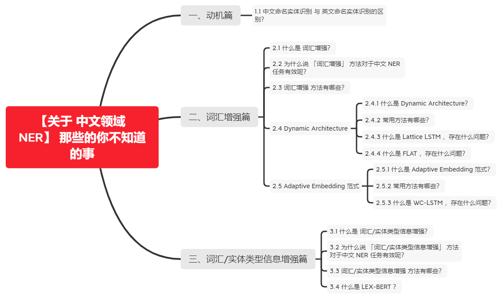

# 【关于 中文领域 NER】 那些的你不知道的事

> 作者：杨夕
> 
> 介绍：本项目是作者们根据个人面试和经验总结出的自然语言处理(NLP)面试准备的学习笔记与资料，该资料目前包含 自然语言处理各领域的 面试题积累。
> 
> NLP 百面百搭 地址：https://github.com/km1994/NLP-Interview-Notes
> 
> **[手机版NLP百面百搭](https://mp.weixin.qq.com/s?__biz=MzAxMTU5Njg4NQ==&mid=100005719&idx=3&sn=5d8e62993e5ecd4582703684c0d12e44&chksm=1bbff26d2cc87b7bf2504a8a4cafc60919d722b6e9acbcee81a626924d80f53a49301df9bd97&scene=18#wechat_redirect)**
> 
> 推荐系统 百面百搭 地址：https://github.com/km1994/RES-Interview-Notes
> 
> **[手机版推荐系统百面百搭](https://mp.weixin.qq.com/s/b_KBT6rUw09cLGRHV_EUtw)**
> 
> 搜索引擎 百面百搭 地址：https://github.com/km1994/search-engine-Interview-Notes 【编写ing】
> 
> NLP论文学习笔记：https://github.com/km1994/nlp_paper_study
> 
> 推荐系统论文学习笔记：https://github.com/km1994/RS_paper_study
> 
> GCN 论文学习笔记：https://github.com/km1994/GCN_study
> 
> **推广搜 军火库**：https://github.com/km1994/recommendation_advertisement_search
> 
> 
> 【注：手机阅读可能图片打不开！！！】

## 一、动机篇
 
### 1.1 中文命名实体识别 与 英文命名实体识别的区别？

和英文 NER 每个单词都使用空格分隔不同，中文 NER 是基于字的表示方法，所以一般会涉及到中文分词和中文NER技术，导致 中文 NER 技术容易受到中文分词的误差的影响。

那么常用的方法有哪些呢？

- 词汇增强：在早期的中文NER技术中，基于字符的 NER 方法往往具有高于 基于词汇（分词后）的方法，为了提高 基于词汇方法的效果，一般会采取引入词汇信息（词汇增强）的方法；
- 词汇/实体类型信息增强：使用特殊标记来识别句子中单词的边界，修改后的句子将由BERT直接编码

## 二、词汇增强篇

### 2.1 什么是 词汇增强？

- 词汇增强：引入词汇信息（词汇增强）来增强 模型 识别 句子中实体的方法

### 2.2 为什么说 「词汇增强」 方法对于中文 NER 任务有效呢？

虽然**基于字符的NER系统通常好于基于词汇（经过分词）的方法**，但**基于字符的NER没有利用词汇信息**，而**词汇边界对于实体边界通常起着至关重要的作用**。

**如何在基于字符的NER系统中引入词汇信息**，是近年来NER的一个研究重点。本文将这种引入词汇的方法称之为「词汇增强」，以表达引入词汇信息可以增强NER性能。

从另一个角度看，**由于NER标注数据资源的稀缺，BERT等预训练语言模型在一些NER任务上表现不佳。特别是在一些中文NER任务上，词汇增强的方法会好于或逼近BERT的性能**。因此，关注「词汇增强」方法在中文NER任务很有必要。

### 2.3 词汇增强 方法有哪些？

- Dynamic Architecture：设计一个动态框架，能够兼容词汇输入；
- Adaptive Embedding ：基于词汇信息，构建自适应Embedding；

### 2.4 Dynamic Architecture

#### 2.4.1 什么是 Dynamic Architecture？

Dynamic Architecture 就是 需要设计相应结构以融入词汇信息。

#### 2.4.2 常用方法有哪些？

- Lattice LSTM 
- ...
- FLAT

#### 2.4.3 什么是 Lattice LSTM ，存在什么问题？

1. 介绍

Lattice LSTM 通过词汇信息（词典）匹配一个句子时，可以获得一个类似Lattice的结构。

> 融合了词汇信息到原生的LSTM

Lattice是一个有向无环图，词汇的开始和结束字符决定了其位置。Lattice LSTM结构则融合了词汇信息到原生的LSTM中：

> Lattice LSTM 结构

如上图所示，Lattice LSTM引入了一个word cell结构，对于当前的字符，融合以该字符结束的所有word信息，如对于「桥」融合了「长江大桥」和「大桥」的信息。对于每一个字符，Lattice LSTM采取注意力机制去融合个数可变的word cell单元，其主要的数学形式化表达为：

2. 存在问题

Lattice LSTM 的提出，将词汇信息引入，有效提升了NER性能；但其也存在一些缺点：

- 计算性能低下，不能batch并行化。究其原因主要是每个字符之间的增加word cell（看作节点）数目不一致；
- 信息损失：
  - 1）每个字符只能获取以它为结尾的词汇信息，对于其之前的词汇信息也没有持续记忆。如对于「大」，并无法获得‘inside’的「长江大桥」信息。
  - 2）由于RNN特性，采取BiLSTM时其前向和后向的词汇信息不能共享。
- 可迁移性差：只适配于LSTM，不具备向其他网络迁移的特性。

#### 2.4.4 什么是 FLAT ，存在什么问题？

1. 动机

- 动机一：Lattice-LSTM 和 LR-CNN 问题
   1. 这些模型采取的RNN和CNN结构无法捕捉长距离依赖；
   2. 动态的Lattice结构也不能充分进行GPU并行；
- 动机二：CGN 和 LGN 问题
   1. 采取的图网络虽然可以捕捉对于NER任务至关重要的顺序结构，但这两者之间的gap是不可忽略的；
   2. 这类图网络通常需要RNN作为底层编码器来捕捉顺序性，通常需要复杂的模型结构

2. 思路

- Transformer：采取全连接的自注意力机制可以很好捕捉长距离依赖，由于自注意力机制对位置是无偏的，因此Transformer引入位置向量来保持位置信息。
- FLAT 亮点：对于每一个字符和词汇都构建两个head position encoding 和 tail position encoding。例如，字符[药]可以匹配词汇[人和药店]和[药店]。

因此，我们可以将Lattice结构展平，将其从一个有向无环图展平为一个平面的Flat-Lattice Transformer结构，由多个span构成：每个字符的head和tail是相同的，每个词汇的head和tail是skipped的。

### 2.5 Adaptive Embedding 范式

#### 2.5.1 什么是 Adaptive Embedding 范式？

Adaptive Embedding 范式 就是 在embedding层对于词汇信息进行自适应，后面通常接入LSTM+CRF和其他通用网络，这种范式与模型无关，具备可迁移性。 

#### 2.5.2 常用方法有哪些？

- WC-LSTM
- Multi-digraph
- ...
- Simple-Lexicon

#### 2.5.3 什么是 WC-LSTM ，存在什么问题？ 

1. 动机

**Lattice LSTM中每个字符只能获取以它为结尾的词汇数量是动态的、不固定**的，这也是导致Lattice LSTM**不能batch并行化**的原因。

2. 思路

WC-LSTM为改进这一问题，采取** Words Encoding Strategy**，**将每个字符为结尾的词汇信息进行固定编码表示**，即每一个字符引入的词汇表征是静态的、固定的，如果没有对应的词汇则用<PAD>代替，从而可以进行batch并行化。

这四种 encoding 策略分别为：最短词汇信息、最长词汇信息、average、self-attenion。以「average」为例：即将当前字符引入所有相关的词汇信息对应的词向量进行平均。

3. 存在问题

WC-LSTM仍然**存在信息损失问题**，无法获得‘inside’的词汇信息，不能充分利用词汇信息。虽然是Adaptive Embedding范式，但WC-LSTM仍然采取LSTM进行编码，建模能力有限、存在效率问题。

## 三、词汇/实体类型信息增强篇

### 3.1 什么是 词汇/实体类型信息增强？

- 词汇/实体类型信息增强：使用特殊标记来识别句子中单词的边界，修改后的句子将由BERT直接编码

### 3.2 为什么说 「词汇/实体类型信息增强」 方法对于中文 NER 任务有效呢？

词汇增强方法 在NER任务中的表现令人印象深刻，但最近已经证明，添加词汇信息可以显著提高下游性能。然而，**没有任何工作在不引入额外结构的情况下将单词信息纳入BERT**。

### 3.3 词汇/实体类型信息增强 方法有哪些？

- LEX-BERT

### 3.4 什么是 LEX-BERT ？

1. LEX-BERT V1

- 方法：Lex BERT的第一个版本通过在单词的左右两侧插入特殊标记来识别句子中单词的 span。特殊标记不仅可以标记单词的起始位置和结束位置，还可以为句子提供实体类型信息

- 作用：
  - 首先，如果我们的字典带有实体类型信息，我们可以通过标记将其插入到句子中。这里是医学相关动词的缩写，表示药物，表示检查索引，表示医学概念术语。
  - 其次，它们表示词汇集合中单词的开始或结束。这里开始标记的格式是[x]，结束标记的格式是[/x]，其中x可以是v、d、i等

2. LEX-BERT V2

- 方法：对于在句子中加宽的单词，我们没有在句子中单词的周围插入起始和结束标记，而是在句子的末尾附加一个标记[x]。请注意，我们将标记的位置嵌入与单词的起始标记绑定：

修改了BERT的注意矩阵，如图2所示。句子中的文字标记只会互相注意，而不会注意标记。相反，markertoken可以处理输入序列中的所有标记。

## 参考资料

1. [Lattice LSTM：Chinese NER Using Lattice LSTM（ACL2018）](https://arxiv.org/abs/1805.02023) 
2. [FLAT: Chinese NER Using Flat-Lattice Transformer（ACL2020）](https://arxiv.org/pdf/2004.11795.pdf)
3. [WC-LSTM: An Encoding Strategy Based Word-Character LSTM for Chinese NER Lattice LSTM（NAACL2019）](https://pdfs.semanticscholar.org/43d7/4cd04fb22bbe61d650861766528e369e08cc.pdf%3F_ga%3D2.158312058.1142019791.1590478401-1756505226.1584453795)
4. [Multi-digraph: A Neural Multi-digraph Model for Chinese NER with Gazetteers（ACL2019）](https://www.aclweb.org/anthology/P19-1141.pdf)
5. [Simple-Lexicon：Simplify the Usage of Lexicon in Chinese NER（ACL2020）](https://arxiv.org/pdf/1908.05969.pdf)
6. [Lex-BERT: Enhancing BERT based NER with lexicons](https://arxiv.org/pdf/2101.00396)