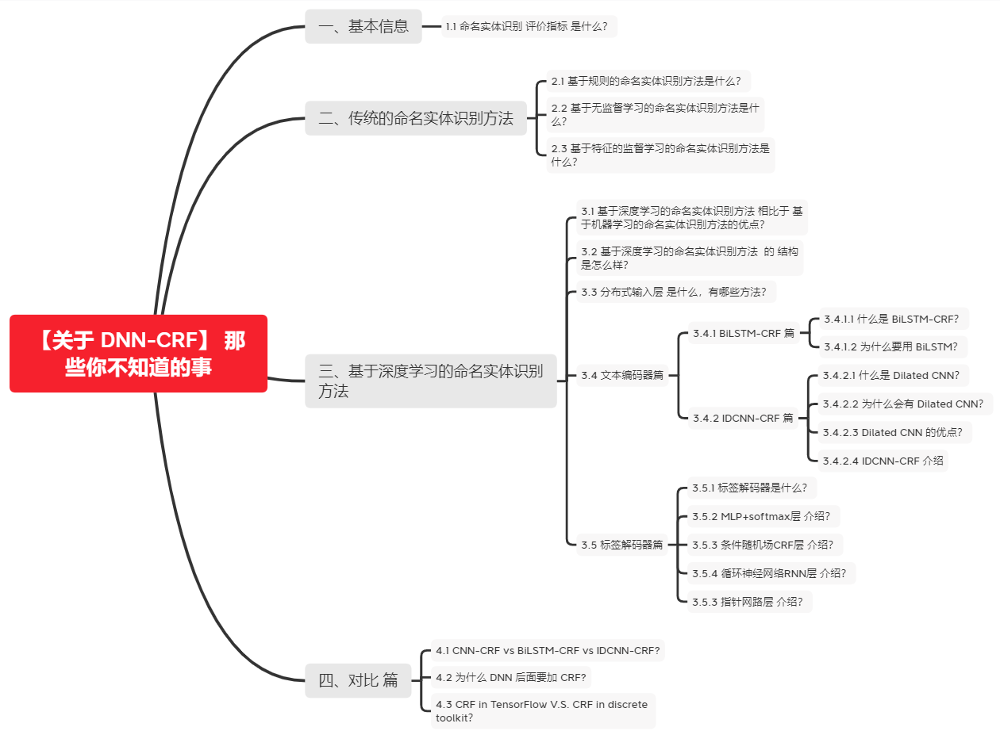
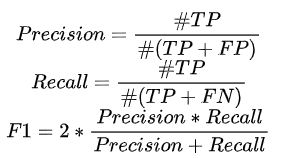
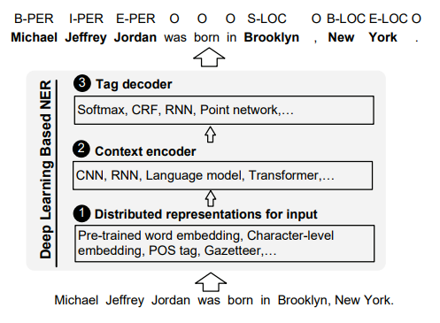
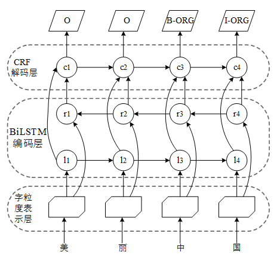
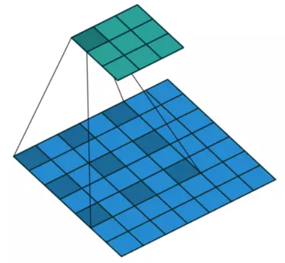
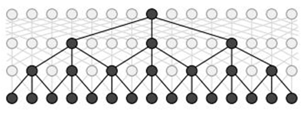
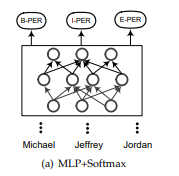
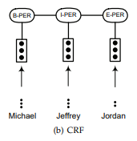
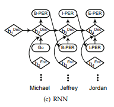
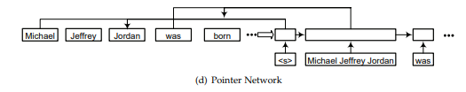

# 【关于 DNN-CRF】 那些你不知道的事

> 作者：杨夕
> 
> 论文链接：https://arxiv.org/pdf/1810.04805.pdf
> 
> 本文链接：https://github.com/km1994/nlp_paper_study
> 
> 个人介绍：大佬们好，我叫杨夕，该项目主要是本人在研读顶会论文和复现经典论文过程中，所见、所思、所想、所闻，可能存在一些理解错误，希望大佬们多多指正。
> 
> 【注：手机阅读可能图片打不开！！！】

## 一、基本信息

### 1.1 命名实体识别 评价指标 是什么？

- 命名实体识别 本质有两个任务组成：
  - 边界检测
  - 类型识别
- 精确匹配评估

> 注：其中 #TP 表示识别出的实体且是正确实体的数量， #FP 表示识别出的实体却是不存在实体的数量， #FN 表示是正确的实体却没被识别出的数量。当然，除此之外，像macro-f1、micro-f1也会用来作评估。

- 宽松匹配评估
  - 特点：降低了匹配正确的要求
  - 类别：
    - 类别正确：一个实体被正确识别到类别，而边界与正确边界有重叠即可；
    - 边界正确：一个实体被正确识别到边界，而不管类别是什么；

## 二、传统的命名实体识别方法

### 2.1 基于规则的命名实体识别方法是什么？

- 介绍：基于特定领域或者特定语法规则来设计规则，然后利用这些规则去抽取 句子中实体
- 缺点：依赖专家知识 构建 规则
- 特点：由于特定领域的规则和不完整的词典，这类系统往往具有较高的精度和较低的召回率，无法转移到其他领域

### 2.2 基于无监督学习的命名实体识别方法是什么？

- 主要思想：词汇、词语模式以及在大语料上计算的统计特性可以用来推断命名实体的出现

### 2.3 基于特征的监督学习的命名实体识别方法是什么？

- 介绍：NER被转化为一个多分类问题或者序列标注问题，通过精心设计的特征，在标注语料上进行训练，从而在未知文本上识别出类似的模式实体。

## 三、基于深度学习的命名实体识别方法

### 3.1 基于深度学习的命名实体识别方法 相比于 基于机器学习的命名实体识别方法的优点？

1. 受益于深度学习的非线性转换，可以从数据中学到更复杂的特征;
2. 避免大量的人工特征的构建;
3. 可以设计为端到端的结构。

### 3.2 基于深度学习的命名实体识别方法  的 结构是怎么样？

- 介绍：基于深度学习的命名实体识别方法 由 分布式输入层、文本编码器、解码层 组成；

### 3.3 分布式输入层 是什么，有哪些方法？

- 介绍：将 句子 转化为 词粒度、字符粒度、混合的表示方法作为模型输入；
- 类别：
  - 词粒度的表示：像word2vec、fasttext、glove或者SENNA等算法可以通过大规模的无监督语料学习词粒度的表示，作为NER模型的输入，在训练过程中既可以固定不变也可以微调。
  - 字符粒度的表示：除了仅考虑词向量作为输入之外，也融合了字符粒度的表示作为模型的输入。字符级别的表示，相对于词向量，能够提取出子词的特征，比如前缀后缀等，也能够缓解oov的问题。如下图所示，最常用的两种提取结构分别基于CNN与RNN模型。
  - 混合表示：除了词粒度和字符粒度的表示之外，还融合了一些额外信息，比如地点信息、词汇相似度、视觉信息等等。像FLAT、BERT、XLNET等模型也被本文划分为混合表示，因为输入的时候还包含有位置等信息。

### 3.4 文本编码器篇

#### 3.4.1 BiLSTM-CRF 篇

##### 3.4.1.1 什么是 BiLSTM-CRF？

- step 1：利用 字粒度表示层 将 句子中每个字 编码成一个字向量；
- step 2：然后利用 BiLSTM 编码层 对句子中每个字的字向量，以捕获 句子中每个字的信息；
- step 3：在 BiLSTM 后接一个 CRF 解码层，对 编码的向量进行解码，以解码出 句子最优的标注序列；

##### 3.4.1.2 为什么要用 BiLSTM？

由于 BiLSTM 能够捕获句子的长距离依赖信息。

#### 3.4.2 IDCNN-CRF 篇

##### 3.4.2.1 什么是 Dilated CNN？

Dilated/Atrous Convolution(中文叫做空洞卷积或者膨胀卷积) 或者是 Convolution with holes 从字面上就很好理解，是在标准的 convolution map 里注入空洞，以此来增加 reception field。相比原来的正常convolution，dilated convolution 多了一个 hyper-parameter 称之为 dilation rate 指的是kernel的间隔数量(e.g. 正常的 convolution 是 dilatation rate 1)。

##### 3.4.2.2 为什么会有 Dilated CNN？

- CNN 特点:方便的获取局部特征，通过pad操作，可以让CNN的输出层与输入层具有相同的序列长度，从而可以使用CNN来进行序列相关的特征抽取；
- CNN 问题：
  - 正常CNN 的 filler 作用于输入矩阵连续位置，利用 卷积 和 池化 整合多尺度的上下文信息，导致分辨率损失；
  - pooling 会损失信息，降低精度，不加则导致感受野变小，学不到全局信息；
  - 浅层的CNN只能获取局部特征，要获取全局特征或者更大的感受野，则需要比较深的CNN层，这会增加计算量也会提高过拟合的风险

##### 3.4.2.3 Dilated CNN 的优点？

- 优点：利用空洞卷积能够使输入宽度随模型深度呈指数增长，达到在不影响每层网络的分辨率的情况下，降低参数数量。
- 与传统CNN层相比，空洞卷积同样对序列上下文的滑动窗口进行操作;

##### 3.4.2.4 IDCNN-CRF 介绍

- 动机：然后 Dilated CNN 相比于 CNN 能够捕获更多信息，但是扩张的窗口捕获的信息只能学习距离为d的其他信息。
- 操作：通过堆叠不同扩张大小的空洞卷积层，有效扩展输入宽度的大小，使其在仅使用几个空洞卷积层的情况下，学习序列的整个长度信息。

> 注：利用四个结构相同的 Dilated CNN 拼接起来，每个 block 里面 dilated width 为 1，1，2 的三层 DCNN

### 3.5 标签解码器篇

#### 3.5.1 标签解码器是什么？

标签解码器是NER模型的最后一个阶段。它接受上下文相关的表示作为输入，并基于输入产生相关的序列标签。

#### 3.5.2 MLP+softmax层 介绍？

- 介绍：使用多层感知器+Softmax层作为标签解码器层，则将序列标注任务转化为一个多分类问题。每个单词的标签都是根据上下文相关的表示独立预测的，而不考虑它的邻居标签结果。

#### 3.5.3 条件随机场CRF层 介绍？

- 介绍：使一个以观测序列为全局条件的随机场。CRF已被广泛应用于基于特征的监督学习方法。许多基于深度学习的NER模型使用CRF层作为标签解码器，并取得了很好的精度。

#### 3.5.4 循环神经网络RNN层 介绍？

- 介绍：RNN解码是个贪婪的过程，先计算出第一个位置的标签，然后后面每一个位置的标签都是基于前面的状态计算出标签，在标签数量比较多的时候，可以比CRF更加快速。

#### 3.5.3 指针网路层 介绍？

- 介绍：将序列标注问题转化为两个子问题：先分块再分类。指针网络会贪婪地从头开始找下一个块结束的位置（开始的位置很显然，第一个块的开始位置是起始点，后面的开始位置都是前面一块的结束位置的后继位置）如上图d所示，在起始块"<\s>"后一块的结束块位置是"Jordan"，这样就得到块"Michael Jeffrey Jordan"，然后将这个块进行分类确定类别，之后再继续找下一个块的结束位置，找到"was"，这样就得到一个新的块"was"，再将这个块进行分类，然后这样循环下去直到序列结束。指针网络主要就起到确定块起始位置的作用。

## 四、对比 篇

### 4.1 CNN-CRF vs BiLSTM-CRF vs IDCNN-CRF?

- CNN-CRF：对于序列标注来讲，普通CNN有一个不足，就是卷积之后，末层神经元可能只是得到了原始输入数据中一小块的信息。而对NER来讲，整个输入句子中每个字都有可能对当前位置的标注产生影响，即所谓的长距离依赖问题。为了覆盖到全部的输入信息就需要加入更多的卷积层，导致层数越来越深，参数越来越多。而为了防止过拟合又要加入更多的Dropout之类的正则化，带来更多的超参数，整个模型变得庞大且难以训练。
- BiLSTM-CRF：因为CNN这样的劣势，对于大部分序列标注问题人们还是选择biLSTM之类的网络结构，尽可能利用网络的记忆力记住全句的信息来对当前字做标注。但这又带来另外一个问题，biLSTM本质是一个序列模型，在对GPU并行计算的利用上不如CNN那么强大。
- IDCNN-CRF:
  - 如何解决 CNN-CRF 问题：通过堆叠不同扩张大小的空洞卷积层，有效扩展输入宽度的大小，使其在仅使用几个空洞卷积层的情况下，学习序列的整个长度信息；
  - 如何解决 BiLSTM-CRF 问题：因为 IDCNN 本身是一个 CNN ，所以可以像 CNN 一样进行并行化计算；

### 4.2 为什么 DNN 后面要加 CRF?

- DNN 做 序列标注 的 机制
  - 做法：NN 对每个 token 打标签的过程是独立进行的，不能直接利用上文已预测的标签（只能靠隐含状态传递上下文信息），进而导致预测出的标签序列可能无效
  - 存在问题：
    - B、S、I、E 顺序错乱问题
- CRF 做 序列标注 的 机制
  - 方法：CRF是全局范围内统计归一化的条件状态转移概率矩阵，再预测出一条指定的sample的每个token的label
  - 介绍：因为CRF的特征函数的存在就是为了对given序列观察学习各种特征（n-gram，窗口），这些特征就是在限定窗口size下的各种词之间的关系。然后一般都会学到这样的一条规律（特征）：B后面接E，不会出现B。这个限定特征会使得CRF的预测结果不出现上述例子的错误。
- DNN-CRF
  - 做法：把CRF接到LSTM后面，把LSTM在timestep上把每一个hiddenstate的tensor输入给CRF，进行句子级别的标签预测，使得标注过程中不再是对各个 token 单独分类

### 4.3 CRF in TensorFlow V.S. CRF in discrete toolkit？

- CRF相关的工具包：采用上述理论提到的为特征打分的方式统计出来的。统计的特征分数作为每个token对应的tag的类别的分数，输入给CRF解码即可。
- TensorFlow：LSTM每个节点的隐含表征vector：Hi的值作为CRF层对应的每个节点的统计分数，再计算每个序列（句子）的整体得分score，作为损失目标，最后inference阶段让viterbi对每个序列的transition matrix去解码，搜出一条最优路径。
- 区别：
  - 在LSTM+CRF中，CRF的特征分数直接来源于LSTM传上来的Hi的值；而在general CRF中，分数是统计来的。
  - 解释：所有导致有的同学认为LSTM+CRF中其实并没有实际意义的CRF。其实按刚才说的，Hi本身当做特征分数形成transition matrix再让viterbi进行路径搜索，这整个其实就是CRF的意义了。所以LSTM+CRF中的CRF没毛病。

## 参考资料

1. [A Survey on Deep Learning for Named Entity Recognition](https://arxiv.org/pdf/1812.09449.pdf)
2. [NLP集大成之命名实体识别](https://mp.weixin.qq.com/s?__biz=MzI4MDYzNzg4Mw==&mid=2247520685&idx=3&sn=aef975d579c190594a202abb8159513b&chksm=ebb7a979dcc0206f7b0aa745ddbae777fb84cd57481ed5697a12fccddca5be5d9f0010bc07ef&mpshare=1&scene=22&srcid=1231rtG7X3DlS9ZGf2XZJBSu&sharer_sharetime=1609377507173&sharer_shareid=da84f0d2d31380d783922b9e26cacfe2#rd)