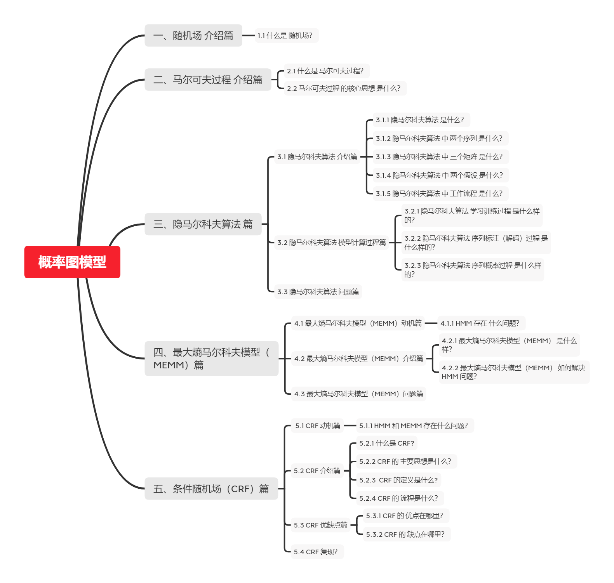

# 【关于 概率图模型】 那些你不知道的事

> 作者：杨夕
> 
> 介绍：本项目是作者们根据个人面试和经验总结出的自然语言处理(NLP)面试准备的学习笔记与资料，该资料目前包含 自然语言处理各领域的 面试题积累。
> 
> NLP 百面百搭 地址：https://github.com/km1994/NLP-Interview-Notes
> 
> **[手机版NLP百面百搭](https://mp.weixin.qq.com/s?__biz=MzAxMTU5Njg4NQ==&mid=100005719&idx=3&sn=5d8e62993e5ecd4582703684c0d12e44&chksm=1bbff26d2cc87b7bf2504a8a4cafc60919d722b6e9acbcee81a626924d80f53a49301df9bd97&scene=18#wechat_redirect)**
> 
> 推荐系统 百面百搭 地址：https://github.com/km1994/RES-Interview-Notes
> 
> **[手机版推荐系统百面百搭](https://mp.weixin.qq.com/s/b_KBT6rUw09cLGRHV_EUtw)**
> 
> 搜索引擎 百面百搭 地址：https://github.com/km1994/search-engine-Interview-Notes 【编写ing】
> 
> NLP论文学习笔记：https://github.com/km1994/nlp_paper_study
> 
> 推荐系统论文学习笔记：https://github.com/km1994/RS_paper_study
> 
> GCN 论文学习笔记：https://github.com/km1994/GCN_study
> 
> **推广搜 军火库**：https://github.com/km1994/recommendation_advertisement_search
> 
> 【注：手机阅读可能图片打不开！！！】



## 一、基础信息 介绍篇

### 1.1 什么是概率图模型？

概率图模型（Probabilistic Graphical Model， PGM），简称图模型（Graphical Model，GM），是指一种用图结构来描述**多元随机变量之间条件独立性的概率模型（注意条件独立性）**，从而给研究高维空间的概率模型带来了很大的便捷性。

### 1.2 什么是 随机场？

每个位置按照某种分布随机赋予一个值 所构成 的 整体。

## 二、马尔可夫过程 介绍篇

### 2.1 什么是 马尔可夫过程？

假设一个随机过程中，$t_n$ 时刻的状态$x_n$的条件发布，只与其前一状态$x_{n-1}$ 相关，即：

$$
    P(x_n|x_1,x_2,...,x_{n-1}) = P(x_n|x_{n-1})
$$

则将其称为 马尔可夫过程。


### 2.2 马尔可夫过程 的核心思想 是什么？

对于 马尔可夫过程 的 思想，用一句话去概括：**当前时刻状态 仅与上一时刻状态相关，与其他时刻不相关。**

可以从 马尔可夫过程 图 去理解，由于 每个状态间 是以 有向直线连接，也就是 当前时刻状态 仅与上一时刻状态相关。

## 三、隐马尔科夫算法 篇

### 3.1 隐马尔科夫算法 介绍篇

#### 3.1.1 隐马尔科夫算法 是什么？

隐马尔科夫算法是对含有未知参数（隐状态）的马尔可夫链进行建模的**生成模型**，如下图所示：


在隐马尔科夫模型中，包含隐状态 和 观察状态，隐状态 $i_i$ 对于观察者而言是不可见的，而观察状态 $o_i$ 对于观察者而言是可见的。隐状态间存在转移概率，隐状态 $i_i$到对应的观察状态 $o_i$ 间存在输出概率。

#### 3.1.2 隐马尔科夫算法 中 两个序列 是什么？


- 两序列
  - 隐藏序列：隐状态 $i_i$ 对于观察者而言是不可见的
  - 观测序列：$o_i$ 对于观察者而言是可见的

#### 3.1.3 隐马尔科夫算法 中 三个矩阵 是什么？

- 初始状态矩阵：每个标签的概率矩阵
- 发射状态矩阵：一个字变成每个标签的概率 $B=\left[b_{i j}\right]_{N \times M}$（$N$为隐藏状态集元素个数，M为观测集元素个数），其中$b_{i j}=P\left(o_{t} | i_{t}\right)$，$(o_{t}$为第i个观测节点 ，$i_t$ 为第i个隐状态节点,即所谓的观测概率（发射概率）；
- 状态转移级证：标签到每个标签的概率 $A=\left[a_{i j}\right]_{N \times N}$ （N 表示隐藏状态集元素的个数），其中  $a_{i j}=P\left(i_{t+1} | i_{t}\right)$，$i_t$  即第i个隐状态节点，即所谓的状态转移；

#### 3.1.4 隐马尔科夫算法 中 两个假设 是什么？

- 齐次马尔可夫性假设：即假设隐藏的马尔科夫链在任意时刻 t 的状态只依赖于其前一时刻的状态，与其他时刻的状态及观测无关，也与时刻 t 无关；

$$
    P(x_i|x_1,x_2,...,x_{i-1}) = P(x_i|x_{i-1})
$$

- 观测独立性假设：即假设任意时刻的观测只依赖于该时刻的马尔科夫链的状态，与其他观测及状态无关。

$$
    P(y_i|x_1,x_2,...,x_{i-1},y_1,y_2,...,y_{i-1},y_{i+1},...) = P(y_i|x_{i})
$$

#### 3.1.5 隐马尔科夫算法 中 工作流程 是什么？

1. 隐状态节点 $i_t$ 是不能直接观测到的数据节点， $o_t$ 才是能观测到的节点，并且注意箭头的指向表示了依赖生成条件关系；
2. $i_t$在$A$的指导下生成下一个隐状态节点$i_{t+1}$;
3. $i_t$在$B$的指导下生成依赖于该$i_t$的观测节点$o_{t}$;

- 深层次理解：由于 为有向图，而且属于生成式模型，直接对联合概率分布建模 

$$
  P(O, I)=\sum_{t=1}^{T} P\left(O_{t} | O_{t-1}\right) P\left(I_{t} | O_{t}\right)
$$

### 3.2 隐马尔科夫算法 模型计算过程篇

#### 3.2.1 隐马尔科夫算法 序列概率计算过程 是什么样的？

1. 思想

如何对一条序列计算其整体的概率。即目标是计算出 $P(O | \lambda)$ ;

给定模型 $\lambda=(A,B,π)$ 和观测序列 O=(o1,o2,...,oT) ，计算在模型 $\lambda$ 下观测序列 $O$ 出现的概率 $P(O|\lambda)$

1. 常用方法

- 直接计算法（穷举搜索）

由于有隐藏的状态序列 I 的存在，我们是无法计算 $P(O|\lambda)$ 的。一种常见的做法是把 I 边缘掉，即 $P(O|\lambda)=\sum(P(O,I|\lambda))$ ，当然，这种计算复杂度非常高，为 $O(TN^2)$

- 前向算法

减少计算量的原因在于每一次计算直接引用前一个时刻的计算结果，避免重复计算，计算复杂度将为$O(T^2 * N)$

- 后向算法

#### 3.2.2 隐马尔科夫算法 学习训练过程 是什么样的？

1. 思想
   

  找出数据的分布情况，也就是模型参数的确定；

  已知观测序列 O=(o1,o2,...,oT) ，估计模型 $\lambda=(A,B,π)$ 参数，使得在该模型下观测序列概率 $P(O|\lambda)$ 最大，即用极大似然估计的方法估计参数

2. 常用方法

- 极大似然估计：该算法在训练数据是**会 将 观测状态序列 $O$ 和 隐状态序列 $I$**;
- Baum-Welch(前向后向)：该算法在训练数据是**只会 将 观测状态序列 $O$**;

#### 3.2.3 隐马尔科夫算法 序列标注（解码）过程 是什么样的？

1. 思想

也就是“预测过程”，通常称为解码过程。在给定的观测序列下找出一条隐状态序列，条件是这个隐状态序列的概率是最大的那个

$$Q_{\max }=\operatorname{argmax}_{\text {allQ}} \frac{P(Q, O)}{P(O)}$$

2. 常用方法：Viterbi算法

Viterbi计算有向无环图的一条最大路径：


### 3.3 HMM模型三个基本问题的联系？

三个基本问题 存在 渐进关系。首先，要学会用前向算法和后向算法算观测序列出现的概率，然后用Baum-Welch算法求参数的时候，某些步骤是需要用到前向算法和后向算法的，计算得到参数后，我们就可以用来做预测了。因此可以看到，三个基本问题，它们是渐进的，对于做NLP的同学来说，应用HMM模型做解码任务应该是最终的目的。

### 3.4 隐马尔科夫算法 问题篇

因为HMM模型其实它简化了很多问题，做了某些很强的假设，如**齐次马尔可夫性假设**和**观测独立性假设**，做了假设的好处是，**简化求解的难度**，坏处是**对真实情况的建模能力变弱**了。

在序列标注问题中，隐状态（标注）不仅和单个观测状态相关，还和观察序列的长度、上下文等信息相关。例如词性标注问题中，一个词被标注为动词还是名词，不仅与它本身以及它前一个词的标注有关，还依赖于上下文中的其他词。

## 四、最大熵马尔科夫模型（MEMM）篇

### 4.1 最大熵马尔科夫模型（MEMM）动机篇

#### 4.1.1 HMM 存在 什么问题？

HMM中，观测节点 $o_i$ 依赖隐藏状态节点 $i_i$ ,也就意味着我的观测节点只依赖当前时刻的隐藏状态。但在更多的实际场景下，**观测序列是需要很多的特征来刻画的**，比如说，我在做NER时，我的标注 $i_i$ 不仅跟当前状态 $o_i$ 相关，而且还跟前后标注 $o_{j}(j \neq i)$ 相关，比如字母大小写、词性等等。

### 4.2 最大熵马尔科夫模型（MEMM）介绍篇

#### 4.2.1 最大熵马尔科夫模型（MEMM） 是什么样？


通过 “定义特征” 的方式，学习条件概率：

$$P(I | O)=\prod_{t=1}^{n} P\left(i_{i} | i_{i-1}, o_{i}\right), i=1, \cdots, n$$

并且， $P(i|i',o)$ 这个概率通过最大熵分类器建模（取名MEMM的原因）:


重点来了，这是ME的内容，也是理解MEMM的关键： $Z(o,i')$ 这部分是归一化； $f_{a}(o, i)$ 是特征函数，具体点，这个函数是需要去定义的; $\lambda$ 是特征函数的权重，这是个未知参数，需要从训练阶段学习而得。

定义特征函数：


其中，特征函数 $f_{a}(o, i)$ 的 个数 可以任意制定，（a=1,...,n）

所以总体上，MEMM的建模公式这样：


请务必注意，理解判别模型和定义特征两部分含义，这已经涉及到CRF的雏形了。

#### 4.2.2 最大熵马尔科夫模型（MEMM） 如何解决 HMM 问题？

在前面介绍 HMM 时，HMM 提出了 **观测节点 $o_i$ 依赖隐藏状态节点 $i_i$** 假设，该假设不合理的，针对该问题， MEMM 提出 **观测节点 $i_i$ 依赖隐藏状态节点 $o_i$ 以及上一时刻的隐藏节点$i_{i-1}$** 假设。（HMM 和 MEMM 箭头）；

### 4.3 最大熵马尔科夫模型（MEMM）问题篇

1. 问题简述
   

MEMM 容易出现标注偏置问题，MEMM倾向于选择拥有更少转移的状态。

2. 问题介绍
   


用Viterbi算法解码MEMM，状态1倾向于转换到状态2，同时状态2倾向于保留在状态2。 解码过程细节（需要会viterbi算法这个前提）：


但是得到的最优的状态转换路径是1->1->1->1，为什么呢？因为状态2可以转换的状态比状态1要多，从而使转移概率降低,即MEMM倾向于选择拥有更少转移的状态。

3. 问题原因分析

对于MEMM公式：


求和的作用在概率中是归一化，但是这里归一化放在了指数内部，管这叫local归一化。 来了，viterbi求解过程，是用dp的状态转移公式（MEMM的没展开，请参考CRF下面的公式），因为是局部归一化，所以MEMM的viterbi的转移公式的第二部分出现了问题，导致dp无法正确的递归到全局的最优。


## 五、条件随机场（CRF）篇

### 5.1 CRF 动机篇

#### 5.1.1 HMM 和 MEMM 存在什么问题？

- HMM ：状态的转移过程中当前状态只与前一状态相关问题 
- MEMM ：标注偏置 问题
  - 解决方法：统计全局概率，在做归一化时考虑数据在全局的分布

### 5.2 CRF 介绍篇

#### 5.2.1 什么是 CRF?

设 X 与 Y 是随机变量，**P(Y|X) 是给定条件 X 的条件下 Y 的条件概率分布**，若**随机变量 Y 构成一个由无向图G=(V,E)表示的马尔科夫随机场**。则称 **条件概率分布P(X|Y)为条件随机场**。


#### 5.2.2 CRF 的 主要思想是什么？

统计全局概率，在做归一化时，考虑了数据在全局的分布。

#### 5.2.3  CRF 的定义是什么?

给定 $X=(x_1,x_2,...,x_n)$ ，$Y=(y_1,y_2,...,y_n)$ 均为线性链表示的随机变量序列，若在给随机变量序列 X 的条件下，随机变量序列 Y 的条件概率分布 $P(Y|X)$ 构成条件随机场，即满足马尔可夫性：

$$
    P(y_i|x_1,x_2,...,x_{i-1},y_1,y_2,...,y_{i-1},y_{i+1})
       = P(y_i|x,y_{i-1},y_{i+1})
$$

则称为 P(Y|X) 为线性链条件随机场。

通过去除了隐马尔科夫算法中的观测状态相互独立假设，使算法在计算当前隐状态$x_i$时，会考虑整个观测序列，从而获得更高的表达能力，并进行全局归一化解决标注偏置问题。


#### 5.2.4  CRF 的 三个基本问题 是什么?

##### 5.2.4.1 概率计算问题

- 定义：给定 观测序列 x 和 状态序列 y， 计算概率 P(y|x)
- 公式定义：

$$
p\left(y | x\right)=\frac{1}{Z\left(x\right)} \prod_{i=1}^{n} \exp \left(\sum_{i, k} \lambda_{k} t_{k}\left(y_{i-1}, y_{i}, x, i\right)+\sum_{i, l} \mu_{l} s_{l}\left(y_{i}, x, i\right)\right)
$$

其中：

> $Z(x)$ 为归一化因子，是在全局范围进行归一化，枚举了整个隐状态序列$x_{1…n}$的全部可能，从而解决了局部归一化带来的标注偏置问题。

$$
Z(x)=\sum_{y} \exp \left(\sum_{i, k} \lambda_{x} t_{k}\left(y_{i-1}, y_{i}, x, i\right)+\sum_{i, l} \mu_{l} s_{l}\left(y_{i}, x, i\right)\right)
$$

> $t_k$ 为定义在边上的特征函数，转移特征，依赖于前一个和当前位置

> $s_1$ 为定义在节点上的特征函数，状态特征，依赖于当前位置。

- 解决方法：前向计算、后向计算 

##### 5.2.4.2 学习计算问题

- 定义：给定训练数据集估计条件随机场模型参数的问题，即条件随机场的学习问题。
- 公式定义：利用极大似然的方法来定义我们的目标函数


- 解决方法：随机梯度法、牛顿法、拟牛顿法、迭代尺度法这些优化方法来求解得到参数
- 目标：解耦 模型定义，目标函数，优化方法

##### 5.2.4.3 预测问题

- 定义：给定条件随机场 P(Y|X) 和输入序列（观测序列） x ，求条件概率最大的输出序列（标记序列） y* ，即对观测序列进行标注。
- 方法：维特比算法

#### 5.2.5 CRF 的 流程是什么？

1. 选择特征模板：抽取文本中的字符组合 or 具有其他特殊意义的标记组成特征，作为当前 token 在模板中的表示；
2. 构建特征函数：通过一组函数来完成由特征向数值转换的过程，使特征与权重对应;
3. 进行前向计算：每个状态特征函数（0-1二值特征函数）对应 L 维向量，最终状态特征函数权值的和即为该位置上激活了的状态特征函数对应的 L 维向量之和；
4. 解码：利用 维特比算法 解码 出 最优标注序列

### 5.3 CRF 优缺点篇

#### 5.3.1 CRF 的 优点在哪里？

- 为每个位置进行标注过程中可利用丰富的内部及上下文特征信息；
- CRF模型在结合多种特征方面的存在优势；
- 避免了标记偏置问题；
- CRF的性能更好，对特征的融合能力更强；

#### 5.3.2 CRF 的 缺点在哪里？

- 训练模型的时间比ME更长，且获得的模型非常大。在一般的PC机上可能无法执行；
- 特征的选择和优化是影响结果的关键因素。特征选择问题的好与坏，直接决定了系统性能的高低

### 5.4 CRF 复现？

```python
  import numpy as np 
  class CRF(object):
      '''实现条件随机场预测问题的维特比算法
      '''
      def __init__(self, V, VW, E, EW):
          '''
          :param V:是定义在节点上的特征函数，称为状态特征
          :param VW:是V对应的权值
          :param E:是定义在边上的特征函数，称为转移特征
          :param EW:是E对应的权值
          '''
          self.V  = V  #点分布表
          self.VW = VW #点权值表
          self.E  = E  #边分布表
          self.EW = EW #边权值表
          self.D  = [] #Delta表，最大非规范化概率的局部状态路径概率
          self.P  = [] #Psi表，当前状态和最优前导状态的索引表s
          self.BP = [] #BestPath，最优路径
          return 
          
      def Viterbi(self):
          '''
          条件随机场预测问题的维特比算法，此算法一定要结合CRF参数化形式对应的状态路径图来理解，更容易理解.
          '''
          self.D = np.full(shape=(np.shape(self.V)), fill_value=.0)
          self.P = np.full(shape=(np.shape(self.V)), fill_value=.0)
          for i in range(np.shape(self.V)[0]):
              #初始化
              if 0 == i:
                  self.D[i] = np.multiply(self.V[i], self.VW[i])
                  self.P[i] = np.array([0, 0])
                  print('self.V[%d]='%i, self.V[i], 'self.VW[%d]='%i, self.VW[i], 'self.D[%d]='%i, self.D[i])
                  print('self.P:', self.P)
                  pass
              #递推求解布局最优状态路径
              else:
                  for y in range(np.shape(self.V)[1]): #delta[i][y=1,2...]
                      for l in range(np.shape(self.V)[1]): #V[i-1][l=1,2...]
                          delta = 0.0
                          delta += self.D[i-1, l]                      #前导状态的最优状态路径的概率
                          delta += self.E[i-1][l,y]*self.EW[i-1][l,y]  #前导状态到当前状体的转移概率
                          delta += self.V[i,y]*self.VW[i,y]            #当前状态的概率
                          print('(x%d,y=%d)-->(x%d,y=%d):%.2f + %.2f + %.2f='%(i-1, l, i, y, \
                                self.D[i-1, l], \
                                self.E[i-1][l,y]*self.EW[i-1][l,y], \
                                self.V[i,y]*self.VW[i,y]), delta)
                          if 0 == l or delta > self.D[i, y]:
                              self.D[i, y] = delta
                              self.P[i, y] = l
                      print('self.D[x%d,y=%d]=%.2f\n'%(i, y, self.D[i,y]))
          print('self.Delta:\n', self.D)
          print('self.Psi:\n', self.P)
          
          #返回，得到所有的最优前导状态
          N = np.shape(self.V)[0]
          self.BP = np.full(shape=(N,), fill_value=0.0)
          t_range = -1 * np.array(sorted(-1*np.arange(N)))
          for t in t_range:
              if N-1 == t:#得到最优状态
                  self.BP[t] = np.argmax(self.D[-1])
              else: #得到最优前导状态
                  self.BP[t] = self.P[t+1, int(self.BP[t+1])]
          
          #最优状态路径表现在存储的是状态的下标，我们执行存储值+1转换成示例中的状态值
          #也可以不用转换，只要你能理解，self.BP中存储的0是状态1就可以~~~~
          self.BP += 1
          
          print('最优状态路径为：', self.BP)
          return self.BP
          
  def CRF_manual():   
      S = np.array([[1,1],   #X1:S(Y1=1), S(Y1=2)
                    [1,1],   #X2:S(Y2=1), S(Y2=2)
                    [1,1]])  #X3:S(Y3=1), S(Y3=1)
      SW = np.array([[1.0, 0.5], #X1:SW(Y1=1), SW(Y1=2)
                    [0.8, 0.5], #X2:SW(Y2=1), SW(Y2=2)
                    [0.8, 0.5]])#X3:SW(Y3=1), SW(Y3=1)
      E = np.array([[[1, 1],  #Edge:Y1=1--->(Y2=1, Y2=2)
                    [1, 0]], #Edge:Y1=2--->(Y2=1, Y2=2)
                    [[0, 1],  #Edge:Y2=1--->(Y3=1, Y3=2) 
                    [1, 1]]])#Edge:Y2=2--->(Y3=1, Y3=2)
      EW= np.array([[[0.6, 1],  #EdgeW:Y1=1--->(Y2=1, Y2=2)
                    [1, 0.0]], #EdgeW:Y1=2--->(Y2=1, Y2=2)
                    [[0.0, 1],  #EdgeW:Y2=1--->(Y3=1, Y3=2)
                    [1, 0.2]]])#EdgeW:Y2=2--->(Y3=1, Y3=2)
      
      crf = CRF(S, SW, E, EW)
      ret = crf.Viterbi()
      print('最优状态路径为:', ret)
      return
      
  if __name__=='__main__':
      CRF_manual()
```

## 六、对比篇

### 6.1 CRF模型 和 HMM 和 MEMM 模型 区别？

- 相同点：MEMM、HMM、CRF 都常用于 序列标注任务；
- 不同点：
  - 与 HMM 的区别：CRF 能够解决 HMMM 因其输出独立性假设，导致其不能考虑上下文的特征，限制了特征的选择的问题；
  - 与 MEMM 的区别：MEMM 虽然能够解决 HMM 的问题，但是 MEMM 由于在每一节点都要进行归一化，所以只能找到局部的最优值，同时也带来了标记偏见的问题，即凡是训练语料中未出现的情况全都忽略掉。
  - CRF ：很好的解决了这一问题，他并不在每一个节点进行归一化，而是所有特征进行全局归一化，因此可以求得全局的最优值。

### 6.2 为什么 CRF模型 会比 HMM 被普遍使用？

- 原因 1：CRF模型 属于 判别式模型，在 序列标注 任务上，效果优于 生成式模型；
- 原因 2：HMM 提出 齐次马尔可夫性假设 和 观测独立性假设，这两个假设过强，而 CRF 只需要满足 局部马尔可夫性就好，通过降低假设的方式，提升模型效果；


## 参考资料

1. [条件随机场CRF](https://zhuanlan.zhihu.com/p/29989121)
2. [朴素贝叶斯(NB)、逻辑回归(LR)、隐马尔科夫模型(HMM)、条件随机场(CRF)](https://blog.csdn.net/u013010889/article/details/81148809)
3. [学习笔记：条件随机场（CRF）](https://hit-computer.github.io/2017/06/10/CRF/)
4. [如何轻松愉快地理解条件随机场（CRF）？](https://www.jianshu.com/p/55755fc649b1)
5. [概率图模型体系：HMM、MEMM、CRF](https://zhuanlan.zhihu.com/p/33397147)
6. [CRF 视频介绍](https://b23.tv/BV19t411R7QU/p1)
7. [概率图模型（二）：捋一捋HMM模型](https://zhuanlan.zhihu.com/p/398880896)
8. [概率图模型（三）：理一理CRF模型](https://zhuanlan.zhihu.com/p/402132237)

