# 【关于 文本分类】那些你不知道的事

> 作者：小猪呼噜

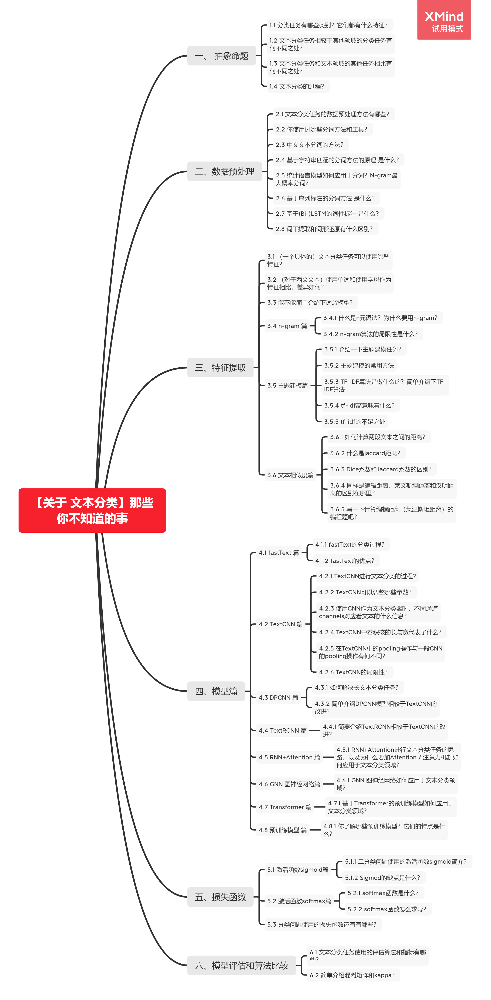

## 一、 抽象命题

### 1.1 分类任务有哪些类别？它们都有什么特征？

分类任务是机器学习中最常见的监督学习任务之一。以文本分类为例，情感分类，新闻分类，主题分类、问答匹配、意图识别、推断等等领域都使用到了文本分类的相关知识或技术。

分类任务按照数据集的不同，可以分为二分类、多分类、多标签分类；按照数据的不平衡程度，还可以分为普通的分类问题和不平衡数据的分类问题（异常检测）等。

分类任务是监督学习任务，因此数据集是带标签的，而且是离散的标签。许多回归任务通过标签离散化也可以使用分类任务解决。

### 1.2 文本分类任务相较于其他领域的分类任务有何不同之处？

同样是分类任务，文本分类和图像分类、语音信号分类不同点在于处理的数据不同。图像、语音信号等数据是连续的，而文本数据是离散的。

### 1.3 文本分类任务和文本领域的其他任务相比有何不同之处？

可以从分类任务和回归任务的区别、分类任务和聚类任务的区别来回答。

### 1.4 文本分类的过程？

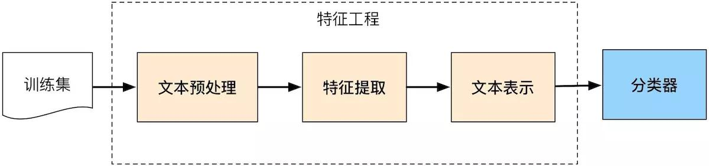

## 二、数据预处理

### 2.1 文本分类任务的数据预处理方法有哪些？

分词：将句子分割成独立的语义单元组成的序列的过程

去停用词：识别并删除那些对分类意义不大的出现频率却很高的单词

词性标注：在分词后判断词性（动词、名词、形容词、副词…）来添加特征

### 2.2 你使用过哪些分词方法和工具？

hanlp、jieba、哈工大LTP、清华THULAC、北大pkuseg、斯坦福分词器、KCWS分词器、NLTK分词器、snowNLP等。

> 关于分词工具的详细介绍，可以看【参考资料1】

### 2.3 中文文本分词的方法？

基于字符串匹配的分词方法

基于统计语言模型的分词方法：

基于统计机器学习的分词方法：中文分词可以建模成一个“序列标注”问题，即一个考虑上下文的字分类问题。因此可以先通过带标签的分词语料来训练一个序列标注模型，再用这个模型对无标签的语料进行分词。

统计序列标注模型的代表就是生成式模型的代表——隐马尔可夫模型（HMM），和判别式模型的代表——（线性链）条件随机场（CRF）。

### 2.4 基于字符串匹配的分词方法的原理 是什么？

基于词典直接进行贪心匹配。直接从句子开头的第一个字开始查字典，找出字典中以该字开头的最长的单词。

举个例子，比如这句“小猪呼噜整天除了吃就是睡”，查字典发现“小猪呼噜”是最长的词了，于是得到

```text
    小猪呼噜 / 整天除了吃就是睡
```

然后从下一个词的开头开始继续匹配字典，发现“整天”就是最长的词了，于是

```
    小猪呼噜 / 整天 / 除了吃就是睡
```

依此类推，最终得到

```
    小猪呼噜 / 整天 / 除了 / 吃 / 就是 / 睡
```

这种简单的算法即为前向最大匹配法（FMM）

由于中文句子本身具有重要信息后置的特点，从后往前匹配的分词正确率往往要高于从前往后，于是就有了反向进行的“后向最大匹配法（BMM）”。当然了，无论是FMM还是BMM，都一定存在不少切分错误，因此一种考虑更周到的方法是“双向最大匹配”。

双向最大匹配算法是指对待切分句子分别使用FMM和RMM进行分词，然后对切分结果不重合的歧义句进行进一步的处理。通常可对两种方法得到的词汇数目进行比较，根据数目的相同与否采取相应的措施，以此来降低歧义句的分词错误率。

基于字符串匹配的分词算法的不足在于其无法应对歧义与单词表外的单词。

> 这一部分内容参考：【参考资料2】

### 2.5 统计语言模型如何应用于分词？N-gram最大概率分词？

假定一个句子S可能有很多种分词方法，那么最好的一种分词方法应该保证分完词后这个句子出现的概率最大。因此，只需利用统计语言模型计算出每种分词后句子出现的概率，并找出其中概率最大的，就能找到最好的分词方法。

如果一个句子可以分成以下词序列：

$$<\omega_1,\omega_2,\dots,\omega_m>$$

则语言模型可以计算出这个词序列存在的可能性：

$$P(<\omega_1,\omega_2,\dots,\omega_m>)=P(\omega_1)\times P(\omega_2|\omega_2)\times \cdots \times P(\omega_m|\omega_1,\omega_2,\dots,\omega_{m-1})$$

从计算上来说，m一旦变大，也就是句子一旦变长，乘法后面的几项将会难以计算。因此我们使用**马尔可夫假设**：任意词$\omega_i$的出现概率只与它前面的词$\omega_{i-1}$有关。

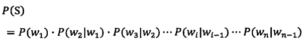

采用马尔可夫假设的语言模型为二元模型（bigram language model）。当然你也可以假设一个词出现的概率由前面N-1个词决定，对应的模型为N元模型（n-gram language model）。

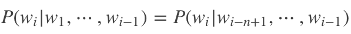

这里面还有一个实现上的技巧，即如果穷举所有可能的分词方法，并计算出每种可能性下句子的概率，那么计算量是相当大的。因此可以把该问题看作一个动态规划问题，并利用维特比（Viterbi）算法快速找到最佳分词。

需要指出的是任何方法都有它的局限性，虽然利用统计语言模型进行分词可以取得比人工更好的结果，但是也不能做到百分之百准确。因为统计语言模型受限于训练它的语料，因此得到的结果很大程度上是依照“大众的想法”，或者“多数句子的用法”，而在特定情况下可能是错的。

> 这一部分内容参考：【参考资料3】

### 2.6 基于序列标注的分词方法 是什么？

将分词问题转换为给每个位置的字进行分类的问题，即序列标注问题。其中，类别有4个，一般用{B:begin, M:middle, E:end, S:single}这4个类别来描述一个分词样本中每个字所属的类别。它们代表的是该字在词语中的位置。其中，B代表该字是词语中的起始字，M代表是词语中的中间字，E代表是词语中的结束字，S则代表是单字成词。

```text
    人/b 们/e 常/s 说/s 生/b 活/e 是/s 一/s 部/s 教/b 科/m 书/e
```

根据序列标注结果，得到的分词序列为：

```text
    人们 / 常 / 说 / 生活 / 是 / 一 / 部 / 教科书
```

因此只需要使用数据集训练合适的机器学习模型来完成序列标注任务即可完成分词任务。

### 2.7 基于(Bi-)LSTM的词性标注 是什么？

字的上下文信息对于排解切分歧义来说非常重要，能考虑的上下文越长，自然排解歧义的能力就越强。而前面的n-gram语言模型也只能做到考虑一定距离的上下文，那么有没有在理论上能考虑无限长上下文距离的分词模型呢？答案就是基于LSTM来做。当然啦，LSTM是有方向的，为了让每个位置的字分类时既能考虑全部历史信息（左边的所有的字），又能考虑全部未来信息（右边所有的字），我们可以使用双向LSTM（Bi-LSTM）来充当序列标注的骨架模型

LSTM完成对每个位置的上下文信息的编码后，最终通过softmax分类层完成对每个位置的分类，从而跟HMM和CRF一样完成了基于序列标注的中文分词。

### 2.8 词干提取和词形还原有什么区别？

词形还原（Lemmatization），是把一个任何形式的语言词汇还原为一般形式（能表达完整语义），而词干提取（Stemming）是抽取词的词干或词根形式（不一定能够表达完整语义）。词形还原和词干提取是词形规范化的两类重要方式，都能够达到有效归并词形的目的，二者既有联系也有区别。

首先让我们看一下联系：

1、目标一致。词干提取和词形还原的目标均为将词的屈折形态或派生形态简化或归并为词干（stem）或原形的基础形式，都是一种对词的不同形态的统一归并的过程。

2、结果部分交叉。词干提取和词形还原不是互斥关系，其结果是有部分交叉的。一部分词利用这两类方法都能达到相同的词形转换效果。如“dogs”的词干为“dog”，其原形也为“dog”。

3、主流实现方法类似。目前实现词干提取和词形还原的主流实现方法均是利用语言中存在的规则或利用词典映射提取词干或获得词的原形。

4、应用领域相似。主要应用于信息检索和文本、自然语言处理等方面，二者均是这些应用的基本步骤。

接下来我们看看区别：

a、在原理上，词干提取主要是采用“缩减”的方法，将词转换为词干，如将“cats”处理为“cat”，将“effective”处理为“effect”。而词形还原主要采用“转变”的方法，将词转变为其原形，如将“drove”处理为“drive”，将“driving”处理为“drive”。

b、在复杂性上，词干提取方法相对简单，词形还原则需要返回词的原形，需要对词形进行分析，不仅要进行词缀的转化，还要进行词性识别，区分相同词形但原形不同的词的差别。词性标注的准确率也直接影响词形还原的准确率，因此，词形还原更为复杂。

c、在实现方法上，虽然词干提取和词形还原实现的主流方法类似，但二者在具体实现上各有侧重。词干提取的实现方法主要利用规则变化进行词缀的去除和缩减，从而达到词的简化效果。词形还原则相对较复杂，有复杂的形态变化，单纯依据规则无法很好地完成。其更依赖于词典，进行词形变化和原形的映射，生成词典中的有效词。

d、在结果上，词干提取和词形还原也有部分区别。词干提取的结果可能并不是完整的、具有意义的词，而只是词的一部分，如“revival”词干提取的结果为“reviv”，“ailiner”词干提取的结果为“airlin”。而经词形还原处理后获得的结果是具有一定意义的、完整的词，一般为词典中的有效词。

e、在应用领域上，同样各有侧重。虽然二者均被应用于信息检索和文本处理中，但侧重不同。词干提取更多被应用于信息检索领域，如Solr、Lucene等，用于扩展检索，粒度较粗。词形还原更主要被应用于文本挖掘、自然语言处理，用于更细粒度、更为准确的文本分析和表达。

> 这一部分内容参考：【参考资料4】

## 三、特征提取

### 3.1 （一个具体的）文本分类任务可以使用哪些特征？

考察面试者特征工程的能力。自然语言处理领域可以使用的特征有字母、单词和单词的组合，甚至可能是字母出现的频率、二元字母出现的频率等等。

### 3.2 （对于西文文本）使用单词和使用字母作为特征相比，差异如何？

使用字母会让模型更稳定，但这样要处理的文本也就更长，同时模型更难从文本中学习到有效的信息。

### 3.3 能不能简单介绍下词袋模型？

用于机器学习的文本表示有一种最简单的方法，也是最常用的方法，就是使用词袋（bag-of-words）表示。使用这种表示方式时，我们舍弃了输入文本中的大部分结构，如章节、段落、句子和格式，**只计算语料库中每个单词在每个文本中的出现频次**。舍弃结构并仅计算单词出现次数，这会让脑海中出现将文本表示为“袋”的画面。

### 3.4 n-gram 篇

#### 3.4.1 什么是n元语法？为什么要用n-gram？

使用词袋表示的主要缺点之一是完全舍弃了单词顺序。因此，“it’s bad, not good at all”（电影很差，一点也不好）和“it’s good, not bad at all”（电影很好，还不错）这两个字符串的词袋表示完全相同，尽管它们的含义相反。将“not”（不）放在单词前面，这只是上下文很重要的一个例子（可能是一个极端的例子）。幸运的是，使用词袋表示时有一种获取上下文的方法，就是不仅考虑单一词例的计数，而且还考虑相邻的两个或三个词例的计数。两个词例被称为二元分词（bigram），三个词例被称为三元分词（trigram），更一般的词例序列被称为 n 元分词（n-gram）。我们可以通过改变 CountVectorizer 或 TfidfVectorizer 的 ngram_range 参数来改变作为特征的词例范围。ngram_range 参数是一个元组，包含要考虑的词例序列的最小长度和最大长度。

#### 3.4.2 n-gram算法的局限性是什么？

在大多数情况下，添加二元分词会有所帮助。添加更长的序列（一直到五元分词）也可能有所帮助，但这会导致特征数量的大大增加，也可能会导致过拟合，因为其中包含许多非常具体的特征。

原则上来说，二元分词的数量是一元分词数量的平方，三元分词的数量是一元分词数量的三次方，从而导致非常大的特征空间。

在实践中，更高的 n 元分词在数据中的出现次数实际上更少，原因在于（英语）语言的结构，不过这个数字仍然很大。

### 3.5 主题建模篇

#### 3.5.1 介绍一下主题建模任务？

常用于文本数据的一种特殊技术是主题建模（topic modeling），这是描述将每个文档分配给一个或多个主题的任务（通常是无监督的）的概括性术语。

直观来讲，如果一篇文章有一个中心思想，那么一些特定词语会更频繁的出现。比方说，如果一篇文章是在讲狗的，那“狗”和“骨头”等词出现的频率会高些。一个主题模型试图用数学框架来体现文档的这种特点。

#### 3.5.2 主题建模的常用方法

凡是能筛选一部分词语来代表一篇文档的方法，都可以将其归类为主题建模方法。

主题建模方法包括tf-idf、LDA等

#### 3.5.3 TF-IDF算法是做什么的？简单介绍下TF-IDF算法

TF-IDF（Term Frequency-inverse Document Frequency）是一种针对关键词的统计分析方法，用于评估一个词对一个文件集或者一个语料库的重要程度。基本思想是如果某个字词在一篇文档中出现的频率较高，而在其他文档中出现频率较低，则认为这个字词更能够代表这篇文档。

在一份给定的文件里，词频（term frequency，tf）指的是某一个给定的词语在该文件中出现的频率。对于在某一特定文件里的词语 $t_{i}$ 来说，它的重要性可表示为：

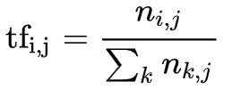

其中以上式子中 $n_{i,j}$ 是该词在文件 $d_{j}$ 中的出现次数，而分母则是在文件 $d_{{j}}$ 中所有字词的出现次数之和。

逆向文件频率（inverse document frequency，idf）是一个词语普遍重要性的度量。某一特定词语的idf，可以由总文件数目除以包含该词语之文件的数目，再将得到的商取以10为底的对数得到：

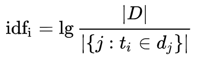

其中 $|D|$ 代表语料库中的文件总数；

$|\{j:t_{{i}}\in d_{{j}}\}|$ ：包含词语 $t_{{i}}$ 的文件数目（即 $n_{{i,j}}\neq 0$ 的文件数目）如果词语不在资料中，就导致分母为零，因此一般情况下使用 $1+|\{j:t_{{i}}\in d_{{j}}\}|$

综合词频该词的词频tf与逆文档频率idf，则：

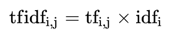

#### 3.5.4 tf-idf高意味着什么？

高权重的tf-idf意味着该词语在某一特定类别（文件）中出现频率高，且在整个类别的语料中出现频率相对较低。因此，tf-idf倾向于过滤掉常见的词语，保留重要的词语。

#### 3.5.5 tf-idf的不足之处

tf-idf算法是创建在这样一个假设之上的：对区别文档最有意义的词语应该是那些在文档中出现频率高，而在整个文档集合的其他文档中出现频率少的词语，所以如果特征空间坐标系取tf词频作为测度，就可以体现同类文本的特点。

另外考虑到单词区别不同类别的能力，tf-idf法认为一个单词出现的文本频数越小，它区别不同类别文本的能力就越大。因此引入了逆文本频度idf的概念，以tf和idf的乘积作为特征空间坐标系的取值测度，并用它完成对权值tf的调整，调整权值的目的在于突出重要单词，抑制次要单词。

但是在本质上idf是一种试图抑制噪声的加权，并且单纯地认为文本频率小的单词就越重要，文本频率大的单词就越无用，显然这并不是完全正确的。

idf的简单结构并不能有效地反映单词的重要程度和特征词的分布情况，使其无法很好地完成对权值调整的功能，所以tf-idf法的精度并不是很高。

此外，在tf-idf算法中并没有体现出单词的位置信息，对于Web文档而言，权重的计算方法应该体现出HTML的结构特征。

特征词在不同的标记符中对文章内容的反映程度不同，其权重的计算方法也应不同。因此应该对于处于网页不同位置的特征词分别赋予不同的系数，然后乘以特征词的词频，以提高文本表示的效果。

> 这一部分内容参考：【参考资料5】

### 3.6 文本相似度篇

#### 3.6.1 如何计算两段文本之间的距离？

衡量文本之间的距离，与相似性计算是同一回事的两个方面，距离可以理解成“不相似性”。

如果我们比较相似度的计算对象是分词后的词汇序列、词性序列、命名实体序列等，那么常用的计算距离的方法有：Jaccard距离、Dice系数、汉明距离、编辑距离等等。

如果我们使用词嵌入向量作为相似度的比较对象，那么文本距离问题就简化成向量相似度计算方法了。常用的向量距离计算方法有余弦距离等。

#### 3.6.2 什么是jaccard距离？

Jaccard指数又称为雅卡尔指数，是用来衡量两个有限集合之间的不相似度的度量指标。定义为两个集合交集大小与并集大小之间的比例：

$${\displaystyle J(A,B)={{|A\cap B|} \over {|A\cup B|}}={{|A\cap B|} \over {|A|+|B|-|A\cap B|}}.}$$

如果A与B完全重合，则定义J(A,B) = 1。完全没有交集则J(A,B) = 0。

$${\displaystyle 0\leq J(A,B)\leq 1.}$$

雅卡尔距离（Jaccard distance）则用于量度样本集之间的不相似度，其定义为1减去雅卡尔系数，即

$${\displaystyle d_{J}(A,B)=1-J(A,B)={{|A\cup B|-|A\cap B|} \over |A\cup B|}.}$$

#### 3.6.3 Dice系数和Jaccard系数的区别？

是一种集合相似度度量函数，通常用于计算两个样本的相似度：

$${\displaystyle s={\frac {2|X\cap Y|}{|X|+|Y|}}}$$

计算方法为集合交集的 2 倍除以两个集合相加。注意与Jaccard不一样，Dice系数的分母并不是并集。

#### 3.6.4 同样是编辑距离，莱文斯坦距离和汉明距离的区别在哪里？

汉明距离是编辑距离中的一个特殊情况，仅用来计算两个**等长**字符串中不一致的字符个数。

因此汉明距离不用考虑添加及删除，只需要对比不同即可，所以实现比较简单。莱文斯坦距离需要考虑插入和删除字符。

#### 3.6.5 写一下计算编辑距离（莱温斯坦距离）的编程题吧？

编辑距离指两个字串之间，由一个转成另一个所需的最少编辑操作次数。，把这个次数叫做距离。这道题是[leetcode 72题](https://leetcode-cn.com/problems/edit-distance/)，用到了动态规划。

下面给出我的实现：

```python
class Solution:
    def minDistance(self, word1: str, word2: str) -> int:
        dp = [[0 for _ in range(len(word2)+1)] for _ in range(len(word1)+1)]
        for i in range(len(word1)+1):
            dp[i][0] = i
        for i in range(len(word2)+1):
            dp[0][i] = i
        for i in range(1, len(word1)+1):
            for j in range(1, len(word2)+1):
                if word1[i-1] == word2[j-1]:
                    dp[i][j] = min(dp[i-1][j-1], 1+dp[i][j-1], 1+dp[i-1][j])
                else:
                    dp[i][j] = 1 + min(dp[i-1][j-1], dp[i][j-1], dp[i-1][j])
        return dp[-1][-1]
```

## 四、模型篇

### 4.1 fastText 篇

#### 4.1.1 fastText的分类过程？

fastText首先把输入转化为词向量，取平均，再经过**线性分类器**得到类别。输入的词向量可以是预先训练好的，也可以随机初始化，跟着分类任务一起训练。

#### 4.1.2 fastText的优点？

fastText是一个快速文本分类算法，与基于神经网络的分类算法相比有两大优点：
1、fastText在保持高精度的情况下加快了训练速度和测试速度
2、fastText不需要预训练好的词向量，fastText会自己训练词向量
3、fastText两个重要的优化：使用层级 Softmax提升效率、采用了char-level的n-gram作为附加特征。

### 4.2 TextCNN 篇

#### 4.2.1 TextCNN进行文本分类的过程?

卷积神经网络的核心思想是捕捉局部特征，对于文本来说，局部特征就是由若干单词组成的滑动窗口，类似于N-gram。卷积神经网络的优势在于能够自动地对N-gram特征进行组合和筛选，获得不同抽象层次的语义信息。因此文本分类任务中可以利用CNN来提取句子中类似 n-gram 的关键信息。

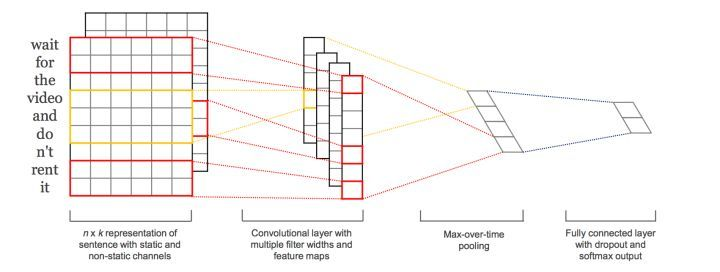

下面是详细信息

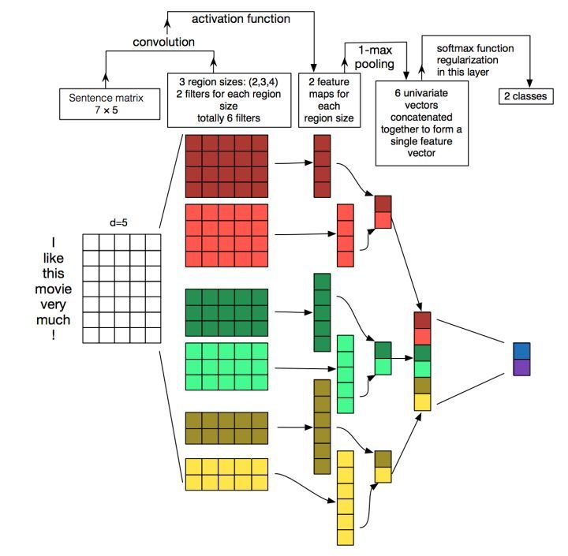

第一层为输入层。将最左边的7乘5的句子矩阵，每行是词向量，维度=5，这个可以类比为图像中的原始像素点了。

图中的输入层实际采用了双通道的形式，即有两个 $n\times k$ 的输入矩阵，其中一个用预训练好的词嵌入表达，并且在训练过程中不再发生变化；另外一个也由同样的方式初始化，但是会作为参数，随着网络的训练过程发生改变。

第二层为卷积层。然后经过有 filter_size=(2,3,4) 的一维卷积层，每个filter_size 有两个输出 channel。第三层是一个1-max pooling层，这样不同长度句子经过pooling层之后都能变成定长的表示了。

最后接一层全连接的 softmax 层，输出每个类别的概率。

每个词向量可以是预先在其他语料库中训练好的，也可以作为未知的参数由网络训练得到。

> 这一部分内容参考：【参考资料6】

#### 4.2.2 TextCNN可以调整哪些参数？

1. 输入词向量表征：词向量表征的选取(如选word2vec还是GloVe)

2. 卷积核大小：一个合理的值范围在1~10。若语料中的句子较长，可以考虑使用更大的卷积核。另外，可以在寻找到了最佳的单个filter的大小后，尝试在该filter的尺寸值附近寻找其他合适值来进行组合。实践证明这样的组合效果往往比单个最佳filter表现更出色

3. feature map 特征图个数：主要考虑的是当增加特征图个数时，训练时间也会加长，因此需要权衡好。这个参数会影响最终特征的维度，维度太大的话训练速度就会变慢。这里在100-600之间调参即可。

当特征图数量增加到将性能降低时，可以加强正则化效果，如将dropout率提高过0.5

4. 激活函数：ReLU和tanh

5. 池化策略：1-max pooling表现最佳，复杂任务选择k-max

6. 正则化项(dropout/L2)：指对CNN参数的正则化，可以使用dropout或L2，但能起的作用很小，可以试下小的dropout率(<0.5)，L2限制大一点

> 这一部分内容参考：【参考资料7】

#### 4.2.3 使用CNN作为文本分类器时，不同通道channels对应着文本的什么信息？

图像中可以利用 (R, G, B) 作为不同channel，而文本的输入的channel通常是不同方式的embedding方式（比如 word2vec或Glove），实践中也有利用静态词向量和fine-tunning词向量作为不同channel的做法。

#### 4.2.4 TextCNN中卷积核的长与宽代表了什么？

在TextCNN中，卷积核不是一个正方形，是一个宽和word embedding相同、长表示n-gram的窗口。一个卷积层会使用多个不同大小的卷积核，往往是(3, 4, 5)这种类型。每一种大小的卷积核也会使用很多个。

#### 4.2.5 在TextCNN中的pooling操作与一般CNN的pooling操作有何不同？

TextCNN中用的是最大池化(1-Max pooling)，但是可以多保留k个最大信息。pooling阶段保留 k 个最大的信息，保留了全局的序列信息。

举个例子：

```text
    “我觉得这个地方景色还不错，但是人也实在太多了 ”
```

虽然前半部分体现情感是正向的，全局文本表达的是偏负面的情感，利用 k-max pooling能够很好捕捉这类信息。

#### 4.2.6 TextCNN的局限性？

TextCNN是很适合中短文本场景的强baseline，但不太适合长文本，因为卷积核尺寸通常不会设很大，无法捕获长距离特征。同时max-pooling也存在局限，会丢掉一些有用特征。TextCNN和传统的n-gram词袋模型本质是一样的，它的好效果很大部分来自于词向量的引入。

### 4.3 DPCNN 篇

#### 4.3.1 如何解决长文本分类任务？

可以使用改进的CNN，如DPCNN

可以使用RNN结构的分类器，也可以使用基于Attention机制的分类器

#### 4.3.2 简单介绍DPCNN模型相较于TextCNN的改进？

TextCNN不太适合长文本分类任务，DPCNN通过叠加CNN来实现了这一点。

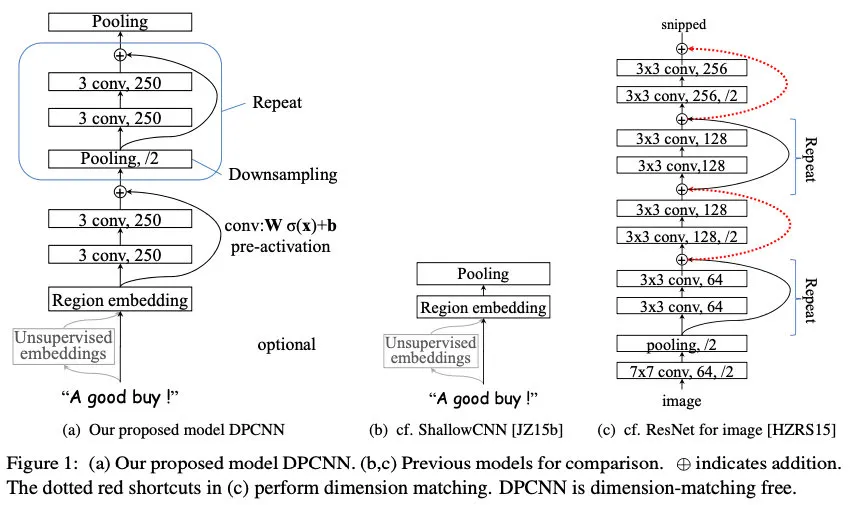

DPCNN的核心改进如下：

1. 区域嵌入
这里是将TextCNN的包含多尺寸卷积滤波器的卷积层的卷积结果称之为区域嵌入，即对一个文本区域/文本片段（比如3-gram）进行一组卷积操作后生成的embedding。

不同于TextCNN的二维卷积，DPCNN采用的是一维卷积。以3-gram为例，DPCNN，采用一种不保留词序的做法，即首先对3-gram中的3个词的词向量取均值得到一个大小为 $1 ∗ D$ 的向量，然后设置一组大小为 $1 ∗ D$ 的一维卷积核对该3-gram进行卷积操作。

2. 等长卷积

经过区域嵌入后，是两层卷积层，这里采用的是等长卷积，以此来提高词位embedding的表示的丰富性。

首先先介绍一下三种卷积的概念：

假设输入的序列长度为 $n$，卷积核大小为 $$m，步长(stride)为 $s$，输入序列两端各填补 $p$ 个零(zero padding)，那么该卷积层的输出序列为 $(n-m+2p)/s+1$。

1) 窄卷积：步长 $s=1$，两端不补零，即 $p=0$，卷积后输出长度为 $n-m+1$。
2) 宽卷积：步长 $s=1$，两端补零 $p=m-1$，卷积后输出长度 $n+m-1$。
3) 等长卷积：步长 $s=1$，两端补零 $p=(m-1)/2$，卷积后输出长度为 $n$。

输入输出序列的位置数一样多，即为等长卷积，该卷积的意义是：输出的词是由该位置输入的词以及其左右词的上下文信息提取得到的，也就是说，这个词包含被上下文信息修饰过的更高级别的语义。

3. 下采样（1/2池化）

本文使用一个 size=3，stride=2（大小为3，步长为2）的池化层进行最大池化，在此称为1/2池化层。每经过一个1/2池化层，序列的长度就被压缩成了原来的一半。因此，经过1/2池化后，同样一个size为3的卷积核，其能够感知到的文本片段就比之前长了一倍。

在堆叠多层卷积池化层之后，就得到了加深的可以抽取长距离的文本依赖关系的网络。最后的池化层把每段文本聚合为一个向量。

4. 残差链接，参考ResNet，减缓梯度弥散问题

> 这一部分内容参考：【参考资料8】

### 4.4 TextRCNN 篇

#### 4.4.1 简要介绍TextRCNN相较于TextCNN的改进？

TextRCNN实际是将RNN和CNN进行结合，先使用双向RNN获取输入文本的上语义和语法信息，接着使用最大池化自动地筛选出最重要的特征。然后接一个全连接层用于分类。

使用RNN处理输入序列时，是对输入序列的词按照次序进行处理，它通过隐藏层储存了之前的序列信息，能更好地获取上下文信息。然而RNN是有偏模型，后面输入的词的重要性要高于之前的词，而实际上一个文本中后面的词并不一定是最重要的词，最重要的词可能出现在文本的任何地方。而CNN则是无偏模型，通过最大池化来自动地筛选文本中重要的词，能够解决RNN有偏的问题。然而CNN是通过使用一定尺寸的窗口来提取特征（卷积操作），窗口的尺寸实际很难确定，尺寸太小则会丢失重要的信息，尺寸过大导致参数过多且难以训练。

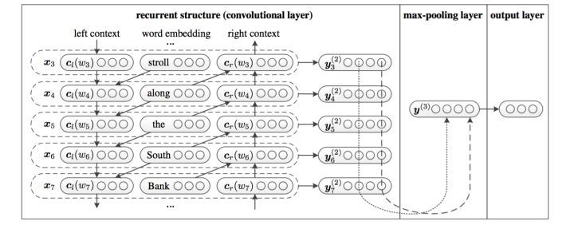

利用前向和后向RNN得到每个词的前向和后向上下文的表示：


这样词的表示就变成词向量和前向后向上下文向量concat起来的形式了，即：


最后再接跟TextCNN相同卷积层，pooling层即可，唯一不同的是卷积层 filter_size = 1就可以了，不再需要更大 filter_size 获得更大视野，这里词的表示也可以只用双向RNN输出。

### 4.5 RNN+Attention 篇

#### 4.5.1 RNN+Attention进行文本分类任务的思路，以及为什么要加Attention / 注意力机制如何应用于文本分类领域？

CNN和RNN用在文本分类任务中尽管效果显著，但都有一个不足的地方就是不够直观，可解释性不好，特别是在分析badcase时候感受尤其深刻。而注意力（Attention）机制是自然语言处理领域一个常用的建模长时间记忆机制，能够很直观的给出每个词对结果的贡献。

加入Attention之后最大的好处自然是能够直观的解释各个句子和词对分类类别的重要性。

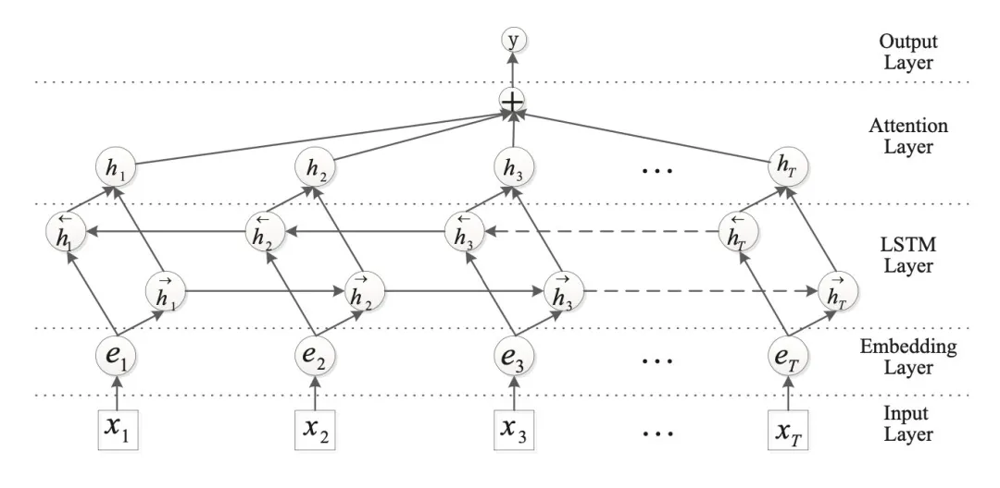

上图所示只是一个示例，attention层做最后的特征融合。这个加attention的套路用到CNN编码器之后代替pooling也是可以的。

也有学者先对每个句子用 BiGRU+Att 编码得到句向量，再对句向量用 BiGRU+Att 得到doc级别的表示进行分类。具体模型示意图如下：

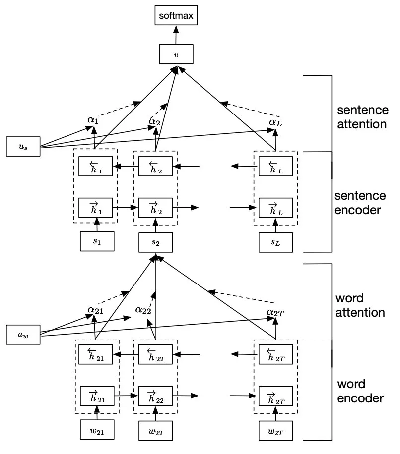

该模型就是HAN的示意图。HAN是attention机制用于文本分类的典型工作，通过将（1）文本组织成层次结构（词，句子），（2）并分别在词级别和句子级别使用注意力机制，保证最终文本表示由不同层次上重要的信息构成，在多个数据集上都取得较好效果。

### 4.6 GNN 图神经网络篇

#### 4.6.1 GNN 图神经网络如何应用于文本分类领域？

自然语言可以当作树结构和图结构来解析，文本中同时包含图结构，如句法分析和语法树往往以树形结构表示。

TextRank将图神经网络应用到处理这些图数据上。用来处理这种拓扑结构信息的模型，除了Tree-LSTM之外，就是GNN了。Graph-CNN首先将文本转换为由词构成的图，并使用图卷积来获取文本语义信息

### 4.7 Transformer 篇

#### 4.7.1 基于Transformer的预训练模型如何应用于文本分类领域？

预训练模型的提出，极大的促进了NLP的发展，也是未来NLP应用和演化的重要方向之一。比如BERT等。这几乎是NLP领域面试必定会被问到的问题。但是BERT的使用范围不局限于文本分类，几乎所有的NLP领域的应用BERT都能做，因此适合单独开一章来讲。

当用于分类任务时，这些预训练模型都可以后接一个线性分类层来微调模型参数。

### 4.8 预训练模型 篇

#### 4.8.1 你了解哪些预训练模型？它们的特点是什么？

自回归训练的模型：ELMo、OpenGPT、XLNet等

自编码的训练方法：BERT、RoBERTa等

OpenGPT是最早的自回归模型，它由12层Transformer组成，每个Transformer块都包含着（一个masked多头注意力模块+Layer Norm+全连接网络）。OpenGPT原来是做序列生成的，从左到右生成逐个单词，下个单词的生成的概率依赖于之前的生成结果。但是OpenGPT也可以用于文本分类任务中。

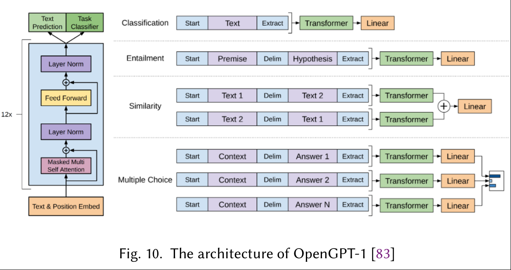

自编码模型中最著名的是BERT。不像OpenGPT在预测单词时依赖于前一个单词，BERT通过双向Transformer利用了整个序列的全部信息。BERT是通过随机mask掉序列中的单词后，令模型预测mask来训练的。这种思路正是降噪自编码器的思路。

RoBERTa是更加鲁棒的BERT，使用了更多的数据。ALBERT则减少了内存消耗和增加了训练速度。DistillBERT则通过知识蒸馏技术，在保证原有BERT的99%能力下，缩小了40%规模（猜想是参数量），推理速度提升60%。SpanBERT提升了BERT对文本span的表示能力和预测能力。

也有研究试图合并自回归和自编码模型。XLNet没有在pretraining阶段使用随机加mask的自编码模式，而是在pretraining阶段和fine-tune阶段采用了permutation operation。具体地说，XLNet依然是使用自回归器的训练模式，依赖context_before来预测当前的单词，只不过会对输入序列进行随机重排，这样context_after也有机会排到context_before去了。这个重新排序的操作是通过Attention Mask的方式实现的，它不会真正mask掉某个单词，只是通过Query向量，把那个单词的attention降到最低，这样模型就看不到它了。

XLNet的改进有三点，第一是吸收了BERT等自编码模型的经验，在自回归模型的训练和预测过程中引入了下文信息；第二是像GPT-2一样使用了 高质量的训练数据；第三是借鉴了Transformer XL中的技术（相对位置编码和分段RNN），能够应用于长文档的NLP场景。此外，由于XLNet是自回归模型，能够更好地融入文本生成类任务。

## 五、损失函数

### 5.1 激活函数sigmoid篇

#### 5.1.1 二分类问题使用的激活函数sigmoid简介？

二分类问题中，我们可以使用sigmoid函数将输入Wx+b映射到(0,1)区间中，从而得到属于某个类别的概率。

Sigmod激活函数和导函数分别为

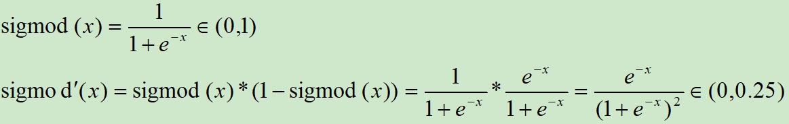

对应的图像分别为：

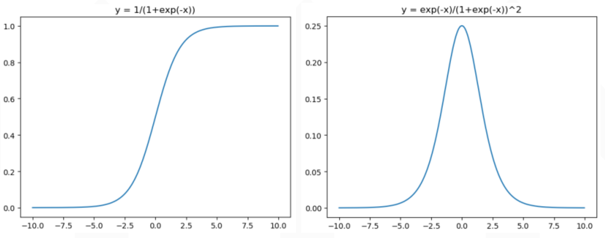

#### 5.1.2 Sigmod的缺点是什么？

1) 输出范围在0~1之间，均值为0.5，不是关于原点对称。需要做数据偏移，不方便下一层的学习。

2) 当x很小或很大时，存在导数很小的情况。神经网络主要的训练方法是BP算法，BP算法的基础是导数的链式法则，也就是多个导数的乘积。而sigmoid的导数最大为0.25，多个小于等于0.25的数值相乘，其运算结果很小。随着神经网络层数的加深，梯度后向传播到浅层网络时，基本无法引起参数的扰动，也就是没有将loss的信息传递到浅层网络，这样网络就无法训练学习了。这就是所谓的梯度消失。

3) 计算exp比较耗时。

### 5.2 激活函数softmax篇

#### 5.2.1 softmax函数是什么？

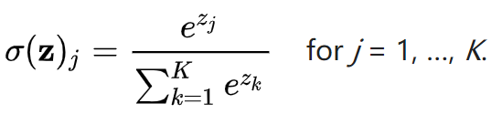

二分类问题中，我们可以使用sigmoid函数将输入Wx+b映射到(0,1)区间中，从而得到属于某个类别的概率。将这个问题进行泛化，推广到多分类问题中，我们可以使用softmax函数，对输出的值归一化为概率值

> 这一部分内容参考：【参考资料9】

#### 5.2.2 softmax函数怎么求导？

softmax函数如下：

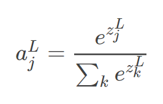

当 $j≠i$ 时，我们只用对分母求偏导就好

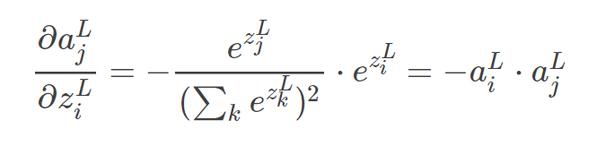

当 $j=i$ 时：

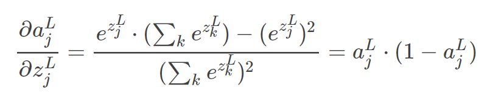

### 5.3 分类问题使用的损失函数还有有哪些？

- 负对数似然损失(neg log-likelihood loss)
- 交叉熵损失(cross entropy loss)
- 指数损失(exponential loss)
- 平方损失

> 这一部分内容参考：【参考资料10、11、12】

## 六、模型评估和算法比较

### 6.1 文本分类任务使用的评估算法和指标有哪些？

准确率、召回率、ROC，AUC，F1、混淆矩阵，kappa

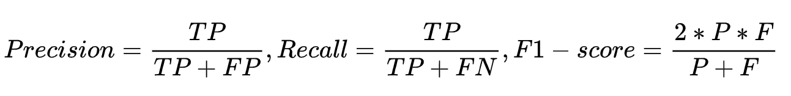

### 6.2 简单介绍混淆矩阵和kappa？

混淆表（有时也称为混淆矩阵）是具有两行两列的表，该表报告假阳性，假阴性，真阳性和真阴性的数量。 所有正确的预测都位于表格的对角线上（以粗体突出显示），因此很容易从视觉上检查表格中的预测错误，因为它们将由对角线之外的值表示。

Kappa系数用于一致性检验，也可以用于衡量分类精度，但kappa系数的计算是基于混淆矩阵的。

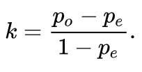

其中，$p_o$ 是每一类正确分类的样本数量之和除以总样本数，也就是总体分类精度 。

假设每一类的真实样本个数分别为a1,a2,...,aC，而预测出来的每一类的样本个数分别为b1,b2,...,bC,总样本个数为n，则有：

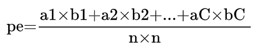

## 参考资料

1. [中文分词方法和软件工具汇总笔记](https://zhuanlan.zhihu.com/p/86322679)
2. [史上最全的分词算法与工具介绍](https://blog.csdn.net/xixiaoyaoww/article/details/104589402)
3. [《数学之美》第二版]()
4. [第6天：文本处理流程——停用词的过滤、正则化操作](https://zhuanlan.zhihu.com/p/143099147)
5. [tf-idf 介绍](https://zh.wikipedia.org/wiki/Tf-idf)
6. [BAT面试题42：深度学习解决大规模文本分类问题](https://cloud.tencent.com/developer/article/1399904)
7. [深入TextCNN（一）详述CNN及TextCNN原理](https://zhuanlan.zhihu.com/p/77634533)
8. [文本分类——DPCNN模型](https://blog.csdn.net/qq_38293297/article/details/107307768)
9. [【机器学习】softmax函数总结](https://blog.csdn.net/haolexiao/article/details/72757796)
10. [分类问题中的损失函数](https://zhuanlan.zhihu.com/p/74073096)
11. [常见的损失函数(loss function)总结](https://zhuanlan.zhihu.com/p/58883095)
12. [常用的分类问题中的损失函数](https://blog.csdn.net/weixin_41065383/article/details/89413819)