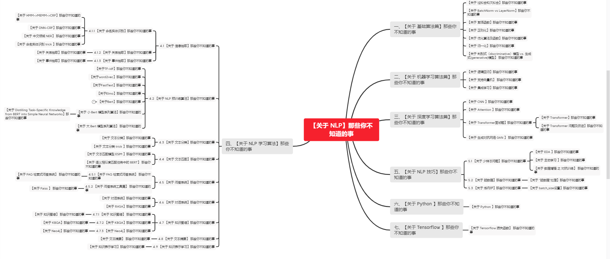

# 【关于 NLP】百问百答

> 作者：杨夕、芙蕖、李玲、陈海顺、twilight、LeoLRH、JimmyDU、张永泰
> 
> 介绍：本项目是作者们根据个人面试和经验总结出的自然语言处理(NLP)面试准备的学习笔记与资料，该资料目前包含 自然语言处理各领域的 面试题积累。
> 
> NLP 百面百搭 地址：https://github.com/km1994/NLP-Interview-Notes
> 
> **[手机版NLP百面百搭](https://mp.weixin.qq.com/s?__biz=MzAxMTU5Njg4NQ==&mid=100005719&idx=3&sn=5d8e62993e5ecd4582703684c0d12e44&chksm=1bbff26d2cc87b7bf2504a8a4cafc60919d722b6e9acbcee81a626924d80f53a49301df9bd97&scene=18#wechat_redirect)**
> 
> 推荐系统 百面百搭 地址：https://github.com/km1994/RES-Interview-Notes
> 
> **[手机版推荐系统百面百搭](https://mp.weixin.qq.com/s/b_KBT6rUw09cLGRHV_EUtw)**
> 
> 搜索引擎 百面百搭 地址：https://github.com/km1994/search-engine-Interview-Notes 【编写ing】
> 
> NLP论文学习笔记：https://github.com/km1994/nlp_paper_study
> 
> 推荐系统论文学习笔记：https://github.com/km1994/RS_paper_study
> 
> GCN 论文学习笔记：https://github.com/km1994/GCN_study
> 
> **推广搜 军火库**：https://github.com/km1994/recommendation_advertisement_search

> **关注公众号 【关于NLP那些你不知道的事】 加入 【NLP && 推荐学习群】一起学习！！！**

## 介绍

本项目是作者们根据个人面试和经验总结出的自然语言处理(NLP)面试准备的学习笔记与资料，该资料目前包含 自然语言处理各领域的 面试题积累。

> 注：github 网页版 看起来不舒服，可以看 **[手机版NLP百面百搭](https://mp.weixin.qq.com/s?__biz=MzAxMTU5Njg4NQ==&mid=100005719&idx=3&sn=5d8e62993e5ecd4582703684c0d12e44&chksm=1bbff26d2cc87b7bf2504a8a4cafc60919d722b6e9acbcee81a626924d80f53a49301df9bd97&scene=18#wechat_redirect)**

## 目录架构

- [【关于 NLP】百问百答](#关于-nlp百问百答)
  - [介绍](#介绍)
  - [目录架构](#目录架构)
  - [手机版 NLP 百面百搭](#手机版-nlp-百面百搭)
  - [内容框架](#内容框架)
    - [一、【关于 基础算法篇】那些你不知道的事](#一关于-基础算法篇那些你不知道的事)
    - [二、【关于 机器学习算法篇】那些你不知道的事](#二关于-机器学习算法篇那些你不知道的事)
    - [三、【关于 深度学习算法篇】那些你不知道的事](#三关于-深度学习算法篇那些你不知道的事)
    - [四、【关于 NLP 学习算法】那些你不知道的事](#四关于-nlp-学习算法那些你不知道的事)
      - [4.1 【关于 信息抽取】那些你不知道的事](#41-关于-信息抽取那些你不知道的事)
        - [4.1.1 【关于 命名实体识别】那些你不知道的事](#411-关于-命名实体识别那些你不知道的事)
        - [4.1.2 【关于 关系抽取】那些你不知道的事](#412-关于-关系抽取那些你不知道的事)
        - [4.1.3 【关于 事件抽取】那些你不知道的事](#413-关于-事件抽取那些你不知道的事)
      - [4.2 【关于 NLP 预训练算法】那些你不知道的事](#42-关于-nlp-预训练算法那些你不知道的事)
      - [4.3 【关于 文本分类】那些你不知道的事](#43-关于-文本分类那些你不知道的事)
      - [4.4 【关于 文本匹配】那些你不知道的事](#44-关于-文本匹配那些你不知道的事)
      - [4.5 【关于 问答系统】那些你不知道的事](#45-关于-问答系统那些你不知道的事)
        - [4.5.1 【关于 FAQ 检索式问答系统】 那些你不知道的事](#451-关于-faq-检索式问答系统-那些你不知道的事)
        - [4.5.2 【关于 问答系统工具篇】 那些你不知道的事](#452-关于-问答系统工具篇-那些你不知道的事)
      - [4.6 【关于 对话系统】那些你不知道的事](#46-关于-对话系统那些你不知道的事)
      - [4.7 【关于 知识图谱】那些你不知道的事](#47-关于-知识图谱那些你不知道的事)
        - [4.7.1 【关于 知识图谱】 那些你不知道的事](#471-关于-知识图谱-那些你不知道的事)
        - [4.7.2 【关于 KBQA】那些你不知道的事](#472-关于-kbqa那些你不知道的事)
        - [4.7.3 【关于 Neo4j】那些你不知道的事](#473-关于-neo4j那些你不知道的事)
      - [4.8 【关于 文本摘要】 那些你不知道的事](#48-关于-文本摘要-那些你不知道的事)
      - [4.9 【关于 知识表示学习】那些你不知道的事](#49-关于-知识表示学习那些你不知道的事)
      - [4.10  【关于 数据挖掘】那些你不知道的事](#410--关于-数据挖掘那些你不知道的事)
    - [五、【关于 NLP 技巧】那些你不知道的事](#五关于-nlp-技巧那些你不知道的事)
      - [5.1 【关于 少样本问题】那些你不知道的事](#51-关于-少样本问题那些你不知道的事)
      - [5.2 【关于 脏数据】那些你不知道的事](#52-关于-脏数据那些你不知道的事)
      - [5.3 【关于 炼丹炉】那些你不知道的事](#53-关于-炼丹炉那些你不知道的事)
      - [5.4 【关于 早停法 EarlyStopping 】那些你不知道的事](#54-关于-早停法-earlystopping-那些你不知道的事)
      - [5.5 【关于 标签平滑法 LabelSmoothing 】那些你不知道的事](#55-关于-标签平滑法-labelsmoothing-那些你不知道的事)
      - [5.6 【关于BERT如何处理篇章级长文本】那些你不知道的事](#56-关于bert如何处理篇章级长文本那些你不知道的事)
      - [5.7 【关于 Bert Trick】 那些你不知道的事](#57-关于-bert-trick-那些你不知道的事)
        - [5.7.1 【关于 Bert 未登录词处理】 那些你不知道的事](#571-关于-bert-未登录词处理-那些你不知道的事)
        - [5.7.2 【关于BERT在输入层引入额外特征】 那些你不知道的事](#572-关于bert在输入层引入额外特征-那些你不知道的事)
    - [六、【关于 Python 】那些你不知道的事](#六关于-python-那些你不知道的事)
    - [七、【关于 Tensorflow 】那些你不知道的事](#七关于-tensorflow-那些你不知道的事)

## 手机版 NLP 百面百搭

- **[手机版NLP百面百搭](https://mp.weixin.qq.com/s?__biz=MzAxMTU5Njg4NQ==&mid=100005719&idx=3&sn=5d8e62993e5ecd4582703684c0d12e44&chksm=1bbff26d2cc87b7bf2504a8a4cafc60919d722b6e9acbcee81a626924d80f53a49301df9bd97&scene=18#wechat_redirect)**

## 内容框架

### 一、[【关于 基础算法篇】那些你不知道的事](BasicAlgorithm/)

- [【关于 过拟合和欠拟合】那些你不知道的事](BasicAlgorithm/过拟合和欠拟合.md)
  - 一、过拟合和欠拟合 是什么？
  - 二、过拟合/高方差（overfiting / high variance）篇
    - 2.1 过拟合是什么及检验方法？
    - 2.2 导致过拟合的原因是什么？
    - 2.3 过拟合的解决方法是什么？
  - 三、欠拟合/高偏差（underfiting / high bias）篇
    - 3.1 欠拟合是什么及检验方法？
    - 3.2 导致欠拟合的原因是什么？
    - 3.3 过拟合的解决方法是什么？

- [【关于 BatchNorm vs LayerNorm】那些你不知道的事](BasicAlgorithm/BatchNormVsLayerNorm.md)
  - 一、动机篇
    - 1.1 独立同分布（independent and identically distributed）与白化
    - 1.2 （ Internal Covariate Shift，ICS）
    - 1.3 ICS问题带来的后果是什么？
  - 二、Normalization 篇
    - 2.1 Normalization 的通用框架与基本思想
  - 三、Batch Normalization 篇
    - 3.1 Batch Normalization（纵向规范化）是什么？
    - 3.2 Batch Normalization（纵向规范化）存在什么问题？
    - 3.3 Batch Normalization（纵向规范化）适用的场景是什么？
    - 3.4 BatchNorm 存在什么问题？
  - 四、Layer Normalization（横向规范化） 篇
    - 4.1 Layer Normalization（横向规范化）是什么？
    - 4.2 Layer Normalization（横向规范化）有什么用？
  - 五、BN vs LN 篇
  - 六、主流 Normalization 方法为什么有效？
- [【关于 激活函数】那些你不知道的事](BasicAlgorithm/激活函数.md)
  - 一、动机篇
    - 1.1 为什么要有激活函数？
  - 二、激活函数介绍篇
    - 2.1 sigmoid 函数篇
      - 2.1.1 什么是 sigmoid 函数？
      - 2.1.2 为什么选 sigmoid 函数 作为激活函数？
      - 2.1.3 sigmoid 函数 有什么缺点？
    - 2.2 tanh 函数篇
      - 2.2.1 什么是 tanh 函数？
      - 2.2.2 为什么选 tanh 函数 作为激活函数？
      - 2.2.3 tanh 函数 有什么缺点？
    - 2.3 relu 函数篇
      - 2.3.1 什么是 relu 函数？
      - 2.3.2 为什么选 relu 函数 作为激活函数？
      - 2.3.3 relu 函数 有什么缺点？
  - 三、激活函数选择篇
- [【关于 正则化】那些你不知道的事](BasicAlgorithm/正则化.md)
  - 一、L0，L1，L2正则化 篇
    - 1.1 正则化 是什么？
    - 1.2 什么是 L0 正则化 ？
    - 1.3 什么是 L1 （稀疏规则算子 Lasso regularization）正则化 ？
    - 1.4 什么是 L2 正则化（岭回归 Ridge Regression 或者 权重衰减 Weight Decay）正则化 ？
  - 二、对比篇
    - 2.1 什么是结构风险最小化？
    - 2.2 从结构风险最小化的角度理解L1和L2正则化
    - 2.3 L1 vs L2
  - 三、dropout 篇
    - 3.1 什么是 dropout？
    - 3.2 dropout 在训练和测试过程中如何操作？
    - 3.3 dropout 如何防止过拟合?
- [【关于 优化算法及函数】那些你不知道的事](BasicAlgorithm/优化算法及函数.md)
  - 一、动机篇
    - 1.1 为什么需要 优化函数？
    - 1.2 优化函数的基本框架是什么?
  - 二、优化函数介绍篇
    - 2.1 梯度下降法是什么?
    - 2.2 随机梯度下降法是什么?
    - 2.3 Momentum 是什么?
    - 2.4 SGD with Nesterov Acceleration 是什么?
    - 2.5 Adagrad 是什么?
    - 2.6 RMSProp/AdaDelta 是什么？
    - 2.7 Adam 是什么?
    - 2.8 Nadam 是什么?
  - 三、优化函数学霸笔记篇
- [【关于 归一化】那些你不知道的事](BasicAlgorithm/归一化.md)
  - 一、动机篇
    - 1.1 为什么要归一化？
  - 二、介绍篇
    - 2.1  归一化 有 哪些方法？
    - 2.2  归一化 各方法 特点？
    - 2.3  归一化 的 意义？
  - 三、应用篇
    - 3.1 哪些机器学习算法 需要做 归一化？
    - 3.2 哪些机器学习算法 不需要做 归一化？
- [【关于 判别式（discriminative）模型 vs. 生成式(generative)模型】 那些你不知道的事](BasicAlgorithm/判别式vs生成式.md)
  - 一、判别式模型篇
    - 1.1 什么是判别式模型？
    - 1.2 判别式模型是思路是什么？
    - 1.3 判别式模型的优点是什么？
  - 二、生成式模型篇
    - 2.1 什么是生成式模型？
    - 2.2 生成式模型是思路是什么？
    - 2.3 生成式模型的优点是什么？
    - 2.4 生成式模型的缺点是什么？

### 二、[【关于 机器学习算法篇】那些你不知道的事](MachineLearningAlgorithm)

- [【关于 逻辑回归】那些你不知道的事](MachineLearningAlgorithm/逻辑回归.md)
  - 一、介绍篇
    - 1.1什么是逻辑回归
    - 1.2逻辑回归的优势
  - 二、推导篇
    - 2.1逻辑回归推导
    - 2.2求解优化
- [【关于 支持向量机】 那些你不知道的事](MachineLearningAlgorithm/支持向量机.md)
  - 一、原理篇
    - 1.1 什么是SVM？
      - Q.A
    - 1.2 SVM怎么发展的？
    - 1.3 SVM存在什么问题？
      - Q.A
  - 二、算法篇
    - 2.1 什么是块算法？
    - 2.2 什么是分解算法？
    - 2.3 什么是序列最小优化算法？
    - 2.4 什么是增量算法？
      - Q.A
  - 三、其他SVM篇
    - 3.1 什么是最小二次支持向量机？
    - 3.2 什么是模糊支持向量机？
    - 3.3 什么是粒度支持向量机？
    - 3.4 什么是多类训练算法？
    - 3.5 什么是孪生支持向量机？
    - 3.6 什么是排序支持向量机？
      - Q.A
  - 四、应用篇
    - 4.1 模式识别
    - 4.2 网页分类
    - 4.3 系统建模与系统辨识
    - 4.4 其他
  - 五、对比篇
  - 六、拓展篇
- [【关于 集成学习】那些你不知道的事](MachineLearningAlgorithm/集成学习.md)
  - 一、动机
  - 二、集成学习介绍篇
    - 2.1 介绍篇
      - 2.1.1 集成学习的基本思想是什么？
      - 2.1.2 集成学习为什么有效？
  - 三、 Boosting 篇
    - 3.1 用一句话概括 Boosting？
    - 3.2 Boosting 的特点是什么？
    - 3.3 Boosting 的基本思想是什么？
    - 3.4 Boosting 的特点是什么？
    - 3.5 GBDT 是什么？
    - 3.6 Xgboost 是什么？
  - 四、Bagging 篇
    - 4.1 用一句话概括 Bagging？
    - 4.2 Bagging 的特点是什么？
    - 4.3 Bagging 的基本思想是什么？
    - 4.4 Bagging 的基分类器如何选择？
    - 4.5 Bagging 的优点 是什么？
    - 4.6 Bagging 的特点是什么？
    - 4.7 随机森林 是什么？
  - 五、 Stacking 篇
    - 5.1 用一句话概括 Stacking ？
    - 5.2 Stacking 的特点是什么？
    - 5.3 Stacking 的基本思路是什么？
  - 六、常见问题篇
    - 6.1 为什么使用决策树作为基学习器？
    - 6.2 为什么不稳定的学习器更适合作为基学习器？
    - 6.3 哪些模型适合作为基学习器？
    - 6.4 Bagging 方法中能使用线性分类器作为基学习器吗？ Boosting 呢？
    - 6.5 Boosting/Bagging 与 偏差/方差 的关系？
  - 七、对比篇
    - 7.1 LR vs GBDT?
      - 7.1.1 从机器学习三要素的角度
        - 7.1.1.1 从模型角度
        - 7.1.1.2 从策略角度
          - 7.1.1.2.1 从 Loss 角度
          - 7.1.1.2.2 从 特征空间 角度
          - 7.1.1.2.3 从 正则 角度
        - 7.1.1.3 从算法角度
      - 7.1.2 从特征的角度
        - 7.1.2.1 特征组合
        - 7.1.2.2 特特征的稀疏性
      - 7.1.3  数据假设不同
        - 7.1.3.1 LR
        - 7.1.3.2 GBDT
  - 参考
### 三、[【关于 深度学习算法篇】那些你不知道的事](DeepLearningAlgorithm)
  
- [【关于 CNN 】那些你不知道的事](DeepLearningAlgorithm/cnn/)
  - 一、动机篇
  - 二、CNN 卷积层篇
    - 2.1 卷积层的本质是什么？
    - 2.2 CNN 卷积层与全连接层的联系？
    - 2.3 channel的含义是什么？
  - 三、CNN 池化层篇
    - 3.1 池化层针对区域是什么？
    - 3.2 池化层的种类有哪些？
    - 3.3 池化层的作用是什么？
    - 3.4 池化层 反向传播 是什么样的？
    - 3.5 mean pooling 池化层 反向传播 是什么样的？
    - 3.6 max pooling 池化层 反向传播 是什么样的？
  - 四、CNN 整体篇
    - 4.1 CNN 的流程是什么？
    - 4.2 CNN 的特点是什么？
    - 4.3 卷积神经网络为什么会具有平移不变性？
    - 4.4 卷积神经网络中im2col是如何实现的？
    - 4.5 CNN 的局限性是什么？
  - 五、Iterated Dilated CNN 篇
    - 5.1 什么是 Dilated CNN 空洞卷积？
    - 5.2 什么是 Iterated Dilated CNN？
  - 六、反卷积 篇
    - 6.1 解释反卷积的原理和用途？
- [【关于 Attention 】那些你不知道的事](DeepLearningAlgorithm/attention)
  - 一、seq2seq 篇
    - 1.1 seq2seq （Encoder-Decoder）是什么？
    - 1.2 seq2seq 中 的 Encoder 怎么样？
    - 1.3 seq2seq 中 的 Decoder 怎么样？
    - 1.4 在 数学角度上 的 seq2seq ，你知道么？
    - 1.5 seq2seq 存在 什么 问题？
  - 二、Attention 篇
    - 2.1 什么是 Attention?
    - 2.2 为什么引入 Attention机制？
    - 2.3 Attention 有什么作用？
    - 2.4 Attention 流程是怎么样？
      - 步骤一  执行encoder (与 seq2seq 一致)
      - 步骤二  计算对齐系数 a
      - 步骤三  计算上下文语义向量 C
      - 步骤四  更新decoder状态
      - 步骤五 计算输出预测词
    - 2.5 Attention 的应用领域有哪些？
  - 三、Attention 变体篇
    - 3.1 Soft Attention 是什么？
    - 3.2 Hard Attention 是什么？
    - 3.3 Global Attention 是什么？
    - 3.4 Local Attention 是什么？
    - 3.5 self-attention 是什么？
- [【关于 Transformer面试题】那些你不知道的事](DeepLearningAlgorithm/transformer)
  - [【关于 Transformer】那些你不知道的事](DeepLearningAlgorithm/transformer/readme.md) 
    - 一、动机篇
      - 1.1 为什么要有 Transformer?
      - 1.2 Transformer 作用是什么？
    - 二、整体结构篇
      - 2.1 Transformer 整体结构是怎么样？
      - 2.2 Transformer-encoder 结构怎么样？
      - 2.3 Transformer-decoder 结构怎么样?
    - 三、模块篇
      - 3.1 self-attention 模块
        - 3.1.1 传统 attention 是什么?
        - 3.1.2 为什么 会有self-attention?
        - 3.1.3 self-attention 的核心思想是什么?
        - 3.1.4 self-attention 的目的是什么?
        - 3.1.5 self-attention 的怎么计算的?
        - 3.1.6 self-attention 为什么Q和K使用不同的权重矩阵生成，为何不能使用同一个值进行自身的点乘？
        - 3.1.7 为什么采用点积模型的 self-attention 而不采用加性模型？
        - 3.1.8 Transformer 中在计算 self-attention 时为什么要除以 $\sqrt{d}$？
        - 3.1.9 self-attention 如何解决长距离依赖问题？
        - 3.1.10 self-attention 如何并行化？
      - 3.2 multi-head attention 模块
        - 3.2.1 multi-head attention 的思路是什么样?
        - 3.2.2 multi-head attention 的步骤是什么样?
        - 3.2.3 Transformer为何使用多头注意力机制？（为什么不使用一个头）
        - 3.2.4 为什么在进行多头注意力的时候需要对每个head进行降维？
        - 3.2.5 multi-head attention 代码介绍
      - 3.3 位置编码（Position encoding）模块
        - 3.3.1 为什么要 加入 位置编码（Position encoding） ？
        - 3.3.2 位置编码（Position encoding）的思路是什么 ？
        - 3.3.3 位置编码（Position encoding）的作用是什么 ？
        - 3.3.4 位置编码（Position encoding）的步骤是什么 ？
        - 3.3.5 Position encoding为什么选择相加而不是拼接呢？
        - 3.3.6 Position encoding和 Position embedding的区别？
        - 3.3.7 为何17年提出Transformer时采用的是 Position Encoder  而不是Position Embedding？而Bert却采用的是 Position Embedding ？
        - 3.3.8 位置编码（Position encoding）的代码介绍
      - 3.4 残差模块模块
        - 3.4.1 为什么要 加入 残差模块？
      - 3.5 Layer normalization 模块
        - 3.5.1 为什么要 加入 Layer normalization 模块？
        - 3.5.2 Layer normalization 模块的是什么？
        - 3.5.3 Batch normalization 和 Layer normalization 的区别？
        - 3.5.4 Transformer 中为什么要舍弃 Batch normalization 改用 Layer normalization 呢?
        - 3.5.5  Layer normalization 模块代码介绍
      - 3.6 Mask 模块
        - 3.6.1 什么是 Mask？
        - 3.6.2 Transformer 中用到 几种 Mask？
        - 3.6.3 能不能介绍一下 Transformer 中用到几种 Mask？
  - [【关于 Transformer 问题及改进】那些你不知道的事](DeepLearningAlgorithm/transformer/transformer_error.md) 
    - 一、Transformer 问题篇
      - 1.1 既然 Transformer 怎么牛逼，是否还存在一些问题？
    - 二、每个问题的解决方法是什么？
      - 2.1 问题一：Transformer 不能很好的处理超长输入问题
        - 2.1.1 Transformer 固定了句子长度？
        - 2.1.2 Transformer 固定了句子长度 的目的是什么？
        - 2.1.3 Transformer 针对该问题的处理方法？
      - 2.2 问题二：Transformer 方向信息以及相对位置 的 缺失 问题
      - 2.3  问题三：缺少Recurrent Inductive Bias
      - 问题四：问题四：Transformer是非图灵完备的： 非图灵完备通俗的理解，就是无法解决所有的问题
      - 问题五：transformer缺少conditional computation；
      - 问题六：transformer 时间复杂度 和 空间复杂度 过大问题；
- [【关于 生成对抗网络 GAN 】 那些你不知道的事](DeepLearningAlgorithm/adversarial_training_study/readme.md)
  - 一、动机
  - 二、介绍篇
    - 2.1 GAN 的基本思想
    - 2.2 GAN 基本介绍
      - 2.2.1  GAN 的基本结构
      - 2.2.2 GAN 的基本思想
  - 三、训练篇
    - 3.1 生成器介绍
    - 3.2 判别器介绍
    - 3.3 训练过程
    - 3.4  训练所涉及相关理论基础
  - 四、总结
- [【关于 RNN】那些你不知道的事](https://github.com/km1994/NLP-Interview-Notes/tree/main/DeepLearningAlgorithm/rnn#关于-rnn那些你不知道的事)
  - 一、RNN 篇
    - 1.2 为什么需要 RNN?
    - 1.2 RNN 结构是怎么样的？
    - 1.3 RNN 前向计算公式？
    - 1.4 RNN 存在什么问题？
  - 二、长短时记忆网络(Long Short Term Memory Network, LSTM) 篇
    - 2.1 为什么 需要 LSTM?
    - 2.2 LSTM 的结构是怎么样的?
    - 2.3 LSTM 如何缓解 RNN 梯度消失和梯度爆炸问题?
    - 2.3 LSTM 的流程是怎么样的?
    - 2.4 LSTM 中激活函数区别?
    - 2.5 LSTM的复杂度？
    - 2.6 LSTM 存在什么问题？
  - 三、GRU (Gated Recurrent Unit)
    - 3.1 为什么 需要 GRU?
    - 3.2 GRU 的结构是怎么样的?
    - 3.3 GRU 的前向计算?
    - 3.4 GRU 与其他 RNN系列模型的区别？
  - 四、RNN系列模型篇
    - 4.1 RNN系列模型 有什么特点？
  - 参考

### 四、[【关于 NLP 学习算法】那些你不知道的事](NLPinterview)

#### 4.1 [【关于 信息抽取】那些你不知道的事](NLPinterview/NER/)

##### 4.1.1 [【关于 命名实体识别】那些你不知道的事](NLPinterview/NER/)

- [【关于 HMM->MEMM->CRF】那些你不知道的事](NLPinterview/ner/crf/)
  - 一、基础信息 介绍篇
    - 1.1 什么是概率图模型？
    - 1.2 什么是 随机场？
  - 二、马尔可夫过程 介绍篇
    - 2.1 什么是 马尔可夫过程？
    - 2.2 马尔可夫过程 的核心思想 是什么？
  - 三、隐马尔科夫算法 篇
    - 3.1 隐马尔科夫算法 介绍篇
      - 3.1.1 隐马尔科夫算法 是什么？
      - 3.1.2 隐马尔科夫算法 中 两个序列 是什么？
      - 3.1.3 隐马尔科夫算法 中 三个矩阵 是什么？
      - 3.1.4 隐马尔科夫算法 中 两个假设 是什么？
      - 3.1.5 隐马尔科夫算法 中 工作流程 是什么？
    - 3.2 隐马尔科夫算法 模型计算过程篇
      - 3.2.1 隐马尔科夫算法 学习训练过程 是什么样的？
      - 3.2.2 隐马尔科夫算法 序列标注（解码）过程 是什么样的？
      - 3.2.3 隐马尔科夫算法 序列概率过程 是什么样的？
    - 3.3 隐马尔科夫算法 问题篇
  - 四、最大熵马尔科夫模型（MEMM）篇
    - 4.1 最大熵马尔科夫模型（MEMM）动机篇
      - 4.1.1 HMM 存在 什么问题？
    - 4.2 最大熵马尔科夫模型（MEMM）介绍篇
      - 4.2.1 最大熵马尔科夫模型（MEMM） 是什么样？
      - 4.2.2 最大熵马尔科夫模型（MEMM） 如何解决 HMM 问题？
    - 4.3 最大熵马尔科夫模型（MEMM）问题篇
  - 五、条件随机场（CRF）篇
    - 5.1 CRF 动机篇
      - 5.1.1 HMM 和 MEMM 存在什么问题？
    - 5.2 CRF 介绍篇
      - 5.2.1 什么是 CRF?
      - 5.2.2 CRF 的 主要思想是什么？
      - 5.2.3  CRF 的定义是什么?
      - 5.2.4 CRF 的 流程是什么？
    - 5.3 CRF 优缺点篇
      - 5.3.1 CRF 的 优点在哪里？
      - 5.3.2 CRF 的 缺点在哪里？
    - 5.4 CRF 复现？
  - 六、对比篇
    - 6.1 CRF模型 和 HMM和MEMM模型 区别？
- [【关于 DNN-CRF】那些你不知道的事](NLPinterview/ner/DNN/readme.md)
  - 一、基本信息
    - 1.1 命名实体识别 评价指标 是什么？
  - 二、传统的命名实体识别方法
    - 2.1 基于规则的命名实体识别方法是什么？
    - 2.2 基于无监督学习的命名实体识别方法是什么？
    - 2.3 基于特征的监督学习的命名实体识别方法是什么？
  - 三、基于深度学习的命名实体识别方法
    - 3.1 基于深度学习的命名实体识别方法 相比于 基于机器学习的命名实体识别方法的优点？
    - 3.2 基于深度学习的命名实体识别方法  的 结构是怎么样？
    - 3.3 分布式输入层 是什么，有哪些方法？
    - 3.4 文本编码器篇
      - 3.4.1 BiLSTM-CRF 篇
        - 3.4.1.1 什么是 BiLSTM-CRF？
        - 3.4.1.2 为什么要用 BiLSTM？
      - 3.4.2 IDCNN-CRF 篇
        - 3.4.2.1 什么是 Dilated CNN？
        - 3.4.2.2 为什么会有 Dilated CNN？
        - 3.4.2.3 Dilated CNN 的优点？
        - 3.4.2.4 IDCNN-CRF 介绍
    - 3.5 标签解码器篇
      - 3.5.1 标签解码器是什么？
      - 3.5.2 MLP+softmax层 介绍？
      - 3.5.3 条件随机场CRF层 介绍？
      - 3.5.4 循环神经网络RNN层 介绍？
      - 3.5.3 指针网路层 介绍？
  - 四、对比 篇
    - 4.1 CNN-CRF vs BiLSTM-CRF vs IDCNN-CRF?
    - 4.2 为什么 DNN 后面要加 CRF?
    - 4.3 CRF in TensorFlow V.S. CRF in discrete toolkit？
- [【关于 中文领域 NER】 那些你不知道的事](NLPinterview/ner/ChineseNer/readme.md)
  - 一、动机篇
    - 1.1 中文命名实体识别 与 英文命名实体识别的区别？
  - 二、词汇增强篇
    - 2.1 什么是 词汇增强？
    - 2.2 为什么说 「词汇增强」 方法对于中文 NER 任务有效呢？
    - 2.3 词汇增强 方法有哪些？
    - 2.4 Dynamic Architecture
      - 2.4.1 什么是 Dynamic Architecture？
      - 2.4.2 常用方法有哪些？
      - 2.4.3 什么是 Lattice LSTM ，存在什么问题？
      - 2.4.4 什么是 FLAT ，存在什么问题？
    - 2.5 Adaptive Embedding 范式
      - 2.5.1 什么是 Adaptive Embedding 范式？
      - 2.5.2 常用方法有哪些？
      - 2.5.3 什么是 WC-LSTM ，存在什么问题？
  - 三、词汇/实体类型信息增强篇
    - 3.1 什么是 词汇/实体类型信息增强？
    - 3.2 为什么说 「词汇/实体类型信息增强」 方法对于中文 NER 任务有效呢？
    - 3.3 词汇/实体类型信息增强 方法有哪些？
    - 3.4 什么是 LEX-BERT ？
- [【关于 命名实体识别 trick 】那些你不知道的事](NLPinterview/ner/NERtrick/NERtrick.md)
  - trick 1：领域词典匹配
  - trick 2：规则抽取
  - trick 3：词向量选取：词向量 or 字向量？
  - trick 4：特征提取器 如何选择？
  - trick 5：专有名称 怎么 处理？【注：这一点来自于 命名实体识别的几点心得 】
  - trick 6：标注数据 不足怎么处理？【这个问题可以说是现在很多小厂最头疼的问题】
  - trick 7：嵌套命名实体识别怎么处理 【注：参考 资料3】
    - 7.1 什么是实体嵌套？
    - 7.2 与 传统命名实体识别任务的区别
    - 7.3 解决方法：
      - 7.3.1 方法一：序列标注
      - 7.3.2 方法二：指针标注
      - 7.3.3 方法三：多头标注
      - 7.3.4 方法四：片段排列
  - trick 8：为什么说 「词汇增强」 方法对于中文 NER 任务有效？
  - trick 9：NER实体span过长怎么办？
  - trick 10: NER 标注数据噪声问题？
  - trick 11： 给定两个命名实体识别任务，一个任务数据量足够，另外一个数据量很少，可以怎么做？
  - trick 12： NER 标注数据不均衡问题？

##### 4.1.2 [【关于 关系抽取】那些你不知道的事](NLPinterview/RelationExtraction/)

- [【关于 关系抽取】那些你不知道的事](NLPinterview/RelationExtraction/)
  - 一、动机篇
    - 1.1 什么是关系抽取？
    - 1.2 关系抽取技术有哪些类型？
    - 1.3 常见的关系抽取流程是怎么做的？
  - 二、经典关系抽取篇
    - 2.1 模板匹配方法是指什么？有什么优缺点？
    - 2.2 远监督关系抽取是指什么？它有什么优缺点？
    - 2.3 什么是关系重叠？复杂关系问题？
    - 2.4 联合抽取是什么？难点在哪里？
    - 2.5 联合抽取总体上有哪些方法？各有哪些缺点？
    - 2.6 介绍基于共享参数的联合抽取方法？
      - 依存结构树：End-to-End Relation Extraction using LSTMs on Sequences and Tree Structures
      - 指针网络，Going out on a limb: Joint Extraction of Entity Mentions and Relations without Dependency Trees
      - Copy机制+seq2seq：Extracting Relational Facts by an End-to-End Neural Model with Copy Mechanism19]
      - 多头选择机制+sigmoid：Joint entity recognition and relation extraction as a multi-head selection problem
      - SPO问题+指针网络，Joint Extraction of Entities and Relations Based on a Novel Decomposition Strategy
      - 多轮对话+强化学习 ：*Entity-Relation Extraction as Multi-Turn Question Answering*
      - 输入端的片段排列： Span-Level Model for Relation Extraction
      - 输出端的片段排列：SpERT：Span-based Joint Entity and Relation Extraction with Transformer Pre-training
    - 2.7 介绍基于联合解码的联合抽取方法？
      - Joint extraction of entities and relations based on a novel tagging scheme
      - Joint Extraction of Entities and Overlapping Relations Using Position-Attentive Sequence Labeling
      - Joint extraction of entities and relations based on a novel tagging scheme
    - 2.8 实体关系抽取的前沿技术和挑战有哪些？如何解决低资源和复杂样本下的实体关系抽取？
  - 三、文档级关系抽取篇
    - 3.1 文档级关系抽取与经典关系抽取有何区别？
    - 3.2 文档级别关系抽取中面临什么样的问题？
    - 3.3 文档级关系抽取的方法有哪些？
      - 3.3.1 基于BERT-like的文档关系抽取是怎么做的？
      - 3.3.2 基于graph的文档关系抽取是怎么做的？
    - 3.4 文档级关系抽取常见数据集有哪些以及其评估方法？

##### 4.1.3 [【关于 事件抽取】那些你不知道的事](NLPinterview/EventExtraction/)

- [【关于 事件抽取】那些你不知道的事](NLPinterview/EventExtraction/)
  - 一、原理篇
    - 1.1 什么是事件？
    - 1.2 什么是事件抽取？
    - 1.3 ACE测评中事件抽取涉及的几个基本术语及任务是什么？
    - 1.4 事件抽取怎么发展的？
    - 1.5 事件抽取存在什么问题？
  - 二、基本任务篇
    - 2.1 触发词检测
      - 2.1.1 什么是触发词检测？
      - 2.1.2 触发词检测有哪些方法？
    - 2.2 类型识别
      - 2.2.1 什么是类型识别？
      - 2.2.2 类型识别有哪些方法？
    - 2.3 角色识别
      - 2.3.1 什么是角色识别？
      - 2.3.2 角色识别有哪些方法？
    - 2.4 论元检测
      - 2.4.1 什么是论元检测？
      - 2.4.2 论元检测有哪些方法？
  - 三、常见方法篇
    - 3.1 模式匹配方法怎么用在事件抽取中?
    - 3.2 统计机器学习方法怎么用在事件抽取中?
    - 3.3 深度学习方法怎么用在事件抽取中?
  - 四、数据集及评价指标篇
    - 4.1 事件抽取中常见的英文数据集有哪些？
    - 4.2 事件抽取中常见的中文数据集有哪些？
    - 4.3 事件抽取的评价指标是什么？怎么计算的？
  - 五、对比篇
    - 5.1 事件抽取和命名实体识别（即实体抽取）有什么异同？
    - 5.2 事件抽取和关系抽取有什么异同？
    - 5.3 什么是事理图谱？有哪些事件关系类型？事理图谱怎么构建？主要技术领域及当前发展热点是什么？
  - 六、应用篇
  - 七、拓展篇
    - 7.1 事件抽取论文综述
    - 7.2 事件抽取常见问题

#### 4.2 [【关于 NLP 预训练算法】那些你不知道的事](NLPinterview/PreTraining/)

- [【关于TF-idf】那些你不知道的事](NLPinterview/PreTraining/tfidf)
  - 一、one-hot 篇
    - 1.1 为什么有 one-hot ？
    - 1.2 one-hot 是什么?
    - 1.3 one-hot 有什么特点?
    - 1.4 one-hot 存在哪些问题?
  - 二、TF-IDF 篇
    - 2.1 什么是 TF-IDF？
    - 2.2  TF-IDF 如何评估词的重要程度？
    - 2.3  TF-IDF 的思想是什么？
    - 2.4  TF-IDF 的计算公式是什么？
    - 2.5  TF-IDF 怎么描述？
    - 2.6  TF-IDF 的优点是什么？
    - 2.7  TF-IDF 的缺点是什么？
    - 2.8  TF-IDF 的应用？
- [【关于word2vec】那些你不知道的事](NLPinterview/PreTraining/word2vec)
  - 一、Wordvec 介绍篇
    - 1.1 Wordvec 指什么?
    - 1.2 Wordvec 中 CBOW 指什么?
    - 1.3 Wordvec 中 Skip-gram 指什么?
    - 1.4 CBOW vs Skip-gram 哪一个好？
  - 二、Wordvec 优化篇
    - 2.1  Word2vec 中 霍夫曼树 是什么？
    - 2.2  Word2vec 中 为什么要使用 霍夫曼树？
    - 2.3  Word2vec 中使用 霍夫曼树 的好处？
    - 2.4 为什么 Word2vec 中会用到 负采样？
    - 2.5 Word2vec 中会用到 负采样 是什么样？
    - 2.6  Word2vec 中 负采样 的采样方式？
  - 三、Wordvec 对比篇
    - 3.1 word2vec和NNLM对比有什么区别？（word2vec vs NNLM）
    - 3.2 word2vec和tf-idf 在相似度计算时的区别？
  - 四、word2vec 实战篇
    - 4.1 word2vec训练trick，window设置多大？
    - 4.1 word2vec训练trick，词向量纬度，大与小有什么影响，还有其他参数？
- [【关于FastText】那些你不知道的事](NLPinterview/PreTraining/fasttext)
  - 一、fastText  动机篇
    - 1.1 word-level Model 是什么？
    - 1.2 word-level Model 存在什么问题？
    - 1.3 Character-Level Model 是什么？
    - 1.4 Character-Level Model 优点？
    - 1.5 Character-Level Model 存在问题？
    - 1.6 Character-Level Model 问题的解决方法？
  - 二、 词内的n-gram信息(subword n-gram information) 介绍篇
    - 2.1 引言
    - 2.2 fastText 是什么?
    - 2.3 fastText 的结构是什么样?
    - 2.4 为什么 fastText 要使用词内的n-gram信息(subword n-gram information)?
    - 2.5 fastText 词内的n-gram信息(subword n-gram information) 介绍?
    - 2.6 fastText 词内的n-gram信息 的 训练过程?
    - 2.7 fastText 词内的n-gram信息 存在问题?
  - 三、 层次化Softmax回归(Hierarchical Softmax) 介绍篇
    - 3.1 为什么要用 层次化Softmax回归(Hierarchical Softmax) ？
    - 3.2 层次化Softmax回归(Hierarchical Softmax) 的思想是什么？
    - 3.3 层次化Softmax回归(Hierarchical Softmax) 的步骤？
  - 四、fastText 存在问题？
- [【关于Elmo】那些你不知道的事](NLPinterview/PreTraining/elmo)
  - 一、Elmo 动机篇
    - 1.1 为什么会有 Elmo？
  - 二、Elmo 介绍篇
    - 2.1 Elmo 的 特点？
    - 2.2 Elmo 的 思想是什么？
  - 三、Elmo 问题篇
    - 3.1 Elmo 存在的问题是什么？
- [【关于Bert】那些你不知道的事](NLPinterview/PreTraining/bert)
  - [【关于Bert】那些你不知道的事](NLPinterview/PreTraining/bert/readme.md) 
    - 一、动机篇
      - 1.1 【演变史】one-hot 存在问题?
      - 1.2【演变史】wordvec 存在问题?
      - 1.3【演变史】fastText 存在问题?
      - 1.4【演变史】elmo 存在问题?
    - 二、Bert 篇
      - 2.1 Bert 介绍篇
        - 2.1.1【BERT】Bert 是什么?
        - 2.1.2【BERT】Bert 三个关键点？
      - 2.2 Bert 输入输出表征篇
        - 2.2.1 【BERT】Bert 输入输出表征长啥样？
      - 2.3 【BERT】Bert 预训练篇
        - 2.3.1 【BERT】Bert 预训练任务介绍
        - 2.3.2 【BERT】Bert 预训练任务 之 Masked LM 篇
          - 2.3.2.1 【BERT】 Bert 为什么需要预训练任务 Masked LM ？
          - 2.3.2.2 【BERT】 Bert 预训练任务 Masked LM 怎么做？
          - 2.3.2.3 【BERT】 Bert 预训练任务 Masked LM 存在问题？
          - 2.3.2.4 【BERT】 预训练和微调之间的不匹配的解决方法？
        - 2.3.3 【BERT】Bert 预训练任务 之 Next Sentence Prediction 篇
          - 2.3.3.1 【BERT】Bert 为什么需要预训练任务 Next Sentence Prediction ？
          - 2.3.3.2 【BERT】 Bert 预训练任务 Next Sentence Prediction 怎么做？
      - 2.4 【BERT】 fine-turning 篇？
        - 2.4.1 【BERT】为什么 Bert 需要 fine-turning？
        - 2.4.2 【BERT】 Bert 如何 fine-turning？
      - 2.5 【BERT】 Bert 损失函数篇？
        - 2.5.1 【BERT】BERT的两个预训练任务对应的损失函数是什么(用公式形式展示)？
    - 三、 对比篇？
      - 3.1 【对比】多义词问题是什么？
      - 3.2 【对比】word2vec 为什么解决不了多义词问题？
      - 3.3 【对比】GPT和BERT有什么不同？
      - 3.4 【对比】为什么 elmo、GPT、Bert能够解决多义词问题？（以 elmo 为例）
  - [【关于 Bert 源码解析I 之 主体篇】那些你不知道的事](NLPinterview/PreTraining/bert/bertCode1_modeling.md)
      - 一、动机
      - 二、本文框架
      - 三、前言
      - 四、配置类 BertConfig
      - 五、获取 词向量 （Embedding_lookup）
      - 六、词向量 的后处理 （embedding_postprocessor）
        - 6.1 介绍
        - 6.2 特点
        - 6.3 代码实现
      - 七、创建 attention mask （attention_mask）
        - 7.1 作用
        - 7.2 代码
      - 八、注意力层（attention layer）
        - 8.1 自注意力层（self-attention）
          - 8.1.1 动机
          - 8.1.2 传统 Attention
          - 8.1.3 核心思想
          - 8.1.4 目的
          - 8.1.5 公式
          - 8.1.6 步骤
        - 8.2 多头自注意力  （Multi-Headed Attention）
          - 8.2.1 思路
          - 8.2.2 步骤
        - 8.3 代码讲解
        - 8.4 代码流程总结
        - 8.5 对比总结
      - 九、Transformer
        - 9.1 介绍
        - 9.2 模型实现
        - 9.3 思路分析
      - 十、入口函数 BertModel()
        - 10.1 模型实现
        - 10.2 流程介绍
      - 十一、总结
  - [【关于 Bert 源码解析II 之 预训练篇】那些你不知道的事](NLPinterview/PreTraining/bert/bertCode2_pretraining.md)
    - 一、动机
    - 二、本文框架
    - 三、前言
    - 四、原始语料 预处理模块 （tokenization.py）
      - 4.1 动机
      - 4.2 类别
      - 4.3 BasicTokenizer
      - 4.4 WordpieceTokenizer
      - 4.5 FullTokenizer
    - 五、训练数据生成（create_pretraining_data.py）
      - 5.1 作用
      - 5.2 参数设置
      - 5.3 main 入口
      - 5.4 定义训练样本类 (TrainingInstance)
      - 5.5 构建训练实例 (create_training_instances)
      - 5.6 从 document 中抽取 实例（create_instances_from_document）
        - 5.6.1 作用
        - 5.6.2 代码讲解
        - 5.6.3 流程
      - 5.7 随机MASK（create_masked_lm_predictions）
        - 5.7.1 介绍
        - 5.7.2 代码解析
      - 5.8 保存instance（write_instance_to_example_files）
    - 六、预训练
      - 6.1 Masked LM 训练 (get_masked_lm_output)
      - 6.2 获取 next sentence prediction（下一句预测） 部分的 loss 以及 log probs (get_next_sentence_output)
    - 七、测试
    - 八、总结
  - [【关于 Bert 源码解析III 之 微调篇】那些你不知道的事](NLPinterview/PreTraining/bert/bertCode3_fineTune.md)
    - 一、动机
    - 二、本文框架
    - 三、前言
    - 四、参数解析
    - 五、输入数据实例
    - 六、特定任务数据处理
      - 6.1 数据处理 接口
      - 6.2 推理任务 数据集处理
      - 6.3 二分类任务 数据集处理
    - 七、examples转换成features （file_based_convert_examples_to_features）
      - 7.1 单例转化
      - 7.2 单例转化
    - 八、创建模型
      - 8.1 create_model 创建 分类模型
      - 8.2 model_fn_builder
    - 九、主入口
    - 十、总结
  - [【关于 Bert 源码解析IV 之 句向量生成篇】那些你不知道的事](NLPinterview/PreTraining/bert/bertCode4_word2embedding.md)
    - 一、动机
    - 二、本文框架
    - 三、前言
    - 四、配置类 （Config）
    - 五、特征实例类 （InputExample）
    - 六、Bert 句向量 类 （BertVector）
    - 七、Bert 句向量 生成 实例
    - 八、总结
  - [【关于 Bert 源码解析V 之 文本相似度篇】那些你不知道的事](NLPinterview/PreTraining/bert/bertCode5_similarity.md)
    - 一、动机
    - 二、本文框架
    - 三、前言
    - 四、配置类 （Config）
    - 五、特征实例类 （InputExample）
    - 六、数据预处理类
      - 6.1 DataProcessor
      - 6.2 文本相似度任务 文本预处理 （SimProcessor）
        - 6.2.1 数据格式
        - 6.2.2 数据预处理类
    - 七、基于 Bert 的 文本相似度 模型
    - 八、Bert 相似度 模型 使用
    - 九、总结
- [【关于 小 Bert 模型系列算法】那些你不知道的事](NLPinterview/PreTraining/bert_zip)
  - [【关于 小 Bert 模型系列算法】那些你不知道的事](NLPinterview/PreTraining/bert_zip)
    - 一、Bert 模型压缩 动机篇
    - 二、Bert 模型压缩对比表
    - 三、 Bert 模型压缩方法介绍
      - 3.1 Bert 模型压缩方法 之 低秩因式分解&跨层参数共享
        - 3.1.1 什么是低秩因式分解？
        - 3.1.2 什么是跨层参数共享？
        - 3.1.3 ALBERT 所所用的方法？
      - 3.2 Bert 模型压缩方法 之 蒸馏
        - 3.2.1 什么是蒸馏？
        - 3.2.2 使用 模型蒸馏 的论文？
          - 3.2.2.1 Extreme Language Model Compression withOptimal Subwords and Shared Projections 【蒸馏】
          - 3.2.2.2 DistilBERT, a distilled version of BERT: smaller, faster, cheaper and lighter 【蒸馏】
          - 3.2.2.3 FastBERT: a Self-distilling BERT with Adaptive Inference Time 【蒸馏】
          - 3.2.2.4 TinyBERT: Distilling BERT for Natural Language Understanding 【蒸馏】
      - 3.3 Bert 模型压缩方法 之 量化
        - 3.3.1 什么是量化？
        - 3.3.2  Q-BERT: Hessian Based Ultra Low Precision Quantization of BERT 【量化】
      - 3.4 Bert 模型压缩方法 之 剪枝
        - 3.4.1 什么是剪枝？
    - 四、模型压缩存在问题？
  - [【关于 Distilling Task-Specific Knowledge from BERT into Simple Neural Networks】那些你不知道的事](NLPinterview/PreTraining/bert_zip/BERTintoSimpleNeuralNetworks/)
    - 一、动机
    - 二、论文思路
    - 三、模型框架讲解【以单句分类任务为例】
      - 3.1 Teacher 模型（Bert） 微调
      - 3.2 Student 模型（TextCNN、TextRNN）构建
        - 3.2.1 TextRNN 模型构建
        - 3.2.2 TextCNN 模型构建
      - 3.3  Distillation Objective
    - 四、Data Augmentation for Distillation
    - 五、单句分类任务 实验结果分析
      - 5.1 数据集介绍
      - 5.2 实验结果分析
    - 六、总结
- [【关于 大 Bert 模型系列算法】 那些你不知道的事](NLPinterview/PreTraining/bert_big)
  - 一、引言
  - 二、Bert 变大篇
    - 2.1 认识 XLNet 么？能不能讲一下？ 和 Bert 的 区别在哪里？
    - 2.2 认识 RoBERTa 么？能不能讲一下？ 和 Bert 的 区别在哪里？
    - 2.3 认识 SpanBERT 么？能不能讲一下？ 和 Bert 的 区别在哪里？
    - 2.4 认识 MASS 么？能不能讲一下？ 和 Bert 的 区别在哪里？

#### 4.3 [【关于 文本分类】那些你不知道的事](NLPinterview//textclassifier/)

- [【关于 文本分类】那些你不知道的事](NLPinterview//textclassifier/TextClassification/)
  - 一、 抽象命题
    - 1.1 分类任务有哪些类别？它们都有什么特征？
    - 1.2 文本分类任务相较于其他领域的分类任务有何不同之处？
    - 1.3 文本分类任务和文本领域的其他任务相比有何不同之处？
    - 1.4 文本分类的过程？
  - 二、数据预处理
    - 2.1 文本分类任务的数据预处理方法有哪些？
    - 2.2 你使用过哪些分词方法和工具？
    - 2.3 中文文本分词的方法？
    - 2.4 基于字符串匹配的分词方法的原理 是什么？
    - 2.5 统计语言模型如何应用于分词？N-gram最大概率分词？
    - 2.6 基于序列标注的分词方法 是什么？
    - 2.7 基于(Bi-)LSTM的词性标注 是什么？
    - 2.8 词干提取和词形还原有什么区别？
  - 三、特征提取
    - 3.1 （一个具体的）文本分类任务可以使用哪些特征？
    - 3.2 （对于西文文本）使用单词和使用字母作为特征相比，差异如何？
    - 3.3 能不能简单介绍下词袋模型？
    - 3.4 n-gram 篇
      - 3.4.1 什么是n元语法？为什么要用n-gram？
      - 3.4.2 n-gram算法的局限性是什么？
    - 3.5 主题建模篇
      - 3.5.1 介绍一下主题建模任务？
      - 3.5.2 主题建模的常用方法
      - 3.5.3 TF-IDF算法是做什么的？简单介绍下TF-IDF算法
      - 3.5.4 tf-idf高意味着什么？
      - 3.5.5 tf-idf的不足之处
    - 3.6 文本相似度篇
      - 3.6.1 如何计算两段文本之间的距离？
      - 3.6.2 什么是jaccard距离？
      - 3.6.3 Dice系数和Jaccard系数的区别？
      - 3.6.4 同样是编辑距离，莱文斯坦距离和汉明距离的区别在哪里？
      - 3.6.5 写一下计算编辑距离（莱温斯坦距离）的编程题吧？
  - 四、模型篇
    - 4.1 fastText 篇
      - 4.1.1 fastText的分类过程？
      - 4.1.2 fastText的优点？
    - 4.2 TextCNN 篇
      - 4.2.1 TextCNN进行文本分类的过程?
      - 4.2.2 TextCNN可以调整哪些参数？
      - 4.2.3 使用CNN作为文本分类器时，不同通道channels对应着文本的什么信息？
      - 4.2.4 TextCNN中卷积核的长与宽代表了什么？
      - 4.2.5 在TextCNN中的pooling操作与一般CNN的pooling操作有何不同？
      - 4.2.6 TextCNN的局限性？
    - 4.3 DPCNN 篇
      - 4.3.1 如何解决长文本分类任务？
      - 4.3.2 简单介绍DPCNN模型相较于TextCNN的改进？
    - 4.4 TextRCNN 篇
      - 4.4.1 简要介绍TextRCNN相较于TextCNN的改进？
    - 4.5 RNN+Attention 篇
      - 4.5.1 RNN+Attention进行文本分类任务的思路，以及为什么要加Attention / 注意力机制如何应用于文本分类领域？
    - 4.6 GNN 图神经网络篇
      - 4.6.1 GNN 图神经网络如何应用于文本分类领域？
    - 4.7 Transformer 篇
      - 4.7.1 基于Transformer的预训练模型如何应用于文本分类领域？
    - 4.8 预训练模型 篇
      - 4.8.1 你了解哪些预训练模型？它们的特点是什么？
  - 五、损失函数
    - 5.1 激活函数sigmoid篇
      - 5.1.1 二分类问题使用的激活函数sigmoid简介？
      - 5.1.2 Sigmod的缺点是什么？
    - 5.2 激活函数softmax篇
      - 5.2.1 softmax函数是什么？
      - 5.2.2 softmax函数怎么求导？
    - 5.3 分类问题使用的损失函数还有有哪些？
  - 六、模型评估和算法比较
    - 6.1 文本分类任务使用的评估算法和指标有哪些？
    - 6.2 简单介绍混淆矩阵和kappa？
- [【关于 文本分类 trick 】那些你不知道的事](NLPinterview//textclassifier/ClassifierTrick/)
  - 一、数据预处理问题
    - 1.1 vocab 构建问题
    - 1.2 模型输入问题
    - 1.3 噪声数据处理问题
    - 1.4 中文任务分词问题
    - 1.5 停用词处理问题
  - 二、模型篇
    - 2.1 模型选择
    - 2.2 词向量选择
    - 2.3 字 or 词向量 预训练
  - 三、参数篇
    - 3.1 正则化
    - 3.2 学习率
  - 四、任务篇
    - 4.1 二分类问题
    - 4.2 多标签分类
    - 4.3 长文本问题
    - 4.4 鲁棒性问题
  - 五、标签体系构建
    - 5.1 标签体系构建
    - 5.2 标签体系合理性评估
  - 六、策略构建
    - 6.1 算法策略构建
    - 6.2 特征挖掘策略
    - 6.3 数据不均衡问题
      - 6.3.1 重采样（re-sampling）
      - 6.3.2 重加权（re-weighting）
      - 6.3.3 数据增强
    - 6.4 预训练模型融合角度
    - 6.5 灾难性遗忘问题
    - 6.6 小模型大智慧
      - 6.6.1 模型蒸馏
      - 6.6.2 数据蒸馏
- [【关于 用检索的方式做文本分类 】 那些你不知道的事](NLPinterview//textclassifier/Retrieval2Classifier/)

#### 4.4 [【关于 文本匹配】那些你不知道的事](NLPinterview/TextMatch/)

- [【关于 文本匹配模型 ESIM 】那些你不知道的事](NLPinterview/TextMatch/ESIM/)
  - 一、动机篇
  - 二、ESIM 模型篇
    - 2.1 模型介绍
    - 2.2 Input Encoding
    - 2.3 Local Inference Modeling
    - 2.4 Inference Composition
    - 2.5 Prediction
    - 2.6 模型训练
- [【关于 语义相似度匹配任务中的 BERT】 那些你不知道的事](NLPinterview/TextMatch/bert_similairity/)
  - 一、Sentence Pair Classification Task：使用 CLS]
  - 二、cosine similairity
  - 三、长短文本的区别
  - 四、sentence/word embedding
  - 五、siamese network 方式

#### 4.5 [【关于 问答系统】那些你不知道的事](NLPinterview/QA/)

##### 4.5.1 [【关于 FAQ 检索式问答系统】 那些你不知道的事](NLPinterview/QA/FAQ/)

- [【关于 FAQ 检索式问答系统】 那些你不知道的事](NLPinterview/QA/FAQ/)
  - 一、动机
    - 1.1 问答系统的动机？
    - 1.2 问答系统 是什么？
  - 二、FAQ 检索式问答系统介绍篇
    - 2.1 FAQ 检索式问答系统 是 什么？
    - 2.2 query 匹配标准 QA 的核心是什么?
  - 三、FAQ 检索式问答系统 方案篇
    - 3.1 常用 方案有哪些？
    - 3.2 为什么 QQ 匹配比较常用？
      - 3.2.1 QQ 匹配的优点有哪些？
      - 3.2.2 QQ 匹配的语义空间是什么？
      - 3.2.3 QQ 匹配的语料的稳定性是什么？
      - 3.2.4 QQ 匹配的业务回答与算法模型的解耦是什么？
      - 3.2.5 QQ 匹配的新问题发现与去重是什么？
      - 3.2.6 QQ 匹配的上线运行速度是什么？
    - 3.3  QQ 匹配一般处理流程是怎么样？ 【假设 标准问题库 已处理好】
  - 四、FAQ 标准问题库构建篇
    - 4.1 如何发现 FAQ 中标准问题？
    - 4.2 FAQ 如何做拆分？
    - 4.3 FAQ 如何做合并？
    - 4.4 FAQ 标准库如何实时更新？
  - 五、FAQ 标准问题库答案优化篇
    - 5.1 FAQ 标准问题库答案如何优化？
  - 参考

##### 4.5.2 [【关于 问答系统工具篇】 那些你不知道的事](NLPinterview/QA/Faiss/)

- [【关于 Faiss 】 那些你不知道的事](NLPinterview/QA/Faiss/)
  - 一、动机篇
    - 1.1 传统的相似度算法所存在的问题？
  - 二、介绍篇
    - 2.1 什么是 Faiss ？
    - 2.2 Faiss 如何使用？
    - 2.3 Faiss原理与核心算法
  - 三、Faiss 实战篇
    - 3.1 Faiss 如何安装？
    - 3.2 Faiss 的索引Index有哪些？
    - 3.3 Faiss 的索引Index都怎么用？
      - 3.3.1 数据预备
      - 3.3.2 暴力美学 IndexFlatL2
      - 3.3.3 闪电侠 IndexIVFFlat
      - 3.3.4 内存管家 IndexIVFPQ
    - 3.4 Faiss 然后使用 GPU？
  - 四、 Faiss 对比篇
    - 4.1 sklearn cosine_similarity  和 Faiss  哪家强

#### 4.6 [【关于 对话系统】那些你不知道的事](NLPinterview/DialogueSystem/)

- [【关于 对话系统】那些你不知道的事](NLPinterview/DialogueSystem/)
  - 一、对话系统 介绍篇
    - 1.1 对话系统有哪几种？
    - 1.2 这几种对话系统的区别？
  - 二、多轮对话系统 介绍篇
    - 2.1 为什么要用 多轮对话系统？
    - 2.2 常见的多轮对话系统解决方案是什么？
  - 三、任务型对话系统 介绍篇
    - 3.1 什么是任务型对话系统？
    - 3.2 任务型对话系统的流程是怎么样？
    - 3.3 任务型对话系统 语言理解（SLU）篇
      - 3.3.1 什么是 语言理解（SLU）？
      - 3.3.2 语言理解（SLU）的输入输出是什么？
      - 3.3.3 语言理解（SLU）所使用的技术是什么？
    - 3.4 任务型对话系统 DST（对话状态跟踪）篇
      - 3.4.1 什么是 DST（对话状态跟踪）？
      - 3.4.2 DST（对话状态跟踪）的输入输出是什么？
      - 3.4.3 DST（对话状态跟踪）存在问题和解决方法？
      - 3.4.4 DST（对话状态跟踪）实现方式是什么？
    - 3.5 任务型对话系统 DPO（对话策略学习）篇
      - 3.5.1 DPO（对话策略学习）是什么？
      - 3.5.2 DPO（对话策略学习）的输入输出是什么？
      - 3.5.3 DPO（对话策略学习）的实现方法是什么？
    - 3.6 任务型对话系统 NLG（自然语言生成）篇
      - 3.6.1 NLG（自然语言生成）是什么？
      - 3.6.2 NLG（自然语言生成）的输入输出是什么？
      - 3.6.3 NLG（自然语言生成）的实现方式？
- [【关于 RASA】那些你不知道的事](NLPinterview/DialogueSystem/Rasa/)

#### 4.7 [【关于 知识图谱】那些你不知道的事](NLPinterview/KG/)

##### 4.7.1 [【关于 知识图谱】 那些你不知道的事](NLPinterview/KG/)

- [【关于 知识图谱】 那些你不知道的事](NLPinterview/KG/)
  - 一、知识图谱简介
    - 1.1 引言
    - 1.2 什么是知识图谱呢？
      - 1.2.1 什么是图（Graph）呢？
      - 1.2.2 什么是 Schema 呢？
    - 1.3 知识图谱的类别有哪些？
    - 1.4 知识图谱的价值在哪呢？
  - 二、怎么构建知识图谱呢？
    - 2.1 知识图谱的数据来源于哪里？
    - 2.2 信息抽取的难点在哪里？
    - 2.3 构建知识图谱所涉及的技术？
    - 2.4、知识图谱的具体构建技术是什么？
      - 2.4.1 实体命名识别（Named Entity Recognition）
      - 2.4.2 关系抽取（Relation Extraction）
      - 2.4.3 实体统一（Entity Resolution）
      - 2.4.4 指代消解（Disambiguation）
  - 三、知识图谱怎么存储？
  - 四、知识图谱可以做什么？
  - 参考资料

##### 4.7.2 [【关于 KBQA】那些你不知道的事](NLPinterview/KG/KBQA/)

- [【关于 KBQA】那些你不知道的事](NLPinterview/KG/KBQA/)
  - 一、基于词典和规则的方法
    - 1.1 介绍
      - 1.1.1 开源知识图谱
      - 1.1.2 代表项目
    - 1.2 流程
      - 1.2.1. 句子输入
      - 1.2.2. 问句解析
      - 1.2.3. 查询语句生成
      - 1.2.4. 查询数据库和结果生成
  - 二、基于信息抽取的方法
    - 2.1 介绍
      - 2.1.1 开源知识图谱介绍
      - 2.1.2 评测标准
    - 2.2 流程
      - 2.2.1. 分类单跳和多跳问句
      - 2.2.2. 分类链式问句（二分类）
      - 2.2.3. 主谓宾分类（三分类）
      - 2.2.4. 实体提及（mention）识别
      - 2.2.5. 关系分类 (语义相似度计算，二分类问题)
      - 2.2.6. 实体链指 【实体消歧】
      - 2.2.7. 候选查询路径生成及文本匹配
      - 2.2.8. 实体桥接及答案检索

##### 4.7.3 [【关于 Neo4j】那些你不知道的事](NLPinterview/KG/neo4j/)

- [【关于 Neo4j】那些你不知道的事](NLPinterview/KG/neo4j/)
  - 一、Neo4J 介绍与安装
    - 1.1 引言
    - 1.2 Neo4J 怎么下载？
    - 1.3 Neo4J 怎么安装？
    - 1.4 Neo4J Web 界面 介绍
    - 1.5 Cypher查询语言是什么？
  - 二、Neo4J 增删查改篇
    - 2.1 引言
    - 2.2 Neo4j 怎么创建节点？
    - 2.3 Neo4j 怎么创建关系？
    - 2.4 Neo4j 怎么创建 出生地关系？
    - 2.5 Neo4j 怎么查询？
    - 2.6 Neo4j 怎么删除和修改？
  - 三、如何利用 Python 操作 Neo4j 图数据库？
    - 3.1 neo4j模块：执行CQL ( cypher ) 语句是什么？
    - 3.2 py2neo模块是什么？
  - 四、数据导入 Neo4j 图数据库篇
  - 参考资料

#### 4.8 [【关于 文本摘要】 那些你不知道的事](NLPinterview/summary/)

- [【关于 文本摘要】 那些你不知道的事](NLPinterview/summary/)
  - 一、动机篇
    - 1.1 什么是文本摘要？
    - 1.2 文本摘要技术有哪些类型？
  - 二、抽取式摘要篇
    - 2.1 抽取式摘要是怎么做的？
      - 2.1.1 句子重要性评估算法有哪些？
      - 2.1.2 基于约束的摘要生成方法有哪些？
      - 2.1.3 TextTeaser算法是怎么抽取摘要的？
      - 2.1.4 TextRank算法是怎么抽取摘要的？
    - 2.2 抽取式摘要的可读性问题是什么？
  - 三、压缩式摘要篇
    - 3.1 压缩式摘要是怎么做的？
  - 四、生成式摘要篇
    - 4.1 生成式摘要是怎么做的？
    - 4.2 生成式摘要存在哪些问题？
    - 4.3 Pointer-generator network解决了什么问题？
  - 五、摘要质量评估方法
    - 5.1 摘要质量的评估方法有哪些类型？
    - 5.2 什么是ROUGE？
    - 5.3 几种ROUGE指标之间的区别是什么？
    - 5.4 BLEU和ROUGE有什么不同？

#### 4.9 [【关于 知识表示学习】那些你不知道的事](NLPinterview/KnowledgeRepresentation/)

- [【关于 数据挖掘】那些你不知道的事](NLPinterview/KnowledgeRepresentation/)
  - 一. 理论及研究现状
    - 1.1 理论
      - 1.1.1 知识表示学习的基本概念
      - 1.1.2 知识表示的理论基础
      - 1.1.3 知识表示学习的典型应用
      - 1.1.4 知识表示学习的主要优点
    - 1.2 研究现状
  - 二. 常见面试题
    - 2.1 Q： 知识表示相对于one-hot表示的优势是什么？
    - 2.2 Q：有哪些文本表示模型?它们各有什么优缺点?
    - 2.3 Q：word2vec与LDA模型之间的区别和联系？
    - 2.4 Q：介绍下词向量空间中的平移不变现象？
    - 2.5 Q：简要介绍下TransE模型的思想及优点？
    - 2.6 Q：解释一下为什么TransE模型用于复杂关系建模时的性能较差？
    - 2.7 Q：简述TransH、TransR和TransD模型的思想
    - 2.8 Q：简述deepwalk和node2vec模型的思想及其优点
    - 2.9 Q：简述Line模型的思想
  - 参考文献
 

#### 4.10  [【关于 数据挖掘】那些你不知道的事](NLPinterview/TextMining/)

- [【关于 数据挖掘】那些你不知道的事](NLPinterview/TextMining/)
  - 一、什么是文本挖掘？
  - 二、文本挖掘的作用是什么？
  - 三、文本预处理
    - 3.1 中文分词
    - 3.2 去停用词
    - 3.3 低频词和高频词处理
    - 3.4 计算 N-gram 【这里采用 Bigrams】
  - 四、文本挖掘
    - 4.1 关键词提取
    - 4.2 LDA 主题模型分析
    - 4.3 情绪分析&LDA主题模型交叉分析
    - 4.4 ATM 模型
    - 4.5 词向量训练及关联词分析
    - 4.6 词聚类与词分类
    - 4.7 文本分类
    - 4.8 文本聚类
    - 4.9 信息检索

### 五、[【关于 NLP 技巧】那些你不知道的事](Trick)

#### 5.1 [【关于 少样本问题】那些你不知道的事](Trick/SmallSampleProblem/)

- [【关于 EDA 】那些你不知道的事](Trick/SmallSampleProblem/EDA/eda.md)
  - 一、动机篇
    - 1.1 什么是 数据增强？
    - 1.2 为什么需要 数据增强？
  - 二、常见的数据增强方法篇
    - 2.1 词汇替换篇
      - 2.1.1 什么是基于词典的替换方法？
      - 2.1.2 什么是基于词向量的替换方法？
      - 2.1.3 什么是基于 MLM 的替换方法？
      - 2.1.4 什么是基于 TF-IDF 的词替换？
    - 2.2 词汇插入篇
      - 2.2.1 什么是随机插入法？
    - 2.3 词汇交换篇
      - 2.3.1 什么是随机交换法？
    - 2.4 词汇删除篇
      - 2.4.1 什么是随机删除法？
    - 2.5 回译篇
      - 2.5.1 什么是回译法？
    - 2.6 交叉增强篇
      - 2.6.1 什么是 交叉增强篇
    - 2.7 语法树篇
      - 2.7.1 什么是语法树操作？
    - 2.8 对抗增强篇
      - 2.8.1 什么是对抗增强？
- [【关于 主动学习 】那些你不知道的事](Trick/SmallSampleProblem/activeLearn/readme.md)
  - 一、动机篇
    - 1.1 主动学习是什么？
    - 1.2 为什么需要主动学习？
  - 二、主动学习篇
    - 2.1 主动学习的思路是什么？
    - 2.2 主动学习方法 的价值点在哪里？
  - 三、样本选取策略篇
    - 3.1 以未标记样本的获取方式的差别进行划分
    - 3.2 测试集内选取“信息”量最大的数据标记
      - 3.2.1 测试集内选取“信息”量最大的数据标记
      - 3.2.2 依赖不确定度的样本选取策略（Uncertainty Sampling, US）
      - 3.2.3 基于委员会查询的方法（Query-By-Committee，QBC）
- [【关于 数据增强 之 对抗训练】 那些你不知道的事](Trick/SmallSampleProblem/AdversarialTraining/AdversarialTraining.md)
  - 一、介绍篇
    - 1.1 什么是 对抗训练 ？
    - 1.2 为什么 对抗训练 能够 提高模型效果？
    - 1.3  对抗训练 有什么特点？
    - 1.4 对抗训练 的作用?
  - 二、概念篇
    - 2.1 对抗训练的基本概念?
    - 2.2 如何计算扰动?
    - 2.3 如何优化?
  - 三、实战篇
    - 3.1 NLP 中经典对抗训练 之  Fast Gradient Method（FGM）
    - 3.2 NLP 中经典对抗训练 之  Projected Gradient Descent（PGD）

#### 5.2 [【关于 脏数据】那些你不知道的事](Trick/noisy_label_learning/)

- [【关于 “脏数据”处理】那些你不知道的事](Trick/noisy_label_learning/)
  - 一、动机
    - 1.1 何为“脏数据”？
    - 1.2 “脏数据” 会带来什么后果？
  - 二、“脏数据” 处理篇
    - 2.1 “脏数据” 怎么处理呢？
    - 2.2 置信学习方法篇
      - 2.2.1 什么是 置信学习方法？
      - 2.2.2 置信学习方法 优点？
      - 2.2.3 置信学习方法 怎么做？
      - 2.2.4 置信学习方法 怎么用？有什么开源框架？
      - 2.2.5 置信学习方法 的工作原理？

#### 5.3 [【关于 炼丹炉】那些你不知道的事](Trick/)

- [【关于 batch_size设置】那些你不知道的事](Trick/batch_size/)
  - 一、训练模型时，batch_size的设置，学习率的设置?

#### 5.4 [【关于 早停法 EarlyStopping 】那些你不知道的事](Trick/EarlyStopping/)

- [【关于 早停法 EarlyStopping 】那些你不知道的事](Trick/EarlyStopping/)
  - 一、 为什么要用 早停法 EarlyStopping？
  - 二、 早停法 EarlyStopping 是什么？
  - 三、早停法 torch 版本怎么实现？

#### 5.5 [【关于 标签平滑法 LabelSmoothing 】那些你不知道的事](Trick/LabelSmoothing/)

- [【关于 标签平滑法 LabelSmoothing 】那些你不知道的事](Trick/LabelSmoothing/)
  - 一、为什么要有 标签平滑法 LabelSmoothing？
  - 二、 标签平滑法 是什么？
  - 三、 标签平滑法 torch 怎么复现？

#### 5.6 [【关于BERT如何处理篇章级长文本】那些你不知道的事](Trick/long_paper/)

- [一、动机](#一动机)
- [二、为什么 Bert 不能 处理 长文本？](#二为什么-bert-不能-处理-长文本)
- [三、解决方法](#三解决方法)
  - [3.1 处理方法](#31-处理方法)
  - [3.2 从 消除限制角度 处理](#32-从-消除限制角度-处理)
    - [3.2.1 从 消除限制角度 处理 思路？](#321-从-消除限制角度-处理-思路)
    - [3.2.2 从 消除限制角度 处理 如何处理？](#322-从-消除限制角度-处理-如何处理)
  - [3.3 从 语料角度 处理](#33-从-语料角度-处理)
    - [3.2.1 从 语料角度 处理 思路？](#321-从-语料角度-处理-思路)
    - [3.2.2 从 语料角度 处理 如何处理？](#322-从-语料角度-处理-如何处理)
      - [3.2.2.1 Clipping（截断法）](#3221-clipping截断法)
        - [3.2.2.1.1 Clipping（截断法）分类](#32211-clipping截断法分类)
        - [3.2.2.1.2 Clipping（截断法） 如何选择](#32212-clipping截断法-如何选择)
        - [3.2.2.1.3 Clipping（截断法） 存在什么问题？](#32213-clipping截断法-存在什么问题)
      - [3.2.2.2 Pooling（池化法）【注：引用至 何枝】](#3222-pooling池化法注引用至-何枝)
        - [3.2.2.2.1 Pooling（池化法）是什么？](#32221-pooling池化法是什么)
        - [3.2.2.2.2 Pooling（池化法）思路？](#32222-pooling池化法思路)
        - [3.2.2.2.3 Pooling（池化法）实战？](#32223-pooling池化法实战)
        - [3.2.2.2.4 Pooling（池化法）缺点？](#32224-pooling池化法缺点)
      - [3.2.2.3 划窗法](#3223-划窗法)
        - [3.2.2.3.1 划窗法 思路介绍](#32231-划窗法-思路介绍)
        - [3.2.2.3.2 划窗法 代码 实战](#32232-划窗法-代码-实战)
        - [3.2.2.3.3 划窗法 缺点](#32233-划窗法-缺点)
      - [3.2.2.4 压缩法](#3224-压缩法)
        - [3.2.2.4.1 压缩法 动机](#32241-压缩法-动机)
        - [3.2.2.4.2 如何筛选出有效句子？](#32242-如何筛选出有效句子)
      - [3.2.2.5 RNN（循环法）](#3225-rnn循环法)
        - [3.2.2.5.1 RNN（循环法）思路](#32251-rnn循环法思路)
  - [3.4 从 模型角度 处理](#34-从-模型角度-处理)
    - [3.4.1 从 模型角度 处理 介绍](#341-从-模型角度-处理-介绍)
    - [3.4.2 从 模型角度 处理 模型思路介绍](#342-从-模型角度-处理-模型思路介绍)

#### 5.7 [【关于 Bert Trick】 那些你不知道的事](Trick/Bert_trick/)

##### 5.7.1 [【关于 Bert 未登录词处理】 那些你不知道的事](Trick/Bert_trick/Bert_UNK_process/)

- 动机
  - 中文预训练BERT 对于 英文单词覆盖不全问题。由于  中文预训练BERT 主要针对中文，所以词表中英文单词比较少，但是一般英文单词如果简单的直接使用tokenize函数，往往在一些序列预测问题上存在一些对齐问题，或者很多不存在的单词或符号没办法处理而直接使用　unk　替换了，某些英文单词或符号失去了单词的预训练效果；
  - 专业领域（如医疗、金融）用词或中文偏僻词问题。NLP经常会用到预训练的语言模型，小到word2vector，大到bert。现在bert之类的基本都用char级别来训练，然而由于 Bert 等预训练模型都是采用开放域的语料进行预训练，所以对词汇覆盖的更多是日常用词，专业用词则覆盖不了，这时候该怎么处理？
- 方法
  - 方法一：直接在 BERT 词表 vocab.txt 中替换 [unused]
  - 方法二：通过重构词汇矩阵来增加新词
  - 方法三：添加特殊占位符号 add_special_tokens
- 方法对比
  - 方法一：
    - 优点：如果存在大量领域内专业词汇，而且已经整理成词表，可以利用该方法批量添加；
    - 缺点：因为 方法1 存在 未登录词数量限制（eg：cased模型只有99个空位，uncased模型有999个空位），所以当 未登录词 太多时，将不适用；
  - 方法二：
    - 优点：不存在 方法1 的 未登录词数量限制 问题；
  - 方法三：
    - 优点：对于一些 占位符（eg：<e></e>），方法一和方法二可能都无法生效，因为 <, e, >和 <e></e>均存在于 vocab.txt，但前三者的优先级高于 <e></e>，而 add_special_tokens会起效，却会使得词汇表大小增大，从而需另外调整模型size。但是，如果同时在词汇表vocab.txt中替换[unused]，同时 add_special_tokens，则新增词会起效，同时词汇表大小不变。

##### 5.7.2 [【关于BERT在输入层引入额外特征】 那些你不知道的事](Trick/Bert_trick/Bert_import_new_features/)

1. 邱锡鹏老师的flat : 他简单来说呢，是把词典拼在原文的输入的后面，然后和前面的词典的位置共享一个position的embedding。相当于呢是词典对原文进行了一种提示，引入了外部的知识。
2. 在底层增加一个embedding层，就像bert原生的一样，从input-id-embedding、token-type-embedding和mask-embedding变成input-id-embedding、token-type-embedding、mask-embedding和keyword-embedding。输入，lookup之后，输出进行加和即可。这样的话，只需要随机初始化keyword-embedding就行，其他参数都可以加载原始参数;
3. 在关键词前后加上特殊的标识符，让模型强行去学习，关键词的信息。

### 六、[【关于 Python 】那些你不知道的事](python/)

- [【关于 Python 】那些你不知道的事](python/)
  - 一、什么是*args 和 **kwargs？
    - 1.1 为什么会有 *args 和 **kwargs？
    - 1.2 *args 和 **kwargs 的用途是什么？
    - 1.3 *args 是什么？
    - 1.4 **kwargs是什么？
    - 1.5 *args 与 **kwargs 的区别是什么？
  - 二、什么是装饰器？
    - 2.1 装饰器是什么？
    - 2.2 装饰器怎么用？
  - 三、Python垃圾回收（GC）
    - 3.1 垃圾回收算法有哪些？
    - 3.2 引用计数（主要）是什么？
    - 3.3 标记-清除是什么？
    - 3.4 分代回收是什么？
  - 四、python的sorted函数对字典按key排序和按value排序
    - 4.1 python 的sorted函数是什么？
    - 4.2 python 的sorted函数举例说明？
  - 五、直接赋值、浅拷贝和深度拷贝
    - 5.1 概念介绍
    - 5.2 介绍
    - 5.3 变量定义流程
    - 5.3 赋值
    - 5.4 浅拷贝
    - 5.5  深度拷贝
    - 5.6 核心：不可变对象类型 and 可变对象类型
      - 5.6.1 不可变对象类型
      - 5.6.2 可变对象类型
  - 六、进程、线程、协程
    - 6.1 进程
      - 6.1.1 什么是进程？
      - 6.1.2 进程间如何通信？
    - 6.2 线程
      - 6.2.1 什么是线程？
      - 6.2.2 线程间如何通信？
    - 6.3 进程 vs 线程
      - 6.3.1 区别
      - 6.3.2 应用场景
    - 6.4 协程
      - 6.4.1 什么是协程？
      - 6.4.2 协程的优点？
  - 七、全局解释器锁
    - 7.1 什么是全局解释器锁？
    - 7.2 GIL有什么作用？
    - 7.3 GIL有什么影响？
    - 7.4 如何避免GIL带来的影响？
  
### 七、[【关于 Tensorflow 】那些你不知道的事](Tensorflow/)

- [【关于 Tensorflow 损失函数】 那些你不知道的事](Tensorflow/loss_study/)
  - 一、动机
  - 二、什么是损失函数？
  - 三、目标函数、损失函数、代价函数之间的关系与区别？
  - 四、损失函数的类别
    - 4.1 回归模型的损失函数
      - （1）L1正则损失函数（即绝对值损失函数）
      - （2）L2正则损失函数（即欧拉损失函数）
      - （3）均方误差（MSE, mean squared error）
      - （4）Pseudo-Huber 损失函数
    - 4.2 分类模型的损失函数
      - （1）Hinge损失函数
      - （2）两类交叉熵（Cross-entropy）损失函数
      - （3）Sigmoid交叉熵损失函数
      - （4）加权交叉熵损失函数
      - （5）Softmax交叉熵损失函数
      - (6) SparseCategoricalCrossentropy vs sparse_categorical_crossentropy
  - 五、总结