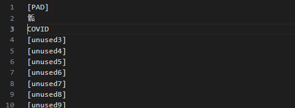

# 【关于 Bert 未登录词处理】 那些你不知道的事

> 作者：杨夕
> 
> 介绍：研读顶会论文，复现论文相关代码
> 
> NLP 百面百搭 地址：https://github.com/km1994/NLP-Interview-Notes
> 
> **[手机版NLP百面百搭](https://mp.weixin.qq.com/s?__biz=MzAxMTU5Njg4NQ==&mid=100005719&idx=3&sn=5d8e62993e5ecd4582703684c0d12e44&chksm=1bbff26d2cc87b7bf2504a8a4cafc60919d722b6e9acbcee81a626924d80f53a49301df9bd97&scene=18#wechat_redirect)**
> 
> 推荐系统 百面百搭 地址：https://github.com/km1994/RES-Interview-Notes
> 
> **[手机版推荐系统百面百搭](https://mp.weixin.qq.com/s/b_KBT6rUw09cLGRHV_EUtw)**
> 
> 搜索引擎 百面百搭 地址：https://github.com/km1994/search-engine-Interview-Notes 【编写ing】
> 
> NLP论文学习笔记：https://github.com/km1994/nlp_paper_study
> 
> 推荐系统论文学习笔记：https://github.com/km1994/RS_paper_study
> 
> GCN 论文学习笔记：https://github.com/km1994/GCN_study
> 
> **推广搜 军火库**：https://github.com/km1994/recommendation_advertisement_search


> 手机版笔记，可以关注公众号 **【关于NLP那些你不知道的事】** 获取，并加入 【NLP && 推荐学习群】一起学习！！！

> 注：github 网页版 看起来不舒服，可以看 **[手机版NLP论文学习笔记](https://mp.weixin.qq.com/s?__biz=MzAxMTU5Njg4NQ==&mid=100005719&idx=1&sn=14d34d70a7e7cbf9700f804cca5be2d0&chksm=1bbff26d2cc87b7b9d2ed12c8d280cd737e270cd82c8850f7ca2ee44ec8883873ff5e9904e7e&scene=18#wechat_redirect)**

## 一、动机

- 中文预训练BERT 对于 英文单词覆盖不全问题。由于  中文预训练BERT 主要针对中文，所以词表中英文单词比较少，但是一般英文单词如果简单的直接使用tokenize函数，往往在一些序列预测问题上存在一些对齐问题，或者很多不存在的单词或符号没办法处理而直接使用　unk　替换了，某些英文单词或符号失去了单词的预训练效果；
- 专业领域（如医疗、金融）用词或中文偏僻词问题。NLP经常会用到预训练的语言模型，小到word2vector，大到bert。现在bert之类的基本都用char级别来训练，然而由于 Bert 等预训练模型都是采用开放域的语料进行预训练，所以对词汇覆盖的更多是日常用词，专业用词则覆盖不了，这时候该怎么处理？

```s
    ...
    print(tokenizer.tokenize('骨骺'))
    >>>
    ['骨', '[UNK]']
```

- 英文预训练BERT（bert-base-uncased 和 bert-base-cased）词语被自动拆成词根词缀问题。 英文预训练BERT 以词为单位。社会生活中总是会有新词产生，而且在专业领域（如医疗、金融）有一些不常用的词语是 英文预训练BERT 没有涵盖到的，可能词语会被自动拆成词根词缀；

```s
    ...
    print(tokenizer.tokenize('COVID'))
    >>>
    ['co', '##vi', '##d']
```

## 二、处理方法

### 2.1 直接在 BERT 词表 vocab.txt 中替换 [unused]

1. 找到pytorch版本的 bert-base-cased 的文件夹中的vocab.txt文件;
2. 最前面的100行都是[unused]（[PAD]除外），直接用需要添加的词替换进去;

> 注：这里我们 加入 骺 和 COVID 两个新词



3. 查询 运行 之前实例，效果如下：

```s
    ...
    print(tokenizer.tokenize('骨骺'))
    >>>
    ['骨', '骺']
```

```s
    ...
    print(tokenizer.tokenize('COVID'))
    >>>
    ['covid']
```

### 2.2 通过重构词汇矩阵来增加新词

1. 如果 觉得 修改 vocab.txt文件 会干扰到 其他项目，那么通过重构BERT初始权重矩阵的方式将他们加入词表；

```s
    new_tokens = ['COVID', '骨骺']
    num_added_toks = tokenizer.add_tokens(new_tokens)
    print(tokenizer.tokenize('骨骺'))
    print(tokenizer.tokenize('COVID'))
    >>>
    ['骨骺']
    ['covid']
```

> 注：num_added_toks返回一个数，表示加入的新词数量，在这里是2

2. resize_token_embeddings输入的参数是tokenizer的新长度

```s
    model.resize_token_embeddings(len(tokenizer))
```

3. 添加后的词汇，通过model.resize_token_embeddings方法，随机初始化了一个权重。

```s
    tokenizer.save_pretrained("Pretrained_LMs/bert-base-cased")
```

### 2.3 添加特殊占位符号 add_special_tokens

1. 动机

前面两个是往 词典中 添加未登录词，那么如何往分词器tokenizer中添加新的特殊占位符呢？

2. 方法介绍

add_special_tokens ： 往分词器tokenizer中添加新的特殊占位符

```s
    tokenizer.add_special_tokens({'additional_special_tokens':["<e>"]})
```

> 注：往additional_special_tokens这一类tokens中添加特殊占位符<e>

3. 测试

```s
    ...
    text = " I love <e> ! "
    # 对于一个句子，首尾分别加[CLS]和[SEP]。
    text = "[CLS] " + text + " [SEP]"
    # 然后进行分词
    print("普通 分词效果：")
    tokenized_text1 = tokenizer.tokenize(text)
    print(tokenized_text1)
    indexed_tokens1 = tokenizer.convert_tokens_to_ids(tokenized_text1)
    # 分词结束后获取BERT模型需要的tensor
    segments_ids1 = [1] * len(tokenized_text1)
    tokens_tensor1 = torch.tensor([indexed_tokens1]) # 将list转为tensor
    segments_tensors1 = torch.tensor([segments_ids1])
    # 获取所有词向量的embedding
    word_vectors1 = bertmodel(tokens_tensor1, segments_tensors1)[0]
    # 获取句子的embedding
    sentenc_vector1 = bertmodel(tokens_tensor1, segments_tensors1)[1]
    tokenizer.add_special_tokens({'additional_special_tokens':["<e>"]})
    print("添加特殊占位符 后 的分词效果：")
    print(tokenizer.additional_special_tokens) # 查看此类特殊token有哪些
    print(tokenizer.additional_special_tokens_ids) # 查看其id
    tokenized_text1 = tokenizer.tokenize(text)
    print(tokenized_text1)
    >>>
    普通 分词效果：
    ['[CLS]', 'i', 'love', '<', 'e', '>', '!', '[SEP]']

    添加特殊占位符 后 的分词效果：
    ['<e>']
    [21128]
    ['[CLS]', 'i', 'love', '<e>', '!', '[SEP]']
```

## 三、方法对比

- 方法一：
  - 优点：如果存在大量领域内专业词汇，而且已经整理成词表，可以利用该方法批量添加；
  - 缺点：因为 方法1 存在 未登录词数量限制（eg：cased模型只有99个空位，uncased模型有999个空位），所以当 未登录词 太多时，将不适用；
- 方法二：
  - 优点：不存在 方法1 的 未登录词数量限制 问题；
- 方法三：
  - 优点：对于一些 占位符（eg：<e></e>），方法一和方法二可能都无法生效，因为 <, e, >和 <e></e>均存在于 vocab.txt，但前三者的优先级高于 <e></e>，而 add_special_tokens会起效，却会使得词汇表大小增大，从而需另外调整模型size。但是，如果同时在词汇表vocab.txt中替换[unused]，同时 add_special_tokens，则新增词会起效，同时词汇表大小不变。


## 参考

1. [NLP | How to add a domain-specific vocabulary (new tokens) to a subword tokenizer already trained like BERT WordPiece | by Pierre Guillou | Medium](https://medium.com/@pierre_guillou/nlp-how-to-add-a-domain-specific-vocabulary-new-tokens-to-a-subword-tokenizer-already-trained-33ab15613a41)
2. [如何向BERT词汇表中添加token，新增特殊占位符](https://blog.csdn.net/icestorm_rain/article/details/108540053)
3. [在BERT模型中添加自己的词汇（pytorch版）](https://zhuanlan.zhihu.com/p/391814780)