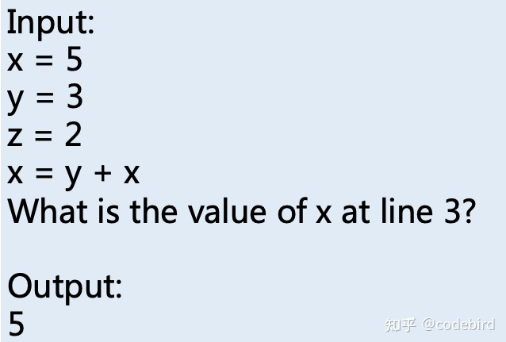
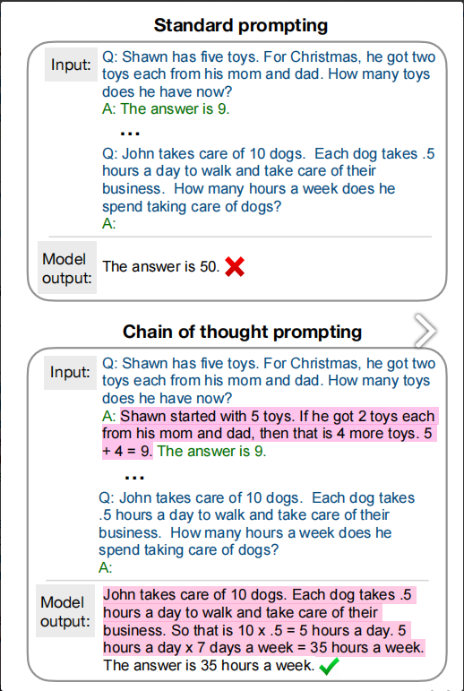

# 【关于BERT 继续预训练】 那些你不知道的事

> 作者：杨夕
> 
> 介绍：研读顶会论文，复现论文相关代码
> 
> NLP 百面百搭 地址：https://github.com/km1994/NLP-Interview-Notes
> 
> 推荐系统 百面百搭 地址：https://github.com/km1994/RES-Interview-Notes
>
> 搜索引擎 百面百搭 地址：https://github.com/km1994/search-engine-Interview-Notes 【编写ing】
> 
> NLP论文学习笔记：https://github.com/km1994/nlp_paper_study
> 
> 推荐系统论文学习笔记：https://github.com/km1994/RS_paper_study
> 
> GCN 论文学习笔记：https://github.com/km1994/GCN_study
> 
> **推广搜 军火库**：https://github.com/km1994/recommendation_advertisement_search

> 手机版笔记，可以关注公众号 **【关于NLP那些你不知道的事】** 获取，并加入 【NLP && 推荐学习群】一起学习！！！

> 注：github 网页版 看起来不舒服，可以看 **[手机版NLP论文学习笔记](https://mp.weixin.qq.com/s?__biz=MzAxMTU5Njg4NQ==&mid=100005719&idx=1&sn=14d34d70a7e7cbf9700f804cca5be2d0&chksm=1bbff26d2cc87b7b9d2ed12c8d280cd737e270cd82c8850f7ca2ee44ec8883873ff5e9904e7e&scene=18#wechat_redirect)**

- [【关于BERT 继续预训练】 那些你不知道的事](#关于bert-继续预训练-那些你不知道的事)
  - [一、动机](#一动机)
  - [二、什么是 继续预训练？](#二什么是-继续预训练)
  - [三、为什么会存在 【数据分布/领域差异】大 问题？](#三为什么会存在-数据分布领域差异大-问题)
  - [四、如何进行 继续预训练？](#四如何进行-继续预训练)
    - [4.1 数据角度](#41-数据角度)
    - [4.2 训练参数角度](#42-训练参数角度)
    - [4.3 模型角度](#43-模型角度)
  - [五、还有哪些待解决问题？](#五还有哪些待解决问题)
    - [5.1 训练数据问题](#51-训练数据问题)
    - [5.2 知识缺乏问题](#52-知识缺乏问题)
      - [5.2.1 知识缺乏问题描述](#521-知识缺乏问题描述)
      - [5.2.2 知识缺乏问题解决方法](#522-知识缺乏问题解决方法)
    - [5.3 知识理解缺乏问题](#53-知识理解缺乏问题)
      - [5.3.1 知识理解缺乏问题描述](#531-知识理解缺乏问题描述)
      - [5.3.2 知识理解缺乏问题解决方法](#532-知识理解缺乏问题解决方法)
  - [参考](#参考)

## 一、动机

- 问题：虽然 开源的大规模预训练模型（如bert/ernie/gpt等）能够用于 一些通用领域（新闻等），但是对于一些特定领域（医疗等），开源的大规模预训练模型（如bert/ernie/gpt等）的适用性明显存在欠缺，所以在这些任务上，**预训练模型的效果得不到充分体现**；

该问题可以 视为：**预训练(pre-train)的语料与下游任务(finetune)语料的【数据分布/领域差异】大**

那么如何才能解决该问题呢？

这个时候需要对 开源的预训练模型 进行 **继续预训练**。

## 二、什么是 继续预训练？

继续预训练：在开源的大规模预训练模型（如bert/ernie/gpt等）基础上，针对（或使用）下游NLP任务的特定语料，对模型进行领域/任务的继续训练。

## 三、为什么会存在 【数据分布/领域差异】大 问题？

- 【数据分布/领域差异】大 存在的根本原因还是在于 数据问题
  - **核心问题：特定领域的n-gram的不同以及其出现的上下文的不同** 

> 注：不同领域的token/word/n-gram的不同直接导致了语言模型可以在相应领域语料中获取的embedding/feature表征的不同，因此**在通用领域上预训练好的模型feature在特定领域语料上使用时往往不会达到最优的效果**。

## 四、如何进行 继续预训练？

继续预训练 可以从 以下三个角度进行继续预训练：

1. 数据角度
2. 训练参数角度
3. 模型角度

### 4.1 数据角度

数据的质量 对 【数据分布/领域差异】 具有很大影响，所以直接从 数据的质量入手 对于解决数据的领域差异的一种通用且高效的方法（**毕竟领域差距的本质，究其根本原因，还是数据问题**）。

- 挖掘并构建高质量领域数据

1. Don’t Stop Pretraining: Adapt Language Models to Domains and Tasks: 作者 针对 **有没有必要将模型调整迁移到特定目标任务的领域上（domain of a target task）**问题，设计了4个领域上的8个分类任务（每个领域上各有2个分类任务），将已经在大量且广泛文本上预训练过的模型进行第二阶段的预训练，作者分别用领域数据、任务数据、增强的任务数据进行了实验，即用这些数据对模型进行第二阶段的预训练，然后再用经过两个预训练阶段后得到的模型生成的数据做分类任务。实验表明，不要停止预训练，对于特定的任务，我们完全可以用任务相关的数据再对语言模型做二次预训练，能大大提高模型性能；
2. BioBERT: a pre-trained biomedical language representation model for biomedical text mining: 作者证明了在生物医学语料库上对BERT进行继续预训练可以大大提高其性能；
3. SCIBERT: A Pretrained Language Model for Scientific Text: 作者 基于WordPiece构建SCIVOCAB作为词汇表，30K词汇量，与BASEVOCAB相比有42%重合。利用 BERT 在1.14M篇文章训练（18%为计算机领域，82%为生物医药领域，共3.17B个token）进行继续预训练可以大大提高其性能；
4. Publicly Available Clinical BERT Embeddings
5. Patent Classification by Fine-Tuning BERT Language Model
6. FinBERT: Financial Sentiment Analysis with Pre-trained Language Models

- 重新设计训练方法

1. 新词挖掘 + whole word masking 【参考7】
   1. **新词发现**：首先要做任务领域语料的新词挖掘，再加入到分词器的词典中，用于whole word masking；
   2. **继续预训练**：再用huggingface的examples来对模型做继续预训练，损失就用wwm mlm损失；
   3. **去掉BERT原生的NSP任务，来得到适应任务领域的预训练模型**

2. 知识增强的mlm
   1. ERNIE2.0 :对 实体 做 mask

3. 数据增强
   1. UDA（Unsupervised Data Augmentation）
   2. 对抗训练
   3. 伪标签（半监督）
   4. 对比学习（infoNCE-loss）

### 4.2 训练参数角度

- 参数平滑泛化：
  - SWA（Stochastic Moving Average，随机滑动平均）
  - EMA（Exponential Moving Average，指数滑动平均）

### 4.3 模型角度

- 模型学习使用领域知识：
  - 固定原始PLM，额外训练一个adapter去学习/利用领域知识(如：Taming Pre-trained Language Models with N-gram Representations for Low-Resource Domain Adaptation)
- 模型适应不同任务：
  - 多任务学习（偏向于Pre-train+Massive Multi-tasking的领域）
  - prompt

## 五、还有哪些待解决问题？

### 5.1 训练数据问题

- **训练数据数量问题**：训练数据量不足 和 标注数据成本昂贵
- **数据长尾问题**：对于大部分数据集都存在 大多数类别出现次数少问题，由于出现次数少，导致模型很难准确学习到这些类别的特征；
  - 解决方法：通过针对长尾数据做特定的知识引入的方式来解决（如：Enhancing Language Model Pre-training with Dictionary）
- **数据分布问题**：数据分布不全面或有偏差，即标注人员很难罗列全所有可能情况；
- **类别不均衡**：某些类别数量偏少问题
  - 解决方法：使用数据增强/过采样/欠采样/集成学习/resample/reweight的方法来解决
- **标注数据的噪音/质量问题**：如虽然数据有标注，但是不同标注人员对于数据存在认知偏差
  - 解决方法：可以使用交叉验证/置信学习/聚类分析的方法来解决

### 5.2 知识缺乏问题

#### 5.2.1 知识缺乏问题描述

- 问题：预训练与下游任务存在偏差，模型缺乏下游特定知识

#### 5.2.2 知识缺乏问题解决方法

1. **模型缺乏下游特定知识**
   
- 解决方法：引入知识方法：通过语料/词条释义/SPO等引入知识；隐式：通过向量方法。【参考10-12】
- 存在问题：**「数据长尾」问题**。常见数据中的知识含量会很容易的被大规模语言模型学习到，而长尾数据中包含的知识由于模型见的比较少，其中的知识很难学到，所以解决知识问题研究者们通常会从长尾数据入手，**解决「数据长尾」问题并不等于解决「知识缺乏」问题**

2. **「数据长尾」问题**

- 问题描述：长尾数据并不一定是需要引入知识的数据，也有可能是错误的表述方法导致出现的数据

> 对于句子：「医生:那你最近的话，给宝宝多吃一点白粥米汤淌少喝一点，然后吃一点妈咪爱或者益生菌类的菜。」
> 如果进行长尾数据的检测，其中的「米汤淌」和「妈咪爱」很容易会被判别为长尾数据，其中「妈咪爱」作为一种药的别称或许是需要相关词条/知识的引入，但人类很容易看出「米汤淌」并不需要引入知识
> 如果不加判断的把所有的长尾数据都加入知识，很大概率会引入大量噪音，导致最终效果不升反降。

3. **如何判别长尾数据是否需要引入知识 问题**

KEPLM（论文13） :在预训练、微调和推理阶段分解预训练语言模型的知识注入过程，这有助于KEPLM在现实场景中的应用。首先检测知识感知的长尾实体作为知识注入的目标，增强KEPLM的语义理解能力，避免注入冗余信息。长尾实体的嵌入被相关知识三元组形成的“伪令牌表示”所取代。进一步设计了用于预训练的关系知识解码任务，以通过关系三重重构迫使模型真正理解注入的知识。

### 5.3 知识理解缺乏问题

#### 5.3.1 知识理解缺乏问题描述
  
虽然语言建模方面，NLP模型表现很好，但是在逻辑推理和数值计算领域（称其为第二类任务，system-2 task），即使是目前最大的模型也难以处理某些推理任务，如数学单词问题、符号操作和常识性推理。

#### 5.3.2 知识理解缺乏问题解决方法

- 思维链（Chain-of-thoughts）作为提示（参考14）：语言模型产生一个连贯的思维链的能力——一系列的短句子，模仿一个人在回答一个问题时可能拥有的推理过程。

## 参考

1. [如何继续预训练汉语bert?](https://www.zhihu.com/question/432886394)
2. Don’t Stop Pretraining: Adapt Language Models to Domains and Tasks
3. BioBERT: a pre-trained biomedical language representation model for biomedical text mining【[github](https://github.com/dmis-lab/biobert)】
4. SCIBERT: A Pretrained Language Model for Scientific Text【[github](https://github.com/allenai/scibert/)】
5. Publicly Available Clinical BERT Embeddings【[github](https://github.com/EmilyAlsentzer/clinicalBERT)】
6. Patent Classification by Fine-Tuning BERT Language Model
7. FinBERT: Financial Sentiment Analysis with Pre-trained Language Models
8. [NLP实验之新词挖掘+预训练模型继续预训练，打造适应任务的PTM](https://zhuanlan.zhihu.com/p/414384344)【[github](https://github.com/zhoujx4/NLP-Series-NewWordsMining-PTMPretraining)】
9. Taming Pre-trained Language Models with N-gram Representations for Low-Resource Domain Adaptation
10. Enhancing Language Model Pre-training with Dictionary
11. Kformer：Knowledge Injection in Transformer Feed-Forward Layers
12. Decomposable Knowledge-enhanced Pre-trained Language Model for  Natural Language Understanding
13. DKPLM: Decomposable Knowledge-enhanced Pre-trained Language Model for Natural Language Understanding 【[paper](https://arxiv.org/abs/2112.01047)】
14. Chain of Thought Prompting Elicits Reasoning in Large Language Models
15. [思维链（Chain-of-thoughts）作为提示](https://zhuanlan.zhihu.com/p/493533589)
16. [Chain of Thought Prompting Elicits Reasoning in Large Language Models 读书笔记](https://www.cnblogs.com/TABball/p/16132925.html)

