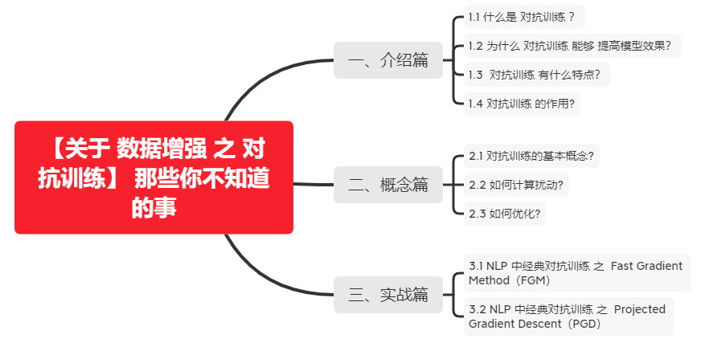
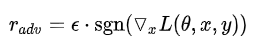

# 【关于 数据增强 之 对抗训练】 那些你不知道的事

> 作者：杨夕
> 
> 面筋地址：https://github.com/km1994/NLP-Interview-Notes
> 
> 个人笔记：https://github.com/km1994/nlp_paper_study
> 
> 个人介绍：大佬们好，我叫杨夕，该项目主要是本人在研读顶会论文和复现经典论文过程中，所见、所思、所想、所闻，可能存在一些理解错误，希望大佬们多多指正。
> 
> 【注：手机阅读可能图片打不开！！！】



## 一、介绍篇

### 1.1 什么是 对抗训练 ？

对抗训练 从 CV 引入到 NLP 领域，作为一种防御机制，能够在修改部分信息的情况下，提高模型的泛化能力。

### 1.2 为什么 对抗训练 能够 提高模型效果？

对抗样本可以用来攻击和防御，而对抗训练其实是“对抗”家族中防御的一种方式，其基本的原理呢，就是通过添加扰动构造一些对抗样本，放给模型去训练，以攻为守，提高模型在遇到对抗样本时的鲁棒性，同时一定程度也能提高模型的表现和泛化能力。

### 1.3  对抗训练 有什么特点？

- 对抗样本一般需要具有两个特点：
  - 相对于原始输入，所添加的扰动是微小的；
  - 能使模型犯错

### 1.4 对抗训练 的作用?

1. 提高模型应对恶意对抗样本时的鲁棒性；
2. 作为一种regularization，减少overfitting，提高泛化能力。

## 二、概念篇

### 2.1 对抗训练的基本概念?

在原始输入样本 x  上加一个扰动 $r_adv$ ，得到对抗样本后，用其进行训练。也就是说，问题可以被抽象成这么一个模型：


> 注： y 为gold label， θ 为模型参数

### 2.2 如何计算扰动?

- 动机：神经网络由于其线性的特点，很容易受到线性扰动的攻击
- 方法：FGSM



> 注： sgn 为符号函数， L 为损失函数。Goodfellow发现，令 ε=0.25 ，用这个扰动能给一个单层分类器造成99.9%的错误率。

### 2.3 如何优化?

- 动机：将问题重新定义成了一个找鞍点的问题
- 方法：Min-Max公式


> 注：公式由两部分构成：一个是内部损失函数的最大化，一个是外部经验风险的最小化
> 内部max是为了找到worst-case的扰动，也就是攻击，其中， L 为损失函数， S 为扰动的范围空间。
> 外部min是为了基于该攻击方式，找到最鲁棒的模型参数，也就是防御，其中 D 是输入样本的分布。

## 三、实战篇

### 3.1 NLP 中经典对抗训练 之  Fast Gradient Method（FGM）

- 方法：假设输入的文本序列的embedding vectors [v1,v2,...,vT] 为 x ，embedding的扰动为：


> 注：实际上就是取消了符号函数，用二范式做了一个scale，需要注意的是：这里的norm计算的是，每个样本的输入序列中出现过的词组成的矩阵的梯度norm。原作者提供了一个TensorFlow的实现 [10]，在他的实现中，公式里的 x 是embedding后的中间结果（batch_size, timesteps, hidden_dim），对其梯度 g 的后面两维计算norm，得到的是一个(batch_size, 1, 1)的向量 $||g||_2$ 。为了实现插件式的调用，笔者将一个batch抽象成一个样本，一个batch统一用一个norm，由于本来norm也只是一个scale的作用，影响不大。

- 代码实现：

1. FGM 类实现

```s
    import torch
    class FGM():
        def __init__(self, model):
            self.model = model
            self.backup = {}

        def attack(self, epsilon=1., emb_name='emb.'):
            # emb_name这个参数要换成你模型中embedding的参数名
            for name, param in self.model.named_parameters():
                if param.requires_grad and emb_name in name:
                    self.backup[name] = param.data.clone()
                    norm = torch.norm(param.grad)
                    if norm != 0 and not torch.isnan(norm):
                        r_at = epsilon * param.grad / norm
                        param.data.add_(r_at)

        def restore(self, emb_name='emb.'):
            # emb_name这个参数要换成你模型中embedding的参数名
            for name, param in self.model.named_parameters():
                if param.requires_grad and emb_name in name: 
                    assert name in self.backup
                    param.data = self.backup[name]
            self.backup = {}
```

2. FGM 类调用

```s
    # 初始化
    fgm = FGM(model)
    for batch_input, batch_label in data:
        # 正常训练
        loss = model(batch_input, batch_label)
        loss.backward() # 反向传播，得到正常的grad
        # 对抗训练
        fgm.attack() # 在embedding上添加对抗扰动
        loss_adv = model(batch_input, batch_label)
        loss_adv.backward() # 反向传播，并在正常的grad基础上，累加对抗训练的梯度
        fgm.restore() # 恢复embedding参数
        # 梯度下降，更新参数
        optimizer.step()
        model.zero_grad()
```

> 注：PyTorch为了节约内存，在backward的时候并不保存中间变量的梯度。因此，如果需要完全照搬原作的实现，需要用register_hook接口[11]将embedding后的中间变量的梯度保存成全局变量，norm后面两维，计算出扰动后，在对抗训练forward时传入扰动，累加到embedding后的中间变量上，得到新的loss，再进行梯度下降。

### 3.2 NLP 中经典对抗训练 之  Projected Gradient Descent（PGD）

- 动机：内部max的过程，本质上是一个非凹的约束优化问题，FGM解决的思路其实就是梯度上升，那么FGM简单粗暴的“一步到位”，是不是有可能并不能走到约束内的最优点呢？
- 方法：用Projected Gradient Descent（PGD）的方法，简单的说，就是“小步走，多走几步”，如果走出了扰动半径为 ε 的空间，就映射回“球面”上，以保证扰动不要过大：


- 代码实现：

1. PGD 类实现

```s
    import torch
    class PGD():
        def __init__(self, model):
            self.model = model
            self.emb_backup = {}
            self.grad_backup = {}

        def attack(self, epsilon=1., alpha=0.3, emb_name='emb.', is_first_attack=False):
            # emb_name这个参数要换成你模型中embedding的参数名
            for name, param in self.model.named_parameters():
                if param.requires_grad and emb_name in name:
                    if is_first_attack:
                        self.emb_backup[name] = param.data.clone()
                    norm = torch.norm(param.grad)
                    if norm != 0 and not torch.isnan(norm):
                        r_at = alpha * param.grad / norm
                        param.data.add_(r_at)
                        param.data = self.project(name, param.data, epsilon)

        def restore(self, emb_name='emb.'):
            # emb_name这个参数要换成你模型中embedding的参数名
            for name, param in self.model.named_parameters():
                if param.requires_grad and emb_name in name: 
                    assert name in self.emb_backup
                    param.data = self.emb_backup[name]
            self.emb_backup = {}

        def project(self, param_name, param_data, epsilon):
            r = param_data - self.emb_backup[param_name]
            if torch.norm(r) > epsilon:
                r = epsilon * r / torch.norm(r)
            return self.emb_backup[param_name] + r

        def backup_grad(self):
            for name, param in self.model.named_parameters():
                if param.requires_grad:
                    self.grad_backup[name] = param.grad.clone()

        def restore_grad(self):
            for name, param in self.model.named_parameters():
                if param.requires_grad:
                    param.grad = self.grad_backup[name]
```

2. FGM 类调用

```s
    pgd = PGD(model)
    K = 3
    for batch_input, batch_label in data:
        # 正常训练
        loss = model(batch_input, batch_label)
        loss.backward() # 反向传播，得到正常的grad
        pgd.backup_grad()
        # 对抗训练
        for t in range(K):
            pgd.attack(is_first_attack=(t==0)) # 在embedding上添加对抗扰动, first attack时备份param.data
            if t != K-1:
                model.zero_grad()
            else:
                pgd.restore_grad()
            loss_adv = model(batch_input, batch_label)
            loss_adv.backward() # 反向传播，并在正常的grad基础上，累加对抗训练的梯度
        pgd.restore() # 恢复embedding参数
        # 梯度下降，更新参数
        optimizer.step()
        model.zero_grad()
```


## 参考

1. [【炼丹技巧】功守道：NLP中的对抗训练 + PyTorch实现](https://zhuanlan.zhihu.com/p/91269728)