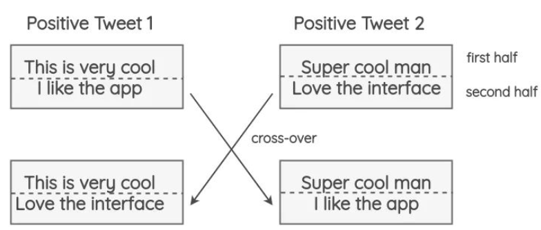

# 【关于 EDA 】那些你不知道的事

> 作者：杨夕
> 
> 面筋地址：https://github.com/km1994/NLP-Interview-Notes
> 
> 个人笔记：https://github.com/km1994/nlp_paper_study
> 
> 个人介绍：大佬们好，我叫杨夕，该项目主要是本人在研读顶会论文和复现经典论文过程中，所见、所思、所想、所闻，可能存在一些理解错误，希望大佬们多多指正。
> 
> 【注：手机阅读可能图片打不开！！！】

## 目录


## 一、动机篇

### 1.1 什么是 数据增强？

数据增强 是通过采用一些策略 增加 训练样本的数据量，提高模型的训练效果。

### 1.2 为什么需要 数据增强？

在医疗、金融、法律等领域，高质量的标注数据十分稀缺、昂贵，我们通常面临少样本低资源问题。

## 二、常见的数据增强方法篇

### 2.1 词汇替换篇
 
#### 2.1.1 什么是基于词典的替换方法？

- 介绍：基于同义词替换的方法是从句子中以一定的概率随机选取一个单词，利用一些同义词数据库（注：英文可以用 WordNet 数据库，中文可以用 synonyms python 同义词词典） 将其替换成对应的同义词。
- 举例说明：


> 注：对 句子 “我 喜欢 NLP ” 随机选取 其中一个词 利用 synonyms 包进行替换，可以替换为 “我 喜爱 NLP ”。

#### 2.1.2 什么是基于词向量的替换方法？

- 介绍：通过利用预先训练好的词向量（eg:Word2Vec、GloVe、FastText等），使用嵌入空间中最近的相邻单词替换句子中的某些单词。
- 思路：

1. 预先训练好的词向量（eg:Word2Vec、GloVe、FastText等）；
2. 使用嵌入空间中最近的相邻单词，如下图，在嵌入空间中，与词 “awesome” 最近的相邻单词为 amazing、perfect等
   

> 嵌入空间

3. 随机选取三个 与 词 “awesome” 最相近的单词替换 词 “awesome”，如下图：


- 实现：

```s
    import synonyms
    # 功能：同义词替换，替换一个语句中的n个单词为其同义词
    def synonym_replacement(words, alpha, num_words, stop_words):
        n = max(1, int(alpha * num_words))
        new_words = words.copy()
        random_word_list = list(set([word for word in words if word not in stop_words]))     
        random.shuffle(random_word_list)
        num_replaced = 0  
        for random_word in random_word_list:          
            synonyms = get_synonyms(random_word)
            if len(synonyms) >= 1:
                synonym = random.choice(synonyms)   
                new_words = [synonym if word == random_word else word for word in new_words]   
                num_replaced += 1
            if num_replaced >= n: 
                break
        sentence = ' '.join(new_words)
        new_words = sentence.split(' ')
        return new_words

    # 功能：获取与 word 最相近的同义词
    def get_synonyms(word):
        return synonyms.nearby(word)[0]

```

#### 2.1.3 什么是基于 MLM 的替换方法？

- 介绍：像BERT、ROBERTA和ALBERT这样的Transformer模型已经接受了大量的文本训练，使用一种称为“Masked Language Modeling”的预训练，即模型必须根据上下文来预测遮盖的词汇。这可以用来扩充一些文本。例如，我们可以使用一个预训练的BERT模型并屏蔽文本的某些部分。然后，我们使用BERT模型来预测遮蔽掉的token。


使用mask预测来生成文本的变体。与之前的方法相比，生成的文本在语法上更加连贯，因为模型在进行预测时考虑了上下文。


- 实现：

> 注：使用开源库这很容易实现，如Hugging Face的transformers。你可以将你想要替换的token设置为并生成预测。

```s
    from transformers import pipeline
    nlp = pipeline('fill-mask')
    nlp('This is <mask> cool')
    [{'score': 0.515411913394928,
    'sequence': '<s> This is pretty cool</s>',
    'token': 1256},
    {'score': 0.1166248694062233,
    'sequence': '<s> This is really cool</s>',
    'token': 269},
    {'score': 0.07387523353099823,
    'sequence': '<s> This is super cool</s>',
    'token': 2422},
    {'score': 0.04272908344864845,
    'sequence': '<s> This is kinda cool</s>',
    'token': 24282},
    {'score': 0.034715913236141205,
    'sequence': '<s> This is very cool</s>',
    'token': 182}]
```
> 注：这种方法的一个问题是，决定要屏蔽文本的哪一部分并不是一件小事。你必须使用启发式的方法来决定掩码，否则生成的文本将不保留原句的含义。

#### 2.1.4 什么是基于 TF-IDF 的词替换？

- 动机：对于 query 里面 TF-IDF 值较小的词语，一般对 query 的贡献度较少
- 基本思想：针对 TF-IDF值较低的词语贡献度低问题，所以在不影响句子所属类别的情况下替换，可以达到数据增强的作用。


### 2.2 词汇插入篇

#### 2.2.1 什么是随机插入法？

- 方法：通过在 query 里面随机插入一个或多个新词汇、相应的拼写错误、符号等噪声的方式提高 训练模型的健壮性。
- 代码实现：

```s
    import random
    import synonyms
    # 功能：随机插入,随机在语句中插入n个词
    def random_insertion(words, alpha, num_words, stop_words):
        n = max(1, int(alpha * num_words))
        new_words = words.copy()
        for _ in range(n):
            self.add_word(new_words)
        return new_words

    # 功能：插入新词
    def add_word(new_words):
        synonyms = []
        counter = 0    
        while len(synonyms) < 1:
            random_word = new_words[random.randint(0, len(new_words)-1)]
            synonyms = get_synonyms(random_word)
            counter += 1
            if counter >= 10:
                return
        random_synonym = random.choice(synonyms)
        random_idx = random.randint(0, len(new_words)-1)
        new_words.insert(random_idx, random_synonym)
    
    # 功能：获取同义词
    def get_synonyms(word):
        return synonyms.nearby(word)[0]
```

### 2.3 词汇交换篇

#### 2.3.1 什么是随机交换法？

- 方法：通过在 query 里面随机交换一个或多个词汇的方式提高 训练模型的健壮性。
- 代码实现：

```s
    import random
    # 功能：随机交换：随机交换句子中的两个词
    def random_swap(words, alpha, num_words, stop_words):
        n = max(1, int(alpha * num_words))
        new_words = words.copy()
        for _ in range(n):
            new_words = swap_word(new_words)
        return new_words

    # 功能：随机交换两个词
    def swap_word(new_words):
        random_idx_1 = random.randint(0, len(new_words)-1)
        random_idx_2 = random_idx_1
        counter = 0
        while random_idx_2 == random_idx_1:
            random_idx_2 = random.randint(0, len(new_words)-1)
            counter += 1
            if counter > 3:
                return new_words
        new_words[random_idx_1], new_words[random_idx_2] = new_words[random_idx_2], new_words[random_idx_1] 
        return new_words
```

### 2.4 词汇删除篇

#### 2.4.1 什么是随机删除法？

- 方法：通过在 query 里面随机删除一个或多个词汇的方式提高 训练模型的健壮性。
- 代码实现：

```s
    import random
    # 功能：随机删除，以概率p删除语句中的词
    def random_deletion( words,  alpha, num_words, stop_words):
        if len(words) == 1:
            return words
        new_words = []
        for word in words:
            r = random.uniform(0, 1)
            if r > alpha:
                new_words.append(word)
        if len(new_words) == 0:
            rand_int = random.randint(0, len(words)-1)
            return [words[rand_int]]
        return new_words
```


### 2.5 回译篇

#### 2.5.1 什么是回译法？

- 方法：利用百度翻译、谷歌翻译等在线翻译器来解释文本，并重新训练文本；
- 思路：
1. 将待数据增强的句子（如中文句子）翻译成另外一种语言，如英语、日语等；
2. 然后将翻译后的句子回译回中文句子；
3. 检查新句子是否与原来的句子不同。如果是，那么我们使用这个新句子作为原始文本的数据增强。


### 2.6 交叉增强篇

#### 2.6.1 什么是 交叉增强篇

- 方法：借鉴遗传学中染色体交叉操作的方式进行数据增强。
- 思路：将 tweets 切分未为两部分，两个具有相同极性的随机推文(即正面/负面)进行交换。这个方法的假设是，即使结果是不符合语法和语义的，新文本仍将保留情感的极性。



- 实验结果分析：这一技术对准确性没有影响，但有助于论文中极少数类的F1分数，如tweets较少的中性类。


### 2.7 语法树篇

#### 2.7.1 什么是语法树操作？

- 思路：这项技术已经在Coulombe的论文中使用。其思想是解析和生成原始句子的依赖关系树，使用规则对其进行转换，并生成改写后的句子。
- 举例说明：在不改变句子的含义的情况下将句子从主动转化为被动语态的方式，也是一种数据增强方式。


- 实现方式：要使用上述所有方法，可以使用名为nlpaug的python库：https://github.com/makcedward/nlpaug。它提供了一个简单且一致的API来应用这些技术。

### 2.8 对抗增强篇

#### 2.8.1 什么是对抗增强？

- 方法：NLP中通常在词向量上添加扰动并进行对抗训练，文献[10]NLP中的对抗训练方法FGM, PGD, FreeAT, YOPO, FreeLB等进行了总结。


## 参考

1. [NLP中数据增强的综述，快速的生成大量的训练数据](https://zhuanlan.zhihu.com/p/142168215)
2. [NLP中的少样本困境问题探究](https://mp.weixin.qq.com/s?__biz=MzI4MDYzNzg4Mw==&mid=2247519324&idx=2&sn=e561d9280cc12756b91288adc858c47c&chksm=ebb7b488dcc03d9e7092729c23ba8f8a986d32bbfde194c6f180357f1c5ad8c5c6e1791966c6&mpshare=1&scene=22&srcid=1208UwySgB0phVjDfti3dPP1&sharer_sharetime=1607390532506&sharer_shareid=da84f0d2d31380d783922b9e26cacfe2#rd)