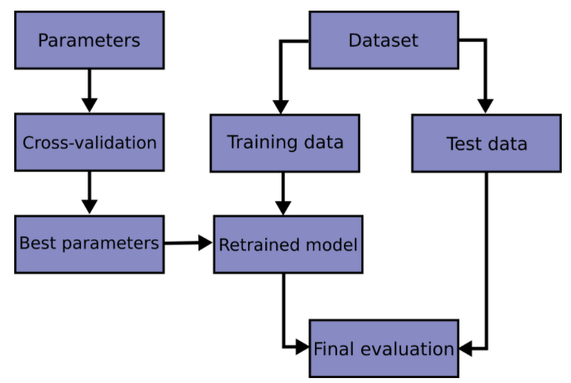
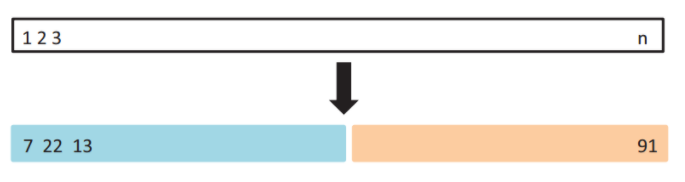
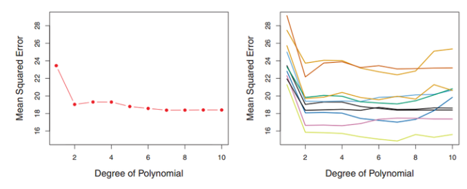
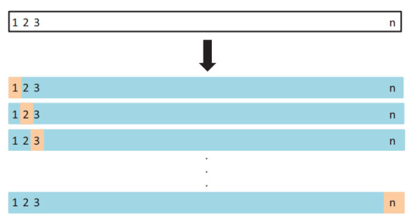
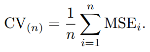
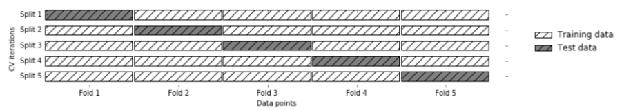
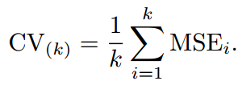

# 【关于 交叉验证】 那些你不知道的事

> 作者：杨夕
> 
> 面筋地址：https://github.com/km1994/NLP-Interview-Notes
> 
> 个人笔记：https://github.com/km1994/nlp_paper_study
> 
> 个人介绍：大佬们好，我叫杨夕，该项目主要是本人在研读顶会论文和复现经典论文过程中，所见、所思、所想、所闻，可能存在一些理解错误，希望大佬们多多指正。
> 
> 【注：手机阅读可能图片打不开！！！】  

## 一、为什么需要交叉验证？

### 1.1 引言

学习预测函数的参数，并在相同数据集上进行测试是一种错误的做法: 一个仅给出测试用例标签的模型将会获得极高的分数，但对于尚未出现过的数据它则无法预测出任何有用的信息。 这种情况称为 overfitting（过拟合）. 



### 1.2 The Validation Set Approach

#### 1.2.1 The Validation Set Approach介绍

为了避免这种情况，在进行（监督）机器学习实验时，通常取出部分可利用数据作为 test set（测试数据集） X_test, y_test。需要强调的是这里说的 “experiment(实验)” 并不仅限于学术（academic），因为即使是在商业场景下机器学习也往往是从实验开始的。



#### 1.2.2 The Validation Set Approach scikit-learn 实现

在  scikit-learn 包中 有 train_test_split 辅助函数可以很快地将实验数据集划分为任何训练集（training sets）和测试集（test sets）。

```s
    >>> import numpy as np
    >>> from sklearn.model_selection import train_test_split
    >>> from sklearn import datasets
    >>> from sklearn import svm

    >>> iris = datasets.load_iris()
    >>> iris.data.shape, iris.target.shape
    ((150, 4), (150,))
```

#### 1.2.3 The Validation Set Approach 存在问题

1. 模型性能强依赖于 划分的方式。也就是划分的不同，最后效果存在很大的差异。



> 注：右边是十种不同的训练集和测试集划分方法得到的test MSE，可以看到，在不同的划分方法下，test MSE的变动是很大的，而且对应的最优degree也不一样。所以如果我们的训练集和测试集的划分方法不够好，很有可能无法选择到最好的模型与参数。

2. 只有部分数据参与模型训练。由于将原始数据分为3个数据集合，我们就大大减少了可用于模型学习的样本数量， 并且得到的结果依赖于集合对（训练，验证）的随机选择。

## 二、 什么是 Cross-Validation 方法？

### 2.1 前言

第一章 已经 介绍了 The Validation Set Approach，并分析 该方法 所存在问题，那么 有什么方法 可以 解决 该问题呢？

### 2.2 什么是 Cross-Validation 方法？

Cross Validation：简言之，就是进行多次train_test_split划分；每次划分时，在不同的数据集上进行训练、测试评估，从而得出一个评价结果。

### 2.3 Cross-Validation 方法 的 目的 是什么？

1. 从有限的学习数据中获取尽可能多的有效信息；
2. 交叉验证从多个方向开始学习样本的，可以有效地避免陷入局部最小值；
3. 可以在一定程度上避免过拟合问题；

## 三、Cross-Validation 方法有哪些方法？

### 3.1 Leave-one-out cross-validation（LOOCV）

#### 3.1.1 LOOCV 方法介绍

将数据集分成 N 份，然后 每次从中选取 一份 作为 测试集，其他的作为 训练集，循环重复步骤 N 次，如下图所示：



这种方法 的优点是能够 训练 n 个 不同的模型，并得到 一个 MSE，最后将 这 n 个 MSE 取平均 得到 最终的 test MES。



#### 3.1.2 LOOCV 方法 实现方式

```s
    >>> from sklearn.model_selection import LeaveOneOut

    >>> X = [1, 2, 3, 4]
    >>> loo = LeaveOneOut()
    >>> for train, test in loo.split(X):
    ...     print("%s  %s" % (train, test))
    [1 2 3] [0]
    [0 2 3] [1]
    [0 1 3] [2]
    [0 1 2] [3]
```

#### 3.1.3 LOOCV 方法 的 优缺点

- 优点：

1. 该方法是 循环 N 次选取，每一份数据集都可以作为 测试集 进行测试，所以 该方法 不受 划分方式 的 影响；
2. 因为能够 循环 N 次训练，所以所有数据 都可以参与 模型训练；

- 缺点：

1. 由于 要 循环 计算 N 次，所以 计算量过高；

### 3.2 K-fold Cross Validation

#### 3.2.1 前言

上一节 介绍了 LOOCV 方法，该方法 由于需要 将 数据集 分成 N 份，并抽取其中一份 作为 验证集，循环 N 次，这种方式虽然能够解决 The Validation Set Approach 问题，但是 计算复杂度太高，那么 有没有 更好的Cross Validation方式呢？

因为该问题，有了 K折交叉验证方法（K-fold Cross Validation）。

#### 3.2.2 K-fold Cross Validation 介绍

将数据集划分为互斥的K个集合，用K-1个集合做训练，然后剩下的一个做验证。

这种方式和 LOOCV 的区别在于 该方法每次 选取 K 份数据【eg：一般 k=5】



#### 3.2.3 K-fold Cross Validation 思路【以 k=5 为例】

1. 将 数据集 分割成 5 份；
2. 每次从中选取不同的样本作为 验证集，而其他部分作为训练集用于训练模型，得到 不同 的 $MSE_i$;
3. 对 5 次  $MSE_i$ 取平均值作为最后 的 MSE;



```s
    >>> import numpy as np
    >>> from sklearn.model_selection import RepeatedKFold
    >>> X = np.array([[1, 2], [3, 4], [1, 2], [3, 4]])
    >>> random_state = 12883823
    >>> rkf = RepeatedKFold(n_splits=2, n_repeats=2, random_state=random_state)
    >>> for train, test in rkf.split(X):
    ...     print("%s  %s" % (train, test))
    ...
    [2 3] [0 1]
    [0 1] [2 3]
    [0 2] [1 3]
    [1 3] [0 2]
```

## 参考

1. [交叉验证：评估估算器的表现](https://sklearn.apachecn.org/docs/master/30.html)
2. [【机器学习】Cross-Validation（交叉验证）详解](https://zhuanlan.zhihu.com/p/24825503)
3. [几种交叉验证（cross validation）方式的比较](https://cloud.tencent.com/developer/article/1093322)

