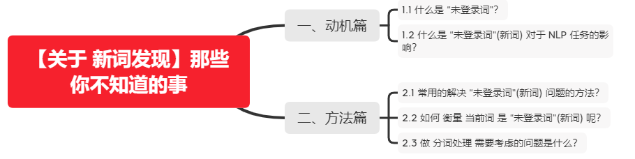

# 【关于 新词发现】那些你不知道的事

> 作者：杨夕
> 
> 面筋地址：https://github.com/km1994/NLP-Interview-Notes
> 
> 个人笔记：https://github.com/km1994/nlp_paper_study
> 
> 个人介绍：大佬们好，我叫杨夕，该项目主要是本人在研读顶会论文和复现经典论文过程中，所见、所思、所想、所闻，可能存在一些理解错误，希望大佬们多多指正。
> 
> 【注：手机阅读可能图片打不开！！！】



## 一、动机篇

### 1.1 什么是 “未登录词”？

- 未登录词 or 新词：NLP 任务中存在一些 之前之前没见过的词，这些词即为 “未登录词”(新词)；

### 1.2 什么是 “未登录词”(新词) 对于 NLP 任务的影响？

1. 对于“未登录词”(新词)的发现，主流的深度学习框架CNN/LSTM/Attention和BERT/RoBERTa/Albert等都无法解决这个问题；
2. 如果无法 发现这些“未登录词”(新词)，那么 会 影响 训练模型的性能；

## 二、方法篇

### 2.1 常用的解决 “未登录词”(新词) 问题的方法？

- 方法类型：无监督任务
- 常用方法：自信息 and 互信息

### 2.2 如何 衡量 当前词 是 “未登录词”(新词) 呢？

- 常用的衡量 字符串 是 新词 的方法：
  - 自信息（信息熵）：Entropy
  - 互信息：MI(Mutual Information)

### 2.3 做 分词处理 需要考虑的问题是什么？

- 动机：在做新词发现时，需要解决 特殊字符 做带来的噪声影响。比如在做 新词发现时，需要设置 滑动窗口，当 存在 阿拉伯数字 or 英文字符时，会导致几个数字或者几个英文字母随便组合一下，他们的程度就大于5，造成的问题是 有些数字会被识别为新词，新发现的英文单词最大程度为5。此外，在这两种情况下，它们对前后字符串的分词也会造成不利的影响。
- 解决方法：需要 将 连续的数字或英文字母看出一个字 【采用 Bert 中 的 tokenization.py】
- 代码

```s
class BasicTokenizer(object):
    """Runs basic tokenization (punctuation splitting, lower casing, etc.)."""

    def __init__(self, do_lower_case=True):
        """Constructs a BasicTokenizer.
        Args:
          do_lower_case: Whether to lower case the input.
        """
        self.do_lower_case = do_lower_case

    def tokenize(self, text):
        """Tokenizes a piece of text."""
        text = convert_to_unicode(text)
        text = self._clean_text(text)

        # This was added on November 1st, 2018 for the multilingual and Chinese
        # models. This is also applied to the English models now, but it doesn't
        # matter since the English models were not trained on any Chinese data
        # and generally don't have any Chinese data in them (there are Chinese
        # characters in the vocabulary because Wikipedia does have some Chinese
        # words in the English Wikipedia.).
        text = self._tokenize_chinese_chars(text)

        orig_tokens = whitespace_tokenize(text)
        split_tokens = []
        for token in orig_tokens:
            if self.do_lower_case:
                token = token.lower()
                token = self._run_strip_accents(token)
            split_tokens.extend(self._run_split_on_punc(token))

        output_tokens = whitespace_tokenize(" ".join(split_tokens))
        return output_tokens

    def _run_strip_accents(self, text):
        """Strips accents from a piece of text."""
        text = unicodedata.normalize("NFD", text)
        output = []
        for char in text:
            cat = unicodedata.category(char)
            if cat == "Mn":
                continue
            output.append(char)
        return "".join(output)

    def _run_split_on_punc(self, text):
        """Splits punctuation on a piece of text."""
        chars = list(text)
        i = 0
        start_new_word = True
        output = []
        while i < len(chars):
            char = chars[i]
            if _is_punctuation(char):
                output.append([char])
                start_new_word = True
            else:
                if start_new_word:
                    output.append([])
                start_new_word = False
                output[-1].append(char)
            i += 1

        return ["".join(x) for x in output]

    def _tokenize_chinese_chars(self, text):
        """Adds whitespace around any CJK character."""
        output = []
        for char in text:
            cp = ord(char)
            if self._is_chinese_char(cp):
                output.append(" ")
                output.append(char)
                output.append(" ")
            else:
                output.append(char)
        return "".join(output)

    def _is_chinese_char(self, cp):
        """Checks whether CP is the codepoint of a CJK character."""
        # This defines a "chinese character" as anything in the CJK Unicode block:
        #   https://en.wikipedia.org/wiki/CJK_Unified_Ideographs_(Unicode_block)
        #
        # Note that the CJK Unicode block is NOT all Japanese and Korean characters,
        # despite its name. The modern Korean Hangul alphabet is a different block,
        # as is Japanese Hiragana and Katakana. Those alphabets are used to write
        # space-separated words, so they are not treated specially and handled
        # like the all of the other languages.
        if ((cp >= 0x4E00 and cp <= 0x9FFF) or  #
                (cp >= 0x3400 and cp <= 0x4DBF) or  #
                (cp >= 0x20000 and cp <= 0x2A6DF) or  #
                (cp >= 0x2A700 and cp <= 0x2B73F) or  #
                (cp >= 0x2B740 and cp <= 0x2B81F) or  #
                (cp >= 0x2B820 and cp <= 0x2CEAF) or
                (cp >= 0xF900 and cp <= 0xFAFF) or  #
                (cp >= 0x2F800 and cp <= 0x2FA1F)):  #
            return True

        return False

    def _clean_text(self, text):
        """Performs invalid character removal and whitespace cleanup on text."""
        output = []
        for char in text:
            cp = ord(char)
            if cp == 0 or cp == 0xfffd or _is_control(char):
                continue
            if _is_whitespace(char):
                output.append(" ")
            else:
                output.append(char)
        return "".join(output)
```


