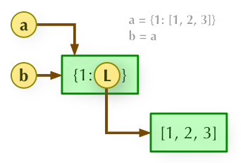
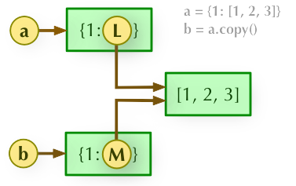
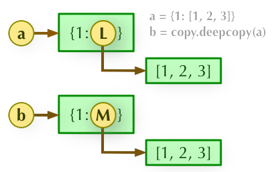

# 【关于 python 】 的那些你不知道的事

> 作者：杨夕
> 
> 项目地址：https://github.com/km1994/nlp_paper_study
> 
> 个人介绍：大佬们好，我叫杨夕，该项目主要是本人在研读顶会论文和复现经典论文过程中，所见、所思、所想、所闻，可能存在一些理解错误，希望大佬们多多指正。
 
- [【关于 python 】 的那些你不知道的事](#关于-python--的那些你不知道的事)
  - [一、什么是*args 和 **kwargs？](#一什么是args-和-kwargs)
    - [1.1 为什么会有 *args 和 **kwargs？](#11-为什么会有-args-和-kwargs)
    - [1.2 *args 和 **kwargs 的用途是什么？](#12-args-和-kwargs-的用途是什么)
    - [1.3 *args 是什么？](#13-args-是什么)
    - [1.4 **kwargs是什么？](#14-kwargs是什么)
    - [1.5 *args 与 **kwargs 的区别是什么？](#15-args-与-kwargs-的区别是什么)
  - [二、什么是装饰器？](#二什么是装饰器)
    - [2.1 装饰器是什么？](#21-装饰器是什么)
    - [2.2 装饰器怎么用？](#22-装饰器怎么用)
  - [三、Python垃圾回收（GC）](#三python垃圾回收gc)
    - [3.1 垃圾回收算法有哪些？](#31-垃圾回收算法有哪些)
    - [3.2 引用计数（主要）是什么？](#32-引用计数主要是什么)
    - [3.3 标记-清除是什么？](#33-标记-清除是什么)
    - [3.4 分代回收是什么？](#34-分代回收是什么)
  - [四、python的sorted函数对字典按key排序和按value排序](#四python的sorted函数对字典按key排序和按value排序)
    - [4.1 python 的sorted函数是什么？](#41-python-的sorted函数是什么)
    - [4.2 python 的sorted函数举例说明？](#42-python-的sorted函数举例说明)
  - [五、直接赋值、浅拷贝和深度拷贝](#五直接赋值浅拷贝和深度拷贝)
    - [5.1 概念介绍](#51-概念介绍)
    - [5.2 介绍](#52-介绍)
    - [5.3 变量定义流程](#53-变量定义流程)
    - [5.3 赋值](#53-赋值)
    - [5.4 浅拷贝](#54-浅拷贝)
    - [5.5  深度拷贝](#55--深度拷贝)
    - [5.6 核心：不可变对象类型 and 可变对象类型](#56-核心不可变对象类型-and-可变对象类型)
      - [5.6.1 不可变对象类型](#561-不可变对象类型)
      - [5.6.2 可变对象类型](#562-可变对象类型)
  - [六、进程、线程、协程](#六进程线程协程)
    - [6.1 进程](#61-进程)
      - [6.1.1 什么是进程？](#611-什么是进程)
      - [6.1.2 进程间如何通信？](#612-进程间如何通信)
    - [6.2 线程](#62-线程)
      - [6.2.1 什么是线程？](#621-什么是线程)
      - [6.2.2 线程间如何通信？](#622-线程间如何通信)
    - [6.3 进程 vs 线程](#63-进程-vs-线程)
      - [6.3.1 区别](#631-区别)
      - [6.3.2 应用场景](#632-应用场景)
    - [6.4 协程](#64-协程)
      - [6.4.1 什么是协程？](#641-什么是协程)
      - [6.4.2 协程的优点？](#642-协程的优点)
  - [七、全局解释器锁](#七全局解释器锁)
    - [7.1 什么是全局解释器锁？](#71-什么是全局解释器锁)
    - [7.2 GIL有什么作用？](#72-gil有什么作用)
    - [7.3 GIL有什么影响？](#73-gil有什么影响)
    - [7.4 如何避免GIL带来的影响？](#74-如何避免gil带来的影响)
  - [参考](#参考)

## 一、什么是*args 和 **kwargs？

### 1.1 为什么会有 *args 和 **kwargs？

对于一些编写的函数，可能预先并不知道, 函数使用者会传递多少个参数给你, 所以在这个场景下使用这两个关键字。

### 1.2 *args 和 **kwargs 的用途是什么？

*args 和 **kwargs 主要用于函数定义。 你可以将不定数量的参数传递给一个函数；

###  1.3 *args 是什么？

- 介绍：用来发送一个非键值对的可变数量的参数列表给一个函数；
- 举例
```s
def test_var_args(f_arg, *argv):
    print("first normal arg:", f_arg)
    for arg in argv:
        print("another arg through *argv:", arg)

test_var_args('yasoob', 'python', 'eggs', 'test')

# output
first normal arg: yasoob
another arg through *argv: python
another arg through *argv: eggs
another arg through *argv: test

```

###  1.4 **kwargs是什么？

- 介绍：允许你将不定长度的键值对, 作为参数传递给一个函数。 如果你想要在一个函数里处理带名字的参数, 你应该使用kwargs;
- 举例：
```s
def greet_me(**kwargs):
    for key, value in kwargs.items():
        print("{0} == {1}".format(key, value))

# output
>>> greet_me(name="yasoob")
name == yasoob

```

### 1.5 *args 与 **kwargs 的区别是什么？

```s
def test_args_kwargs(arg1, arg2, arg3):
    print("arg1:", arg1)
    print("arg2:", arg2)
    print("arg3:", arg3)

```
> 使用 *args
```s
>>> args = ("two", 3, 5)
>>> test_args_kwargs(*args)
arg1: two
arg2: 3
arg3: 5
```

> 使用 **kwargs
```s
>>> kwargs = {"arg3": 3, "arg2": "two", "arg1": 5}
>>> test_args_kwargs(**kwargs)
arg1: 5
arg2: two
arg3: 3
```


## 二、什么是装饰器？

### 2.1 装饰器是什么？

- 装饰器本质：一个 Python 函数或类；
- 作用：可以让其他函数或类在不需要做任何代码修改的前提下增加额外功能，装饰器的返回值也是一个函数/类对象。
- 使用场景：经常用于有切面需求的场景，比如：插入日志、性能测试、事务处理、缓存、权限校验等场景，装饰器是解决这类问题的绝佳设计。
- 优点：有了装饰器，我们就可以抽离出大量与函数功能本身无关的雷同代码到装饰器中并继续重用。概括的讲，装饰器的作用就是为已经存在的对象添加额外的功能。

### 2.2 装饰器怎么用？

> 简单装饰器
```s
def use_logging(func):

    def wrapper():
        logging.warn("%s is running" % func.__name__)
        return func()   # 把 foo 当做参数传递进来时，执行func()就相当于执行foo()
    return wrapper

def foo():
    print('i am foo')

foo = use_logging(foo)  # 因为装饰器 use_logging(foo) 返回的时函数对象 wrapper，这条语句相当于  foo = wrapper
foo()                   # 执行foo()就相当于执行 wrapper()
```
> @ 语法糖
```s
def use_logging(func):

    def wrapper():
        logging.warn("%s is running" % func.__name__)
        return func()
    return wrapper

@use_logging
def foo():
    print("i am foo")

foo()
```
> 带参数的装饰器
```s
# 功能：加载数据
def loadData(filename):
    '''
        功能：加载数据
        input:
            filename   String 文件名称 
        return:
            data       List    数据列表
    '''
    data = []
    with open(filename,"r",encoding="utf-8") as f:
        line = f.readline().replace("\n","")
        while line:
            data.append(line)
            line = f.readline().replace("\n","")
    return data

# 功能：装饰器 之 数据采样
def simpleData(func):
    '''
        功能：装饰器 之 数据采样
    '''
    def wrapper(*args):
        dataList = func(*args)
        rate = 0.05
        dataListLen = len(dataList)
        if dataListLen>100000:
            rate = 0.001
        elif dataListLen>10000:
            rate = 0.01
        elif dataListLen>1000:
            rate = 0.05
        elif dataListLen>100:
            rate = 0.1
        else:
            rate =1
        shuffle(dataList)
        simpleDataList =dataList[:int(rate*len(dataList))]
        return dataList,simpleDataList
    return wrapper

# 使用
dataList,simpleDataList = simpleData(loadData)(f"{basePath}{name}.txt")

```

## 三、Python垃圾回收（GC）

### 3.1 垃圾回收算法有哪些？

- 引用计数
- 标记-清除
- 分代回收

### 3.2 引用计数（主要）是什么？

- 核心：每一个对象的核心就是一个结构体PyObject，它的内部有一个引用计数器（ob_refcnt）

```s
 typedef struct_object {
    int ob_refcnt;
    struct_typeobject *ob_type;
} PyObject;
```
- 介绍：在Python中每一个对象的核心就是一个结构体PyObject，它的内部有一个引用计数器（ob_refcnt）。程序在运行的过程中会实时的更新ob_refcnt的值，来反映引用当前对象的名称数量。当某对象的引用计数值为0,那么它的内存就会被立即释放掉。
- 以下情况是导致引用计数加一的情况:
    - 对象被创建，例如a=2
    - 对象被引用，b=a
    - 对象被作为参数，传入到一个函数中
    - 对象作为一个元素，存储在容器中
- 下面的情况则会导致引用计数减一:
  - 对象别名被显示销毁 del
  - 对象别名被赋予新的对象
  - 一个对象离开他的作用域
  - 对象所在的容器被销毁或者是从容器中删除对象

- 优点：如高效、实现逻辑简单、具备实时性，一旦一个对象的引用计数归零，内存就直接释放了。不用像其他机制等到特定时机。将垃圾回收随机分配到运行的阶段，处理回收内存的时间分摊到了平时，正常程序的运行比较平稳。
- 缺点：
  - 逻辑简单，但实现有些麻烦。每个对象需要分配单独的空间来统计引用计数，这无形中加大的空间的负担，并且需要对引用计数进行维护，在维护的时候很容易会出错。
  - 在一些场景下，可能会比较慢。正常来说垃圾回收会比较平稳运行，但是当需要释放一个大的对象时，比如字典，需要对引用的所有对象循环嵌套调用，从而可能会花费比较长的时间。
  - 循环引用。这将是引用计数的致命伤，引用计数对此是无解的，因此必须要使用其它的垃圾回收算法对其进行补充。

```s
    a=[1,2]
    b=[2,3]
    a.append(b)
    b.append(a)
    DEL a
    DEL b
```
> 说实话感觉还有点像死锁的问题，这种问题出现在可以循环的结构中List Dict Object等等，如上代码a、b间的引用都为1，而a、b被引用的对象删除后都各自减去1（所以他们各自的引用计数还是1），这时候就尴尬了啊，都是1就有了免死金牌（一直是1不会变化了）。这样的情况单单靠引用计数就无法解决了。

### 3.3 标记-清除是什么？

- 动机：用来解决循环引用的问题的只有容器对象才会出现引用循环，比如列表、字典、类、元组。 
- 思路：
  - A）标记阶段，遍历所有的对象，如果是可达的（reachable），也就是还有对象引用它，那么就标记该对象为可达；
  - B）清除阶段，再次遍历对象，如果发现某个对象没有标记为可达，则就将其回收。
- 指针：
  - root链表(root object)
  - unreachable链表

> 情况一
```s
    a=[1,3]
    b=[2,4]
    a.append(b)
    b.append(a)
    del a
    del b
```
> 对于情景A，原来再未执行DEL语句的时候，a,b的引用计数都为2（init+append=2），但是在DEL执行完以后，a,b引用次数互相减1。a,b陷入循环引用的圈子中，然后标记-清除算法开始出来做事，找到其中一端a,开始拆这个a,b的引用环（我们从A出发，因为它有一个对B的引用，则将B的引用计数减1；然后顺着引用达到B，因为B有一个对A的引用，同样将A的引用减1，这样，就完成了循环引用对象间环摘除。），去掉以后发现，a,b循环引用变为了0，所以a,b就被处理到unreachable链表中直接被做掉。

> 情况二
```s
    a=[1,3]
    b=[2,4]
    a.append(b)
    b.append(a)
    del a
```
> 对于情景B,简单一看那b取环后引用计数还为1，但是a取环，就为0了。这个时候a已经进入unreachable链表中，已经被判为死刑了，但是这个时候，root链表中有b。如果a被做掉，那世界上还有什么正义... ，在root链表中的b会被进行引用检测引用了a，如果a被做掉了，那么b就...凉凉，一审完事，二审a无罪，所以被拉到了root链表中。

### 3.4 分代回收是什么？

- 垃圾回收=垃圾检测+释放。
- 动机：对于程序，存在一定比例的内存块的生存周期比较短；而剩下的内存块，生存周期会比较长，甚至会从程序开始一直持续到程序结束。生存期较短对象的比例通常在 80%～90% 之间，这种思想简单点说就是：对象存在时间越长，越可能不是垃圾，应该越少去收集。这样在执行标记-清除算法时可以有效减小遍历的对象数，从而提高垃圾回收的速度。
- 三代（generation 0,1,2）：
  - 0代表幼年对象，
  - 1代表青年对象，
  - 2代表老年对象
- 根据弱代假说（越年轻的对象越容易死掉，老的对象通常会存活更久。）
- 新生的对象被放入0代，如果该对象在第0代的一次gc垃圾回收中活了下来，那么它就被放到第1代里面（它就升级了）。如果第1代里面的对象在第1代的一次gc垃圾回收中活了下来，它就被放到第2代里面。 

## 四、python的sorted函数对字典按key排序和按value排序

### 4.1 python 的sorted函数是什么？

- sorted 函数
  - 表达式：sorted(iterable,key,reverse)
  - 参数：
    - iterable表示可以迭代的对象，例如可以是dict.items()、dict.keys()等；
    - key是一个函数，用来选取参与比较的元素；
    - reverse则是用来指定排序是倒序还是顺序，reverse=true则是倒序，reverse=false时则是顺序，默认时reverse=false。

### 4.2 python 的sorted函数举例说明？

- 按key值对字典排序


> 直接使用sorted(d.keys())就能按key值对字典排序，这里是按照顺序对key值排序的，如果想按照倒序排序的话，则只要将reverse置为true即可。

- sorted函数按value值对字典排序


> d.items()实际上是将d转换为可迭代对象，迭代对象的元素为（‘lilee’,25）、（‘wangyan’,21）、（‘liqun’,32）、（‘lidaming’,19），items()方法将字典的元素转化为了元组，而这里key参数对应的lambda表达式的意思则是选取元组中的第二个元素作为比较参数（如果写作key=lambda item:item[0]的话则是选取第一个元素作为比较对象，也就是key值作为比较对象。lambda x:y中x表示输出参数，y表示lambda函数的返回值），所以采用这种方法可以对字典的value进行排序。注意排序后的返回值是一个list，而原字典中的名值对被转换为了list中的元组。

## 五、直接赋值、浅拷贝和深度拷贝

### 5.1 概念介绍

- 变量：是一个系统表的元素，拥有指向对象的连接空间
- 对象：被分配的一块内存，存储其所代表的值
- 引用：是自动形成的从变量到对象的指针
- 类型：属于对象，而非变量
- 不可变对象：**一旦创建就不可修改的对象**，包括字符串、元组、数值类型（**该对象所指向的内存中的值不能被改变**。当改变某个变量时候，由于其所指的值不能被改变，相当于把原来的值复制一份后再改变，这会开辟一个新的地址，变量再指向这个新的地址。）
- 可变对象：**可以修改的对象**，包括列表、字典、集合（该对象所指向的内存中的值可以被改变。变量（准确的说是引用）改变后，实际上是其所指的值直接发生改变，并没有发生复制行为，也没有开辟新的地址，通俗点说就是原地改变。）

### 5.2 介绍

- 直接赋值：其实就是对象的**引用（别名）**。
- 浅拷贝(copy)：拷贝**父对象**，**不会拷贝对象的内部的子对象**。
- 深拷贝(deepcopy)： copy 模块的 deepcopy 方法，**完全拷贝了父对象及其子对象**。

### 5.3 变量定义流程

对于 ： a = {1: [1,2,3]}

python解释器流程：

1. 创建变量a；
2. 创建一个对象(分配一块内存)，来存储值  {1: [1,2,3]}；
3. 将变量与对象，通过指针连接起来，从变量到对象的连接称之为引用(变量引用对象)


### 5.3 赋值

- 介绍：b = a。赋值引用，只复制新对象的引用，不会开辟新内存空间，此时 a 和 b 都指向同一个对象；



### 5.4 浅拷贝

- 介绍：a 和 b 是一个独立的对象，但他们的子对象还是指向统一对象（是引用）。
- 三种形式： eg： lst = [1,2,[3,4]]
  - 切片操作：lst1 = lst[:] 或者 lst1 = [each for each in lst]
  - 工厂函数：lst1 = list(lst)
  - copy函数：lst1 = copy.copy(lst)



- 浅复制要分两种情况进行讨论：
  - 1）当浅复制的值是**不可变对象**（字符串、元组、数值类型）时**和“赋值”的情况一样**，对象的id值（id()函数用于获取对象的内存地址）与浅复制原来的值相同。
  - 2）当浅复制的值是**可变对象**（列表、字典、集合）时会产生一个“不是那么独立的对象”存在。有两种情况：
    - 第一种情况：复制的对象中无复杂子对象，原来值的改变并不会影响浅复制的值，同时浅复制的值改变也并不会影响原来的值。原来值的id值与浅复制原来的值不同。
    - 第二种情况：复制的对象中有复杂子对象（例如列表中的一个子元素是一个列表），如果不改变其中复杂子对象，浅复制的值改变并不会影响原来的值。 但是改变原来的值中的复杂子对象的值会影响浅复制的值。

### 5.5  深度拷贝

- 介绍：b = copy.deepcopy(a)。 a 和 b 完全拷贝了父对象及其子对象，两者是完全独立的。



### 5.6 核心：不可变对象类型 and 可变对象类型

#### 5.6.1 不可变对象类型

- 介绍：**不可变类型，不管是深拷贝还是浅拷贝，地址值和拷贝后的值都是一样的**

```s
    import copy
    a=(1,2,3)

    print("=====赋值=====")
    b=a
    print(a)
    print(b)
    print(id(a))
    print(id(b))

    print("=====浅拷贝=====")
    b=copy.copy(a)
    print(a)
    print(b)
    print(id(a))
    print(id(b))

    print("=====深拷贝=====")
    b=copy.deepcopy(a)
    print(a)
    print(b)
    print(id(a))
    print(id(b))

    结果：

    =====赋值=====
    (1, 2, 3)
    (1, 2, 3)
    43481128
    43481128
    =====浅拷贝=====
    (1, 2, 3)
    (1, 2, 3)
    43481128
    43481128
    =====深拷贝=====
    (1, 2, 3)
    (1, 2, 3)
    43481128
    43481128
```

#### 5.6.2 可变对象类型

- 介绍：

1. **外层添加元素时，浅拷贝不会随原列表变化而变化；内层添加元素时，浅拷贝才会变化。**
2. **无论原列表如何变化，深拷贝都保持不变。**
3. **赋值对象随着原列表一起变化。**

> 对于可变对象深浅拷贝(外层改变元素)
```s
    import copy
    l=[1,2,3,[4, 5]]

    l1=l #赋值
    l2=copy.copy(l) #浅拷贝
    l3=copy.deepcopy(l) #深拷贝
    l.append(6)

    print(l)  
    print(l1)
    print(l2)
    print(l3)

    结果：
    [1, 2, 3, [4, 5], 6]     #l添加一个元素6
    [1, 2, 3, [4, 5], 6]     #l1跟着添加一个元素6
    [1, 2, 3, [4, 5]]        #l2保持不变
    [1, 2, 3, [4, 5]]        #l3保持不变
```

> 对于可变对象深浅拷贝(内层改变元素)
```s
    import copy
    l=[1,2,3,[4, 5]]

    l1=l #赋值
    l2=copy.copy(l) #浅拷贝
    l3=copy.deepcopy(l) #深拷贝
    l[3].append(6) 

    print(l) 
    print(l1)
    print(l2)
    print(l3)

    结果：
    [1, 2, 3, [4, 5, 6]]      #l[3]添加一个元素6
    [1, 2, 3, [4, 5, 6]]      #l1跟着添加一个元素6
    [1, 2, 3, [4, 5, 6]]      #l2跟着添加一个元素6
    [1, 2, 3, [4, 5]]         #l3保持不变
```

## 六、进程、线程、协程

### 6.1 进程

#### 6.1.1 什么是进程？

- 介绍：是执行中的计算机程序。也就是说，每个代码在执行的时候，首先本身即是一个进程。运行中每个进程都拥有自己的地址空间、内存、数据栈及其它资源。
- 特点：
  - 多个进程可以在不同的 CPU 上运行，互不干扰
  - 同一个CPU上，可以运行多个进程，由操作系统来自动分配时间片
  - 由于进程间资源不能共享，需要进程间通信，来发送数据，接受消息等
  - 多进程，也称为“并行”。

#### 6.1.2 进程间如何通信？

- 进程彼此之间互相隔离，要实现进程间通信（IPC），multiprocessing模块支持两种形式：队列和管道，这两种方式都是使用消息传递的。
- 进程队列queue：不同于线程queue，进程queue的生成是用multiprocessing模块生成的。在生成子进程的时候，会将代码拷贝到子进程中执行一遍，及子进程拥有和主进程内容一样的不同的名称空间。
- 管道pipe：默认管道是全双工的，如果创建管道的时候映射成False，左边只能用于接收，右边只能用于发送，类似于单行道；
- 共享数据manage：Queue和pipe只是实现了数据交互，并没实现数据共享，即一个进程去更改另一个进程的数据。
- 进程池：开多进程是为了并发，通常有几个cpu核心就开几个进程，但是进程开多了会影响效率，主要体现在切换的开销，所以引入进程池限制进程的数量。进程池内部维护一个进程序列，当使用时，则去进程池中获取一个进程，如果进程池序列中没有可供使用的进进程，那么程序就会等待，直到进程池中有可用进程为止。

### 6.2 线程

#### 6.2.1 什么是线程？

- 介绍：线程，是在进程中执行的代码。一个进程下可以运行多个线程，这些线程之间共享主进程内申请的操作系统资源。在一个进程中启动多个线程的时候，每个线程按照顺序执行。现在的操作系统中，也支持线程抢占，也就是说其它等待运行的线程，可以通过优先级，信号等方式，将运行的线程挂起，自己先运行。

#### 6.2.2 线程间如何通信？

- 共享变量：创建全局变量，多个线程公用一个全局变量，方便简单。但是坏处就是共享变量容易出现数据竞争，不是线程安全的，解决方法就是使用互斥锁。
- 变量共享引申出线程同步问题：如果多个线程共同对某个数据修改，则可能出现不可预料的结果，为了保证数据的正确性，需要对多个线程进行同步。 使用Thread对象的Lock和Rlock可以实现简单的线程同步，这两个对象都有acquire方法和release方法，对于那些需要每次只允许一个线程操作的数据，可以将其操作放到acquire和release方法之间。
- 队列：线程间使用队列进行通信，因为队列所有方法都是线程安全的，所以不会出现线程竞争资源的情况。Queue.Queue 是进程内非阻塞队列

### 6.3 进程 vs 线程

#### 6.3.1 区别

- 一个进程中的各个线程与主进程共享相同的资源，与进程间互相独立相比，线程之间信息共享和通信更加容易(都在进程中，并且共享内存等)。

- 线程一般以**并发执行**，正是由于这种并发和数据共享机制，使多任务间的协作成为可能。
- 进程一般以**并行执行**，这种并行能使得程序能同时在多个CPU上运行;

- 区别：**多个线程只能在进程申请到的的“时间片”内运行**(一个CPU内的进程，启动了多个线程，线程调度共享这个进程的可执行时间片)，进程可以真正实现程序的“同时”运行(多个CPU同时运行)。

#### 6.3.2 应用场景

- 计算密集型任务使用多进程
- IO密集型(如:网络通讯)任务使用多线程，较少使用多进程. 【IO操作需要独占资源】

### 6.4 协程

#### 6.4.1 什么是协程？

- 介绍: 协程，又称微线程，纤程，英文名Coroutine。协程的作用，是**在执行函数A时，可以随时中断，去执行函数B，然后中断继续执行函数A（可以自由切换）**。但这一过程并不是函数调用（没有调用语句），这一整个过程看似像多线程，然而协程只有一个线程执行.

#### 6.4.2 协程的优点？

- 协程的主要特色是：协程间是协同调度的，这使得并发量数万以上的时候，协程的性能是远远高于线程。【注意这里也是“并发”，不是“并行”。】

- 协程优点：
  - 协程的切换开销更小，属于程序级别的切换，操作系统完全感知不到，因而更加轻量级
  - 单线程内就可以实现并发的效果，最大限度地利用cpu
- 协程缺点：
  - 协程的本质是单线程下，无法利用多核，可以是一个程序开启多个进程，每个进程内开启多个线程，每个线程内开启协程
  - 协程指的是单个线程，因而一旦协程出现阻塞，将会阻塞整个线程
- 使用场景：
  - 对于IO密集型任务非常适用，如果是cpu密集型，推荐多进程+协程的方式。

## 七、全局解释器锁

### 7.1 什么是全局解释器锁？

GIL全称Global Interpreter Lock，即全局解释器锁。 作用就是，**限制多线程同时执行，保证同一时间内只有一个线程在执行**。 GIL并不是Python的特性，它是在实现Python解析器(CPython)时所引入的一个概念。

### 7.2 GIL有什么作用？

为了更有效的利用多核处理器的性能，就出现了多线程的编程方式，而随之带来的就是线程间数据的一致性和状态同步的完整性。 python为了利用多核，开始支持多线程，但线程是非独立的，所以同一进程里线程是数据共享，当各个线程访问数据资源时会出现竞状态，即数据可能会同时被多个线程占用，造成数据混乱，这就是线程的不安全。而解决多线程之间数据完整性和状态同步最简单的方式就是加锁。GIL能限制多线程同时执行，保证同一时间内只有一个线程在执行。

### 7.3 GIL有什么影响？

GIL无疑就是一把全局排他锁。毫无疑问全局锁的存在会对多线程的效率有不小影响。甚至就几乎等于Python是个单线程的程序。

### 7.4 如何避免GIL带来的影响？

- 方法一：用进程+协程 代替 多线程的方式 在多进程中，由于每个进程都是独立的存在，所以每个进程内的线程都拥有独立的GIL锁，互不影响。但是，由于进程之间是独立的存在，所以进程间通信就需要通过队列的方式来实现。

- 方法二：更换解释器。像JPython和IronPython这样的解析器由于实现语言的特性，他们不需要GIL的帮助。然而由于用了Java/C#用于解析器实现，他们也失去了利用社区众多C语言模块有用特性的机会。所以这些解析器也因此一直都比较小众。


## 参考

1. [*args 和 **kwargs的用法](https://www.jianshu.com/p/d993b2a88e73)
2. [理解 Python 装饰器看这一篇就够了](https://foofish.net/python-decorator.html)
3. [Python垃圾回收（GC）三层心法,你了解到第几层？](https://juejin.im/post/6844903629556547598)
4. [Python垃圾回收机制！非常实用](https://zhuanlan.zhihu.com/p/83251959)
5. [python的sorted函数对字典按key排序和按value排序](https://blog.csdn.net/tangtanghao511/article/details/47810729)
6. [Python中的赋值(复制)、浅拷贝与深拷贝](https://zhuanlan.zhihu.com/p/54011712)
7. [Python 直接赋值、浅拷贝和深度拷贝解析](https://www.runoob.com/w3cnote/python-understanding-dict-copy-shallow-or-deep.html)
8. [Python中 进程 线程 协程 (多任务概念/重点)](https://v3u.cn/book/p4.html)
9. [全局解释器锁](https://v3u.cn/book/p5.html)

