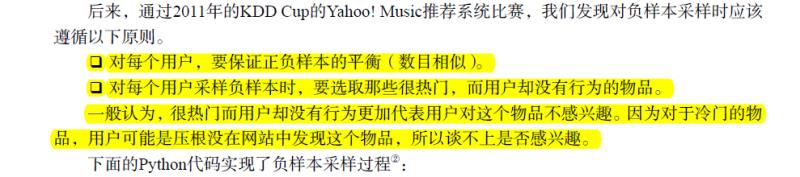
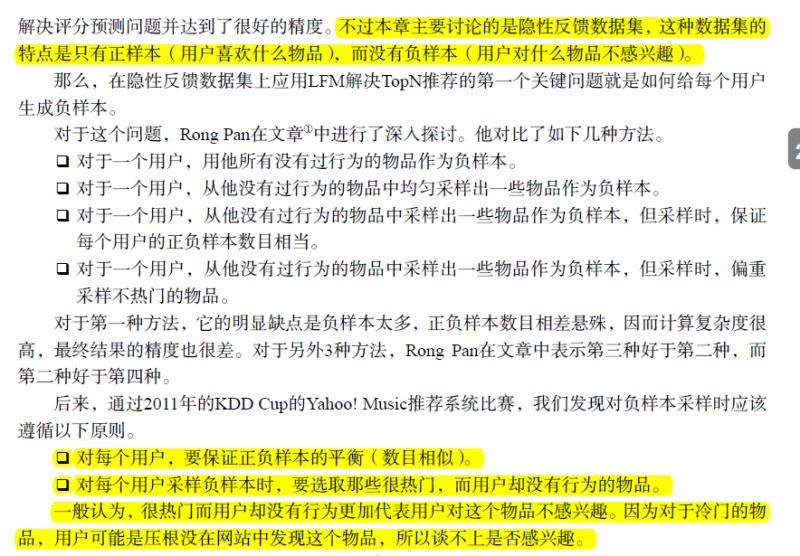
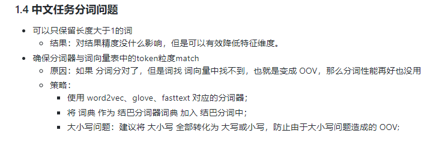
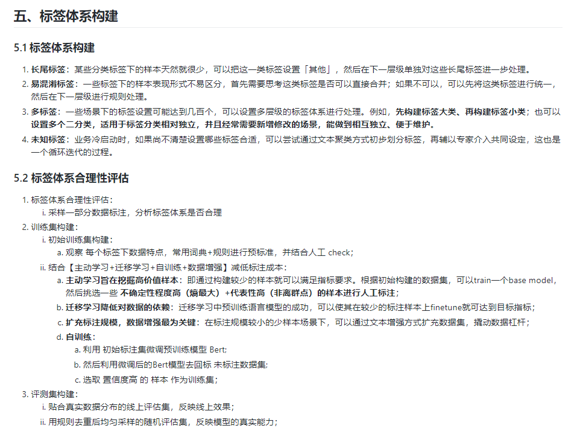

# 群精华

## 2021.5.27 群讨论计划

### 一、lfm的问题 

走吧five:
各位大佬，问个lfm的问题

走吧five:

走吧five:
LFM这里不太明白为啥要负采样

就是最后分解成两个矩阵，相乘得回原先的评分矩阵（不为0的评分相近，为0的预测），那对负样本降采样有什么用啊，还是用原先负样本远大于正样本的评分矩阵做分解啊

走吧five:
就是项亮的那本推荐系统实战

走吧five:

走吧five:
如果时评分，怎么说是正负样本

.:
仅从截图这段话，这是在讲怎么构造复样本吧，原始数据只有正正样本(喜欢)，没有负样本，不是必然要去构造负样本么？

走吧five:
还有如果是要降采样的话，是把要降采样的样本的分数或者喜欢直接置0？

.:
这个地方核心不是降采样，核心是我们只有用户喜欢那些东西，这些是正样本，没有用户不喜欢那些的负样本，所以要从全局的item抽一些来做负样本，怎么采呢，采那些热门的，同时采的时候保证每个用户数量跟正样本相当

走吧five:
@.?我是奇怪加入只有点击行为的是喜欢，为1，没点击是0，那点击肯定远小于不点击，就算有负样本，负样本一样是0，和没点击一个数值，我们把整个评分矩阵分解成两个矩阵，这时不管怎么降采样制造负样本，分解的还是原先的评分矩阵啊

.:
这不就是说的方法一么，用所有没行为的作为负样本，不是文字里说了缺陷么

走吧five:
我没说降采样的方法啊，我说不管用什么方法去制造负样本，分解的矩阵不还是原先的评分矩阵么？

.:
搜了下LFM，LFM是把用户和item表示成向量去迭次吧，向量乘起来跟真实label做loss，然后一批批的样本送进去做学习。 并不是把原矩阵写出来，有的位置是1，有的位置是0，去直接做分解吧。

.:
不是做推荐的，不过看起来感觉就是很直观的做法呢。

colitas:
可以想象成有一个user数*item数的评分矩阵 矩阵里正样本是1 负样本是0 还有大部分空项待遇测 负样本采样就是确定哪些空项填成0

麻木的程序猿:
填负数呗

走吧five:
差不多理解了，就是原矩阵是不写出来的，未点击的地方不是负样本的不优化，不填数值，只和有值的地方求loss，进行优化。

走吧five:
user向量和item向量随机初始化成隐因子的长度就行，和原先的行为数据无关。

colitas:
"走吧five: 差不多理解了，就是原矩阵是不写出来的，未点击的地方不是负样本的不优化，不填数值，只和有值的地方求loss，进行优化。"
- - - - - - - - - - - - - - -
没错

### 二、OOV 的问题

hirah:
我有个关于oov的问题

hirah:
fasttext可以做基于字母的embedding

hirah:
可以部分解决oov

hirah:
但是中文最小只能分割到单元字

hirah:
中文里面oov怎么处理呀

hirah:
不过训练集里面没有的字算是很生僻的字了吧

Stefan:
这种处理了能有多大收益呢

hirah:
fasttext相当于分解词根词缀的方式应对了oov

走吧five:
Bert不是基于单个字的么

hirah:
比如两个在word2vec那里不同的token

蠢蠢:
oov不用处理吧，预训练模型这么强的表征能力

hirah:
上面不是说的embedding吗

just do it!:
词表不用全，而在于精吧

枫胤雪:
应该就是用基于概率的wordpiece或者基于频率的bpe生成词表吧

just do it!:
比如你能够把一些常用的词覆盖到了就好了，bert基于字也是只覆盖高频词

文笔超好的男同学:
问题是

just do it!:
一般比较好的方式应该是定期重新预训练吧

文笔超好的男同学:
覆盖了，这些字能学好吗

just do it!:
这个词要看看是不是热词了

文笔超好的男同学:
是的，的确要看

文笔超好的男同学:
如果新热，那最好还是覆盖，不过一般覆盖都是用词典规则处理更快哈哈哈哈哈

just do it!:
比如如果是做新媒，你们重新预训练是在所难免的，比如一些网红词

hirah:
噢噢 应该也还是只能这样子

just do it!:
词典加规则确实是工业界标配吧，至少你可以控制

文笔超好的男同学:
是的，预训练这个在上游，老是改的话会被下游的同事追着打的

文笔超好的男同学:
科研的话，要思考的问题就是这种低频词，模型学不学的到

just do it!:
word2vec和bert其实用一个频率阈值，所以如果对于一些只出现两三次的低频词，重新预训练也是浪费时间

文笔超好的男同学:
是的会有一个频次约束

文笔超好的男同学:
gensim包里可以看看

枫胤雪:
查了一下，像英文里用的wordpiece或bpe并不适用于中文

just do it!:
bert前：jieba，ngram
bert后：字，知识

Cassia:
可以试试sentence price

文笔超好的男同学:
我们现在连textcnn这种都用字了

.:
Price

文笔超好的男同学:
未登录词基本不用处理，汉子就那么多

文笔超好的男同学:
汉字

鲤鱼(小白):
@just do it!?知识是指知识图谱？

just do it!:
是的

Cassia:
如果不纠结那几个点的提升，字是省事又好用

just do it!:
词典、知识图谱

吴玺煜:
好久好久之前做过实验，确实字会更好

文笔超好的男同学:
还试过一种是主体用字，配一些实体词然后在原来的基础上再训

文笔超好的男同学:
效果也有提升

走吧five:
我上一个实习就是词典+规则

吴玺煜:
数据量大的话，字会更好吧

文笔超好的男同学:
有些实体词能学到的话的确有利于下游任务的

### 三、标签数量太多问题

走吧five:
标签200多个

文笔超好的男同学:
200多个标签，优先考虑以搜代替分类

hirah:
tag classification啊

hirah:
比如给tweet上tag

hirah:
就有几百上千个class

文笔超好的男同学:
智能问答faq之类的，其实就是一个n分类，每个分类空间都很小

文笔超好的男同学:
query进入，找有没有和他相近的，如果有，那就认为query就属于和他相近的句子的那个类

枫胤雪:
我很好奇，实习让标注，那面试的时候都面的啥内容

文笔超好的男同学:
这种检索答案，本质上就是一种分类，而且这种方案还有个优势，就是分类的个数可以随意调整

吴玺煜:
以前做过智能客服，某公司用的就是分类，400多分类

just do it!:

走吧five:
以搜代替分类？

吴玺煜:
但是rank效果会比分类好吗？

just do it!:

just do it!:
多标签：一些场景下的标签设置可能达到几百个，可以设置多层级的标签体系进行处理。例如，先构建标签大类、再构建标签小类；也可以设置多个二分类，适用于标签分类相对独立，并且经常需要新增修改的场景，能做到相互独立、便于维护。

文笔超好的男同学:
你是指hard case吗，这个对分类，搜索方案都一样是难题啊

文笔超好的男同学:
总体效果来说，我感觉比直接多分类更容易拿到好的效果

走吧five:
多层级就是训练多个模型然后做类似模型融合么

just do it!:
hard case 直接规则吧，让模型搞，你都不知道他能不能解决问题，即使解决了你还不知道他是不是偶然的或者有没有引入新问题

走吧five:
就是第一个模型分大类，第二个模型分小类，把多个标签的识别分给多个模型粉红负责

文笔超好的男同学:
能发现就赶紧黑白名单搞，但是还是要弄点泛化的

文笔超好的男同学:
如果是这种优化，那其实就是语义相似度的优化了

文笔超好的男同学:
这周我会写这个以搜代分类的适用场景，完整思路，优缺点，可以期待下

文笔超好的男同学:
这个trick其实挺喜欢的。说白了检索top1其实就是可以理解为n分类，这个n可以很大，几十万几百万

吴玺煜:
不过，从数学角度上，多分类就是一种listwise了

文笔超好的男同学:
检索本身也是listwise啊

文笔超好的男同学:
多个分类要从中选一个最合适的，那就得和其他pk

吴玺煜:
也不一定

吴玺煜:
也可以是point或者pair

文笔超好的男同学:
偶对，多分类，想要分别控制效果可以考虑多个二分类，多意图的然后再排序

文笔超好的男同学:
换个说法吧，其实都是涉及到排序的问题

文笔超好的男同学:
point pair list只是一个思路

吴玺煜:
嗯呐

文笔超好的男同学:
可以说直接一个模型端到端，是其实是隐式的listwise，最后一层，其实就是个排序的工作

吴玺煜:
所以我很好奇，l2r会比多分类效果好吗？

文笔超好的男同学:
检索的方法，做相似度这个事情其实是pointwise，到最后精排一样可以弄个listwise的

文笔超好的男同学:
对多分类问题来说，ltr只是个视角吧

文笔超好的男同学:
他是只考虑自己的分数，两两对比还是全表排序

吴玺煜:
因为我的经验：x-wise会增加ndcg，但是不会增加categorical accuracy

吴玺煜:
才疏学浅，主要看看大佬们有没有别的经验和做法

文笔超好的男同学:
是有这个情况，但是有的时候是只看top1的，多分类这个其实某种程度上说是

just do it!:
https://github.com/km1994/NLP-Interview-Notes/tree/main/zoom

just do it!:
不想爬楼的可以看这个

文笔超好的男同学:
搜索的方式特点之一在于把分类问题转化为相似度问题，判断句子相似就能完成这个分类，前提是这个类下的句子要尽可能覆盖这个分类的各种情况

文笔超好的男同学:
所以一般是用来解决长尾数据不足的类目的，高频重要的类目还是优先推荐用正统的分类模型

文笔超好的男同学:
200个分类，例如有5个高频，那就用分类模型重点突破，在整个other类，命中other的去整这个检索方法也行

文笔超好的男同学:
这就是方案的制定与选择了

吴玺煜:
work

just do it!:
我一般先做大类，在做小类

文笔超好的男同学:
是的，先关注高频重点的问题

吴玺煜:
不过，出现了几十万类的时候，优先不是要考虑怎么削减类数吗

吴玺煜:
几十万的rank效果也挺烂的

文笔超好的男同学:
教员提的《矛盾论》讨论什么对主要矛盾次要矛盾辩证关系的理解

just do it!:
比如  买鞋、买衣服、打车、外卖、公交 => 出行【打车、公交】、购物【 买鞋、买衣服】、饮食【外卖】

文笔超好的男同学:
能简化问题就简化当然好了，但得看能不能，让不让简化，简化的成本和代价，以及他的手艺是什么

文笔超好的男同学:
收益

just do it!:
一般是先把相似的合并到一起，把 长尾的作为 other，然后对于大类 在考虑细分，对于 other 直接规则算了，因为 一般都是一些用户不caer 的长尾问题居多，没必要花太多时间去瞎搞

文笔超好的男同学:
百科场景。
圆柱的侧面积
圆柱的表面积
圆柱的体积
圆锥。。。。
长方体。。。。

文笔超好的男同学:
这种一个其实就是一类，那这种其实很容易想到就是搜索，但是抽象出来认为他是多分类的问题没毛病的

文笔超好的男同学:
细品

吴玺煜:
listmle

吴玺煜:
用的就是多分类做的

just do it!:
但是 粗分类 也可以考虑用 叉烧大佬提的 召回方法，前提是这些 类别要足够相似

文笔超好的男同学:
嗯，我的这个方法有适用条件，但凡方法都要考虑这个点

### 四、word2vec to 推荐

行者无疆:
只有个word2vec，一定会遇到oov问题，这个时候oov问题怎么处理？我问他如何处理，他说把这些词收集起来，然后重新训练

Stefan:
用来召回吧

Stefan:
side_info也训练emb。方便冷启动召回

文笔超好的男同学:
w2v能解高频用户，倒是也行

行者无疆:
embedding当然需要，但问题在于他只有word2vec，别的什么都没有，然后就是计算相似度，这个就是推荐的结果

文笔超好的男同学:
低频新用户肯定是新热这种来处理的

走吧five:
就是得要多路召回么

政委:
w2v作为一路召回

文笔超好的男同学:
多路召回是必然的
