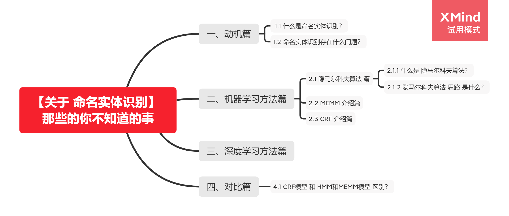

# 【关于 命名实体识别】 那些的你不知道的事

> 作者：杨夕

## 目录

## 一、动机篇

### 1.1 什么是命名实体识别？

### 1.2 命名实体识别存在什么问题？

## 二、机器学习方法篇

### 2.1 隐马尔科夫算法 篇

#### 2.1.1 什么是 隐马尔科夫算法？

#### 2.1.2 隐马尔科夫算法 思路 是什么？

### 2.2 MEMM 介绍篇

### 2.3 CRF 介绍篇

## 三、深度学习方法篇

## 四、对比篇

### 4.1 CRF模型 和 HMM和MEMM模型 区别？

- 相同点：MEMM、HMM、CRF 都常用于 序列标注任务；
- 不同点：
    - 与 HMM 的区别：CRF 能够解决 HMMM 因其输出独立性假设，导致其不能考虑上下文的特征，限制了特征的选择的问题；
    - 与 MEMM 的区别：MEMM 虽然能够解决 HMM 的问题，但是 MEMM 由于在每一节点都要进行归一化，所以只能找到局部的最优值，同时也带来了标记偏见的问题，即凡是训练语料中未出现的情况全都忽略掉。
    - CRF ：很好的解决了这一问题，他并不在每一个节点进行归一化，而是所有特征进行全局归一化，因此可以求得全局的最优值。

## 参考资料

1. [条件随机场CRF](https://zhuanlan.zhihu.com/p/29989121)
2. [朴素贝叶斯(NB)、逻辑回归(LR)、隐马尔科夫模型(HMM)、条件随机场(CRF)](https://blog.csdn.net/u013010889/article/details/81148809)
...
